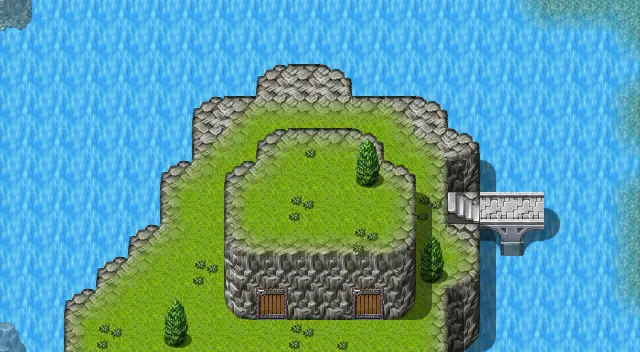

# Mountainlake27

| | |
|---|---|
| **Map ID** | `mountainlake27` |
| **Type** | Indoors / underground |
| **Size** | 20×11 tiles |
| **World map** | [World1](index.md) |
| **Introduced** | [v0.8.18](../versions/0.8.18.md) |
| **NPCs** | 5 |
| **Quests** | 2 |

**Mountainlake27** is an indoor map. It has 5 NPCs, and no enemies. Exits lead to Mountainlake8, Mountainlake6, Mountainlake28, Mountainlake26.

## Map

<label class="lg"><input type="checkbox" data-t="spawn" checked><b>Red</b>&nbsp;Monsters / NPCs</label><label class="lg"><input type="checkbox" data-t="mapchange" checked><b>Blue</b>&nbsp;Exit to another map</label><label class="lg"><input type="checkbox" data-t="container" checked><b>Yellow</b>&nbsp;Container (click to see contents)</label><label class="lg"><input type="checkbox" data-t="sign" checked><b>Purple</b>&nbsp;Sign</label><label class="lg"><input type="checkbox" data-t="rest" checked><b>Green</b>&nbsp;Resting place</label><label class="lg"><input type="checkbox" data-t="key" checked><b>Orange dashed</b>&nbsp;Blocked until a quest step / item</label><label class="lg"><input type="checkbox" data-t="script"><b>Grey dotted</b>&nbsp;Scripted event</label><label class="lg"><input type="checkbox" data-t="replace"><b>White dotted</b>&nbsp;Changes during a quest</label><label class="lg"><input type="checkbox" data-t="pin" checked><b>Numbers</b>&nbsp;Numbered key points (see the key below the map)</label>

<a class="pin pin-exit" href="#key-1" style="left:15.000%;top:4.545%" title="Exit (north): to [Mountainlake8](mountainlake8.md)">1</a><a class="pin pin-exit" href="#key-2" style="left:90.000%;top:95.455%" title="Exit (southeast): to [Mountainlake6](mountainlake6.md)">2</a><a class="pin pin-exit" href="#key-3" style="left:17.500%;top:95.455%" title="Exit (south): to [Mountainlake28](mountainlake28.md)">3</a><a class="pin pin-exit" href="#key-4" style="left:2.500%;top:50.000%" title="Exit (west): to [Mountainlake26](mountainlake26.md)">4</a><a id="pin-npc-ll2_cyclops2" class="pin pin-npc" href="#key-5" style="left:32.500%;top:59.091%" title="[Aphem](../../monsters/ll2_cyclops2.md): NPC">5</a><a id="pin-npc-ll2_captain" class="pin pin-npc" href="#key-6" style="left:52.500%;top:77.273%" title="[Captain Burry](../../monsters/ll2_captain.md): NPC">6</a><a id="pin-npc-ll2_cyclops1" class="pin pin-npc" href="#key-7" style="left:27.500%;top:59.091%" title="[Polyasem](../../monsters/ll2_cyclops1.md): NPC">7</a><a id="pin-npc-ll2_cyclops_sheep1" class="pin pin-npc" href="#key-8" style="left:47.500%;top:50.000%" title="[Sheep](../../monsters/sheep1.md#v-ll2_cyclops_sheep1): NPC">8</a><a id="pin-npc-ll2_cyclops_sheep2" class="pin pin-npc" href="#key-9" style="left:22.500%;top:77.273%" title="[Sheep](../../monsters/sheep1.md#v-ll2_cyclops_sheep2): 1 quest">9</a><a class="pin pin-script" href="#key-10" style="left:87.500%;top:59.091%" title="Quest trigger: Scripted event: advances the quest: hidden story flag “ll2_nd” to stage 10 (“10=Boat afloat”) (+1 more quest(s))">10</a><a class="pin pin-script" href="#key-11" style="left:7.500%;top:40.909%" title="Quest trigger: Scripted event: advances the quest: hidden story flag “ll2_maps” to stage 27 (“27=mountainlake27”) (+1 more quest(s))">11</a><a class="pin pin-script" href="#key-11" style="left:50.000%;top:13.636%" title="Quest trigger: Scripted event: advances the quest: hidden story flag “ll2_maps” to stage 27 (“27=mountainlake27”) (+1 more quest(s))">11</a><a class="pin pin-key" href="#key-12" style="left:57.500%;top:86.364%" title="Blocked passage: Closed off once you reach this point in the quest: Search for Andor (stage 1: “My father Mikhail says that Andor has not been home since yesterday. I should go look for him in the village.”)">12</a><a class="pin pin-key" href="#key-12" style="left:42.500%;top:86.364%" title="Blocked passage: Closed off once you reach this point in the quest: Search for Andor (stage 1: “My father Mikhail says that Andor has not been home since yesterday. I should go look for him in the village.”)">12</a><a class="pin pin-key" href="#key-13" style="left:30.329%;top:52.274%" title="Blocked passage: Opens after killing 1× Polyasem">13</a><a class="pin pin-key" href="#key-14" style="left:28.700%;top:67.887%" title="Blocked passage: Opens after killing 1× Aphem">14</a><a class="pin pin-script" href="#key-15" style="left:24.757%;top:63.026%" title="Quest trigger: Scripted event: advances the quest: hidden story flag “ll2_nd” to stage 41 (“41=Cling to sheep again”)">15</a><a class="pin pin-replace" href="#key-16" style="left:87.829%;top:47.728%" title="Changes during a quest: This area changes during the quest: hidden story flag “ll2_nd” (stage 14: “14=Boat anchored at Cyclops”)">16</a><a class="pin pin-replace" href="#key-17" style="left:83.100%;top:53.130%" title="Changes during a quest: This area changes back during the quest: hidden story flag “ll2_nd” (stage 14: “14=Boat anchored at Cyclops”)">17</a>

??? abstract "Key to the numbers on the map"

    | # | What | Details |
    |---|---|---|
    | 1 | Exit (north) | to [Mountainlake8](mountainlake8.md) |
    | 2 | Exit (southeast) | to [Mountainlake6](mountainlake6.md) |
    | 3 | Exit (south) | to [Mountainlake28](mountainlake28.md) |
    | 4 | Exit (west) | to [Mountainlake26](mountainlake26.md) |
    | 5 | [Aphem](../monsters/ll2_cyclops2.md) | NPC |
    | 6 | [Captain Burry](../monsters/ll2_captain.md) | NPC |
    | 7 | [Polyasem](../monsters/ll2_cyclops1.md) | NPC |
    | 8 | [Sheep](../monsters/sheep1.md#v-ll2_cyclops_sheep1) | NPC |
    | 9 | [Sheep](../monsters/sheep1.md#v-ll2_cyclops_sheep2) | 1 quest |
    | 10 | Quest trigger | Scripted event: advances the quest: hidden story flag “ll2_nd” to stage 10 (“10=Boat afloat”) (+1 more quest(s)) |
    | 11 | Quest trigger | Scripted event: advances the quest: hidden story flag “ll2_maps” to stage 27 (“27=mountainlake27”) (+1 more quest(s)) |
    | 12 | Blocked passage | Closed off once you reach this point in the quest: Search for Andor (stage 1: “My father Mikhail says that Andor has not been home since yesterday. I should go look for him in the village.”) |
    | 13 | Blocked passage | Opens after killing 1× Polyasem |
    | 14 | Blocked passage | Opens after killing 1× Aphem |
    | 15 | Quest trigger | Scripted event: advances the quest: hidden story flag “ll2_nd” to stage 41 (“41=Cling to sheep again”) |
    | 16 | Changes during a quest | This area changes during the quest: hidden story flag “ll2_nd” (stage 14: “14=Boat anchored at Cyclops”) |
    | 17 | Changes during a quest | This area changes back during the quest: hidden story flag “ll2_nd” (stage 14: “14=Boat anchored at Cyclops”) |

Verified against v0.8.18 map data.

## Connections

| Direction | Leads to | Region there | Map # |
|---|---|---|---|
| North | [Mountainlake8](mountainlake8.md) | – | 1 |
| Southeast | [Mountainlake6](mountainlake6.md) | – | 2 |
| South | [Mountainlake28](mountainlake28.md) | – | 3 |
| West | [Mountainlake26](mountainlake26.md) | – | 4 |

## NPCs

- [Aphem](../monsters/ll2_cyclops2.md) — can be fought (#5)
- [Captain Burry](../monsters/ll2_captain.md) (#6)
- [Polyasem](../monsters/ll2_cyclops1.md) — can be fought (#7)
- [Sheep](../monsters/sheep1.md#v-ll2_cyclops_sheep1) (#8)
- [Sheep](../monsters/sheep1.md#v-ll2_cyclops_sheep2) — quests: [A map of the Great Lake Laeroth](../quests/lake_map.md) (#9)

## Quests

- [A map of the Great Lake Laeroth](../quests/lake_map.md): [Sheep](../monsters/sheep1.md#v-ll2_cyclops_sheep2) is involved; something on this map advances it; stepping on a trigger here sets stage 28; stepping on a trigger here sets stage 900
- [Search for Andor](../quests/andor.md): blocked passage closes at stage 1
- [Lake Laeroth Maps found (hidden flag)](../quests/ll2_maps.md): something on this map advances it; stepping on a trigger here sets stage 27
- [Lake Laeroth nondisplay (hidden flag)](../quests/ll2_nd.md): part of the map changes at stage 14; something on this map advances it; stepping on a trigger here sets stage 10; stepping on a trigger here sets stage 14; stepping on a trigger here sets stage 40; stepping on a trigger here sets stage 41

## Points of interest

- **Quest trigger** (#10): Scripted event: advances the quest: hidden story flag “ll2_nd” to stage 10 (“10=Boat afloat”) (+1 more quest(s))
- **Quest trigger** (#11): Scripted event: advances the quest: hidden story flag “ll2_maps” to stage 27 (“27=mountainlake27”) (+1 more quest(s))
- **Blocked passage** (#12): Closed off once you reach this point in the quest: Search for Andor (stage 1: “My father Mikhail says that Andor has not been home since yesterday. I should go look for him in the village.”)
- **Blocked passage** (#13): Opens after killing 1× Polyasem
- **Blocked passage** (#14): Opens after killing 1× Aphem
- **Quest trigger** (#15): Scripted event: advances the quest: hidden story flag “ll2_nd” to stage 41 (“41=Cling to sheep again”)
- **Changes during a quest** (#16): This area changes during the quest: hidden story flag “ll2_nd” (stage 14: “14=Boat anchored at Cyclops”)
- **Changes during a quest** (#17): This area changes back during the quest: hidden story flag “ll2_nd” (stage 14: “14=Boat anchored at Cyclops”)

## Version history

| Version | Change |
|---|---|
| [v0.8.18](../versions/0.8.18.md) | Added |

Verified against v0.8.18 and every earlier release back to v0.7.0 (game data compared release by release).

## Community notes

<small>Written by players, not generated from game data. **Observations**: what players notice in-game · **Lore**: the in-world story · **Trivia**: real-world facts, references, development history · **Theory / speculation**: unconfirmed ideas; may just be unfinished content</small>

### Observations

*No notes yet. Contributions are welcome: [add a note](https://github.com/asdfghjkl628/Andor-s-Trail-Wikiiii/new/main/notes/maps?filename=mountainlake27.md&value=%23%23%20Observations%0A%0A%3C%21--%20what%20players%20notice%20in-game%20--%3E%0A%0A%23%23%20Lore%0A%0A%3C%21--%20the%20in-world%20story%20--%3E%0A%0A%23%23%20Trivia%0A%0A%3C%21--%20real-world%20facts%2C%20references%2C%20development%20history%20--%3E%0A%0A%23%23%20Theory%20/%20speculation%0A%0A%3C%21--%20unconfirmed%20ideas%3B%20may%20just%20be%20unfinished%20content%20--%3E%0A).*

### Lore

*No notes yet. Contributions are welcome: [add a note](https://github.com/asdfghjkl628/Andor-s-Trail-Wikiiii/new/main/notes/maps?filename=mountainlake27.md&value=%23%23%20Observations%0A%0A%3C%21--%20what%20players%20notice%20in-game%20--%3E%0A%0A%23%23%20Lore%0A%0A%3C%21--%20the%20in-world%20story%20--%3E%0A%0A%23%23%20Trivia%0A%0A%3C%21--%20real-world%20facts%2C%20references%2C%20development%20history%20--%3E%0A%0A%23%23%20Theory%20/%20speculation%0A%0A%3C%21--%20unconfirmed%20ideas%3B%20may%20just%20be%20unfinished%20content%20--%3E%0A).*

### Trivia

*No notes yet. Contributions are welcome: [add a note](https://github.com/asdfghjkl628/Andor-s-Trail-Wikiiii/new/main/notes/maps?filename=mountainlake27.md&value=%23%23%20Observations%0A%0A%3C%21--%20what%20players%20notice%20in-game%20--%3E%0A%0A%23%23%20Lore%0A%0A%3C%21--%20the%20in-world%20story%20--%3E%0A%0A%23%23%20Trivia%0A%0A%3C%21--%20real-world%20facts%2C%20references%2C%20development%20history%20--%3E%0A%0A%23%23%20Theory%20/%20speculation%0A%0A%3C%21--%20unconfirmed%20ideas%3B%20may%20just%20be%20unfinished%20content%20--%3E%0A).*

### Theory / speculation

*No notes yet. Contributions are welcome: [add a note](https://github.com/asdfghjkl628/Andor-s-Trail-Wikiiii/new/main/notes/maps?filename=mountainlake27.md&value=%23%23%20Observations%0A%0A%3C%21--%20what%20players%20notice%20in-game%20--%3E%0A%0A%23%23%20Lore%0A%0A%3C%21--%20the%20in-world%20story%20--%3E%0A%0A%23%23%20Trivia%0A%0A%3C%21--%20real-world%20facts%2C%20references%2C%20development%20history%20--%3E%0A%0A%23%23%20Theory%20/%20speculation%0A%0A%3C%21--%20unconfirmed%20ideas%3B%20may%20just%20be%20unfinished%20content%20--%3E%0A).*

??? info "Technical information"

    | | |
    |---|---|
    | Map ID | `mountainlake27` |
    | File | `res/xml/mountainlake27.tmx` |
    | Size | 20×11 tiles (640×352 px) |
    | outdoors property | – |
    | Layers drawn | base, ground, objects, above, top |
    | Tilesets | map_bed_1, map_boats_2, map_border_1, map_bridge_1, map_bridge_2, map_broken_1, map_cavewall_1, map_cavewall_2, map_cavewall_3, map_cavewall_4, map_chair_table_1, map_chair_table_2, map_crate_1, map_cupboard_1, map_curtain_1, map_entrance_1, map_entrance_2, map_fence_1, map_fence_2, map_fence_3, map_fence_4, map_ground_1, map_ground_2, map_ground_3, map_ground_4, map_ground_5, map_ground_6, map_ground_7, map_ground_8, map_guynmart, map_house_1, map_house_2, map_indoor_1, map_indoor_2, map_kitchen_1, map_outdoor_1, map_pillar_1, map_pillar_2, map_plant_1, map_plant_2, map_rock_1, map_rock_2, map_roof_1, map_roof_2, map_roof_3, map_shop_1, map_sign_ladder_1, map_table_1, map_trail_1, map_transition_1, map_transition_2, map_transition_3, map_transition_4, map_transition_5, map_tree_1, map_tree_2, map_wall_1, map_wall_2, map_wall_3, map_wall_4, map_window_1, map_window_2 |
    | Map objects | spawn: 6, mapchange: 5, script: 4, key: 4, replace: 2 |
    | World map position | segment `world1`, x 779, y 62 |

<small>Data from v0.8.18</small>
