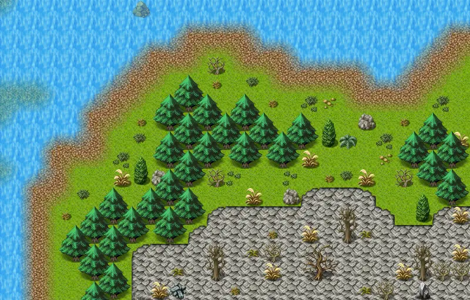

# Mountainlake4

25×16 tiles · outdoors · part of [World1](index.md)

<label class="lg"><input type="checkbox" data-t="spawn" checked><b>Red</b>&nbsp;Monsters / NPCs</label><label class="lg"><input type="checkbox" data-t="mapchange" checked><b>Blue</b>&nbsp;Exit to another map</label><label class="lg"><input type="checkbox" data-t="container" checked><b>Yellow</b>&nbsp;Container (click to see contents)</label><label class="lg"><input type="checkbox" data-t="sign" checked><b>Purple</b>&nbsp;Sign</label><label class="lg"><input type="checkbox" data-t="rest" checked><b>Green</b>&nbsp;Resting place</label><label class="lg"><input type="checkbox" data-t="key" checked><b>Orange dashed</b>&nbsp;Blocked until a quest step / item</label><label class="lg"><input type="checkbox" data-t="script"><b>Grey dotted</b>&nbsp;Scripted event</label><label class="lg"><input type="checkbox" data-t="replace"><b>White dotted</b>&nbsp;Changes during a quest</label>

## Exits

- [Mountainlake3](mountainlake3.md)
- [Mountainlake33](mountainlake33.md)
- [Mountainlake35](mountainlake35.md)
- [Mountainlake5](mountainlake5.md)

## Monsters & NPCs here

| Name | HP |
|---|---|
| [Maonit troll](../monsters/maonit_1.md) | 255 |
| [Giant maonit troll](../monsters/maonit_2.md) | 270 |
| [Strong maonit troll](../monsters/maonit_3.md) | 285 |
| [Maonit brute](../monsters/maonit_4.md) | 290 |
| [Tough maonit brute](../monsters/maonit_5.md) | 310 |
| [Strong maonit brute](../monsters/maonit_6.md) | 320 |

<small>Map ID: `mountainlake4` · Data from v0.8.18</small>
