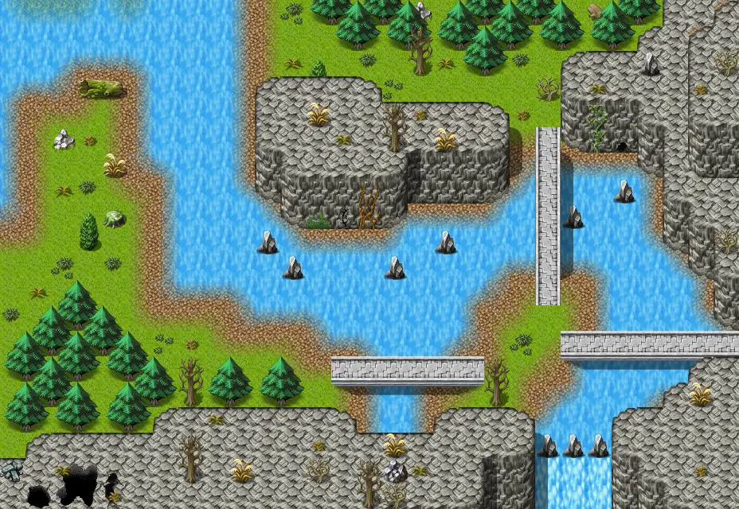

# Mountainlake5

29×20 tiles · outdoors · part of [World1](index.md)

<label class="lg lg-spawn"><input type="checkbox" data-t="spawn" checked> Monsters / NPCs</label><label class="lg lg-mapchange"><input type="checkbox" data-t="mapchange" checked> Exit to another map</label><label class="lg lg-container"><input type="checkbox" data-t="container" checked> Container</label><label class="lg lg-sign"><input type="checkbox" data-t="sign" checked> Sign</label><label class="lg lg-rest"><input type="checkbox" data-t="rest" checked> Resting place</label><label class="lg lg-key"><input type="checkbox" data-t="key" checked> Blocked / needs key or quest</label><label class="lg lg-script"><input type="checkbox" data-t="script"> Scripted event</label><label class="lg lg-replace"><input type="checkbox" data-t="replace"> Changes after a quest</label>

## Exits

- [Arulirmountain1](arulirmountain1.md)
- [Laerothcave0](laerothcave0.md)
- [Mountainlake4](mountainlake4.md)
- [Mountainlake6](mountainlake6.md)

## Monsters & NPCs here

| Name | HP |
|---|---|
| [Strong maonit troll](../monsters/maonit_3.md) | 285 |
| [Maonit brute](../monsters/maonit_4.md) | 290 |
| [Tough maonit brute](../monsters/maonit_5.md) | 310 |
| [Strong maonit brute](../monsters/maonit_6.md) | 320 |
| [Arulir](../monsters/arulir_1.md) | 325 |
| [Giant arulir](../monsters/arulir_2.md) | 330 |

<small>Map ID: `mountainlake5` · Data from v0.8.18</small>
