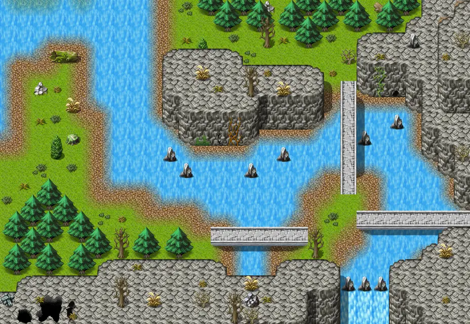

# Mountainlake5

| | |
|---|---|
| **Map ID** | `mountainlake5` |
| **Type** | Outdoors |
| **Size** | 29×20 tiles |
| **World map** | [World1](index.md) |
| **Introduced** | v0.7.0 or earlier |
| **Enemy types** | 6 |
| **Quests** | 0 |

**Mountainlake5** is an outdoor map. It has no NPCs and 6 kinds of enemy. Exits lead to Mountainlake6, Arulirmountain1, Laerothcave0, Mountainlake4.

## Map

<label class="lg"><input type="checkbox" data-t="spawn" checked><b>Red</b>&nbsp;Monsters / NPCs</label><label class="lg"><input type="checkbox" data-t="mapchange" checked><b>Blue</b>&nbsp;Exit to another map</label><label class="lg"><input type="checkbox" data-t="container" checked><b>Yellow</b>&nbsp;Container (click to see contents)</label><label class="lg"><input type="checkbox" data-t="sign" checked><b>Purple</b>&nbsp;Sign</label><label class="lg"><input type="checkbox" data-t="rest" checked><b>Green</b>&nbsp;Resting place</label><label class="lg"><input type="checkbox" data-t="key" checked><b>Orange dashed</b>&nbsp;Blocked until a quest step / item</label><label class="lg"><input type="checkbox" data-t="script"><b>Grey dotted</b>&nbsp;Scripted event</label><label class="lg"><input type="checkbox" data-t="replace"><b>White dotted</b>&nbsp;Changes during a quest</label><label class="lg"><input type="checkbox" data-t="pin" checked><b>Numbers</b>&nbsp;Numbered key points (see the key below the map)</label>

<a class="pin pin-exit" href="#key-1" style="left:37.931%;top:2.500%" title="Exit (north): to [Mountainlake6](mountainlake6.md)">1</a><a class="pin pin-exit" href="#key-2" style="left:93.103%;top:2.500%" title="Exit (northeast): to [Mountainlake6](mountainlake6.md)">2</a><a class="pin pin-exit" href="#key-3" style="left:98.276%;top:40.000%" title="Exit (east): to [Arulirmountain1](arulirmountain1.md)">3</a><a class="pin pin-exit" href="#key-3" style="left:98.276%;top:67.500%" title="Exit (east): to [Arulirmountain1](arulirmountain1.md)">3</a><a class="pin pin-exit" href="#key-4" style="left:32.759%;top:97.500%" title="Exit (south): to [Laerothcave0](laerothcave0.md)">4</a><a class="pin pin-exit" href="#key-5" style="left:1.724%;top:97.500%" title="Exit (southwest): to [Mountainlake4](mountainlake4.md)">5</a><a class="pin pin-exit" href="#key-6" style="left:1.724%;top:57.500%" title="Exit (west): to [Mountainlake4](mountainlake4.md)">6</a><a class="pin pin-key" href="#key-7" style="left:84.483%;top:67.500%" title="Blocked passage: Requires carrying: Arulir skin">7</a>

??? abstract "Key to the numbers on the map"

    | # | What | Details |
    |---|---|---|
    | 1 | Exit (north) | to [Mountainlake6](mountainlake6.md) |
    | 2 | Exit (northeast) | to [Mountainlake6](mountainlake6.md) |
    | 3 | Exit (east) | to [Arulirmountain1](arulirmountain1.md) |
    | 4 | Exit (south) | to [Laerothcave0](laerothcave0.md) |
    | 5 | Exit (southwest) | to [Mountainlake4](mountainlake4.md) |
    | 6 | Exit (west) | to [Mountainlake4](mountainlake4.md) |
    | 7 | Blocked passage | Requires carrying: Arulir skin |

Verified against v0.8.18 map data.

## Connections

| Direction | Leads to | Region there | Map # |
|---|---|---|---|
| North | [Mountainlake6](mountainlake6.md) | – | 1 |
| Northeast | [Mountainlake6](mountainlake6.md) | – | 2 |
| East | [Arulirmountain1](arulirmountain1.md) | – | 3 |
| South | [Laerothcave0](laerothcave0.md) | – | 4 |
| Southwest | [Mountainlake4](mountainlake4.md) | – | 5 |
| West | [Mountainlake4](mountainlake4.md) | – | 6 |

## Enemies

| Enemy | HP | Damage | Up to | Notes |
|---|---|---|---|---|
| [Strong maonit troll](../monsters/maonit_3.md) | 285 | 1–20 | 3 | shares spawn with Maonit brute |
| [Maonit brute](../monsters/maonit_4.md) | 290 | 1–20 | 3 | shares spawn with Strong maonit troll |
| [Tough maonit brute](../monsters/maonit_5.md) | 310 | 1–20 | 2 | shares spawn with Strong maonit brute |
| [Strong maonit brute](../monsters/maonit_6.md) | 320 | 1–20 | 2 | shares spawn with Tough maonit brute |
| [Arulir](../monsters/arulir_1.md) | 325 | 1–20 | 11 | shares spawn with Giant arulir |
| [Giant arulir](../monsters/arulir_2.md) | 330 | 1–20 | 11 | shares spawn with Arulir |

<small>“Up to” is the most that can be alive at once from the spawn areas on this map.</small>

## Points of interest

- **Blocked passage** (#7): Requires carrying: Arulir skin

## Version history

| Version | Change |
|---|---|
| [v0.7.0](../versions/0.7.0.md) | Present in v0.7.0 (earliest release tracked) |
| [v0.7.1](../versions/0.7.1.md) | Map layout or objects changed |
| [v0.7.2](../versions/0.7.2.md) | Map layout or objects changed |
| [v0.7.8](../versions/0.7.8.md) | Map layout or objects changed |
| [v0.7.9](../versions/0.7.9.md) | Map layout or objects changed |
| [v0.8.5](../versions/0.8.5.md) | Map layout or objects changed |
| [v0.8.8](../versions/0.8.8.md) | Map layout or objects changed |
| [v0.8.11](../versions/0.8.11.md) | Map layout or objects changed |
| [v0.8.14](../versions/0.8.14.md) | Map layout or objects changed |
| [v0.8.18](../versions/0.8.18.md) | Map layout or objects changed |

Verified against v0.8.18 and every earlier release back to v0.7.0 (game data compared release by release).

## Community notes

<small>Written by players, not generated from game data. **Observations**: what players notice in-game · **Lore**: the in-world story · **Trivia**: real-world facts, references, development history · **Theory / speculation**: unconfirmed ideas; may just be unfinished content</small>

### Observations

*No notes yet. Contributions are welcome: [add a note](https://github.com/asdfghjkl628/Andor-s-Trail-Wikiiii/new/main/notes/maps?filename=mountainlake5.md&value=%23%23%20Observations%0A%0A%3C%21--%20what%20players%20notice%20in-game%20--%3E%0A%0A%23%23%20Lore%0A%0A%3C%21--%20the%20in-world%20story%20--%3E%0A%0A%23%23%20Trivia%0A%0A%3C%21--%20real-world%20facts%2C%20references%2C%20development%20history%20--%3E%0A%0A%23%23%20Theory%20/%20speculation%0A%0A%3C%21--%20unconfirmed%20ideas%3B%20may%20just%20be%20unfinished%20content%20--%3E%0A).*

### Lore

*No notes yet. Contributions are welcome: [add a note](https://github.com/asdfghjkl628/Andor-s-Trail-Wikiiii/new/main/notes/maps?filename=mountainlake5.md&value=%23%23%20Observations%0A%0A%3C%21--%20what%20players%20notice%20in-game%20--%3E%0A%0A%23%23%20Lore%0A%0A%3C%21--%20the%20in-world%20story%20--%3E%0A%0A%23%23%20Trivia%0A%0A%3C%21--%20real-world%20facts%2C%20references%2C%20development%20history%20--%3E%0A%0A%23%23%20Theory%20/%20speculation%0A%0A%3C%21--%20unconfirmed%20ideas%3B%20may%20just%20be%20unfinished%20content%20--%3E%0A).*

### Trivia

*No notes yet. Contributions are welcome: [add a note](https://github.com/asdfghjkl628/Andor-s-Trail-Wikiiii/new/main/notes/maps?filename=mountainlake5.md&value=%23%23%20Observations%0A%0A%3C%21--%20what%20players%20notice%20in-game%20--%3E%0A%0A%23%23%20Lore%0A%0A%3C%21--%20the%20in-world%20story%20--%3E%0A%0A%23%23%20Trivia%0A%0A%3C%21--%20real-world%20facts%2C%20references%2C%20development%20history%20--%3E%0A%0A%23%23%20Theory%20/%20speculation%0A%0A%3C%21--%20unconfirmed%20ideas%3B%20may%20just%20be%20unfinished%20content%20--%3E%0A).*

### Theory / speculation

*No notes yet. Contributions are welcome: [add a note](https://github.com/asdfghjkl628/Andor-s-Trail-Wikiiii/new/main/notes/maps?filename=mountainlake5.md&value=%23%23%20Observations%0A%0A%3C%21--%20what%20players%20notice%20in-game%20--%3E%0A%0A%23%23%20Lore%0A%0A%3C%21--%20the%20in-world%20story%20--%3E%0A%0A%23%23%20Trivia%0A%0A%3C%21--%20real-world%20facts%2C%20references%2C%20development%20history%20--%3E%0A%0A%23%23%20Theory%20/%20speculation%0A%0A%3C%21--%20unconfirmed%20ideas%3B%20may%20just%20be%20unfinished%20content%20--%3E%0A).*

??? info "Technical information"

    | | |
    |---|---|
    | Map ID | `mountainlake5` |
    | File | `res/xml/mountainlake5.tmx` |
    | Size | 29×20 tiles (928×640 px) |
    | outdoors property | 1 |
    | Layers drawn | ground, objects, above, top |
    | Tilesets | map_bed_1, map_border_1, map_bridge_1, map_broken_1, map_cavewall_1, map_cavewall_2, map_cavewall_3, map_chair_table_1, map_crate_1, map_cupboard_1, map_curtain_1, map_entrance_1, map_fence_1, map_fence_2, map_ground_1, map_ground_2, map_ground_3, map_ground_4, map_ground_5, map_ground_6, map_ground_7, map_ground_8, map_guynmart, map_indoor_1, map_kitchen_1, map_outdoor_1, map_pillar_1, map_plant_1, map_rock_1, map_roof_1, map_roof_2, map_shop_1, map_sign_ladder_1, map_table_1, map_trail_1, map_transition_1, map_transition_2, map_tree_1, map_wall_1, map_wall_2, map_wall_3, map_window_1, map_window_2 |
    | Map objects | spawn: 14, mapchange: 8, key: 1, replace: 1 |
    | World map position | segment `world1`, x 787, y 104 |

<small>Data from v0.8.18</small>
