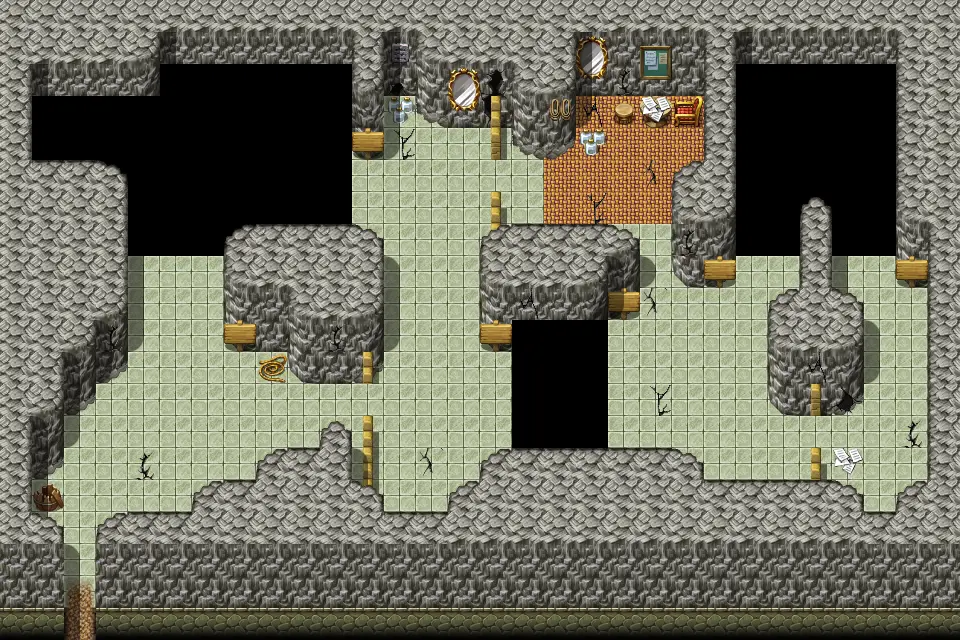
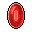

# Mountainlake8 cave

30×20 tiles

<label class="lg"><input type="checkbox" data-t="spawn" checked><b>Red</b>&nbsp;Monsters / NPCs</label><label class="lg"><input type="checkbox" data-t="mapchange" checked><b>Blue</b>&nbsp;Exit to another map</label><label class="lg"><input type="checkbox" data-t="container" checked><b>Yellow</b>&nbsp;Container (click to see contents)</label><label class="lg"><input type="checkbox" data-t="sign" checked><b>Purple</b>&nbsp;Sign</label><label class="lg"><input type="checkbox" data-t="rest" checked><b>Green</b>&nbsp;Resting place</label><label class="lg"><input type="checkbox" data-t="key" checked><b>Orange dashed</b>&nbsp;Blocked until a quest step / item</label><label class="lg"><input type="checkbox" data-t="script"><b>Grey dotted</b>&nbsp;Scripted event</label><label class="lg"><input type="checkbox" data-t="replace"><b>White dotted</b>&nbsp;Changes during a quest</label>

## Containers

<b>Container 1</b><ul><li><a href="../../items/lae_cube/">Cube</a> <small>100%</small></li></ul>

<b>Container 2</b><ul><li><a href="../../items/gold/">Gold coins</a> <small>100% · ×10 to 1000</small></li></ul>

<b>Container 3</b><ul><li><a href="../../items/gem2/">Ruby gem</a> <small>100% · ×1 to 3</small></li></ul>

## Exits

- [Mountainlake8](mountainlake8.md)
- [Mountainlake8 cave](mountainlake8_cave.md)

## Monsters & NPCs here

| Name | HP |
|---|---|
| [Os](../monsters/brute_creator.md) | 0 |
| [Tiny rat](../monsters/brute_origin1a.md) | 0 |
| [Tiny rat](../monsters/brute_origin1.md) | 2 |
| [Tough cave rat](../monsters/tough_cave_rat.md) | 5 |
| [Mountain wolf](../monsters/mountain_wolf.md) | 49 |
| [Tough mountain brute](../monsters/mbrute_10.md) | 126 |
| [Fearless mountain brute](../monsters/mbrute_11.md) | 137 |
| [Enraged mountain brute](../monsters/mbrute_12.md) | 148 |
| [Young mountain brute](../monsters/mbrute_1.md) | 148 |
| [Weak mountain brute](../monsters/mbrute_2.md) | 157 |
| [Whitefur mountain brute](../monsters/mbrute_3.md) | 166 |

<small>Map ID: `mountainlake8_cave` · Data from v0.8.18</small>
