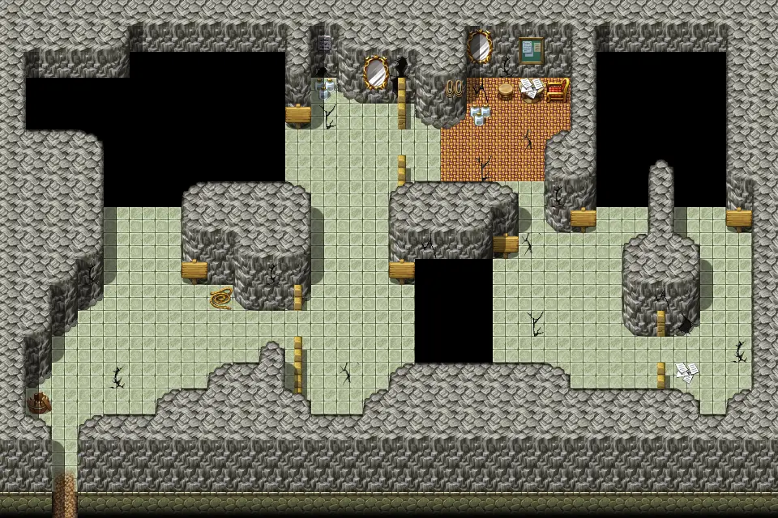

# Mountainlake8 cave

| | |
|---|---|
| **Map ID** | `mountainlake8_cave` |
| **Type** | Indoors / underground |
| **Size** | 30×20 tiles |
| **Introduced** | [v0.8.11](../versions/0.8.11.md) |
| **NPCs** | 2 |
| **Enemy types** | 9 |
| **Quests** | 2 |
| **Containers** | 3 |

**Mountainlake8 cave** is an indoor map. It has 2 NPCs and 9 kinds of enemy. Exits lead to Mountainlake8, Mountainlake8 cave.

## Map

<label class="lg"><input type="checkbox" data-t="spawn" checked><b>Red</b>&nbsp;Monsters / NPCs</label><label class="lg"><input type="checkbox" data-t="mapchange" checked><b>Blue</b>&nbsp;Exit to another map</label><label class="lg"><input type="checkbox" data-t="container" checked><b>Yellow</b>&nbsp;Container (click to see contents)</label><label class="lg"><input type="checkbox" data-t="sign" checked><b>Purple</b>&nbsp;Sign</label><label class="lg"><input type="checkbox" data-t="rest" checked><b>Green</b>&nbsp;Resting place</label><label class="lg"><input type="checkbox" data-t="key" checked><b>Orange dashed</b>&nbsp;Blocked until a quest step / item</label><label class="lg"><input type="checkbox" data-t="script"><b>Grey dotted</b>&nbsp;Scripted event</label><label class="lg"><input type="checkbox" data-t="replace"><b>White dotted</b>&nbsp;Changes during a quest</label><label class="lg"><input type="checkbox" data-t="pin" checked><b>Numbers</b>&nbsp;Numbered key points (see the key below the map)</label>

<a class="pin pin-exit" href="#key-1" style="left:8.333%;top:97.500%" title="Exit (south): to [Mountainlake8](../mountainlake8.md)">1</a><a class="pin pin-exit" href="#key-2" style="left:48.333%;top:17.500%" title="Exit (stairs / passage): to [Mountainlake8 cave](../mountainlake8_cave.md)">2</a><a class="pin pin-exit" href="#key-2" style="left:61.667%;top:12.500%" title="Exit (stairs / passage): to [Mountainlake8 cave](../mountainlake8_cave.md)">2</a><a class="pin pin-npc" href="#key-3" style="left:65.000%;top:27.500%" title="[Os](../../monsters/brute_creator.md): 1 quest">3</a><a class="pin pin-npc" href="#key-4" style="left:95.000%;top:52.500%" title="[Tiny rat](../../monsters/brute_origin1a.md): NPC">4</a><a class="pin pin-script" href="#key-5" style="left:50.000%;top:50.000%" title="Quest trigger: Scripted event: advances the quest: Brutes to stage 30 (“I have discovered a cave where brutes seem to pour out.”) (+1 more quest(s))">5</a><a class="pin pin-script" href="#key-6" style="left:85.000%;top:22.500%" title="Quest trigger: Scripted event: advances the quest: hidden story flag “laeroth_nondisplay” to stage 200 (“brute_creator_in”)">6</a><a class="pin pin-container" href="#key-7" style="left:85.000%;top:17.500%" title="Container 1: Cube">7</a><a class="pin pin-container" href="#key-8" style="left:78.333%;top:22.500%" title="Container 2: Gold coins">8</a><a class="pin pin-container" href="#key-9" style="left:91.667%;top:12.500%" title="Container 3: Ruby gem">9</a><a class="pin pin-key" href="#key-10" style="left:25.000%;top:27.500%" title="Blocked passage: Closed off once you reach this point in the quest: Search for Andor (stage 1: “My father Mikhail says that Andor has not been home since yesterday. I should go look for him in the village.”)">10</a><a class="pin pin-key" href="#key-10" style="left:58.333%;top:62.500%" title="Blocked passage: Closed off once you reach this point in the quest: Search for Andor (stage 1: “My father Mikhail says that Andor has not been home since yesterday. I should go look for him in the village.”)">10</a><a class="pin pin-key" href="#key-10" style="left:80.000%;top:32.500%" title="Blocked passage: Closed off once you reach this point in the quest: Search for Andor (stage 1: “My father Mikhail says that Andor has not been home since yesterday. I should go look for him in the village.”)">10</a><a class="pin pin-key" href="#key-11" style="left:90.000%;top:32.500%" title="Blocked passage: Unlocked during the quest: hidden story flag “laeroth_nondisplay” (stage 201: “brute_creator_key”)">11</a>

??? abstract "Key to the numbers on the map"

    | # | What | Details |
    |---|---|---|
    | 1 | Exit (south) | to [Mountainlake8](../mountainlake8.md) |
    | 2 | Exit (stairs / passage) | to [Mountainlake8 cave](../mountainlake8_cave.md) |
    | 3 | [Os](../monsters/brute_creator.md) | 1 quest |
    | 4 | [Tiny rat](../monsters/brute_origin1a.md) | NPC |
    | 5 | Quest trigger | Scripted event: advances the quest: Brutes to stage 30 (“I have discovered a cave where brutes seem to pour out.”) (+1 more quest(s)) |
    | 6 | Quest trigger | Scripted event: advances the quest: hidden story flag “laeroth_nondisplay” to stage 200 (“brute_creator_in”) |
    | 7 | Container 1 | Cube |
    | 8 | Container 2 | Gold coins |
    | 9 | Container 3 | Ruby gem |
    | 10 | Blocked passage | Closed off once you reach this point in the quest: Search for Andor (stage 1: “My father Mikhail says that Andor has not been home since yesterday. I should go look for him in the village.”) |
    | 11 | Blocked passage | Unlocked during the quest: hidden story flag “laeroth_nondisplay” (stage 201: “brute_creator_key”) |

Verified against v0.8.18 map data.

## Connections

| Direction | Leads to | Region there | Map # |
|---|---|---|---|
| South | [Mountainlake8](mountainlake8.md) | – | 1 |
| Stairs / passage | [Mountainlake8 cave](mountainlake8_cave.md) | – | 2 |

## NPCs

- [Os](../monsters/brute_creator.md) — quests: [Brutes](../quests/brute_creator.md) (#3)
- [Tiny rat](../monsters/brute_origin1a.md) (#4)

## Enemies

| Enemy | HP | Damage | Up to | Notes |
|---|---|---|---|---|
| [Tiny rat](../monsters/brute_origin1.md) | 2 | 1–1 | 10 | – |
| [Tough cave rat](../monsters/tough_cave_rat.md) | 5 | 3–3 | 10 | – |
| [Mountain wolf](../monsters/mountain_wolf.md) | 49 | 3–9 | 10 | – |
| [Tough mountain brute](../monsters/mbrute_10.md) | 126 | 2–15 | 4 | shares spawn with Enraged mountain brute, Fearless mountain brute |
| [Fearless mountain brute](../monsters/mbrute_11.md) | 137 | 2–15 | 4 | shares spawn with Enraged mountain brute, Tough mountain brute |
| [Young mountain brute](../monsters/mbrute_1.md) | 148 | 0–14 | 4 | shares spawn with Weak mountain brute, Whitefur mountain brute |
| [Enraged mountain brute](../monsters/mbrute_12.md) | 148 | 2–16 | 4 | shares spawn with Fearless mountain brute, Tough mountain brute |
| [Weak mountain brute](../monsters/mbrute_2.md) | 157 | 0–14 | 4 | shares spawn with Whitefur mountain brute, Young mountain brute |
| [Whitefur mountain brute](../monsters/mbrute_3.md) | 166 | 0–14 | 4 | shares spawn with Weak mountain brute, Young mountain brute |

<small>“Up to” is the most that can be alive at once from the spawn areas on this map.</small>

## Items & containers

<b>Container 1</b><ul><li><a href="../../items/lae_cube/">Cube</a> <small>100%</small></li></ul>

<b>Container 2</b><ul><li><a href="../../items/gold/">Gold coins</a> <small>100% · ×10 to 1000</small></li></ul>

<b>Container 3</b><ul><li><a href="../../items/gem2/">Ruby gem</a> <small>100% · ×1 to 3</small></li></ul>

## Quests

- [Brutes](../quests/brute_creator.md): [Os](../monsters/brute_creator.md) is involved; something on this map advances it; stepping on a trigger here sets stage 30
- [Search for Andor](../quests/andor.md): blocked passage closes at stage 1
- [laeroth_nondisplay (hidden flag)](../quests/laeroth_nondisplay.md): blocked passage opens at stage 201; something on this map advances it; stepping on a trigger here sets stage 200; stepping on a trigger here sets stage 201

## Points of interest

- **Quest trigger** (#5): Scripted event: advances the quest: Brutes to stage 30 (“I have discovered a cave where brutes seem to pour out.”) (+1 more quest(s))
- **Quest trigger** (#6): Scripted event: advances the quest: hidden story flag “laeroth_nondisplay” to stage 200 (“brute_creator_in”)
- **Blocked passage** (#10): Closed off once you reach this point in the quest: Search for Andor (stage 1: “My father Mikhail says that Andor has not been home since yesterday. I should go look for him in the village.”)
- **Blocked passage** (#11): Unlocked during the quest: hidden story flag “laeroth_nondisplay” (stage 201: “brute_creator_key”)

## Version history

| Version | Change |
|---|---|
| [v0.8.11](../versions/0.8.11.md) | Added |

Verified against v0.8.18 and every earlier release back to v0.7.0 (game data compared release by release).

## Community notes

<small>Written by players, not generated from game data. **Observations**: what players notice in-game · **Lore**: the in-world story · **Trivia**: real-world facts, references, development history · **Theory / speculation**: unconfirmed ideas; may just be unfinished content</small>

### Observations

*Nothing here yet. Know something? [Add it](https://github.com/asdfghjkl628/Andor-s-Trail-Wikiiii/new/main/notes/maps?filename=mountainlake8_cave.md&value=%23%23%20Observations%0A%0A%3C%21--%20what%20players%20notice%20in-game%20--%3E%0A%0A%23%23%20Lore%0A%0A%3C%21--%20the%20in-world%20story%20--%3E%0A%0A%23%23%20Trivia%0A%0A%3C%21--%20real-world%20facts%2C%20references%2C%20development%20history%20--%3E%0A%0A%23%23%20Theory%20/%20speculation%0A%0A%3C%21--%20unconfirmed%20ideas%3B%20may%20just%20be%20unfinished%20content%20--%3E%0A).*

### Lore

*Nothing here yet. Know something? [Add it](https://github.com/asdfghjkl628/Andor-s-Trail-Wikiiii/new/main/notes/maps?filename=mountainlake8_cave.md&value=%23%23%20Observations%0A%0A%3C%21--%20what%20players%20notice%20in-game%20--%3E%0A%0A%23%23%20Lore%0A%0A%3C%21--%20the%20in-world%20story%20--%3E%0A%0A%23%23%20Trivia%0A%0A%3C%21--%20real-world%20facts%2C%20references%2C%20development%20history%20--%3E%0A%0A%23%23%20Theory%20/%20speculation%0A%0A%3C%21--%20unconfirmed%20ideas%3B%20may%20just%20be%20unfinished%20content%20--%3E%0A).*

### Trivia

*Nothing here yet. Know something? [Add it](https://github.com/asdfghjkl628/Andor-s-Trail-Wikiiii/new/main/notes/maps?filename=mountainlake8_cave.md&value=%23%23%20Observations%0A%0A%3C%21--%20what%20players%20notice%20in-game%20--%3E%0A%0A%23%23%20Lore%0A%0A%3C%21--%20the%20in-world%20story%20--%3E%0A%0A%23%23%20Trivia%0A%0A%3C%21--%20real-world%20facts%2C%20references%2C%20development%20history%20--%3E%0A%0A%23%23%20Theory%20/%20speculation%0A%0A%3C%21--%20unconfirmed%20ideas%3B%20may%20just%20be%20unfinished%20content%20--%3E%0A).*

### Theory / speculation

*Nothing here yet. Know something? [Add it](https://github.com/asdfghjkl628/Andor-s-Trail-Wikiiii/new/main/notes/maps?filename=mountainlake8_cave.md&value=%23%23%20Observations%0A%0A%3C%21--%20what%20players%20notice%20in-game%20--%3E%0A%0A%23%23%20Lore%0A%0A%3C%21--%20the%20in-world%20story%20--%3E%0A%0A%23%23%20Trivia%0A%0A%3C%21--%20real-world%20facts%2C%20references%2C%20development%20history%20--%3E%0A%0A%23%23%20Theory%20/%20speculation%0A%0A%3C%21--%20unconfirmed%20ideas%3B%20may%20just%20be%20unfinished%20content%20--%3E%0A).*

??? info "Technical information"

    | | |
    |---|---|
    | Map ID | `mountainlake8_cave` |
    | File | `res/xml/mountainlake8_cave.tmx` |
    | Size | 30×20 tiles (960×640 px) |
    | outdoors property | – |
    | Layers drawn | ground, objects, above, top |
    | Tilesets | map_bed_1, map_border_1, map_bridge_1, map_bridge_2, map_broken_1, map_cavewall_1, map_cavewall_2, map_cavewall_3, map_cavewall_4, map_chair_table_1, map_chair_table_2, map_crate_1, map_cupboard_1, map_curtain_1, map_entrance_1, map_entrance_2, map_fence_1, map_fence_2, map_fence_3, map_fence_4, map_ground_1, map_ground_2, map_ground_3, map_ground_4, map_ground_5, map_ground_6, map_ground_7, map_ground_8, map_house_1, map_house_2, map_indoor_1, map_indoor_2, map_kitchen_1, map_outdoor_1, map_pillar_1, map_pillar_2, map_plant_1, map_plant_2, map_ratdom, map_rock_1, map_rock_2, map_roof_1, map_roof_2, map_roof_3, map_shop_1, map_sign_ladder_1, map_table_1, map_trail_1, map_transition_1, map_transition_2, map_transition_3, map_transition_4, map_transition_5, map_tree_1, map_tree_2, map_wall_1, map_wall_2, map_wall_3, map_wall_4, map_window_1, map_window_2 |
    | Map objects | script: 12, spawn: 9, mapchange: 5, key: 4, container: 3, replace: 3 |
    | World map position | – |

<small>Data from v0.8.18</small>
