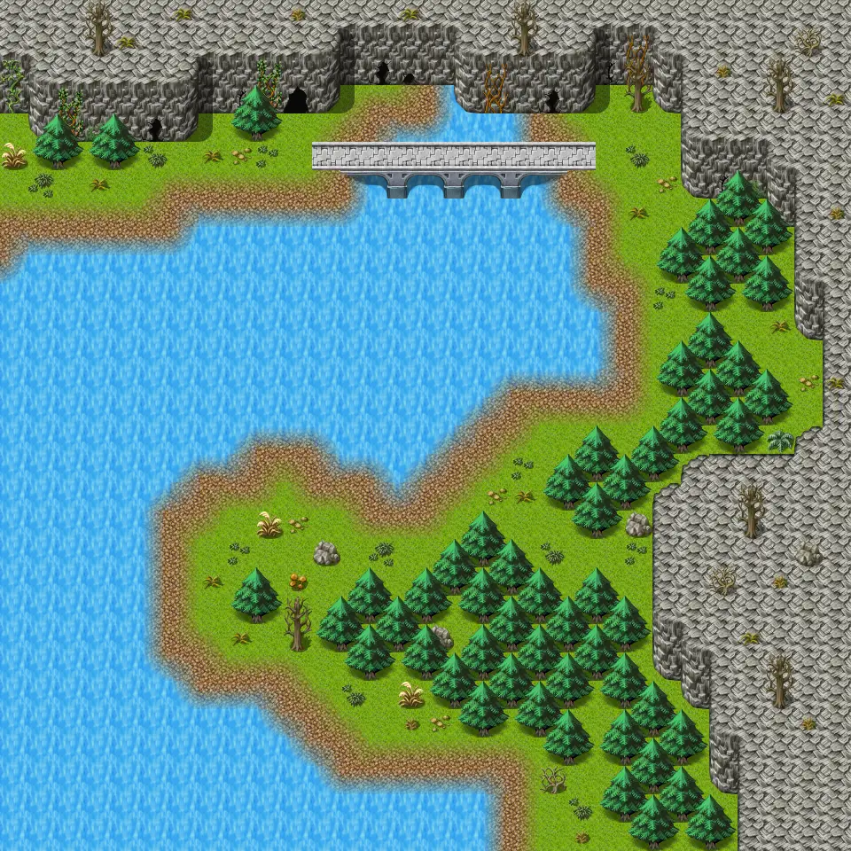
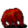
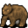
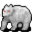

# Mountainlake9

30×30 tiles · outdoors · part of [World1](index.md)

<label class="lg"><input type="checkbox" data-t="spawn" checked><b>Red</b>&nbsp;Monsters / NPCs</label><label class="lg"><input type="checkbox" data-t="mapchange" checked><b>Blue</b>&nbsp;Exit to another map</label><label class="lg"><input type="checkbox" data-t="container" checked><b>Yellow</b>&nbsp;Container (click to see contents)</label><label class="lg"><input type="checkbox" data-t="sign" checked><b>Purple</b>&nbsp;Sign</label><label class="lg"><input type="checkbox" data-t="rest" checked><b>Green</b>&nbsp;Resting place</label><label class="lg"><input type="checkbox" data-t="key" checked><b>Orange dashed</b>&nbsp;Blocked until a quest step / item</label><label class="lg"><input type="checkbox" data-t="script"><b>Grey dotted</b>&nbsp;Scripted event</label><label class="lg"><input type="checkbox" data-t="replace"><b>White dotted</b>&nbsp;Changes during a quest</label>

## Exits

- [Mountainlake10](mountainlake10.md)
- [Mountainlake22](mountainlake22.md)
- [Mountainlake8](mountainlake8.md)

## Monsters & NPCs here

| Name | HP |
|---|---|
| [Fast mountain brute](../monsters/mbrute_6.md) | 82 |
| [Quick mountain brute](../monsters/mbrute_7.md) | 93 |
| [Aggressive mountain brute](../monsters/mbrute_8.md) | 104 |
| [Strong mountain brute](../monsters/mbrute_9.md) | 115 |
| [Young mountain brute](../monsters/mbrute_1.md) | 148 |
| [Weak mountain brute](../monsters/mbrute_2.md) | 157 |
| [Whitefur mountain brute](../monsters/mbrute_3.md) | 166 |
| [Mountain brute](../monsters/mbrute_4.md) | 175 |
| [Large mountain brute](../monsters/mbrute_5.md) | 184 |

<small>Map ID: `mountainlake9` · Data from v0.8.18</small>
