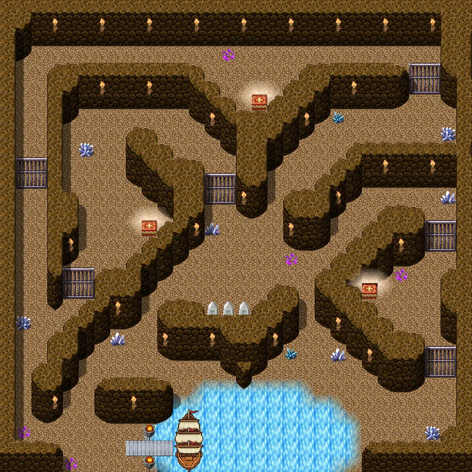
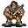
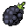

# Mountainlake sub

30×30 tiles · outdoors

<label class="lg"><input type="checkbox" data-t="spawn" checked><b>Red</b>&nbsp;Monsters / NPCs</label><label class="lg"><input type="checkbox" data-t="mapchange" checked><b>Blue</b>&nbsp;Exit to another map</label><label class="lg"><input type="checkbox" data-t="container" checked><b>Yellow</b>&nbsp;Container (click to see contents)</label><label class="lg"><input type="checkbox" data-t="sign" checked><b>Purple</b>&nbsp;Sign</label><label class="lg"><input type="checkbox" data-t="rest" checked><b>Green</b>&nbsp;Resting place</label><label class="lg"><input type="checkbox" data-t="key" checked><b>Orange dashed</b>&nbsp;Blocked until a quest step / item</label><label class="lg"><input type="checkbox" data-t="script"><b>Grey dotted</b>&nbsp;Scripted event</label><label class="lg"><input type="checkbox" data-t="replace"><b>White dotted</b>&nbsp;Changes during a quest</label>

## Containers

<b>Container 1</b><ul><li><a href="../../items/gold/">Gold coins</a> <small>100% · ×500 to 1500</small></li><li><a href="../../items/ll2_grape_kalypso/">A single grape from Kalypso</a> <small>100%</small></li></ul>

<b>Container 2</b><ul><li><a href="../../items/gold/">Gold coins</a> <small>100% · ×500 to 1500</small></li><li><a href="../../items/ll2_necklace/">Circe&#x27;s Necklace</a> <small>100%</small></li></ul>

<b>Container 3</b><ul><li><a href="../../items/gold/">Gold coins</a> <small>100% · ×500 to 1500</small></li><li><a href="../../items/ll2_wine/">Polyphem&#x27;s favourite wine</a> <small>100% · ×5 to 8</small></li></ul>

## Monsters & NPCs here

| Name | HP |
|---|---|
| [Charybdis](../monsters/ll2_whirl_return.md) | 0 |
| [Ash fisher](../monsters/ash_fisher.md) | 0 |
| [Captain Burry](../monsters/ll2_captain.md) | 0 |
| [Dead worms](../monsters/dead_worms.md) | 50 |
| [Molykros](../monsters/molykros.md) | 100 |

<small>Map ID: `mountainlake_sub` · Data from v0.8.18</small>
