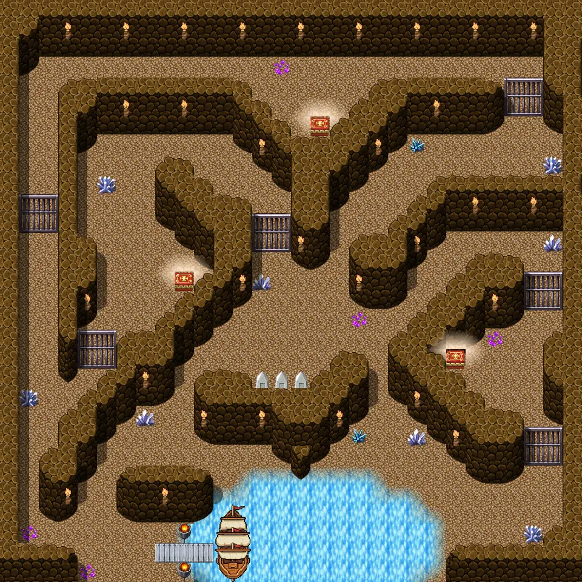

# Mountainlake sub

| | |
|---|---|
| **Map ID** | `mountainlake_sub` |
| **Type** | Outdoors |
| **Size** | 30×30 tiles |
| **Introduced** | [v0.8.18](../versions/0.8.18.md) |
| **NPCs** | 3 |
| **Enemy types** | 2 |
| **Quests** | 2 |
| **Containers** | 3 |

**Mountainlake sub** is an outdoor map. It has 3 NPCs and 2 kinds of enemy. 

## Map

<label class="lg"><input type="checkbox" data-t="spawn" checked><b>Red</b>&nbsp;Monsters / NPCs</label><label class="lg"><input type="checkbox" data-t="mapchange" checked><b>Blue</b>&nbsp;Exit to another map</label><label class="lg"><input type="checkbox" data-t="container" checked><b>Yellow</b>&nbsp;Container (click to see contents)</label><label class="lg"><input type="checkbox" data-t="sign" checked><b>Purple</b>&nbsp;Sign</label><label class="lg"><input type="checkbox" data-t="rest" checked><b>Green</b>&nbsp;Resting place</label><label class="lg"><input type="checkbox" data-t="key" checked><b>Orange dashed</b>&nbsp;Blocked until a quest step / item</label><label class="lg"><input type="checkbox" data-t="script"><b>Grey dotted</b>&nbsp;Scripted event</label><label class="lg"><input type="checkbox" data-t="replace"><b>White dotted</b>&nbsp;Changes during a quest</label><label class="lg"><input type="checkbox" data-t="pin" checked><b>Numbers</b>&nbsp;Numbered key points (see the key below the map)</label>

<a id="pin-npc-ash_fisher" class="pin pin-npc" href="#key-1" style="left:71.667%;top:85.000%" title="[Ash fisher](../../monsters/ash_fisher.md): NPC">1</a><a id="pin-npc-ll2_captain" class="pin pin-npc" href="#key-2" style="left:1.667%;top:98.333%" title="[Captain Burry](../../monsters/ll2_captain.md): NPC">2</a><a id="pin-npc-ll2_whirl_return" class="pin pin-npc" href="#key-3" style="left:51.667%;top:95.000%" title="[Charybdis](../../monsters/ll2_whirl.md#v-ll2_whirl_return): 1 quest">3</a><a class="pin pin-script" href="#key-4" style="left:38.333%;top:95.000%" title="Quest trigger: Scripted event: advances the quest: hidden story flag “ll2_nd” to stage 20 (“20=Sub Boat afloat”)">4</a><a class="pin pin-script" href="#key-5" style="left:45.000%;top:65.000%" title="Quest trigger: Scripted event: advances the quest: hidden story flag “ll2_nd” to stage 113 (“113=Door 3 open”)">5</a><a class="pin pin-script" href="#key-6" style="left:48.333%;top:65.000%" title="Quest trigger: Scripted event: advances the quest: hidden story flag “ll2_nd” to stage 112 (“112=Door 2 open”)">6</a><a class="pin pin-script" href="#key-7" style="left:51.667%;top:65.000%" title="Quest trigger: Scripted event: advances the quest: hidden story flag “ll2_nd” to stage 111 (“111=Door 1 open”)">7</a><a class="pin pin-container" href="#key-8" style="left:55.000%;top:21.667%" title="Container 1: Gold coins, A single grape from Kalypso">8</a><a class="pin pin-container" href="#key-9" style="left:31.667%;top:48.333%" title="Container 2: Gold coins, Circe&#x27;s Necklace">9</a><a class="pin pin-container" href="#key-10" style="left:78.333%;top:61.667%" title="Container 3: Gold coins, Polyphem&#x27;s favourite wine">10</a><a class="pin pin-key" href="#key-11" style="left:73.333%;top:88.333%" title="Blocked passage: Closed off once you reach this point in the quest: Search for Andor (stage 1: “My father Mikhail says that Andor has not been home since yesterday. I should go look for him in the village.”)">11</a><a class="pin pin-key" href="#key-11" style="left:68.333%;top:85.000%" title="Blocked passage: Closed off once you reach this point in the quest: Search for Andor (stage 1: “My father Mikhail says that Andor has not been home since yesterday. I should go look for him in the village.”)">11</a><a class="pin pin-key" href="#key-11" style="left:63.333%;top:81.667%" title="Blocked passage: Closed off once you reach this point in the quest: Search for Andor (stage 1: “My father Mikhail says that Andor has not been home since yesterday. I should go look for him in the village.”)">11</a><a class="pin pin-replace" href="#key-12" style="left:38.553%;top:90.834%" title="Changes during a quest: This area changes back during the quest: hidden story flag “ll2_nd” (stage 20: “20=Sub Boat afloat”)">12</a><a class="pin pin-replace" href="#key-13" style="left:35.400%;top:92.814%" title="Changes during a quest: This area changes during the quest: hidden story flag “ll2_nd” (stage 20: “20=Sub Boat afloat”)">13</a><a class="pin pin-replace" href="#key-14" style="left:93.333%;top:76.667%" title="Changes during a quest: This area changes during the quest: hidden story flag “ll2_nd” (stage 113: “113=Door 3 open”)">14</a><a class="pin pin-replace" href="#key-14" style="left:93.333%;top:50.000%" title="Changes during a quest: This area changes during the quest: hidden story flag “ll2_nd” (stage 113: “113=Door 3 open”)">14</a><a class="pin pin-replace" href="#key-15" style="left:16.667%;top:60.000%" title="Changes during a quest: This area changes during the quest: hidden story flag “ll2_nd” (stage 112: “112=Door 2 open”)">15</a><a class="pin pin-replace" href="#key-15" style="left:46.667%;top:40.000%" title="Changes during a quest: This area changes during the quest: hidden story flag “ll2_nd” (stage 112: “112=Door 2 open”)">15</a><a class="pin pin-replace" href="#key-16" style="left:90.000%;top:16.667%" title="Changes during a quest: This area changes during the quest: hidden story flag “ll2_nd” (stage 111: “111=Door 1 open”)">16</a><a class="pin pin-replace" href="#key-16" style="left:6.667%;top:36.667%" title="Changes during a quest: This area changes during the quest: hidden story flag “ll2_nd” (stage 111: “111=Door 1 open”)">16</a>

??? abstract "Key to the numbers on the map"

    | # | What | Details |
    |---|---|---|
    | 1 | [Ash fisher](../monsters/ash_fisher.md) | NPC |
    | 2 | [Captain Burry](../monsters/ll2_captain.md) | NPC |
    | 3 | [Charybdis](../monsters/ll2_whirl.md#v-ll2_whirl_return) | 1 quest |
    | 4 | Quest trigger | Scripted event: advances the quest: hidden story flag “ll2_nd” to stage 20 (“20=Sub Boat afloat”) |
    | 5 | Quest trigger | Scripted event: advances the quest: hidden story flag “ll2_nd” to stage 113 (“113=Door 3 open”) |
    | 6 | Quest trigger | Scripted event: advances the quest: hidden story flag “ll2_nd” to stage 112 (“112=Door 2 open”) |
    | 7 | Quest trigger | Scripted event: advances the quest: hidden story flag “ll2_nd” to stage 111 (“111=Door 1 open”) |
    | 8 | Container 1 | Gold coins, A single grape from Kalypso |
    | 9 | Container 2 | Gold coins, Circe's Necklace |
    | 10 | Container 3 | Gold coins, Polyphem's favourite wine |
    | 11 | Blocked passage | Closed off once you reach this point in the quest: Search for Andor (stage 1: “My father Mikhail says that Andor has not been home since yesterday. I should go look for him in the village.”) |
    | 12 | Changes during a quest | This area changes back during the quest: hidden story flag “ll2_nd” (stage 20: “20=Sub Boat afloat”) |
    | 13 | Changes during a quest | This area changes during the quest: hidden story flag “ll2_nd” (stage 20: “20=Sub Boat afloat”) |
    | 14 | Changes during a quest | This area changes during the quest: hidden story flag “ll2_nd” (stage 113: “113=Door 3 open”) |
    | 15 | Changes during a quest | This area changes during the quest: hidden story flag “ll2_nd” (stage 112: “112=Door 2 open”) |
    | 16 | Changes during a quest | This area changes during the quest: hidden story flag “ll2_nd” (stage 111: “111=Door 1 open”) |

Verified against v0.8.18 map data.

## NPCs

- [Ash fisher](../monsters/ash_fisher.md) (#1)
- [Captain Burry](../monsters/ll2_captain.md) (#2)
- [Charybdis](../monsters/ll2_whirl.md#v-ll2_whirl_return) — quests: [A map of the Great Lake Laeroth](../quests/lake_map.md) (#3)

## Enemies

| Enemy | HP | Damage | Up to | Notes |
|---|---|---|---|---|
| [Dead worms](../monsters/dead_worms.md) | 50 | 5–15 | 16 | – |
| [Molykros](../monsters/molykros.md) | 100 | 10–20 | 1 | – |

<small>“Up to” is the most that can be alive at once from the spawn areas on this map.</small>

## Items & containers

<b>Container 1</b><ul><li><a href="../../items/gold/">Gold coins</a> <small>100% · ×500 to 1500</small></li><li><a href="../../items/ll2_grape_kalypso/">A single grape from Kalypso</a> <small>100%</small></li></ul>

<b>Container 2</b><ul><li><a href="../../items/gold/">Gold coins</a> <small>100% · ×500 to 1500</small></li><li><a href="../../items/ll2_necklace/">Circe&#x27;s Necklace</a> <small>100%</small></li></ul>

<b>Container 3</b><ul><li><a href="../../items/gold/">Gold coins</a> <small>100% · ×500 to 1500</small></li><li><a href="../../items/ll2_wine/">Polyphem&#x27;s favourite wine</a> <small>100% · ×5 to 8</small></li></ul>

## Quests

- [A map of the Great Lake Laeroth](../quests/lake_map.md): [Charybdis](../monsters/ll2_whirl.md#v-ll2_whirl_return) is involved
- [Search for Andor](../quests/andor.md): blocked passage closes at stage 1
- [Lake Laeroth nondisplay (hidden flag)](../quests/ll2_nd.md): part of the map changes at stage 111; part of the map changes at stage 112; part of the map changes at stage 113; part of the map changes at stage 20; something on this map advances it; stepping on a trigger here sets stage 111; stepping on a trigger here sets stage 112; stepping on a trigger here sets stage 113; stepping on a trigger here sets stage 20

## Points of interest

- **Quest trigger** (#4): Scripted event: advances the quest: hidden story flag “ll2_nd” to stage 20 (“20=Sub Boat afloat”)
- **Quest trigger** (#5): Scripted event: advances the quest: hidden story flag “ll2_nd” to stage 113 (“113=Door 3 open”)
- **Quest trigger** (#6): Scripted event: advances the quest: hidden story flag “ll2_nd” to stage 112 (“112=Door 2 open”)
- **Quest trigger** (#7): Scripted event: advances the quest: hidden story flag “ll2_nd” to stage 111 (“111=Door 1 open”)
- **Blocked passage** (#11): Closed off once you reach this point in the quest: Search for Andor (stage 1: “My father Mikhail says that Andor has not been home since yesterday. I should go look for him in the village.”)
- **Changes during a quest** (#12): This area changes back during the quest: hidden story flag “ll2_nd” (stage 20: “20=Sub Boat afloat”)
- **Changes during a quest** (#13): This area changes during the quest: hidden story flag “ll2_nd” (stage 20: “20=Sub Boat afloat”)
- **Changes during a quest** (#14): This area changes during the quest: hidden story flag “ll2_nd” (stage 113: “113=Door 3 open”)
- **Changes during a quest** (#15): This area changes during the quest: hidden story flag “ll2_nd” (stage 112: “112=Door 2 open”)
- **Changes during a quest** (#16): This area changes during the quest: hidden story flag “ll2_nd” (stage 111: “111=Door 1 open”)

## Version history

| Version | Change |
|---|---|
| [v0.8.18](../versions/0.8.18.md) | Added |

Verified against v0.8.18 and every earlier release back to v0.7.0 (game data compared release by release).

## Community notes

<small>Written by players, not generated from game data. **Observations**: what players notice in-game · **Lore**: the in-world story · **Trivia**: real-world facts, references, development history · **Theory / speculation**: unconfirmed ideas; may just be unfinished content</small>

### Observations

*No notes yet. Contributions are welcome: [add a note](https://github.com/asdfghjkl628/Andor-s-Trail-Wikiiii/new/main/notes/maps?filename=mountainlake_sub.md&value=%23%23%20Observations%0A%0A%3C%21--%20what%20players%20notice%20in-game%20--%3E%0A%0A%23%23%20Lore%0A%0A%3C%21--%20the%20in-world%20story%20--%3E%0A%0A%23%23%20Trivia%0A%0A%3C%21--%20real-world%20facts%2C%20references%2C%20development%20history%20--%3E%0A%0A%23%23%20Theory%20/%20speculation%0A%0A%3C%21--%20unconfirmed%20ideas%3B%20may%20just%20be%20unfinished%20content%20--%3E%0A).*

### Lore

*No notes yet. Contributions are welcome: [add a note](https://github.com/asdfghjkl628/Andor-s-Trail-Wikiiii/new/main/notes/maps?filename=mountainlake_sub.md&value=%23%23%20Observations%0A%0A%3C%21--%20what%20players%20notice%20in-game%20--%3E%0A%0A%23%23%20Lore%0A%0A%3C%21--%20the%20in-world%20story%20--%3E%0A%0A%23%23%20Trivia%0A%0A%3C%21--%20real-world%20facts%2C%20references%2C%20development%20history%20--%3E%0A%0A%23%23%20Theory%20/%20speculation%0A%0A%3C%21--%20unconfirmed%20ideas%3B%20may%20just%20be%20unfinished%20content%20--%3E%0A).*

### Trivia

*No notes yet. Contributions are welcome: [add a note](https://github.com/asdfghjkl628/Andor-s-Trail-Wikiiii/new/main/notes/maps?filename=mountainlake_sub.md&value=%23%23%20Observations%0A%0A%3C%21--%20what%20players%20notice%20in-game%20--%3E%0A%0A%23%23%20Lore%0A%0A%3C%21--%20the%20in-world%20story%20--%3E%0A%0A%23%23%20Trivia%0A%0A%3C%21--%20real-world%20facts%2C%20references%2C%20development%20history%20--%3E%0A%0A%23%23%20Theory%20/%20speculation%0A%0A%3C%21--%20unconfirmed%20ideas%3B%20may%20just%20be%20unfinished%20content%20--%3E%0A).*

### Theory / speculation

*No notes yet. Contributions are welcome: [add a note](https://github.com/asdfghjkl628/Andor-s-Trail-Wikiiii/new/main/notes/maps?filename=mountainlake_sub.md&value=%23%23%20Observations%0A%0A%3C%21--%20what%20players%20notice%20in-game%20--%3E%0A%0A%23%23%20Lore%0A%0A%3C%21--%20the%20in-world%20story%20--%3E%0A%0A%23%23%20Trivia%0A%0A%3C%21--%20real-world%20facts%2C%20references%2C%20development%20history%20--%3E%0A%0A%23%23%20Theory%20/%20speculation%0A%0A%3C%21--%20unconfirmed%20ideas%3B%20may%20just%20be%20unfinished%20content%20--%3E%0A).*

??? info "Technical information"

    | | |
    |---|---|
    | Map ID | `mountainlake_sub` |
    | File | `res/xml/mountainlake_sub.tmx` |
    | Size | 30×30 tiles (960×960 px) |
    | outdoors property | 1 |
    | Layers drawn | base, ground, objects, above, top |
    | Tilesets | map_bed_1, map_boats_2, map_border_1, map_bridge_1, map_bridge_2, map_broken_1, map_cavewall_1, map_cavewall_2, map_cavewall_3, map_cavewall_4, map_chair_table_1, map_chair_table_2, map_crate_1, map_cupboard_1, map_curtain_1, map_entrance_1, map_entrance_2, map_fence_1, map_fence_2, map_fence_3, map_fence_4, map_ground_1, map_ground_2, map_ground_3, map_ground_4, map_ground_5, map_ground_6, map_ground_7, map_ground_8, map_house_1, map_house_2, map_indoor_1, map_indoor_2, map_kitchen_1, map_outdoor_1, map_pillar_1, map_pillar_2, map_plant_1, map_plant_2, map_rock_1, map_rock_2, map_roof_1, map_roof_2, map_roof_3, map_shop_1, map_sign_ladder_1, map_table_1, map_trail_1, map_transition_1, map_transition_2, map_transition_3, map_transition_4, map_transition_5, map_tree_1, map_tree_2, map_wall_1, map_wall_2, map_wall_3, map_wall_4, map_window_1, map_window_2 |
    | Map objects | spawn: 10, replace: 8, script: 4, container: 3, key: 3, mapchange: 1 |
    | World map position | – |

<small>Data from v0.8.18</small>
