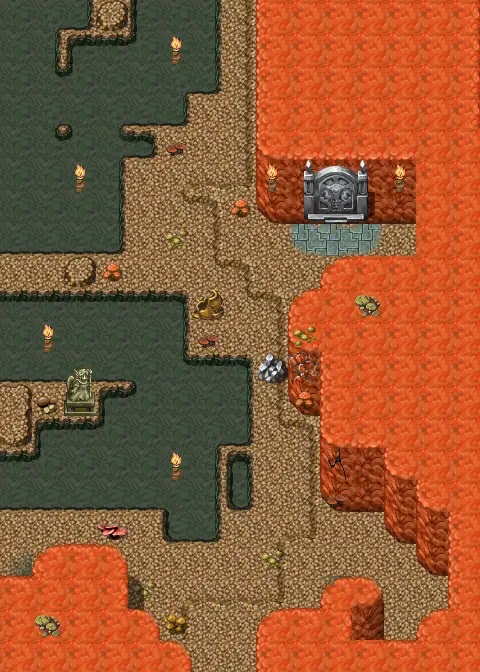

# Mushroom m2 4

| | |
|---|---|
| **Map ID** | `mushroom_m2_4` |
| **Type** | Indoors / underground |
| **Size** | 15×21 tiles |
| **World map** | [Fungi panic](index.md) |
| **Introduced** | [v0.7.13](../versions/0.7.13.md) |
| **NPCs** | 2 |
| **Enemy types** | 2 |
| **Quests** | 0 |
| **Containers** | 1 |

**Mushroom m2 4** is an indoor map. It has 2 NPCs and 2 kinds of enemy. Exits lead to Mushroom m2 4b, Mushroom m2 5, Mushroom m2 2, Mushroom m2 3.

## Map

<label class="lg"><input type="checkbox" data-t="spawn" checked><b>Red</b>&nbsp;Monsters / NPCs</label><label class="lg"><input type="checkbox" data-t="mapchange" checked><b>Blue</b>&nbsp;Exit to another map</label><label class="lg"><input type="checkbox" data-t="container" checked><b>Yellow</b>&nbsp;Container (click to see contents)</label><label class="lg"><input type="checkbox" data-t="sign" checked><b>Purple</b>&nbsp;Sign</label><label class="lg"><input type="checkbox" data-t="rest" checked><b>Green</b>&nbsp;Resting place</label><label class="lg"><input type="checkbox" data-t="key" checked><b>Orange dashed</b>&nbsp;Blocked until a quest step / item</label><label class="lg"><input type="checkbox" data-t="script"><b>Grey dotted</b>&nbsp;Scripted event</label><label class="lg"><input type="checkbox" data-t="replace"><b>White dotted</b>&nbsp;Changes during a quest</label><label class="lg"><input type="checkbox" data-t="pin" checked><b>Numbers</b>&nbsp;Numbered key points (see the key below the map)</label>

<a class="pin pin-exit" href="#key-1" style="left:83.333%;top:2.381%" title="Exit (north): to [Mushroom m2 4b](mushroom_m2_4b.md)">1</a><a class="pin pin-exit" href="#key-2" style="left:50.000%;top:2.381%" title="Exit (north): to [Mushroom m2 5](mushroom_m2_5.md)">2</a><a class="pin pin-exit" href="#key-3" style="left:46.667%;top:97.619%" title="Exit (south): to [Mushroom m2 2](mushroom_m2_2.md)">3</a><a class="pin pin-exit" href="#key-4" style="left:3.333%;top:61.905%" title="Exit (west): to [Mushroom m2 3](mushroom_m2_3.md)">4</a><a id="pin-npc-bogsten_granny" class="pin pin-npc" href="#key-5" style="left:56.667%;top:50.000%" title="[Undina Bogsten](../../monsters/bogsten_granny.md): NPC">5</a><a id="pin-npc-bogsten_granny1" class="pin pin-npc" href="#key-6" style="left:76.667%;top:16.667%" title="[Undina Bogsten](../../monsters/bogsten_granny.md#v-bogsten_granny1): NPC">6</a><a class="pin pin-container" href="#key-7" style="left:63.333%;top:11.905%" title="Container 1: Gold coins">7</a><a class="pin pin-sign" href="#key-8" style="left:63.333%;top:7.143%" title="Sign: “In death, I still help mushrooms to grow.”">8</a><a class="pin pin-sign" href="#key-9" style="left:70.000%;top:7.143%" title="Sign: “Here lies Febalum Bogsten, founder of this mushroom farm.”">9</a><a class="pin pin-sign" href="#key-10" style="left:76.667%;top:7.143%" title="Sign: “Bogsten is my name, mushrooms are my game.”">10</a><a class="pin pin-script" href="#key-11" style="left:83.333%;top:7.143%" title="Quest trigger: Scripted event: advances the quest: hidden story flag “fungi_panic_nondisplayed” to stage 210 (“You found a hidden way downstairs.”)">11</a><a class="pin pin-sign" href="#key-12" style="left:90.000%;top:7.143%" title="Sign: “I&#x27;ve been planted in the soil, and it&#x27;s dark. I feel like a mushroom.”">12</a><a class="pin pin-script" href="#key-13" style="left:43.333%;top:33.333%" title="Quest trigger: Scripted event: advances the quest: hidden story flag “fungi_panic_nondisplayed” to stage 100 (“100=Granny despawn.”)">13</a><a class="pin pin-key" href="#key-14" style="left:70.000%;top:30.952%" title="Blocked passage: Unlocked during the quest: hidden story flag “fungi_panic_nondisplayed” (stage 200: “Bogsten&#x27;s grand grand grandmother invited me to their family tomb.”)">14</a><a class="pin pin-replace" href="#key-15" style="left:77.105%;top:13.096%" title="Changes during a quest: This area changes during the quest: hidden story flag “fungi_panic_nondisplayed” (stage 200: “Bogsten&#x27;s grand grand grandmother invited me to their family tomb.”)">15</a><a class="pin pin-replace" href="#key-16" style="left:77.466%;top:1.640%" title="Changes during a quest: This area changes during the quest: hidden story flag “fungi_panic_nondisplayed” (stage 210: “You found a hidden way downstairs.”)">16</a>

??? abstract "Key to the numbers on the map"

    | # | What | Details |
    |---|---|---|
    | 1 | Exit (north) | to [Mushroom m2 4b](mushroom_m2_4b.md) |
    | 2 | Exit (north) | to [Mushroom m2 5](mushroom_m2_5.md) |
    | 3 | Exit (south) | to [Mushroom m2 2](mushroom_m2_2.md) |
    | 4 | Exit (west) | to [Mushroom m2 3](mushroom_m2_3.md) |
    | 5 | [Undina Bogsten](../monsters/bogsten_granny.md) | NPC |
    | 6 | [Undina Bogsten](../monsters/bogsten_granny.md#v-bogsten_granny1) | NPC |
    | 7 | Container 1 | Gold coins |
    | 8 | Sign | “In death, I still help mushrooms to grow.” |
    | 9 | Sign | “Here lies Febalum Bogsten, founder of this mushroom farm.” |
    | 10 | Sign | “Bogsten is my name, mushrooms are my game.” |
    | 11 | Quest trigger | Scripted event: advances the quest: hidden story flag “fungi_panic_nondisplayed” to stage 210 (“You found a hidden way downstairs.”) |
    | 12 | Sign | “I've been planted in the soil, and it's dark. I feel like a mushroom.” |
    | 13 | Quest trigger | Scripted event: advances the quest: hidden story flag “fungi_panic_nondisplayed” to stage 100 (“100=Granny despawn.”) |
    | 14 | Blocked passage | Unlocked during the quest: hidden story flag “fungi_panic_nondisplayed” (stage 200: “Bogsten's grand grand grandmother invited me to their family tomb.”) |
    | 15 | Changes during a quest | This area changes during the quest: hidden story flag “fungi_panic_nondisplayed” (stage 200: “Bogsten's grand grand grandmother invited me to their family tomb.”) |
    | 16 | Changes during a quest | This area changes during the quest: hidden story flag “fungi_panic_nondisplayed” (stage 210: “You found a hidden way downstairs.”) |

Verified against v0.8.18 map data.

## Connections

| Direction | Leads to | Region there | Map # |
|---|---|---|---|
| North | [Mushroom m2 4b](mushroom_m2_4b.md) | – | 1 |
| North | [Mushroom m2 5](mushroom_m2_5.md) | – | 2 |
| South | [Mushroom m2 2](mushroom_m2_2.md) | – | 3 |
| West | [Mushroom m2 3](mushroom_m2_3.md) | – | 4 |

## NPCs

- [Undina Bogsten](../monsters/bogsten_granny.md) (#5)
- [Undina Bogsten](../monsters/bogsten_granny.md#v-bogsten_granny1) (#6)

## Enemies

| Enemy | HP | Damage | Up to | Notes |
|---|---|---|---|---|
| [Weak fungi](../monsters/weak_fungi.md) | 20 | 1–2 | 5 | – |
| [Fungi](../monsters/mid_fungi.md) | 25 | 2–3 | 4 | – |

<small>“Up to” is the most that can be alive at once from the spawn areas on this map.</small>

## Items & containers

<b>Container 1</b><ul><li><a href="../../items/gold/">Gold coins</a> <small>100% · ×100 to 200</small></li></ul>

## Quests

- [Fungi Panic - non displayed (hidden flag)](../quests/fungi_panic_nondisplayed.md): [Undina Bogsten](../monsters/bogsten_granny.md) is involved; [Undina Bogsten](../monsters/bogsten_granny.md#v-bogsten_granny1) is involved; blocked passage opens at stage 200; part of the map changes at stage 200; part of the map changes at stage 210; something on this map advances it; stepping on a trigger here sets stage 100; stepping on a trigger here sets stage 210

## Points of interest

- **Sign** (#8): “In death, I still help mushrooms to grow.”
- **Sign** (#9): “Here lies Febalum Bogsten, founder of this mushroom farm.”
- **Sign** (#10): “Bogsten is my name, mushrooms are my game.”
- **Quest trigger** (#11): Scripted event: advances the quest: hidden story flag “fungi_panic_nondisplayed” to stage 210 (“You found a hidden way downstairs.”)
- **Sign** (#12): “I've been planted in the soil, and it's dark. I feel like a mushroom.”
- **Quest trigger** (#13): Scripted event: advances the quest: hidden story flag “fungi_panic_nondisplayed” to stage 100 (“100=Granny despawn.”)
- **Blocked passage** (#14): Unlocked during the quest: hidden story flag “fungi_panic_nondisplayed” (stage 200: “Bogsten's grand grand grandmother invited me to their family tomb.”)
- **Changes during a quest** (#15): This area changes during the quest: hidden story flag “fungi_panic_nondisplayed” (stage 200: “Bogsten's grand grand grandmother invited me to their family tomb.”)
- **Changes during a quest** (#16): This area changes during the quest: hidden story flag “fungi_panic_nondisplayed” (stage 210: “You found a hidden way downstairs.”)

## Version history

| Version | Change |
|---|---|
| [v0.7.13](../versions/0.7.13.md) | Added |

Verified against v0.8.18 and every earlier release back to v0.7.0 (game data compared release by release).

## Community notes

<small>Written by players, not generated from game data. **Observations**: what players notice in-game · **Lore**: the in-world story · **Trivia**: real-world facts, references, development history · **Theory / speculation**: unconfirmed ideas; may just be unfinished content</small>

### Observations

*No notes yet. Contributions are welcome: [add a note](https://github.com/asdfghjkl628/Andor-s-Trail-Wikiiii/new/main/notes/maps?filename=mushroom_m2_4.md&value=%23%23%20Observations%0A%0A%3C%21--%20what%20players%20notice%20in-game%20--%3E%0A%0A%23%23%20Lore%0A%0A%3C%21--%20the%20in-world%20story%20--%3E%0A%0A%23%23%20Trivia%0A%0A%3C%21--%20real-world%20facts%2C%20references%2C%20development%20history%20--%3E%0A%0A%23%23%20Theory%20/%20speculation%0A%0A%3C%21--%20unconfirmed%20ideas%3B%20may%20just%20be%20unfinished%20content%20--%3E%0A).*

### Lore

*No notes yet. Contributions are welcome: [add a note](https://github.com/asdfghjkl628/Andor-s-Trail-Wikiiii/new/main/notes/maps?filename=mushroom_m2_4.md&value=%23%23%20Observations%0A%0A%3C%21--%20what%20players%20notice%20in-game%20--%3E%0A%0A%23%23%20Lore%0A%0A%3C%21--%20the%20in-world%20story%20--%3E%0A%0A%23%23%20Trivia%0A%0A%3C%21--%20real-world%20facts%2C%20references%2C%20development%20history%20--%3E%0A%0A%23%23%20Theory%20/%20speculation%0A%0A%3C%21--%20unconfirmed%20ideas%3B%20may%20just%20be%20unfinished%20content%20--%3E%0A).*

### Trivia

*No notes yet. Contributions are welcome: [add a note](https://github.com/asdfghjkl628/Andor-s-Trail-Wikiiii/new/main/notes/maps?filename=mushroom_m2_4.md&value=%23%23%20Observations%0A%0A%3C%21--%20what%20players%20notice%20in-game%20--%3E%0A%0A%23%23%20Lore%0A%0A%3C%21--%20the%20in-world%20story%20--%3E%0A%0A%23%23%20Trivia%0A%0A%3C%21--%20real-world%20facts%2C%20references%2C%20development%20history%20--%3E%0A%0A%23%23%20Theory%20/%20speculation%0A%0A%3C%21--%20unconfirmed%20ideas%3B%20may%20just%20be%20unfinished%20content%20--%3E%0A).*

### Theory / speculation

*No notes yet. Contributions are welcome: [add a note](https://github.com/asdfghjkl628/Andor-s-Trail-Wikiiii/new/main/notes/maps?filename=mushroom_m2_4.md&value=%23%23%20Observations%0A%0A%3C%21--%20what%20players%20notice%20in-game%20--%3E%0A%0A%23%23%20Lore%0A%0A%3C%21--%20the%20in-world%20story%20--%3E%0A%0A%23%23%20Trivia%0A%0A%3C%21--%20real-world%20facts%2C%20references%2C%20development%20history%20--%3E%0A%0A%23%23%20Theory%20/%20speculation%0A%0A%3C%21--%20unconfirmed%20ideas%3B%20may%20just%20be%20unfinished%20content%20--%3E%0A).*

??? info "Technical information"

    | | |
    |---|---|
    | Map ID | `mushroom_m2_4` |
    | File | `res/xml/mushroom_m2_4.tmx` |
    | Size | 15×21 tiles (480×672 px) |
    | outdoors property | – |
    | Layers drawn | ground, objects, above, top |
    | Tilesets | map_bed_1, map_border_1, map_bridge_1, map_bridge_2, map_broken_1, map_cavewall_1, map_cavewall_2, map_cavewall_3, map_cavewall_4, map_chair_table_1, map_chair_table_2, map_crate_1, map_cupboard_1, map_curtain_1, map_entrance_1, map_entrance_2, map_fence_1, map_fence_2, map_fence_3, map_fence_4, map_ground_1, map_ground_2, map_ground_3, map_ground_4, map_ground_5, map_ground_6, map_ground_7, map_ground_8, map_house_1, map_house_2, map_indoor_1, map_indoor_2, map_kitchen_1, map_outdoor_1, map_pillar_1, map_pillar_2, map_plant_1, map_plant_2, map_rock_1, map_rock_2, map_roof_1, map_roof_2, map_roof_3, map_shop_1, map_sign_ladder_1, map_table_1, map_trail_1, map_transition_1, map_transition_2, map_transition_3, map_transition_4, map_transition_5, map_tree_1, map_tree_2, map_wall_1, map_wall_2, map_wall_3, map_wall_4, map_window_1, map_window_2 |
    | Map objects | spawn: 6, mapchange: 4, sign: 4, script: 2, replace: 2, container: 1, key: 1 |
    | World map position | segment `fungi_panic`, x 329, y 420 |

<small>Data from v0.8.18</small>
