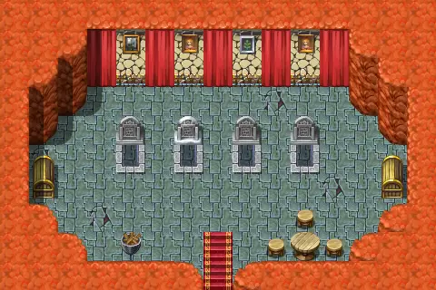

# Mushroom m 2 4b

| | |
|---|---|
| **Map ID** | `mushroom_m2_4b` |
| **Type** | Indoors / underground |
| **Size** | 15×10 tiles |
| **Introduced** | [v0.7.13](../versions/0.7.13.md) |
| **NPCs** | 4 |
| **Quests** | 1 |
| **Containers** | 2 |

**Mushroom m 2 4b** is an indoor map. It has 4 NPCs, and no enemies. Exits lead to Mushroom m 2 4.

## Map

<label class="lg"><input type="checkbox" data-t="spawn" checked><b>Red</b>&nbsp;Monsters / NPCs</label><label class="lg"><input type="checkbox" data-t="mapchange" checked><b>Blue</b>&nbsp;Exit to another map</label><label class="lg"><input type="checkbox" data-t="container" checked><b>Yellow</b>&nbsp;Container (click to see contents)</label><label class="lg"><input type="checkbox" data-t="sign" checked><b>Purple</b>&nbsp;Sign</label><label class="lg"><input type="checkbox" data-t="rest" checked><b>Green</b>&nbsp;Resting place</label><label class="lg"><input type="checkbox" data-t="key" checked><b>Orange dashed</b>&nbsp;Blocked until a quest step / item</label><label class="lg"><input type="checkbox" data-t="script"><b>Grey dotted</b>&nbsp;Scripted event</label><label class="lg"><input type="checkbox" data-t="replace"><b>White dotted</b>&nbsp;Changes during a quest</label><label class="lg"><input type="checkbox" data-t="pin" checked><b>Numbers</b>&nbsp;Numbered key points (see the key below the map)</label>

<a class="pin pin-exit" href="#key-1" style="left:50.000%;top:95.000%" title="Exit (south): to [Mushroom m 2 4](mushroom_m2_4.md)">1</a><a id="pin-npc-bogsten_gambler1" class="pin pin-npc" href="#key-2" style="left:76.667%;top:85.000%" title="[Bogal](../../monsters/bogsten_gambler1.md): NPC">2</a><a id="pin-npc-bogsten_gambler3" class="pin pin-npc" href="#key-3" style="left:63.333%;top:85.000%" title="[Bollo](../../monsters/bogsten_gambler3.md): NPC">3</a><a id="pin-npc-bogsten_gambler2" class="pin pin-npc" href="#key-4" style="left:70.000%;top:75.000%" title="[Botisto](../../monsters/bogsten_gambler2.md): NPC">4</a><a id="pin-npc-bogsten_ghost5" class="pin pin-npc" href="#key-5" style="left:43.333%;top:45.000%" title="[Confused ghost](../../monsters/bogsten_ghost5.md): NPC">5</a><a class="pin pin-container" href="#key-6" style="left:90.000%;top:55.000%" title="Container 1: Glass gem, Gardener&#x27;s gloves">6</a><a class="pin pin-container" href="#key-7" style="left:10.000%;top:55.000%" title="Container 2: Ruby gem, Iron dagger">7</a><a class="pin pin-key" href="#key-8" style="left:30.000%;top:50.000%" title="Blocked passage: Unlocked during the quest: base_nondisplay (stage 2: “2=This stage is never set”)">8</a><a class="pin pin-key" href="#key-8" style="left:40.123%;top:54.412%" title="Blocked passage: Unlocked during the quest: base_nondisplay (stage 2: “2=This stage is never set”)">8</a><a class="pin pin-key" href="#key-8" style="left:56.667%;top:50.000%" title="Blocked passage: Unlocked during the quest: base_nondisplay (stage 2: “2=This stage is never set”)">8</a><a class="pin pin-key" href="#key-8" style="left:70.000%;top:50.000%" title="Blocked passage: Unlocked during the quest: base_nondisplay (stage 2: “2=This stage is never set”)">8</a>

??? abstract "Key to the numbers on the map"

    | # | What | Details |
    |---|---|---|
    | 1 | Exit (south) | to [Mushroom m 2 4](mushroom_m2_4.md) |
    | 2 | [Bogal](../monsters/bogsten_gambler1.md) | NPC |
    | 3 | [Bollo](../monsters/bogsten_gambler3.md) | NPC |
    | 4 | [Botisto](../monsters/bogsten_gambler2.md) | NPC |
    | 5 | [Confused ghost](../monsters/bogsten_ghost5.md) | NPC |
    | 6 | Container 1 | Glass gem, Gardener's gloves |
    | 7 | Container 2 | Ruby gem, Iron dagger |
    | 8 | Blocked passage | Unlocked during the quest: base_nondisplay (stage 2: “2=This stage is never set”) |

Verified against v0.8.18 map data.

## Connections

| Direction | Leads to | Region there | Map # |
|---|---|---|---|
| South | [Mushroom m 2 4](mushroom_m2_4.md) | – | 1 |

## NPCs

- [Bogal](../monsters/bogsten_gambler1.md) (#2)
- [Bollo](../monsters/bogsten_gambler3.md) (#3)
- [Botisto](../monsters/bogsten_gambler2.md) (#4)
- [Confused ghost](../monsters/bogsten_ghost5.md) (#5)

## Items & containers

<b>Container 1</b><ul><li><a href="../../items/gem1/">Glass gem</a> <small>100% · ×1 to 3</small></li><li><a href="../../items/gardener_gloves/">Gardener&#x27;s gloves</a> <small>100%</small></li></ul>

<b>Container 2</b><ul><li><a href="../../items/gem2/">Ruby gem</a> <small>100% · ×1 to 3</small></li><li><a href="../../items/dagger0/">Iron dagger</a> <small>100%</small></li></ul>

## Quests

- [base_nondisplay](../quests/base_nondisplay.md): blocked passage opens at stage 2

## Points of interest

- **Blocked passage** (#8): Unlocked during the quest: base_nondisplay (stage 2: “2=This stage is never set”)

## Version history

| Version | Change |
|---|---|
| [v0.7.13](../versions/0.7.13.md) | Added |

Verified against v0.8.18 and every earlier release back to v0.7.0 (game data compared release by release).

## Community notes

<small>Written by players, not generated from game data. **Observations**: what players notice in-game · **Lore**: the in-world story · **Trivia**: real-world facts, references, development history · **Theory / speculation**: unconfirmed ideas; may just be unfinished content</small>

### Observations

*No notes yet. Contributions are welcome: [add a note](https://github.com/asdfghjkl628/Andor-s-Trail-Wikiiii/new/main/notes/maps?filename=mushroom_m2_4b.md&value=%23%23%20Observations%0A%0A%3C%21--%20what%20players%20notice%20in-game%20--%3E%0A%0A%23%23%20Lore%0A%0A%3C%21--%20the%20in-world%20story%20--%3E%0A%0A%23%23%20Trivia%0A%0A%3C%21--%20real-world%20facts%2C%20references%2C%20development%20history%20--%3E%0A%0A%23%23%20Theory%20/%20speculation%0A%0A%3C%21--%20unconfirmed%20ideas%3B%20may%20just%20be%20unfinished%20content%20--%3E%0A).*

### Lore

*No notes yet. Contributions are welcome: [add a note](https://github.com/asdfghjkl628/Andor-s-Trail-Wikiiii/new/main/notes/maps?filename=mushroom_m2_4b.md&value=%23%23%20Observations%0A%0A%3C%21--%20what%20players%20notice%20in-game%20--%3E%0A%0A%23%23%20Lore%0A%0A%3C%21--%20the%20in-world%20story%20--%3E%0A%0A%23%23%20Trivia%0A%0A%3C%21--%20real-world%20facts%2C%20references%2C%20development%20history%20--%3E%0A%0A%23%23%20Theory%20/%20speculation%0A%0A%3C%21--%20unconfirmed%20ideas%3B%20may%20just%20be%20unfinished%20content%20--%3E%0A).*

### Trivia

*No notes yet. Contributions are welcome: [add a note](https://github.com/asdfghjkl628/Andor-s-Trail-Wikiiii/new/main/notes/maps?filename=mushroom_m2_4b.md&value=%23%23%20Observations%0A%0A%3C%21--%20what%20players%20notice%20in-game%20--%3E%0A%0A%23%23%20Lore%0A%0A%3C%21--%20the%20in-world%20story%20--%3E%0A%0A%23%23%20Trivia%0A%0A%3C%21--%20real-world%20facts%2C%20references%2C%20development%20history%20--%3E%0A%0A%23%23%20Theory%20/%20speculation%0A%0A%3C%21--%20unconfirmed%20ideas%3B%20may%20just%20be%20unfinished%20content%20--%3E%0A).*

### Theory / speculation

*No notes yet. Contributions are welcome: [add a note](https://github.com/asdfghjkl628/Andor-s-Trail-Wikiiii/new/main/notes/maps?filename=mushroom_m2_4b.md&value=%23%23%20Observations%0A%0A%3C%21--%20what%20players%20notice%20in-game%20--%3E%0A%0A%23%23%20Lore%0A%0A%3C%21--%20the%20in-world%20story%20--%3E%0A%0A%23%23%20Trivia%0A%0A%3C%21--%20real-world%20facts%2C%20references%2C%20development%20history%20--%3E%0A%0A%23%23%20Theory%20/%20speculation%0A%0A%3C%21--%20unconfirmed%20ideas%3B%20may%20just%20be%20unfinished%20content%20--%3E%0A).*

??? info "Technical information"

    | | |
    |---|---|
    | Map ID | `mushroom_m2_4b` |
    | File | `res/xml/mushroom_m2_4b.tmx` |
    | Size | 15×10 tiles (480×320 px) |
    | outdoors property | – |
    | Layers drawn | ground, objects, above, top |
    | Tilesets | map_bed_1, map_border_1, map_bridge_1, map_bridge_2, map_broken_1, map_cavewall_1, map_cavewall_2, map_cavewall_3, map_cavewall_4, map_chair_table_1, map_chair_table_2, map_crate_1, map_cupboard_1, map_curtain_1, map_entrance_1, map_entrance_2, map_fence_1, map_fence_2, map_fence_3, map_fence_4, map_ground_1, map_ground_2, map_ground_3, map_ground_4, map_ground_5, map_ground_6, map_ground_7, map_ground_8, map_house_1, map_house_2, map_indoor_1, map_indoor_2, map_kitchen_1, map_outdoor_1, map_pillar_1, map_pillar_2, map_plant_1, map_plant_2, map_rock_1, map_rock_2, map_roof_1, map_roof_2, map_roof_3, map_shop_1, map_sign_ladder_1, map_table_1, map_trail_1, map_transition_1, map_transition_2, map_transition_3, map_transition_4, map_transition_5, map_tree_1, map_tree_2, map_wall_1, map_wall_2, map_wall_3, map_wall_4, map_window_1, map_window_2 |
    | Map objects | spawn: 4, key: 4, container: 2, mapchange: 1 |
    | World map position | – |

<small>Data from v0.8.18</small>
