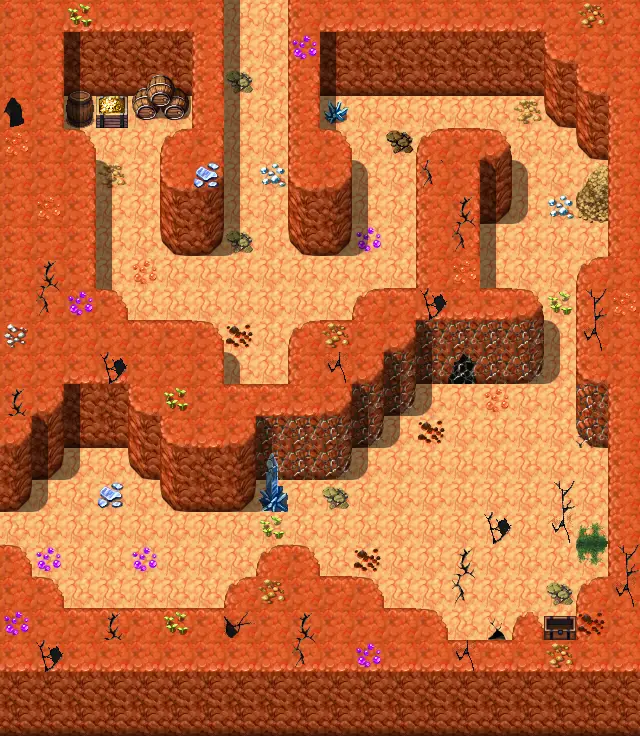

# Mushroom m3 2

20×23 tiles · part of [Fungi panic](index.md)

<label class="lg"><input type="checkbox" data-t="spawn" checked><b>Red</b>&nbsp;Monsters / NPCs</label><label class="lg"><input type="checkbox" data-t="mapchange" checked><b>Blue</b>&nbsp;Exit to another map</label><label class="lg"><input type="checkbox" data-t="container" checked><b>Yellow</b>&nbsp;Container (click to see contents)</label><label class="lg"><input type="checkbox" data-t="sign" checked><b>Purple</b>&nbsp;Sign</label><label class="lg"><input type="checkbox" data-t="rest" checked><b>Green</b>&nbsp;Resting place</label><label class="lg"><input type="checkbox" data-t="key" checked><b>Orange dashed</b>&nbsp;Blocked until a quest step / item</label><label class="lg"><input type="checkbox" data-t="script"><b>Grey dotted</b>&nbsp;Scripted event</label><label class="lg"><input type="checkbox" data-t="replace"><b>White dotted</b>&nbsp;Changes during a quest</label>

## Containers

<b>Container 1</b><ul><li><a href="../../items/gold/">Gold coins</a> <small>100% · ×100 to 300</small></li><li><a href="../../items/gem1/">Glass gem</a> <small>50% · ×1 to 3</small></li><li><a href="../../items/gem2/">Ruby gem</a> <small>50% · ×1 to 3</small></li></ul>

<b>Container 2</b><ul><li><a href="../../items/liquid_fungi/">Fungi potion</a> <small>100%</small></li><li><a href="../../items/gold/">Gold coins</a> <small>100% · ×50 to 200</small></li><li><a href="../../items/gem2/">Ruby gem</a> <small>50% · ×2 to 3</small></li></ul>

## Exits

- [Mushroom m3 1](mushroom_m3_1.md)
- [Mywildcave4](mywildcave4.md)

## Monsters & NPCs here

| Name | HP |
|---|---|
| [Lediofa](../monsters/fungi_rescued.md) | 0 |
| [Angry weak fungi](../monsters/weak_fungi_1.md) | 20 |
| [Weak fungi](../monsters/weak_fungi.md) | 20 |
| [Fungi](../monsters/mid_fungi.md) | 25 |
| [Gray cave bat](../monsters/cavebat1.md) | 28 |
| [Lombric ball](../monsters/lombric_ball.md) | 30 |
| [Lombric beast](../monsters/lombric_beast.md) | 30 |
| [Black cave bat](../monsters/cavebat2.md) | 32 |
| [Angry fungi](../monsters/mid_fungi_1.md) | 35 |
| [Brown cave bat](../monsters/cavebat3.md) | 36 |
| [Angry dangerous fungi](../monsters/dangerous_fungi_1.md) | 45 |
| [Dangerous fungi](../monsters/dangerous_fungi.md) | 55 |
| [Great fungi](../monsters/boss_fungi.md) | 175 |

<small>Map ID: `mushroom_m3_2` · Data from v0.8.18</small>
