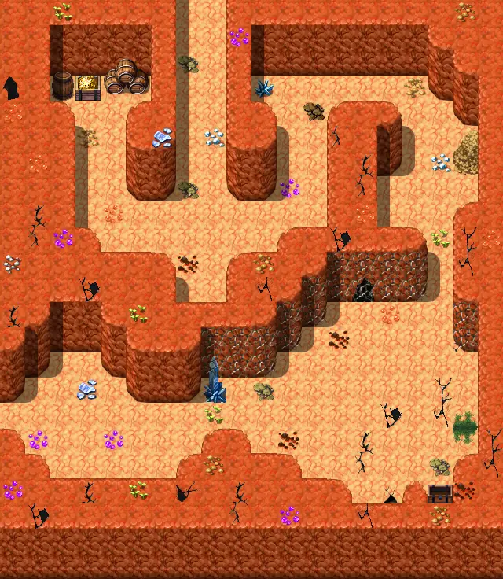
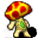
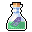

# Mushroom m 3 2

| | |
|---|---|
| **Map ID** | `mushroom_m3_2` |
| **Type** | Indoors / underground |
| **Size** | 20×23 tiles |
| **World map** | [Fungi panic](index.md) |
| **Introduced** | [v0.7.13](../versions/0.7.13.md) |
| **NPCs** | 1 |
| **Enemy types** | 12 |
| **Quests** | 1 |
| **Containers** | 2 |

**Mushroom m 3 2** is an indoor map. It has 1 NPC and 12 kinds of enemy. Exits lead to Mushroom m 3 1, Mywildcave 4.

## Map

<label class="lg"><input type="checkbox" data-t="spawn" checked><b>Red</b>&nbsp;Monsters / NPCs</label><label class="lg"><input type="checkbox" data-t="mapchange" checked><b>Blue</b>&nbsp;Exit to another map</label><label class="lg"><input type="checkbox" data-t="container" checked><b>Yellow</b>&nbsp;Container (click to see contents)</label><label class="lg"><input type="checkbox" data-t="sign" checked><b>Purple</b>&nbsp;Sign</label><label class="lg"><input type="checkbox" data-t="rest" checked><b>Green</b>&nbsp;Resting place</label><label class="lg"><input type="checkbox" data-t="key" checked><b>Orange dashed</b>&nbsp;Blocked until a quest step / item</label><label class="lg"><input type="checkbox" data-t="script"><b>Grey dotted</b>&nbsp;Scripted event</label><label class="lg"><input type="checkbox" data-t="replace"><b>White dotted</b>&nbsp;Changes during a quest</label><label class="lg"><input type="checkbox" data-t="pin" checked><b>Numbers</b>&nbsp;Numbered key points (see the key below the map)</label>

<a class="pin pin-exit" href="#key-1" style="left:40.000%;top:2.174%" title="Exit (north): to [Mushroom m 3 1](mushroom_m3_1.md)">1</a><a class="pin pin-exit" href="#key-2" style="left:2.500%;top:71.739%" title="Exit (west): to [Mywildcave 4](mywildcave4.md)">2</a><a id="pin-npc-fungi_rescued" class="pin pin-npc" href="#key-3" style="left:67.500%;top:58.696%" title="[Lediofa](../../monsters/fungi_rescued.md): 1 quest">3</a><a class="pin pin-script" href="#key-4" style="left:77.500%;top:71.739%" title="Quest trigger: Scripted event: advances the quest: Fungi panic to stage 200 (“I defeated the giant mushroom, Zuul&#x27;khan&#x27;s fungi leader.”) (+1 more quest(s))">4</a><a class="pin pin-container" href="#key-5" style="left:17.500%;top:15.217%" title="Container 1: Gold coins, Glass gem, Ruby gem">5</a><a class="pin pin-container" href="#key-6" style="left:87.500%;top:84.783%" title="Container 2: Fungi potion, Gold coins, Ruby gem">6</a><a class="pin pin-key" href="#key-7" style="left:87.829%;top:81.522%" title="Blocked passage: Opens after killing 1× Great fungi">7</a>

??? abstract "Key to the numbers on the map"

    | # | What | Details |
    |---|---|---|
    | 1 | Exit (north) | to [Mushroom m 3 1](mushroom_m3_1.md) |
    | 2 | Exit (west) | to [Mywildcave 4](mywildcave4.md) |
    | 3 | [Lediofa](../monsters/fungi_rescued.md) | 1 quest |
    | 4 | Quest trigger | Scripted event: advances the quest: Fungi panic to stage 200 (“I defeated the giant mushroom, Zuul'khan's fungi leader.”) (+1 more quest(s)) |
    | 5 | Container 1 | Gold coins, Glass gem, Ruby gem |
    | 6 | Container 2 | Fungi potion, Gold coins, Ruby gem |
    | 7 | Blocked passage | Opens after killing 1× Great fungi |

Verified against v0.8.18 map data.

## Connections

| Direction | Leads to | Region there | Map # |
|---|---|---|---|
| North | [Mushroom m 3 1](mushroom_m3_1.md) | – | 1 |
| West | [Mywildcave 4](mywildcave4.md) | – | 2 |

## NPCs

- [Lediofa](../monsters/fungi_rescued.md) — quests: [Fungi panic](../quests/fungi_panic.md) (#3)

## Enemies

| Enemy | HP | Damage | Up to | Notes |
|---|---|---|---|---|
| [Weak fungi](../monsters/weak_fungi.md) | 20 | 1–2 | 2 | – |
| [Angry weak fungi](../monsters/weak_fungi_1.md) | 20 | 1–2 | 5 | appears later, during a quest |
| [Fungi](../monsters/mid_fungi.md) | 25 | 2–3 | 2 | – |
| [Gray cave bat](../monsters/cavebat1.md) | 28 | 3–5 | 2 | shares spawn with Black cave bat, Brown cave bat |
| [Lombric beast](../monsters/lombric_beast.md) | 30 | 3–10 | 2 | – |
| [Lombric ball](../monsters/lombric_ball.md) | 30 | 1–15 | 4 | – |
| [Black cave bat](../monsters/cavebat2.md) | 32 | 2–6 | 2 | shares spawn with Brown cave bat, Gray cave bat |
| [Angry fungi](../monsters/mid_fungi_1.md) | 35 | 3–6 | 4 | appears later, during a quest |
| [Brown cave bat](../monsters/cavebat3.md) | 36 | 1–7 | 2 | shares spawn with Black cave bat, Gray cave bat |
| [Angry dangerous fungi](../monsters/dangerous_fungi_1.md) | 45 | 3–6 | 3 | appears later, during a quest |
| [Dangerous fungi](../monsters/dangerous_fungi.md) | 55 | 2–5 | 2 | – |
| [Great fungi](../monsters/boss_fungi.md) | 175 | 3–6 | 1 | – |

<small>“Up to” is the most that can be alive at once from the spawn areas on this map.</small>

## Items & containers

<b>Container 1</b><ul><li><a href="../../items/gold/">Gold coins</a> <small>100% · ×100 to 300</small></li><li><a href="../../items/gem1/">Glass gem</a> <small>50% · ×1 to 3</small></li><li><a href="../../items/gem2/">Ruby gem</a> <small>50% · ×1 to 3</small></li></ul>

<b>Container 2</b><ul><li><a href="../../items/liquid_fungi/">Fungi potion</a> <small>100%</small></li><li><a href="../../items/gold/">Gold coins</a> <small>100% · ×50 to 200</small></li><li><a href="../../items/gem2/">Ruby gem</a> <small>50% · ×2 to 3</small></li></ul>

## Quests

- [Fungi panic](../quests/fungi_panic.md): [Lediofa](../monsters/fungi_rescued.md) is involved; something on this map advances it; stepping on a trigger here sets stage 200
- [Fungi Panic story flags (hidden flag)](../quests/fungi_panic_nondisplayed.md): something on this map advances it; stepping on a trigger here sets stage 90

## Points of interest

- **Quest trigger** (#4): Scripted event: advances the quest: Fungi panic to stage 200 (“I defeated the giant mushroom, Zuul'khan's fungi leader.”) (+1 more quest(s))
- **Blocked passage** (#7): Opens after killing 1× Great fungi

## Version history

| Version | Change |
|---|---|
| [v0.7.13](../versions/0.7.13.md) | Added |

Verified against v0.8.18 and every earlier release back to v0.7.0 (game data compared release by release).

## Community notes

<small>Written by players, not generated from game data. **Observations**: what players notice in-game · **Lore**: the in-world story · **Trivia**: real-world facts, references, development history · **Theory / speculation**: unconfirmed ideas; may just be unfinished content</small>

### Observations

*No notes yet. Contributions are welcome: [add a note](https://github.com/asdfghjkl628/Andor-s-Trail-Wikiiii/new/main/notes/maps?filename=mushroom_m3_2.md&value=%23%23%20Observations%0A%0A%3C%21--%20what%20players%20notice%20in-game%20--%3E%0A%0A%23%23%20Lore%0A%0A%3C%21--%20the%20in-world%20story%20--%3E%0A%0A%23%23%20Trivia%0A%0A%3C%21--%20real-world%20facts%2C%20references%2C%20development%20history%20--%3E%0A%0A%23%23%20Theory%20/%20speculation%0A%0A%3C%21--%20unconfirmed%20ideas%3B%20may%20just%20be%20unfinished%20content%20--%3E%0A).*

### Lore

*No notes yet. Contributions are welcome: [add a note](https://github.com/asdfghjkl628/Andor-s-Trail-Wikiiii/new/main/notes/maps?filename=mushroom_m3_2.md&value=%23%23%20Observations%0A%0A%3C%21--%20what%20players%20notice%20in-game%20--%3E%0A%0A%23%23%20Lore%0A%0A%3C%21--%20the%20in-world%20story%20--%3E%0A%0A%23%23%20Trivia%0A%0A%3C%21--%20real-world%20facts%2C%20references%2C%20development%20history%20--%3E%0A%0A%23%23%20Theory%20/%20speculation%0A%0A%3C%21--%20unconfirmed%20ideas%3B%20may%20just%20be%20unfinished%20content%20--%3E%0A).*

### Trivia

*No notes yet. Contributions are welcome: [add a note](https://github.com/asdfghjkl628/Andor-s-Trail-Wikiiii/new/main/notes/maps?filename=mushroom_m3_2.md&value=%23%23%20Observations%0A%0A%3C%21--%20what%20players%20notice%20in-game%20--%3E%0A%0A%23%23%20Lore%0A%0A%3C%21--%20the%20in-world%20story%20--%3E%0A%0A%23%23%20Trivia%0A%0A%3C%21--%20real-world%20facts%2C%20references%2C%20development%20history%20--%3E%0A%0A%23%23%20Theory%20/%20speculation%0A%0A%3C%21--%20unconfirmed%20ideas%3B%20may%20just%20be%20unfinished%20content%20--%3E%0A).*

### Theory / speculation

*No notes yet. Contributions are welcome: [add a note](https://github.com/asdfghjkl628/Andor-s-Trail-Wikiiii/new/main/notes/maps?filename=mushroom_m3_2.md&value=%23%23%20Observations%0A%0A%3C%21--%20what%20players%20notice%20in-game%20--%3E%0A%0A%23%23%20Lore%0A%0A%3C%21--%20the%20in-world%20story%20--%3E%0A%0A%23%23%20Trivia%0A%0A%3C%21--%20real-world%20facts%2C%20references%2C%20development%20history%20--%3E%0A%0A%23%23%20Theory%20/%20speculation%0A%0A%3C%21--%20unconfirmed%20ideas%3B%20may%20just%20be%20unfinished%20content%20--%3E%0A).*

??? info "Technical information"

    | | |
    |---|---|
    | Map ID | `mushroom_m3_2` |
    | File | `res/xml/mushroom_m3_2.tmx` |
    | Size | 20×23 tiles (640×736 px) |
    | outdoors property | – |
    | Layers drawn | ground, objects, above, top |
    | Tilesets | map_bed_1, map_border_1, map_bridge_1, map_bridge_2, map_broken_1, map_cavewall_1, map_cavewall_2, map_cavewall_3, map_cavewall_4, map_chair_table_1, map_chair_table_2, map_crate_1, map_cupboard_1, map_curtain_1, map_entrance_1, map_entrance_2, map_fence_1, map_fence_2, map_fence_3, map_fence_4, map_ground_1, map_ground_2, map_ground_3, map_ground_4, map_ground_5, map_ground_6, map_ground_7, map_ground_8, map_house_1, map_house_2, map_indoor_1, map_indoor_2, map_kitchen_1, map_outdoor_1, map_pillar_1, map_pillar_2, map_plant_1, map_plant_2, map_rock_1, map_rock_2, map_roof_1, map_roof_2, map_roof_3, map_shop_1, map_sign_ladder_1, map_table_1, map_trail_1, map_transition_1, map_transition_2, map_transition_3, map_transition_4, map_tree_1, map_tree_2, map_wall_1, map_wall_2, map_wall_3, map_wall_4, map_window_1, map_window_2 |
    | Map objects | spawn: 12, mapchange: 2, container: 2, script: 1, key: 1 |
    | World map position | segment `fungi_panic`, x 217, y 443 |

<small>Data from v0.8.18</small>
