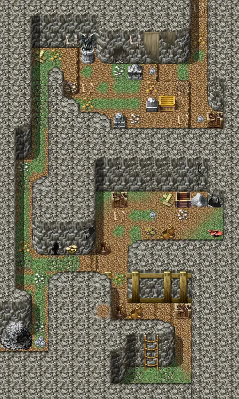

# Mywildcave2

15×25 tiles · part of [Fungi panic](index.md)

<label class="lg lg-spawn"><input type="checkbox" data-t="spawn" checked> Monsters / NPCs</label><label class="lg lg-mapchange"><input type="checkbox" data-t="mapchange" checked> Exit to another map</label><label class="lg lg-container"><input type="checkbox" data-t="container" checked> Container</label><label class="lg lg-sign"><input type="checkbox" data-t="sign" checked> Sign</label><label class="lg lg-rest"><input type="checkbox" data-t="rest" checked> Resting place</label><label class="lg lg-key"><input type="checkbox" data-t="key" checked> Blocked / needs key or quest</label><label class="lg lg-script"><input type="checkbox" data-t="script"> Scripted event</label><label class="lg lg-replace"><input type="checkbox" data-t="replace"> Changes after a quest</label>

## Exits

- [Mywildcave1](mywildcave1.md)
- [Mywildcave3](mywildcave3.md)

## Monsters & NPCs here

| Name | HP |
|---|---|
| [Small stone worm](../monsters/small_stone_worm.md) | 17 |
| [Stone worm](../monsters/stone_worm_2.md) | 26 |
| [Old stone worm](../monsters/old_stone_worm.md) | 36 |
| [Angry stone worm](../monsters/angry_stoneworm.md) | 40 |
| [Ancient stone worm](../monsters/ancient_stone_worm.md) | 42 |

<small>Map ID: `mywildcave2` · Data from v0.8.18</small>
