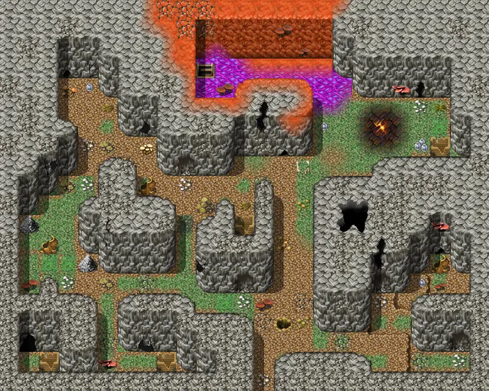
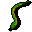
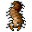
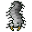
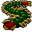

# Mywildcave3

25×20 tiles · part of [Fungi panic](index.md)

<label class="lg"><input type="checkbox" data-t="spawn" checked><b>Red</b>&nbsp;Monsters / NPCs</label><label class="lg"><input type="checkbox" data-t="mapchange" checked><b>Blue</b>&nbsp;Exit to another map</label><label class="lg"><input type="checkbox" data-t="container" checked><b>Yellow</b>&nbsp;Container (click to see contents)</label><label class="lg"><input type="checkbox" data-t="sign" checked><b>Purple</b>&nbsp;Sign</label><label class="lg"><input type="checkbox" data-t="rest" checked><b>Green</b>&nbsp;Resting place</label><label class="lg"><input type="checkbox" data-t="key" checked><b>Orange dashed</b>&nbsp;Blocked until a quest step / item</label><label class="lg"><input type="checkbox" data-t="script"><b>Grey dotted</b>&nbsp;Scripted event</label><label class="lg"><input type="checkbox" data-t="replace"><b>White dotted</b>&nbsp;Changes during a quest</label>

## Exits

- [Mywildcave2](mywildcave2.md)
- [Mywildcave4](mywildcave4.md)

## Monsters & NPCs here

| Name | HP |
|---|---|
| [Small stone worm](../monsters/small_stone_worm.md) | 17 |
| [Stone worm](../monsters/stone_worm_2.md) | 26 |
| [Old stone worm](../monsters/old_stone_worm.md) | 36 |
| [Angry stone worm](../monsters/angry_stoneworm.md) | 40 |
| [Ancient stone worm](../monsters/ancient_stone_worm.md) | 42 |

<small>Map ID: `mywildcave3` · Data from v0.8.18</small>
