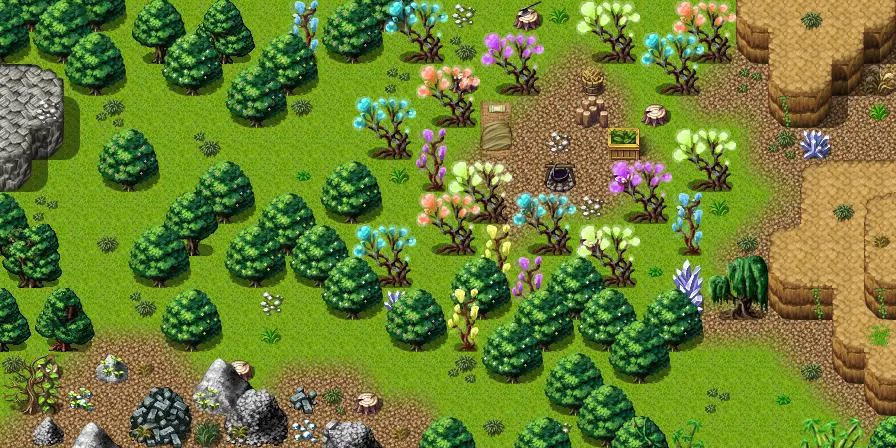

# Nw sullengard 1

28×14 tiles · outdoors · part of [World1](index.md)

<label class="lg lg-spawn"><input type="checkbox" data-t="spawn" checked> Monsters / NPCs</label><label class="lg lg-mapchange"><input type="checkbox" data-t="mapchange" checked> Exit to another map</label><label class="lg lg-container"><input type="checkbox" data-t="container" checked> Container</label><label class="lg lg-sign"><input type="checkbox" data-t="sign" checked> Sign</label><label class="lg lg-rest"><input type="checkbox" data-t="rest" checked> Resting place</label><label class="lg lg-key"><input type="checkbox" data-t="key" checked> Blocked / needs key or quest</label><label class="lg lg-script"><input type="checkbox" data-t="script"> Scripted event</label><label class="lg lg-replace"><input type="checkbox" data-t="replace"> Changes after a quest</label>

## Exits

- [Way to sullengard west 4](way_to_sullengard_west_4.md)

## Monsters & NPCs here

| Name | HP |
|---|---|
| [Favlon](../monsters/dds_favlon.md) | 0 |
| [Red tree ant](../monsters/red_tree_ant.md) | 131 |
| [Crimoculus Cyclopea creeper](../monsters/agg_cyclopea_creeper.md) | 245 |
| [Cyclopea creeper](../monsters/cyclopea_creeper.md) | 245 |

<small>Map ID: `nw_sullengard_1` · Data from v0.8.18</small>
