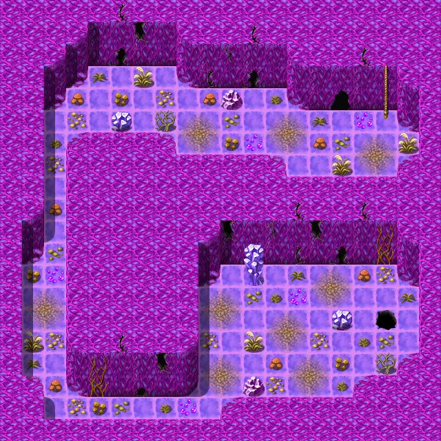
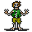
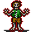

# Oldcave0

20×20 tiles

<label class="lg"><input type="checkbox" data-t="spawn" checked><b>Red</b>&nbsp;Monsters / NPCs</label><label class="lg"><input type="checkbox" data-t="mapchange" checked><b>Blue</b>&nbsp;Exit to another map</label><label class="lg"><input type="checkbox" data-t="container" checked><b>Yellow</b>&nbsp;Container (click to see contents)</label><label class="lg"><input type="checkbox" data-t="sign" checked><b>Purple</b>&nbsp;Sign</label><label class="lg"><input type="checkbox" data-t="rest" checked><b>Green</b>&nbsp;Resting place</label><label class="lg"><input type="checkbox" data-t="key" checked><b>Orange dashed</b>&nbsp;Blocked until a quest step / item</label><label class="lg"><input type="checkbox" data-t="script"><b>Grey dotted</b>&nbsp;Scripted event</label><label class="lg"><input type="checkbox" data-t="replace"><b>White dotted</b>&nbsp;Changes during a quest</label>

## Exits

- [Oldcave1](oldcave1.md)
- [Roadbeforecrossroads9](roadbeforecrossroads9.md)

## Monsters & NPCs here

| Name | HP |
|---|---|
| [Rancid zombie](../monsters/zombie1.md) | 26 |
| [Rotting zombie](../monsters/zombie2.md) | 32 |
| [Corrupted zombie](../monsters/zombie5.md) | 42 |
| [Blighted zombie](../monsters/zombie3.md) | 49 |
| [Bloodthirsty zombie](../monsters/zombie6.md) | 54 |

<small>Map ID: `oldcave0` · Data from v0.8.18</small>
