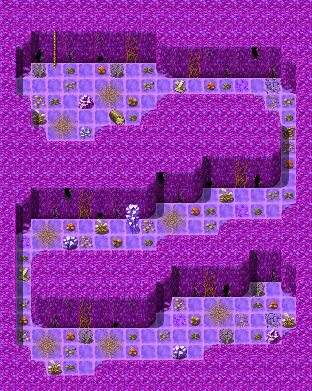

# Oldcave1

20×25 tiles

<label class="lg lg-spawn"><input type="checkbox" data-t="spawn" checked> Monsters / NPCs</label><label class="lg lg-mapchange"><input type="checkbox" data-t="mapchange" checked> Exit to another map</label><label class="lg lg-container"><input type="checkbox" data-t="container" checked> Container</label><label class="lg lg-sign"><input type="checkbox" data-t="sign" checked> Sign</label><label class="lg lg-rest"><input type="checkbox" data-t="rest" checked> Resting place</label><label class="lg lg-key"><input type="checkbox" data-t="key" checked> Blocked / needs key or quest</label><label class="lg lg-script"><input type="checkbox" data-t="script"> Scripted event</label><label class="lg lg-replace"><input type="checkbox" data-t="replace"> Changes after a quest</label>

## Exits

- [Oldcave0](oldcave0.md)

## Monsters & NPCs here

| Name | HP |
|---|---|
| [Rancid zombie](../monsters/zombie1.md) | 26 |
| [Rotting zombie](../monsters/zombie2.md) | 32 |
| [Corrupted zombie](../monsters/zombie5.md) | 42 |
| [Blighted zombie](../monsters/zombie3.md) | 49 |
| [Bloodthirsty zombie](../monsters/zombie6.md) | 54 |
| [Tainted zombie](../monsters/zombie7.md) | 87 |
| [Dread zombie](../monsters/oldcaveboss.md) | 95 |

<small>Map ID: `oldcave1` · Data from v0.8.18</small>
