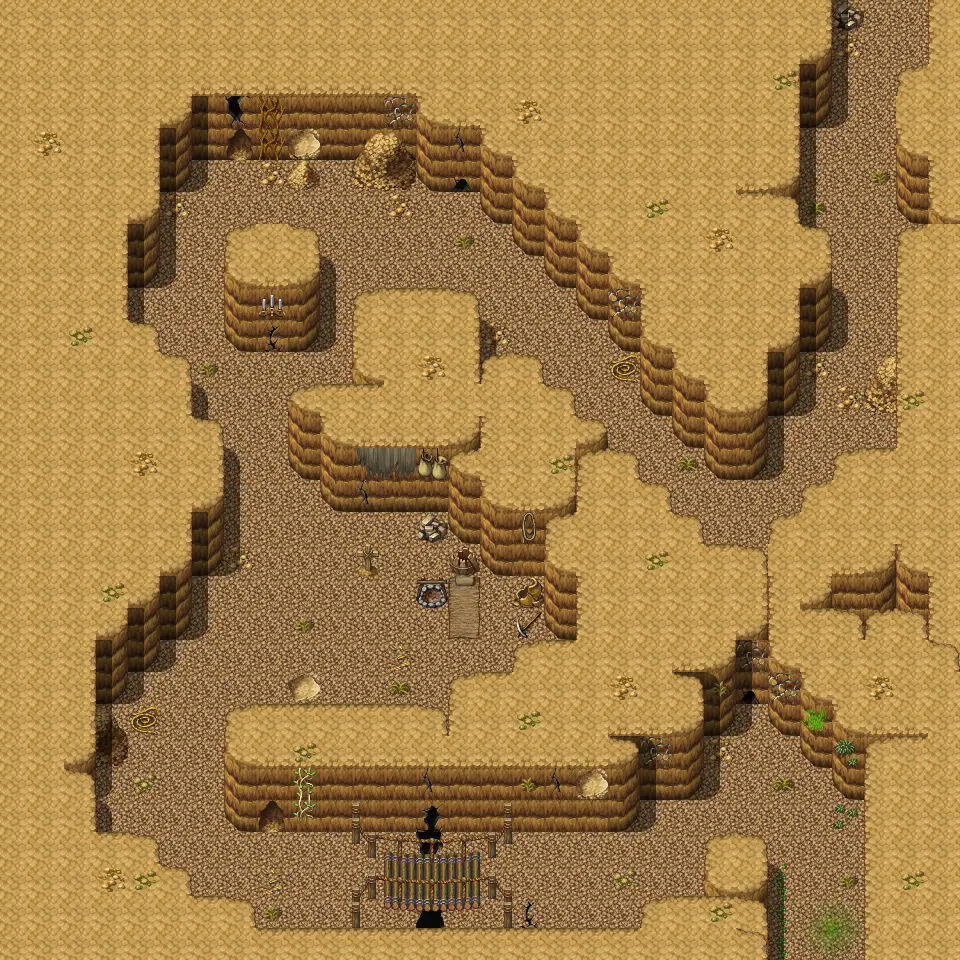

# Pwcave1

30×30 tiles · part of [Pwcave](index.md)

<label class="lg"><input type="checkbox" data-t="spawn" checked><b>Red</b>&nbsp;Monsters / NPCs</label><label class="lg"><input type="checkbox" data-t="mapchange" checked><b>Blue</b>&nbsp;Exit to another map</label><label class="lg"><input type="checkbox" data-t="container" checked><b>Yellow</b>&nbsp;Container (click to see contents)</label><label class="lg"><input type="checkbox" data-t="sign" checked><b>Purple</b>&nbsp;Sign</label><label class="lg"><input type="checkbox" data-t="rest" checked><b>Green</b>&nbsp;Resting place</label><label class="lg"><input type="checkbox" data-t="key" checked><b>Orange dashed</b>&nbsp;Blocked until a quest step / item</label><label class="lg"><input type="checkbox" data-t="script"><b>Grey dotted</b>&nbsp;Scripted event</label><label class="lg"><input type="checkbox" data-t="replace"><b>White dotted</b>&nbsp;Changes during a quest</label>

## Exits

- [Pwcave0](pwcave0.md)
- [Pwcave2](pwcave2.md)

## Monsters & NPCs here

| Name | HP |
|---|---|
| [Iqhan worker thrall](../monsters/iqhan_1a.md) | 55 |
| [Iqhan thrall servant](../monsters/iqhan_1b.md) | 57 |
| [Iqhan guard thrall](../monsters/iqhan_2a.md) | 59 |
| [Iqhan thrall](../monsters/iqhan_2b.md) | 62 |
| [Iqhan warrior thrall](../monsters/iqhan_3a.md) | 65 |
| [Iqhan master](../monsters/iqhan_3b.md) | 67 |

<small>Map ID: `pwcave1` · Data from v0.8.18</small>
