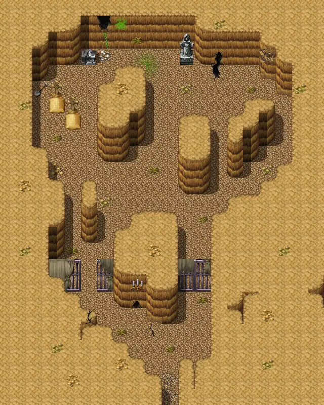
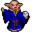
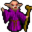

# Pwcave2a

20×25 tiles · part of [Pwcave](index.md)

<label class="lg"><input type="checkbox" data-t="spawn" checked><b>Red</b>&nbsp;Monsters / NPCs</label><label class="lg"><input type="checkbox" data-t="mapchange" checked><b>Blue</b>&nbsp;Exit to another map</label><label class="lg"><input type="checkbox" data-t="container" checked><b>Yellow</b>&nbsp;Container (click to see contents)</label><label class="lg"><input type="checkbox" data-t="sign" checked><b>Purple</b>&nbsp;Sign</label><label class="lg"><input type="checkbox" data-t="rest" checked><b>Green</b>&nbsp;Resting place</label><label class="lg"><input type="checkbox" data-t="key" checked><b>Orange dashed</b>&nbsp;Blocked until a quest step / item</label><label class="lg"><input type="checkbox" data-t="script"><b>Grey dotted</b>&nbsp;Scripted event</label><label class="lg"><input type="checkbox" data-t="replace"><b>White dotted</b>&nbsp;Changes during a quest</label>

## Exits

- [Pwcave2](pwcave2.md)

## Monsters & NPCs here

| Name | HP |
|---|---|
| [Iqhan master](../monsters/iqhan_4a.md) | 69 |
| [Iqhan master](../monsters/iqhan_4b.md) | 71 |
| [Iqhan chaos evoker](../monsters/iqhan_ch_1a.md) | 73 |
| [Iqhan chaos evoker](../monsters/iqhan_ch_1b.md) | 75 |
| [Iqhan chaos master](../monsters/iqhan_ch_3a.md) | 83 |
| [Iqhan chaos master](../monsters/iqhan_ch_3b.md) | 85 |
| [Iqhan chaos beast](../monsters/iqhan_chb_1a.md) | 122 |
| [Iqhan chaos beast](../monsters/iqhan_chb_1b.md) | 140 |

<small>Map ID: `pwcave2a` · Data from v0.8.18</small>
