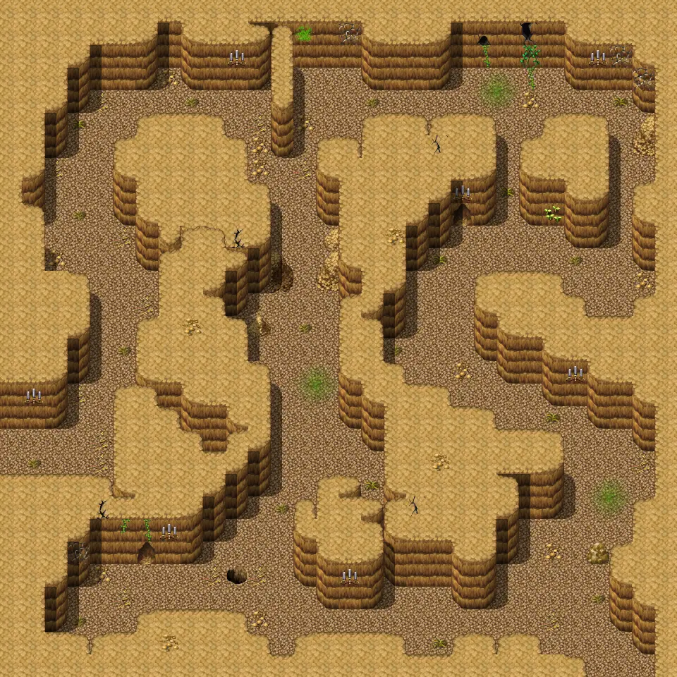

# Pwcave3

30×30 tiles · part of [Pwcave](index.md)

<label class="lg lg-spawn"><input type="checkbox" data-t="spawn" checked> Monsters / NPCs</label><label class="lg lg-mapchange"><input type="checkbox" data-t="mapchange" checked> Exit to another map</label><label class="lg lg-container"><input type="checkbox" data-t="container" checked> Container</label><label class="lg lg-sign"><input type="checkbox" data-t="sign" checked> Sign</label><label class="lg lg-rest"><input type="checkbox" data-t="rest" checked> Resting place</label><label class="lg lg-key"><input type="checkbox" data-t="key" checked> Blocked / needs key or quest</label><label class="lg lg-script"><input type="checkbox" data-t="script"> Scripted event</label><label class="lg lg-replace"><input type="checkbox" data-t="replace"> Changes after a quest</label>

## Exits

- [Pwcave2](pwcave2.md)
- [Pwcave4](pwcave4.md)

## Monsters & NPCs here

| Name | HP |
|---|---|
| [Iqhan warrior thrall](../monsters/iqhan_3a.md) | 65 |
| [Iqhan master](../monsters/iqhan_3b.md) | 67 |
| [Iqhan master](../monsters/iqhan_4a.md) | 69 |
| [Iqhan master](../monsters/iqhan_4b.md) | 71 |
| [Iqhan chaos evoker](../monsters/iqhan_ch_1a.md) | 73 |
| [Iqhan chaos evoker](../monsters/iqhan_ch_1b.md) | 75 |
| [Iqhan chaos servant](../monsters/iqhan_ch_2a.md) | 78 |
| [Iqhan chaos servant](../monsters/iqhan_ch_2b.md) | 79 |
| [Iqhan chaos master](../monsters/iqhan_ch_3a.md) | 83 |
| [Iqhan chaos master](../monsters/iqhan_ch_3b.md) | 85 |

<small>Map ID: `pwcave3` · Data from v0.8.18</small>
