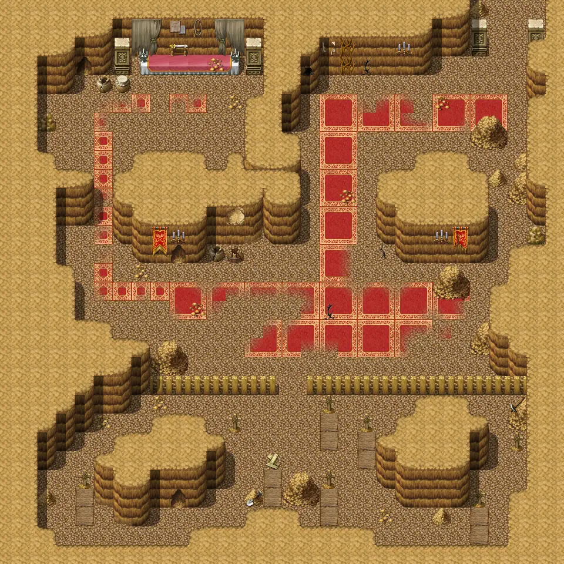
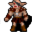

# Pwcave4

| | |
|---|---|
| **Map ID** | `pwcave4` |
| **Type** | Indoors / underground |
| **Size** | 30×30 tiles |
| **World map** | [Pwcave](index.md) |
| **Introduced** | v0.7.0 or earlier |
| **NPCs** | 1 |
| **Enemy types** | 12 |
| **Quests** | 0 |

**Pwcave4** is an indoor map. It has 1 NPC and 12 kinds of enemy. Exits lead to Pwcave3.

## Map

<label class="lg"><input type="checkbox" data-t="spawn" checked><b>Red</b>&nbsp;Monsters / NPCs</label><label class="lg"><input type="checkbox" data-t="mapchange" checked><b>Blue</b>&nbsp;Exit to another map</label><label class="lg"><input type="checkbox" data-t="container" checked><b>Yellow</b>&nbsp;Container (click to see contents)</label><label class="lg"><input type="checkbox" data-t="sign" checked><b>Purple</b>&nbsp;Sign</label><label class="lg"><input type="checkbox" data-t="rest" checked><b>Green</b>&nbsp;Resting place</label><label class="lg"><input type="checkbox" data-t="key" checked><b>Orange dashed</b>&nbsp;Blocked until a quest step / item</label><label class="lg"><input type="checkbox" data-t="script"><b>Grey dotted</b>&nbsp;Scripted event</label><label class="lg"><input type="checkbox" data-t="replace"><b>White dotted</b>&nbsp;Changes during a quest</label><label class="lg"><input type="checkbox" data-t="pin" checked><b>Numbers</b>&nbsp;Numbered key points (see the key below the map)</label>

<a class="pin pin-exit" href="#key-1" style="left:91.667%;top:1.667%" title="Exit (north): to [Pwcave3](pwcave3.md)">1</a><a id="pin-npc-iqhan_boss" class="pin pin-npc" href="#key-2" style="left:15.000%;top:15.000%" title="[Iqhan chaos enslaver](../../monsters/iqhan_boss.md): NPC">2</a><a class="pin pin-sign" href="#key-3" style="left:91.667%;top:81.667%" title="Sign: “The cross contains symbols that you cannot understand. It looks like someone started digging up this grave recently, but stopped halfway.”">3</a><a class="pin pin-sign" href="#key-4" style="left:85.000%;top:91.667%" title="Sign: “The cross contains symbols that you cannot understand, in addition to a crude drawing of what you think should resemble an Izthiel beast.”">4</a><a class="pin pin-sign" href="#key-5" style="left:58.333%;top:88.333%" title="Sign: “The cross contains symbols that you cannot understand, in addition to a crude drawing of what you think should resemble a sword.”">5</a><a class="pin pin-sign" href="#key-6" style="left:65.000%;top:78.333%" title="Sign: “The cross contains symbols that you cannot understand, in addition to a crude drawing of what you think should resemble a frog.”">6</a><a class="pin pin-sign" href="#key-7" style="left:58.333%;top:75.000%" title="Sign: “The cross contains symbols that you cannot understand, but you recognize the word &#x27;Iqhan&#x27;.”">7</a><a class="pin pin-sign" href="#key-8" style="left:41.667%;top:78.333%" title="Sign: “The cross contains symbols that you cannot understand, in addition to a crude drawing of something that you cannot make out what it should resemble.”">8</a><a class="pin pin-sign" href="#key-9" style="left:15.000%;top:88.333%" title="Sign: “The cross contains symbols that you cannot understand, in addition to an elaborate drawing of a skull.”">9</a>

??? abstract "Key to the numbers on the map"

    | # | What | Details |
    |---|---|---|
    | 1 | Exit (north) | to [Pwcave3](pwcave3.md) |
    | 2 | [Iqhan chaos enslaver](../monsters/iqhan_boss.md) | NPC |
    | 3 | Sign | “The cross contains symbols that you cannot understand. It looks like someone started digging up this grave recently, but stopped halfway.” |
    | 4 | Sign | “The cross contains symbols that you cannot understand, in addition to a crude drawing of what you think should resemble an Izthiel beast.” |
    | 5 | Sign | “The cross contains symbols that you cannot understand, in addition to a crude drawing of what you think should resemble a sword.” |
    | 6 | Sign | “The cross contains symbols that you cannot understand, in addition to a crude drawing of what you think should resemble a frog.” |
    | 7 | Sign | “The cross contains symbols that you cannot understand, but you recognize the word 'Iqhan'.” |
    | 8 | Sign | “The cross contains symbols that you cannot understand, in addition to a crude drawing of something that you cannot make out what it should resemble.” |
    | 9 | Sign | “The cross contains symbols that you cannot understand, in addition to an elaborate drawing of a skull.” |

Verified against v0.8.18 map data.

## Connections

| Direction | Leads to | Region there | Map # |
|---|---|---|---|
| North | [Pwcave3](pwcave3.md) | – | 1 |

## NPCs

- [Iqhan chaos enslaver](../monsters/iqhan_boss.md) — can be fought (#2)

## Enemies

| Enemy | HP | Damage | Up to | Notes |
|---|---|---|---|---|
| [Iqhan worker thrall](../monsters/iqhan_1a.md) | 55 | 2–9 | 1 | shares spawn with Iqhan thrall servant |
| [Iqhan thrall servant](../monsters/iqhan_1b.md) | 57 | 2–9 | 1 | shares spawn with Iqhan worker thrall |
| [Iqhan master](../monsters/iqhan_3b.md#v-iqhan_4a) | 69 | 2–13 | 2 | shares spawn with Iqhan master |
| [Iqhan master](../monsters/iqhan_3b.md#v-iqhan_4b) | 71 | 2–15 | 2 | shares spawn with Iqhan master |
| [Iqhan chaos evoker](../monsters/iqhan_ch_1a.md) | 73 | 2–15 | 2 | shares spawn with Iqhan chaos evoker |
| [Iqhan chaos evoker](../monsters/iqhan_ch_1a.md#v-iqhan_ch_1b) | 75 | 2–14 | 2 | shares spawn with Iqhan chaos evoker |
| [Iqhan chaos servant](../monsters/iqhan_ch_2a.md) | 78 | 2–14 | 2 | shares spawn with Iqhan chaos servant |
| [Iqhan chaos servant](../monsters/iqhan_ch_2a.md#v-iqhan_ch_2b) | 79 | 2–13 | 2 | shares spawn with Iqhan chaos servant |
| [Iqhan chaos master](../monsters/iqhan_ch_3a.md) | 83 | 2–13 | 10 | shares spawn with Iqhan chaos master |
| [Iqhan chaos master](../monsters/iqhan_ch_3a.md#v-iqhan_ch_3b) | 85 | 2–13 | 10 | shares spawn with Iqhan chaos master |
| [Iqhan chaos beast](../monsters/iqhan_chb_1a.md) | 122 | 0–15 | 7 | shares spawn with Iqhan chaos beast |
| [Iqhan chaos beast](../monsters/iqhan_chb_1a.md#v-iqhan_chb_1b) | 140 | 0–15 | 7 | shares spawn with Iqhan chaos beast |

<small>“Up to” is the most that can be alive at once from the spawn areas on this map.</small>

## Points of interest

- **Sign** (#3): “The cross contains symbols that you cannot understand. It looks like someone started digging up this grave recently, but stopped halfway.”
- **Sign** (#4): “The cross contains symbols that you cannot understand, in addition to a crude drawing of what you think should resemble an Izthiel beast.”
- **Sign** (#5): “The cross contains symbols that you cannot understand, in addition to a crude drawing of what you think should resemble a sword.”
- **Sign** (#6): “The cross contains symbols that you cannot understand, in addition to a crude drawing of what you think should resemble a frog.”
- **Sign** (#7): “The cross contains symbols that you cannot understand, but you recognize the word 'Iqhan'.”
- **Sign** (#8): “The cross contains symbols that you cannot understand, in addition to a crude drawing of something that you cannot make out what it should resemble.”
- **Sign** (#9): “The cross contains symbols that you cannot understand, in addition to an elaborate drawing of a skull.”

## Version history

| Version | Change |
|---|---|
| [v0.7.0](../versions/0.7.0.md) | Present in v0.7.0 (earliest release tracked) |
| [v0.7.1](../versions/0.7.1.md) | map layout or objects changed |
| [v0.7.2](../versions/0.7.2.md) | map layout or objects changed |
| [v0.8.2](../versions/0.8.2.md) | map layout or objects changed |

Verified against v0.8.18 and every earlier release back to v0.7.0 (game data compared release by release).

## Community notes

<small>Written by players, not generated from game data. **Observations**: what players notice in-game · **Lore**: the in-world story · **Trivia**: real-world facts, references, development history · **Theory / speculation**: unconfirmed ideas; may just be unfinished content</small>

### Observations

*No notes yet. Contributions are welcome: [add a note](https://github.com/asdfghjkl628/Andor-s-Trail-Wikiiii/new/main/notes/maps?filename=pwcave4.md&value=%23%23%20Observations%0A%0A%3C%21--%20what%20players%20notice%20in-game%20--%3E%0A%0A%23%23%20Lore%0A%0A%3C%21--%20the%20in-world%20story%20--%3E%0A%0A%23%23%20Trivia%0A%0A%3C%21--%20real-world%20facts%2C%20references%2C%20development%20history%20--%3E%0A%0A%23%23%20Theory%20/%20speculation%0A%0A%3C%21--%20unconfirmed%20ideas%3B%20may%20just%20be%20unfinished%20content%20--%3E%0A).*

### Lore

*No notes yet. Contributions are welcome: [add a note](https://github.com/asdfghjkl628/Andor-s-Trail-Wikiiii/new/main/notes/maps?filename=pwcave4.md&value=%23%23%20Observations%0A%0A%3C%21--%20what%20players%20notice%20in-game%20--%3E%0A%0A%23%23%20Lore%0A%0A%3C%21--%20the%20in-world%20story%20--%3E%0A%0A%23%23%20Trivia%0A%0A%3C%21--%20real-world%20facts%2C%20references%2C%20development%20history%20--%3E%0A%0A%23%23%20Theory%20/%20speculation%0A%0A%3C%21--%20unconfirmed%20ideas%3B%20may%20just%20be%20unfinished%20content%20--%3E%0A).*

### Trivia

*No notes yet. Contributions are welcome: [add a note](https://github.com/asdfghjkl628/Andor-s-Trail-Wikiiii/new/main/notes/maps?filename=pwcave4.md&value=%23%23%20Observations%0A%0A%3C%21--%20what%20players%20notice%20in-game%20--%3E%0A%0A%23%23%20Lore%0A%0A%3C%21--%20the%20in-world%20story%20--%3E%0A%0A%23%23%20Trivia%0A%0A%3C%21--%20real-world%20facts%2C%20references%2C%20development%20history%20--%3E%0A%0A%23%23%20Theory%20/%20speculation%0A%0A%3C%21--%20unconfirmed%20ideas%3B%20may%20just%20be%20unfinished%20content%20--%3E%0A).*

### Theory / speculation

*No notes yet. Contributions are welcome: [add a note](https://github.com/asdfghjkl628/Andor-s-Trail-Wikiiii/new/main/notes/maps?filename=pwcave4.md&value=%23%23%20Observations%0A%0A%3C%21--%20what%20players%20notice%20in-game%20--%3E%0A%0A%23%23%20Lore%0A%0A%3C%21--%20the%20in-world%20story%20--%3E%0A%0A%23%23%20Trivia%0A%0A%3C%21--%20real-world%20facts%2C%20references%2C%20development%20history%20--%3E%0A%0A%23%23%20Theory%20/%20speculation%0A%0A%3C%21--%20unconfirmed%20ideas%3B%20may%20just%20be%20unfinished%20content%20--%3E%0A).*

??? info "Technical information"

    | | |
    |---|---|
    | Map ID | `pwcave4` |
    | File | `res/xml/pwcave4.tmx` |
    | Size | 30×30 tiles (960×960 px) |
    | outdoors property | – |
    | Layers drawn | ground, objects, above |
    | Tilesets | map_bed_1, map_border_1, map_bridge_1, map_bridge_2, map_broken_1, map_cavewall_1, map_cavewall_2, map_cavewall_3, map_cavewall_4, map_chair_table_1, map_chair_table_2, map_crate_1, map_cupboard_1, map_curtain_1, map_entrance_1, map_entrance_2, map_fence_1, map_fence_2, map_fence_3, map_fence_4, map_ground_1, map_ground_2, map_ground_3, map_ground_4, map_ground_5, map_ground_6, map_ground_7, map_ground_8, map_house_1, map_house_2, map_indoor_1, map_indoor_2, map_kitchen_1, map_outdoor_1, map_pillar_1, map_pillar_2, map_plant_1, map_plant_2, map_rock_1, map_rock_2, map_roof_1, map_roof_2, map_roof_3, map_shop_1, map_sign_ladder_1, map_table_1, map_trail_1, map_transition_1, map_transition_2, map_transition_3, map_transition_4, map_transition_5, map_tree_1, map_tree_2, map_wall_1, map_wall_2, map_wall_3, map_wall_4, map_window_1, map_window_2 |
    | Map objects | spawn: 12, sign: 7, mapchange: 1 |
    | World map position | segment `pwcave`, x 318, y 91 |

<small>Data from v0.8.18</small>
