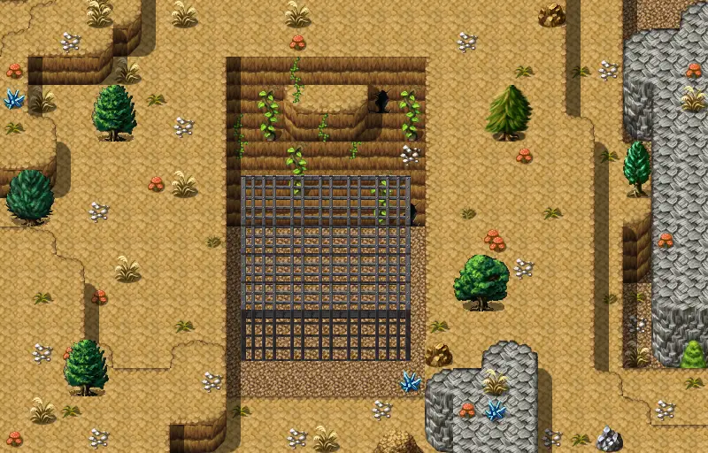

# Rat mountain 3

25×16 tiles · outdoors · part of [World1](index.md)

<label class="lg lg-spawn"><input type="checkbox" data-t="spawn" checked> Monsters / NPCs</label><label class="lg lg-mapchange"><input type="checkbox" data-t="mapchange" checked> Exit to another map</label><label class="lg lg-container"><input type="checkbox" data-t="container" checked> Container</label><label class="lg lg-sign"><input type="checkbox" data-t="sign" checked> Sign</label><label class="lg lg-rest"><input type="checkbox" data-t="rest" checked> Resting place</label><label class="lg lg-key"><input type="checkbox" data-t="key" checked> Blocked / needs key or quest</label><label class="lg lg-script"><input type="checkbox" data-t="script"> Scripted event</label><label class="lg lg-replace"><input type="checkbox" data-t="replace"> Changes after a quest</label>

## Exits

- [Rat mountain 1](rat_mountain_1.md)
- [Rat mountain 2](rat_mountain_2.md)
- [Rat mountain 4](rat_mountain_4.md)
- [Rat mountain 7](rat_mountain_7.md)
- [Witch house basement](witch_house_basement.md)

## Monsters & NPCs here

| Name | HP |
|---|---|
| [Gray cat](../monsters/gray_cat.md) | 0 |
| [Old Blue](../monsters/blue_cat.md) | 0 |
| [Brown cat](../monsters/brown_cat.md) | 0 |
| [Black cat](../monsters/black_cat.md) | 0 |
| [Orange cat](../monsters/orange_cat.md) | 0 |
| [Tiger cat](../monsters/striped_cat.md) | 0 |
| [Tiny rat](../monsters/tiny_rat.md) | 2 |
| [Cave rat](../monsters/cave_rat.md) | 5 |
| [Flamejaw tunnelbeast](../monsters/flamejaw_tunnelbeast.md) | 237 |

<small>Map ID: `rat_mountain_3` · Data from v0.8.18</small>
