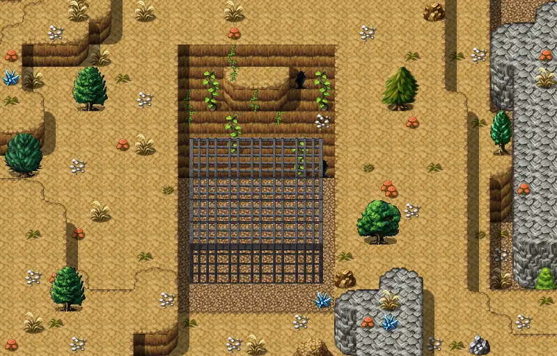
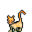
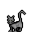
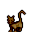

# Rat mountain 3

| | |
|---|---|
| **Map ID** | `rat_mountain_3` |
| **Region** | Near Flagstone Prison (other) |
| **Type** | Outdoors |
| **Size** | 25×16 tiles |
| **World map** | [World1](index.md) |
| **Introduced** | [v0.8.8](../versions/0.8.8.md) |
| **NPCs** | 6 |
| **Enemy types** | 3 |
| **Quests** | 0 |

**Rat mountain 3** is an outdoor map, near Flagstone Prison (other). It has 6 NPCs and 3 kinds of enemy. Exits lead to Rat mountain 2, Rat mountain 4, Rat mountain 7, Rat mountain 1 and 1 more.

## Map

<label class="lg"><input type="checkbox" data-t="spawn" checked><b>Red</b>&nbsp;Monsters / NPCs</label><label class="lg"><input type="checkbox" data-t="mapchange" checked><b>Blue</b>&nbsp;Exit to another map</label><label class="lg"><input type="checkbox" data-t="container" checked><b>Yellow</b>&nbsp;Container (click to see contents)</label><label class="lg"><input type="checkbox" data-t="sign" checked><b>Purple</b>&nbsp;Sign</label><label class="lg"><input type="checkbox" data-t="rest" checked><b>Green</b>&nbsp;Resting place</label><label class="lg"><input type="checkbox" data-t="key" checked><b>Orange dashed</b>&nbsp;Blocked until a quest step / item</label><label class="lg"><input type="checkbox" data-t="script"><b>Grey dotted</b>&nbsp;Scripted event</label><label class="lg"><input type="checkbox" data-t="replace"><b>White dotted</b>&nbsp;Changes during a quest</label><label class="lg"><input type="checkbox" data-t="pin" checked><b>Numbers</b>&nbsp;Numbered key points (see the key below the map)</label>

<a class="pin pin-exit" href="#key-1" style="left:48.000%;top:3.125%" title="Exit (north): to [Rat mountain 2](rat_mountain_2.md)">1</a><a class="pin pin-exit" href="#key-1" style="left:10.000%;top:3.125%" title="Exit (north): to [Rat mountain 2](rat_mountain_2.md)">1</a><a class="pin pin-exit" href="#key-2" style="left:98.000%;top:37.500%" title="Exit (east): to [Rat mountain 4](rat_mountain_4.md)">2</a><a class="pin pin-exit" href="#key-3" style="left:98.000%;top:96.875%" title="Exit (southeast): to [Rat mountain 4](rat_mountain_4.md)">3</a><a class="pin pin-exit" href="#key-4" style="left:70.000%;top:90.625%" title="Exit (south): to [Rat mountain 4](rat_mountain_4.md)">4</a><a class="pin pin-exit" href="#key-5" style="left:68.000%;top:96.875%" title="Exit (south): to [Rat mountain 7](rat_mountain_7.md)">5</a><a class="pin pin-exit" href="#key-5" style="left:80.000%;top:96.875%" title="Exit (south): to [Rat mountain 7](rat_mountain_7.md)">5</a><a class="pin pin-exit" href="#key-6" style="left:2.000%;top:21.875%" title="Exit (west): to [Rat mountain 1](rat_mountain_1.md)">6</a><a class="pin pin-exit" href="#key-7" style="left:58.000%;top:84.375%" title="Exit (cave entrance): to [Witch house basement](witch_house_basement.md)">7</a><a id="pin-npc-black_cat" class="pin pin-npc" href="#key-8" style="left:62.000%;top:71.875%" title="[Black cat](../../monsters/black_cat.md): NPC">8</a><a id="pin-npc-brown_cat" class="pin pin-npc" href="#key-9" style="left:30.000%;top:71.875%" title="[Brown cat](../../monsters/brown_cat.md): NPC">9</a><a id="pin-npc-gray_cat" class="pin pin-npc" href="#key-10" style="left:30.000%;top:53.125%" title="[Gray cat](../../monsters/gray_cat.md): NPC">10</a><a id="pin-npc-blue_cat" class="pin pin-npc" href="#key-11" style="left:34.000%;top:84.375%" title="[Old Blue](../../monsters/blue_cat.md): NPC">11</a><a id="pin-npc-orange_cat" class="pin pin-npc" href="#key-12" style="left:46.000%;top:21.875%" title="[Orange cat](../../monsters/orange_cat.md): NPC">12</a><a id="pin-npc-striped_cat" class="pin pin-npc" href="#key-13" style="left:62.000%;top:40.625%" title="[Tiger cat](../../monsters/striped_cat.md): NPC">13</a>

??? abstract "Key to the numbers on the map"

    | # | What | Details |
    |---|---|---|
    | 1 | Exit (north) | to [Rat mountain 2](rat_mountain_2.md) |
    | 2 | Exit (east) | to [Rat mountain 4](rat_mountain_4.md) |
    | 3 | Exit (southeast) | to [Rat mountain 4](rat_mountain_4.md) |
    | 4 | Exit (south) | to [Rat mountain 4](rat_mountain_4.md) |
    | 5 | Exit (south) | to [Rat mountain 7](rat_mountain_7.md) |
    | 6 | Exit (west) | to [Rat mountain 1](rat_mountain_1.md) |
    | 7 | Exit (cave entrance) | to [Witch house basement](witch_house_basement.md) |
    | 8 | [Black cat](../monsters/black_cat.md) | NPC |
    | 9 | [Brown cat](../monsters/brown_cat.md) | NPC |
    | 10 | [Gray cat](../monsters/gray_cat.md) | NPC |
    | 11 | [Old Blue](../monsters/blue_cat.md) | NPC |
    | 12 | [Orange cat](../monsters/orange_cat.md) | NPC |
    | 13 | [Tiger cat](../monsters/striped_cat.md) | NPC |

Verified against v0.8.18 map data.

## Connections

| Direction | Leads to | Region there | Map # |
|---|---|---|---|
| North | [Rat mountain 2](rat_mountain_2.md) | Flagstone Prison | 1 |
| East | [Rat mountain 4](rat_mountain_4.md) | – | 2 |
| Southeast | [Rat mountain 4](rat_mountain_4.md) | – | 3 |
| South | [Rat mountain 4](rat_mountain_4.md) | – | 4 |
| South | [Rat mountain 7](rat_mountain_7.md) | Flagstone Prison | 5 |
| West | [Rat mountain 1](rat_mountain_1.md) | Flagstone Prison | 6 |
| Cave entrance | [Witch house basement](witch_house_basement.md) | – | 7 |

## NPCs

- [Black cat](../monsters/black_cat.md) (#8)
- [Brown cat](../monsters/brown_cat.md) (#9)
- [Gray cat](../monsters/gray_cat.md) (#10)
- [Old Blue](../monsters/blue_cat.md) (#11)
- [Orange cat](../monsters/orange_cat.md) (#12)
- [Tiger cat](../monsters/striped_cat.md) (#13)

## Enemies

| Enemy | HP | Damage | Up to | Notes |
|---|---|---|---|---|
| [Tiny rat](../monsters/tiny_rat.md) | 2 | 1–1 | 3 | – |
| [Cave rat](../monsters/cave_rat.md) | 5 | 2–2 | 2 | – |
| [Flamejaw tunnelbeast](../monsters/flamejaw_tunnelbeast.md) | 237 | 7–10 | 2 | – |

<small>“Up to” is the most that can be alive at once from the spawn areas on this map.</small>

## Version history

| Version | Change |
|---|---|
| [v0.8.8](../versions/0.8.8.md) | Added |
| [v0.8.9](../versions/0.8.9.md) | Map layout or objects changed |

Verified against v0.8.18 and every earlier release back to v0.7.0 (game data compared release by release).

## Community notes

<small>Written by players, not generated from game data. **Observations**: what players notice in-game · **Lore**: the in-world story · **Trivia**: real-world facts, references, development history · **Theory / speculation**: unconfirmed ideas; may just be unfinished content</small>

### Observations

*No notes yet. Contributions are welcome: [add a note](https://github.com/asdfghjkl628/Andor-s-Trail-Wikiiii/new/main/notes/maps?filename=rat_mountain_3.md&value=%23%23%20Observations%0A%0A%3C%21--%20what%20players%20notice%20in-game%20--%3E%0A%0A%23%23%20Lore%0A%0A%3C%21--%20the%20in-world%20story%20--%3E%0A%0A%23%23%20Trivia%0A%0A%3C%21--%20real-world%20facts%2C%20references%2C%20development%20history%20--%3E%0A%0A%23%23%20Theory%20/%20speculation%0A%0A%3C%21--%20unconfirmed%20ideas%3B%20may%20just%20be%20unfinished%20content%20--%3E%0A).*

### Lore

*No notes yet. Contributions are welcome: [add a note](https://github.com/asdfghjkl628/Andor-s-Trail-Wikiiii/new/main/notes/maps?filename=rat_mountain_3.md&value=%23%23%20Observations%0A%0A%3C%21--%20what%20players%20notice%20in-game%20--%3E%0A%0A%23%23%20Lore%0A%0A%3C%21--%20the%20in-world%20story%20--%3E%0A%0A%23%23%20Trivia%0A%0A%3C%21--%20real-world%20facts%2C%20references%2C%20development%20history%20--%3E%0A%0A%23%23%20Theory%20/%20speculation%0A%0A%3C%21--%20unconfirmed%20ideas%3B%20may%20just%20be%20unfinished%20content%20--%3E%0A).*

### Trivia

*No notes yet. Contributions are welcome: [add a note](https://github.com/asdfghjkl628/Andor-s-Trail-Wikiiii/new/main/notes/maps?filename=rat_mountain_3.md&value=%23%23%20Observations%0A%0A%3C%21--%20what%20players%20notice%20in-game%20--%3E%0A%0A%23%23%20Lore%0A%0A%3C%21--%20the%20in-world%20story%20--%3E%0A%0A%23%23%20Trivia%0A%0A%3C%21--%20real-world%20facts%2C%20references%2C%20development%20history%20--%3E%0A%0A%23%23%20Theory%20/%20speculation%0A%0A%3C%21--%20unconfirmed%20ideas%3B%20may%20just%20be%20unfinished%20content%20--%3E%0A).*

### Theory / speculation

*No notes yet. Contributions are welcome: [add a note](https://github.com/asdfghjkl628/Andor-s-Trail-Wikiiii/new/main/notes/maps?filename=rat_mountain_3.md&value=%23%23%20Observations%0A%0A%3C%21--%20what%20players%20notice%20in-game%20--%3E%0A%0A%23%23%20Lore%0A%0A%3C%21--%20the%20in-world%20story%20--%3E%0A%0A%23%23%20Trivia%0A%0A%3C%21--%20real-world%20facts%2C%20references%2C%20development%20history%20--%3E%0A%0A%23%23%20Theory%20/%20speculation%0A%0A%3C%21--%20unconfirmed%20ideas%3B%20may%20just%20be%20unfinished%20content%20--%3E%0A).*

??? info "Technical information"

    | | |
    |---|---|
    | Map ID | `rat_mountain_3` |
    | File | `res/xml/rat_mountain_3.tmx` |
    | Size | 25×16 tiles (800×512 px) |
    | outdoors property | 1 |
    | Layers drawn | base, ground, objects, above, top |
    | Tilesets | map_bed_1, map_border_1, map_bridge_1, map_bridge_2, map_broken_1, map_cavewall_1, map_cavewall_2, map_cavewall_3, map_cavewall_4, map_chair_table_1, map_chair_table_2, map_crate_1, map_cupboard_1, map_curtain_1, map_entrance_1, map_entrance_2, map_fence_1, map_fence_2, map_fence_3, map_fence_4, map_ground_1, map_ground_2, map_ground_3, map_ground_4, map_ground_5, map_ground_6, map_ground_7, map_ground_8, map_house_1, map_house_2, map_indoor_1, map_indoor_2, map_kitchen_1, map_outdoor_1, map_pillar_1, map_pillar_2, map_pillar_3, map_plant_1, map_plant_2, map_plant_3, map_rock_1, map_rock_2, map_roof_1, map_roof_2, map_roof_3, map_shop_1, map_sign_ladder_1, map_table_1, map_trail_1, map_transition_1, map_transition_2, map_transition_3, map_transition_4, map_transition_5, map_tree_1, map_tree_2, map_tree_3, map_wall_1, map_wall_2, map_wall_3, map_wall_4, map_window_1, map_window_2 |
    | Map objects | spawn: 10, mapchange: 9 |
    | World map position | segment `world1`, x 126, y 545 |

<small>Data from v0.8.18</small>
