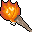

# Ratdom maze1

| | |
|---|---|
| **Map ID** | `ratdom_maze1` |
| **Region** | In Crossglen (settlement) |
| **Type** | Indoors / underground |
| **Size** | 30×20 tiles |
| **World map** | [Ratdom cave](index.md) |
| **Introduced** | [v0.8.5](../versions/0.8.5.md) |
| **NPCs** | 1 |
| **Enemy types** | 2 |
| **Quests** | 3 |
| **Containers** | 1 |

**Ratdom maze1** is an indoor map, in Crossglen (settlement). It has 1 NPC and 2 kinds of enemy. Exits lead to Crossglen cave, Ratdom maze2.

## Map

<label class="lg"><input type="checkbox" data-t="spawn" checked><b>Red</b>&nbsp;Monsters / NPCs</label><label class="lg"><input type="checkbox" data-t="mapchange" checked><b>Blue</b>&nbsp;Exit to another map</label><label class="lg"><input type="checkbox" data-t="container" checked><b>Yellow</b>&nbsp;Container (click to see contents)</label><label class="lg"><input type="checkbox" data-t="sign" checked><b>Purple</b>&nbsp;Sign</label><label class="lg"><input type="checkbox" data-t="rest" checked><b>Green</b>&nbsp;Resting place</label><label class="lg"><input type="checkbox" data-t="key" checked><b>Orange dashed</b>&nbsp;Blocked until a quest step / item</label><label class="lg"><input type="checkbox" data-t="script"><b>Grey dotted</b>&nbsp;Scripted event</label><label class="lg"><input type="checkbox" data-t="replace"><b>White dotted</b>&nbsp;Changes during a quest</label><label class="lg"><input type="checkbox" data-t="pin" checked><b>Numbers</b>&nbsp;Numbered key points (see the key below the map)</label>

<a class="pin pin-exit" href="#key-1" style="left:98.333%;top:22.500%" title="Exit (east): to [Crossglen cave](crossglen_cave.md)">1</a><a class="pin pin-exit" href="#key-2" style="left:1.667%;top:72.500%" title="Exit (west): to [Ratdom maze2](ratdom_maze2.md)">2</a><a id="pin-npc-ratdom_rat" class="pin pin-npc" href="#key-3" style="left:25.000%;top:2.500%" title="[Clevred](../../monsters/ratdom_rat.md): 1 quest">3</a><a class="pin pin-container" href="#key-4" style="left:95.000%;top:17.500%" title="Container 1: Ratcave Torch">4</a><a class="pin pin-script" href="#key-5" style="left:80.000%;top:55.000%" title="Quest trigger: Scripted event: advances the quest: hidden story flag “ratdom_maze” to stage 1 (“Light-1”)">5</a><a class="pin pin-script" href="#key-5" style="left:90.000%;top:30.000%" title="Quest trigger: Scripted event: advances the quest: hidden story flag “ratdom_maze” to stage 1 (“Light-1”)">5</a><a class="pin pin-script" href="#key-6" style="left:48.333%;top:62.500%" title="Quest trigger: Scripted event: advances the quest: hidden story flag “ratdom_maze” to stage 2 (“Light-2”)">6</a><a class="pin pin-script" href="#key-7" style="left:26.667%;top:52.500%" title="Quest trigger: Scripted event: advances the quest: hidden story flag “ratdom_maze” to stage 3 (“Light-3”)">7</a><a class="pin pin-script" href="#key-8" style="left:23.333%;top:22.500%" title="Quest trigger: Scripted event: advances the quest: hidden story flag “ratdom_maze” to stage 4 (“Light-4”)">8</a><a class="pin pin-script" href="#key-9" style="left:6.667%;top:52.500%" title="Quest trigger: Scripted event: advances the quest: hidden story flag “ratdom_maze” to stage 5 (“Light-5”)">9</a><a class="pin pin-script" href="#key-10" style="left:55.000%;top:15.000%" title="Quest trigger: Scripted event: advances the quest: hidden story flag “ratdom_maze” to stage 6 (“Light-6”)">10</a><a class="pin pin-script" href="#key-11" style="left:90.000%;top:72.500%" title="Quest trigger: Scripted event: advances the quest: hidden story flag “ratdom_maze” to stage 7 (“Light-7”)">11</a><a class="pin pin-script" href="#key-12" style="left:56.667%;top:35.000%" title="Quest trigger: Scripted event: advances the quest: hidden story flag “ratdom_maze” to stage 8 (“Light-8”)">12</a><a class="pin pin-script" href="#key-13" style="left:63.333%;top:55.000%" title="Quest trigger: Scripted event: advances the quest: Yellow is it to stage 942 (“Although I had told Clevred that I couldn&#x27;t help him further with the search and he then left me, I met him in the caves again. I have decided to start the search again.”) (+1 more quest(s))">13</a><a class="pin pin-key" href="#key-14" style="left:21.667%;top:32.500%" title="Blocked passage: Requires wearing: Ratcave Torch">14</a><a class="pin pin-key" href="#key-15" style="left:40.000%;top:2.500%" title="Blocked passage: Closed off once you reach this point in the quest: Search for Andor (stage 1: “My father Mikhail says that Andor has not been home since yesterday. I should go look for him in the village.”)">15</a><a class="pin pin-replace" href="#key-16" style="left:50.000%;top:50.000%" title="Changes during a quest: This area changes during the quest: hidden story flag “ratdom_maze” (stage 10: “Light off”)">16</a><a class="pin pin-replace" href="#key-17" style="left:50.219%;top:46.250%" title="Changes during a quest: This area changes during the quest: hidden story flag “ratdom_maze” (stage 1: “Light-1”)">17</a><a class="pin pin-replace" href="#key-18" style="left:51.682%;top:53.291%" title="Changes during a quest: This area changes during the quest: hidden story flag “ratdom_maze” (stage 2: “Light-2”)">18</a><a class="pin pin-replace" href="#key-19" style="left:47.066%;top:49.222%" title="Changes during a quest: This area changes during the quest: hidden story flag “ratdom_maze” (stage 3: “Light-3”)">19</a><a class="pin pin-replace" href="#key-20" style="left:52.673%;top:47.449%" title="Changes during a quest: This area changes during the quest: hidden story flag “ratdom_maze” (stage 4: “Light-4”)">20</a><a class="pin pin-replace" href="#key-21" style="left:49.133%;top:54.838%" title="Changes during a quest: This area changes during the quest: hidden story flag “ratdom_maze” (stage 5: “Light-5”)">21</a><a class="pin pin-replace" href="#key-22" style="left:46.821%;top:44.286%" title="Changes during a quest: This area changes during the quest: hidden story flag “ratdom_maze” (stage 6: “Light-6”)">22</a><a class="pin pin-replace" href="#key-23" style="left:55.006%;top:51.010%" title="Changes during a quest: This area changes during the quest: hidden story flag “ratdom_maze” (stage 7: “Light-7”)">23</a><a class="pin pin-replace" href="#key-24" style="left:45.783%;top:54.401%" title="Changes during a quest: This area changes during the quest: hidden story flag “ratdom_maze” (stage 8: “Light-8”)">24</a><a class="pin pin-replace" href="#key-25" style="left:8.333%;top:17.500%" title="Changes during a quest: This area changes during the quest: hidden story flag “ratdom_maze” (stage 31: “compass BWM”)">25</a><a class="pin pin-replace" href="#key-26" style="left:5.000%;top:42.500%" title="Changes during a quest: This area changes during the quest: hidden story flag “ratdom_maze” (stage 32: “compass Tour”)">26</a>

??? abstract "Key to the numbers on the map"

    | # | What | Details |
    |---|---|---|
    | 1 | Exit (east) | to [Crossglen cave](crossglen_cave.md) |
    | 2 | Exit (west) | to [Ratdom maze2](ratdom_maze2.md) |
    | 3 | [Clevred](../monsters/ratdom_rat.md) | 1 quest |
    | 4 | Container 1 | Ratcave Torch |
    | 5 | Quest trigger | Scripted event: advances the quest: hidden story flag “ratdom_maze” to stage 1 (“Light-1”) |
    | 6 | Quest trigger | Scripted event: advances the quest: hidden story flag “ratdom_maze” to stage 2 (“Light-2”) |
    | 7 | Quest trigger | Scripted event: advances the quest: hidden story flag “ratdom_maze” to stage 3 (“Light-3”) |
    | 8 | Quest trigger | Scripted event: advances the quest: hidden story flag “ratdom_maze” to stage 4 (“Light-4”) |
    | 9 | Quest trigger | Scripted event: advances the quest: hidden story flag “ratdom_maze” to stage 5 (“Light-5”) |
    | 10 | Quest trigger | Scripted event: advances the quest: hidden story flag “ratdom_maze” to stage 6 (“Light-6”) |
    | 11 | Quest trigger | Scripted event: advances the quest: hidden story flag “ratdom_maze” to stage 7 (“Light-7”) |
    | 12 | Quest trigger | Scripted event: advances the quest: hidden story flag “ratdom_maze” to stage 8 (“Light-8”) |
    | 13 | Quest trigger | Scripted event: advances the quest: Yellow is it to stage 942 (“Although I had told Clevred that I couldn't help him further with the search and he then left me, I met him in the caves again. I have decided to start the search again.”) (+1 more quest(s)) |
    | 14 | Blocked passage | Requires wearing: Ratcave Torch |
    | 15 | Blocked passage | Closed off once you reach this point in the quest: Search for Andor (stage 1: “My father Mikhail says that Andor has not been home since yesterday. I should go look for him in the village.”) |
    | 16 | Changes during a quest | This area changes during the quest: hidden story flag “ratdom_maze” (stage 10: “Light off”) |
    | 17 | Changes during a quest | This area changes during the quest: hidden story flag “ratdom_maze” (stage 1: “Light-1”) |
    | 18 | Changes during a quest | This area changes during the quest: hidden story flag “ratdom_maze” (stage 2: “Light-2”) |
    | 19 | Changes during a quest | This area changes during the quest: hidden story flag “ratdom_maze” (stage 3: “Light-3”) |
    | 20 | Changes during a quest | This area changes during the quest: hidden story flag “ratdom_maze” (stage 4: “Light-4”) |
    | 21 | Changes during a quest | This area changes during the quest: hidden story flag “ratdom_maze” (stage 5: “Light-5”) |
    | 22 | Changes during a quest | This area changes during the quest: hidden story flag “ratdom_maze” (stage 6: “Light-6”) |
    | 23 | Changes during a quest | This area changes during the quest: hidden story flag “ratdom_maze” (stage 7: “Light-7”) |
    | 24 | Changes during a quest | This area changes during the quest: hidden story flag “ratdom_maze” (stage 8: “Light-8”) |
    | 25 | Changes during a quest | This area changes during the quest: hidden story flag “ratdom_maze” (stage 31: “compass BWM”) |
    | 26 | Changes during a quest | This area changes during the quest: hidden story flag “ratdom_maze” (stage 32: “compass Tour”) |

Verified against v0.8.18 map data.

## Connections

| Direction | Leads to | Region there | Map # |
|---|---|---|---|
| East | [Crossglen cave](crossglen_cave.md) | Crossglen | 1 |
| West | [Ratdom maze2](ratdom_maze2.md) | Entry | 2 |

## NPCs

- [Clevred](../monsters/ratdom_rat.md) — quests: [Yellow is it](../quests/ratdom_quest.md) (#3)

## Enemies

| Enemy | HP | Damage | Up to | Notes |
|---|---|---|---|---|
| [Tough cave rat](../monsters/tough_cave_rat.md) | 5 | 3–3 | 2 | – |
| [Cave rat](../monsters/cave_rat.md) | 5 | 2–2 | 8 | – |

<small>“Up to” is the most that can be alive at once from the spawn areas on this map.</small>

## Items & containers

<b>Container 1</b><ul><li><a href="../../items/ratdom_torch/">Ratcave Torch</a> <small>100%</small></li></ul>

## Quests

- [Rats!](../quests/mikhail_rats.md): a scripted event can trigger here from stage 100
- [Search for Andor](../quests/andor.md): blocked passage closes at stage 1
- [Yellow is it](../quests/ratdom_quest.md): [Clevred](../monsters/ratdom_rat.md) is involved; something on this map advances it; stepping on a trigger here sets stage 942
- [Ratdom_maze (hidden flag)](../quests/ratdom_maze.md): part of the map changes at stage 1; part of the map changes at stage 10; part of the map changes at stage 2; part of the map changes at stage 3; part of the map changes at stage 31; part of the map changes at stage 32; part of the map changes at stage 4; part of the map changes at stage 5; part of the map changes at stage 6; part of the map changes at stage 7; part of the map changes at stage 8; something on this map advances it; stepping on a trigger here sets stage 1; stepping on a trigger here sets stage 10; stepping on a trigger here sets stage 2; stepping on a trigger here sets stage 3; stepping on a trigger here sets stage 4; stepping on a trigger here sets stage 5; stepping on a trigger here sets stage 6; stepping on a trigger here sets stage 7; stepping on a trigger here sets stage 8
- [ratdom_nondisplay (hidden flag)](../quests/ratdom_nondisplay.md): [Clevred](../monsters/ratdom_rat.md) is involved; a scripted event can trigger here from stage 10; something on this map advances it; stepping on a trigger here sets stage 10

## Points of interest

- **Quest trigger** (#5): Scripted event: advances the quest: hidden story flag “ratdom_maze” to stage 1 (“Light-1”)
- **Quest trigger** (#6): Scripted event: advances the quest: hidden story flag “ratdom_maze” to stage 2 (“Light-2”)
- **Quest trigger** (#7): Scripted event: advances the quest: hidden story flag “ratdom_maze” to stage 3 (“Light-3”)
- **Quest trigger** (#8): Scripted event: advances the quest: hidden story flag “ratdom_maze” to stage 4 (“Light-4”)
- **Quest trigger** (#9): Scripted event: advances the quest: hidden story flag “ratdom_maze” to stage 5 (“Light-5”)
- **Quest trigger** (#10): Scripted event: advances the quest: hidden story flag “ratdom_maze” to stage 6 (“Light-6”)
- **Quest trigger** (#11): Scripted event: advances the quest: hidden story flag “ratdom_maze” to stage 7 (“Light-7”)
- **Quest trigger** (#12): Scripted event: advances the quest: hidden story flag “ratdom_maze” to stage 8 (“Light-8”)
- **Quest trigger** (#13): Scripted event: advances the quest: Yellow is it to stage 942 (“Although I had told Clevred that I couldn't help him further with the search and he then left me, I met him in the caves again. I have decided to start the search again.”) (+1 more quest(s))
- **Blocked passage** (#14): Requires wearing: Ratcave Torch
- **Blocked passage** (#15): Closed off once you reach this point in the quest: Search for Andor (stage 1: “My father Mikhail says that Andor has not been home since yesterday. I should go look for him in the village.”)
- **Changes during a quest** (#16): This area changes during the quest: hidden story flag “ratdom_maze” (stage 10: “Light off”)
- **Changes during a quest** (#17): This area changes during the quest: hidden story flag “ratdom_maze” (stage 1: “Light-1”)
- **Changes during a quest** (#18): This area changes during the quest: hidden story flag “ratdom_maze” (stage 2: “Light-2”)
- **Changes during a quest** (#19): This area changes during the quest: hidden story flag “ratdom_maze” (stage 3: “Light-3”)
- **Changes during a quest** (#20): This area changes during the quest: hidden story flag “ratdom_maze” (stage 4: “Light-4”)
- **Changes during a quest** (#21): This area changes during the quest: hidden story flag “ratdom_maze” (stage 5: “Light-5”)
- **Changes during a quest** (#22): This area changes during the quest: hidden story flag “ratdom_maze” (stage 6: “Light-6”)
- **Changes during a quest** (#23): This area changes during the quest: hidden story flag “ratdom_maze” (stage 7: “Light-7”)
- **Changes during a quest** (#24): This area changes during the quest: hidden story flag “ratdom_maze” (stage 8: “Light-8”)
- **Changes during a quest** (#25): This area changes during the quest: hidden story flag “ratdom_maze” (stage 31: “compass BWM”)
- **Changes during a quest** (#26): This area changes during the quest: hidden story flag “ratdom_maze” (stage 32: “compass Tour”)

## Version history

| Version | Change |
|---|---|
| [v0.8.5](../versions/0.8.5.md) | Added |
| [v0.8.12.1](../versions/0.8.12.1.md) | Map layout or objects changed |

Verified against v0.8.18 and every earlier release back to v0.7.0 (game data compared release by release).

## Community notes

<small>Written by players, not generated from game data. **Observations**: what players notice in-game · **Lore**: the in-world story · **Trivia**: real-world facts, references, development history · **Theory / speculation**: unconfirmed ideas; may just be unfinished content</small>

### Observations

*No notes yet. Contributions are welcome: [add a note](https://github.com/asdfghjkl628/Andor-s-Trail-Wikiiii/new/main/notes/maps?filename=ratdom_maze1.md&value=%23%23%20Observations%0A%0A%3C%21--%20what%20players%20notice%20in-game%20--%3E%0A%0A%23%23%20Lore%0A%0A%3C%21--%20the%20in-world%20story%20--%3E%0A%0A%23%23%20Trivia%0A%0A%3C%21--%20real-world%20facts%2C%20references%2C%20development%20history%20--%3E%0A%0A%23%23%20Theory%20/%20speculation%0A%0A%3C%21--%20unconfirmed%20ideas%3B%20may%20just%20be%20unfinished%20content%20--%3E%0A).*

### Lore

*No notes yet. Contributions are welcome: [add a note](https://github.com/asdfghjkl628/Andor-s-Trail-Wikiiii/new/main/notes/maps?filename=ratdom_maze1.md&value=%23%23%20Observations%0A%0A%3C%21--%20what%20players%20notice%20in-game%20--%3E%0A%0A%23%23%20Lore%0A%0A%3C%21--%20the%20in-world%20story%20--%3E%0A%0A%23%23%20Trivia%0A%0A%3C%21--%20real-world%20facts%2C%20references%2C%20development%20history%20--%3E%0A%0A%23%23%20Theory%20/%20speculation%0A%0A%3C%21--%20unconfirmed%20ideas%3B%20may%20just%20be%20unfinished%20content%20--%3E%0A).*

### Trivia

*No notes yet. Contributions are welcome: [add a note](https://github.com/asdfghjkl628/Andor-s-Trail-Wikiiii/new/main/notes/maps?filename=ratdom_maze1.md&value=%23%23%20Observations%0A%0A%3C%21--%20what%20players%20notice%20in-game%20--%3E%0A%0A%23%23%20Lore%0A%0A%3C%21--%20the%20in-world%20story%20--%3E%0A%0A%23%23%20Trivia%0A%0A%3C%21--%20real-world%20facts%2C%20references%2C%20development%20history%20--%3E%0A%0A%23%23%20Theory%20/%20speculation%0A%0A%3C%21--%20unconfirmed%20ideas%3B%20may%20just%20be%20unfinished%20content%20--%3E%0A).*

### Theory / speculation

*No notes yet. Contributions are welcome: [add a note](https://github.com/asdfghjkl628/Andor-s-Trail-Wikiiii/new/main/notes/maps?filename=ratdom_maze1.md&value=%23%23%20Observations%0A%0A%3C%21--%20what%20players%20notice%20in-game%20--%3E%0A%0A%23%23%20Lore%0A%0A%3C%21--%20the%20in-world%20story%20--%3E%0A%0A%23%23%20Trivia%0A%0A%3C%21--%20real-world%20facts%2C%20references%2C%20development%20history%20--%3E%0A%0A%23%23%20Theory%20/%20speculation%0A%0A%3C%21--%20unconfirmed%20ideas%3B%20may%20just%20be%20unfinished%20content%20--%3E%0A).*

??? info "Technical information"

    | | |
    |---|---|
    | Map ID | `ratdom_maze1` |
    | File | `res/xml/ratdom_maze1.tmx` |
    | Size | 30×20 tiles (960×640 px) |
    | outdoors property | – |
    | Layers drawn | ground, objects, above, top |
    | Tilesets | map_bed_1, map_border_1, map_bridge_1, map_bridge_2, map_broken_1, map_cavewall_1, map_chair_table_1, map_chair_table_2, map_crate_1, map_cupboard_1, map_curtain_1, map_entrance_1, map_entrance_2, map_fence_1, map_fence_2, map_fence_3, map_fence_4, map_ground_1, map_ground_2, map_ground_3, map_ground_4, map_ground_5, map_ground_6, map_ground_7, map_ground_8, map_guynmart, map_house_1, map_house_2, map_indoor_1, map_indoor_2, map_kitchen_1, map_outdoor_1, map_pillar_1, map_pillar_2, map_plant_1, map_plant_2, map_ratdom, map_rock_1, map_rock_2, map_roof_1, map_roof_2, map_roof_3, map_shop_1, map_sign_ladder_1, map_table_1, map_trail_1, map_transition_1, map_transition_2, map_transition_3, map_transition_4, map_transition_5, map_tree_1, map_tree_2, map_wall_1, map_wall_2, map_wall_3, map_wall_4, map_window_1, map_window_2 |
    | Map objects | script: 11, replace: 11, spawn: 5, mapchange: 2, key: 2, container: 1 |
    | World map position | segment `ratdom_cave`, x -6, y -12 |

<small>Data from v0.8.18</small>
