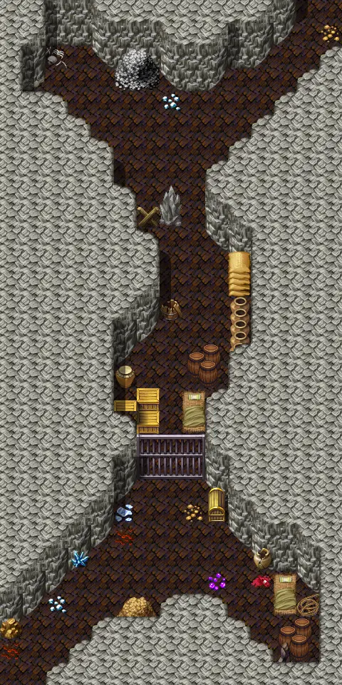

# Ratdom maze 412

15×30 tiles · part of [Ratdom level 4](index.md)

<label class="lg lg-spawn"><input type="checkbox" data-t="spawn" checked> Monsters / NPCs</label><label class="lg lg-mapchange"><input type="checkbox" data-t="mapchange" checked> Exit to another map</label><label class="lg lg-container"><input type="checkbox" data-t="container" checked> Container</label><label class="lg lg-sign"><input type="checkbox" data-t="sign" checked> Sign</label><label class="lg lg-rest"><input type="checkbox" data-t="rest" checked> Resting place</label><label class="lg lg-key"><input type="checkbox" data-t="key" checked> Blocked / needs key or quest</label><label class="lg lg-script"><input type="checkbox" data-t="script"> Scripted event</label><label class="lg lg-replace"><input type="checkbox" data-t="replace"> Changes after a quest</label>

## Exits

- [Ratdom maze 401](ratdom_maze_401.md)
- [Ratdom maze 402](ratdom_maze_402.md)
- [Ratdom maze 421](ratdom_maze_421.md)
- [Ratdom maze 422](ratdom_maze_422.md)

## Monsters & NPCs here

| Name | HP |
|---|---|
| [Clevred](../monsters/ratdom_rat.md) | 0 |
| [Tiny rat](../monsters/ratdom_maze_rat1.md) | 2 |
| [Tough cave rat](../monsters/tough_cave_rat3.md) | 5 |
| [Cave rat](../monsters/ratdom_maze_rat2.md) | 5 |
| [Lazy snail](../monsters/ratdom_m5a.md) | 30 |
| [Poisenous snail](../monsters/ratdom_m5b.md) | 30 |
| [Feygard patrol watch](../monsters/ratdom_ff_guard.md) | 80 |
| [Kriih](../monsters/ratdom_kriih.md) | 160 |

<small>Map ID: `ratdom_maze_412` · Data from v0.8.18</small>
