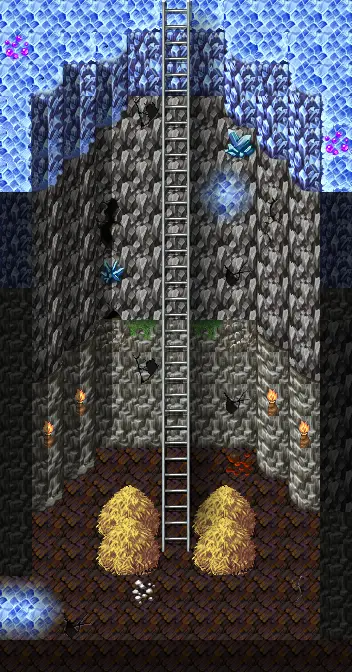

# Ratdom maze 455a

11×21 tiles · part of [Ratdom level 4](index.md)

<label class="lg"><input type="checkbox" data-t="spawn" checked><b>Red</b>&nbsp;Monsters / NPCs</label><label class="lg"><input type="checkbox" data-t="mapchange" checked><b>Blue</b>&nbsp;Exit to another map</label><label class="lg"><input type="checkbox" data-t="container" checked><b>Yellow</b>&nbsp;Container (click to see contents)</label><label class="lg"><input type="checkbox" data-t="sign" checked><b>Purple</b>&nbsp;Sign</label><label class="lg"><input type="checkbox" data-t="rest" checked><b>Green</b>&nbsp;Resting place</label><label class="lg"><input type="checkbox" data-t="key" checked><b>Orange dashed</b>&nbsp;Blocked until a quest step / item</label><label class="lg"><input type="checkbox" data-t="script"><b>Grey dotted</b>&nbsp;Scripted event</label><label class="lg"><input type="checkbox" data-t="replace"><b>White dotted</b>&nbsp;Changes during a quest</label>

## Exits

- [Blackwater mountain55](blackwater_mountain55.md)
- [Ratdom maze 455](ratdom_maze_455.md)
- [Ratdom maze 455a](ratdom_maze_455a.md)

## Monsters & NPCs here

| Name | HP |
|---|---|
| [Clevred](../monsters/ratdom_rat.md) | 0 |
| [Tiny rat](../monsters/ratdom_maze_rat1.md) | 2 |
| [Cave rat](../monsters/ratdom_maze_rat2.md) | 5 |
| [Tough cave rat](../monsters/tough_cave_rat3.md) | 5 |

<small>Map ID: `ratdom_maze_455a` · Data from v0.8.18</small>
