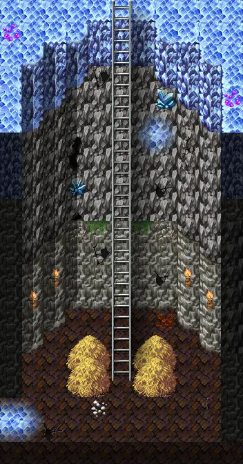

# Ratdom maze 455a

| | |
|---|---|
| **Map ID** | `ratdom_maze_455a` |
| **Region** | In Blackwater Mountain (other) |
| **Type** | Indoors / underground |
| **Size** | 11×21 tiles |
| **World map** | [Ratdom level 4](index.md) |
| **Introduced** | [v0.8.5](../versions/0.8.5.md) |
| **NPCs** | 1 |
| **Enemy types** | 3 |
| **Quests** | 1 |

**Ratdom maze 455a** is an indoor map, in Blackwater Mountain (other). It has 1 NPC and 3 kinds of enemy. Exits lead to Blackwater mountain 55, Ratdom maze 455, Ratdom maze 455a.

## Map

<label class="lg"><input type="checkbox" data-t="spawn" checked><b>Red</b>&nbsp;Monsters / NPCs</label><label class="lg"><input type="checkbox" data-t="mapchange" checked><b>Blue</b>&nbsp;Exit to another map</label><label class="lg"><input type="checkbox" data-t="container" checked><b>Yellow</b>&nbsp;Container (click to see contents)</label><label class="lg"><input type="checkbox" data-t="sign" checked><b>Purple</b>&nbsp;Sign</label><label class="lg"><input type="checkbox" data-t="rest" checked><b>Green</b>&nbsp;Resting place</label><label class="lg"><input type="checkbox" data-t="key" checked><b>Orange dashed</b>&nbsp;Blocked until a quest step / item</label><label class="lg"><input type="checkbox" data-t="script"><b>Grey dotted</b>&nbsp;Scripted event</label><label class="lg"><input type="checkbox" data-t="replace"><b>White dotted</b>&nbsp;Changes during a quest</label><label class="lg"><input type="checkbox" data-t="pin" checked><b>Numbers</b>&nbsp;Numbered key points (see the key below the map)</label>

<a class="pin pin-exit" href="#key-1" style="left:50.000%;top:2.381%" title="Exit (north): to [Blackwater mountain 55](blackwater_mountain55.md)">1</a><a class="pin pin-exit" href="#key-2" style="left:4.545%;top:90.476%" title="Exit (southwest): to [Ratdom maze 455](ratdom_maze_455.md)">2</a><a class="pin pin-exit" href="#key-3" style="left:40.909%;top:38.095%" title="Exit (stairs / passage): to [Ratdom maze 455a](ratdom_maze_455a.md)">3</a><a class="pin pin-exit" href="#key-3" style="left:59.091%;top:38.095%" title="Exit (stairs / passage): to [Ratdom maze 455a](ratdom_maze_455a.md)">3</a><a id="pin-npc-ratdom_rat" class="pin pin-npc" href="#key-4" style="left:31.818%;top:7.143%" title="[Clevred](../../monsters/ratdom_rat.md): 1 quest">4</a><a class="pin pin-script" href="#key-5" style="left:50.000%;top:85.714%" title="Quest trigger: Scripted event: advances the quest: hidden story flag “ratdom_nondisplay” to stage 61 (“61=Use ladder”)">5</a><a class="pin pin-script" href="#key-5" style="left:50.000%;top:9.524%" title="Quest trigger: Scripted event: advances the quest: hidden story flag “ratdom_nondisplay” to stage 61 (“61=Use ladder”)">5</a><a class="pin pin-replace" href="#key-6" style="left:50.000%;top:71.429%" title="Changes during a quest: This area changes during the quest: hidden story flag “ratdom_nondisplay” (stage 61: “61=Use ladder”)">6</a><a class="pin pin-replace" href="#key-7" style="left:50.598%;top:67.858%" title="Changes during a quest: This area changes back during the quest: hidden story flag “ratdom_nondisplay” (stage 61: “61=Use ladder”)">7</a>

??? abstract "Key to the numbers on the map"

    | # | What | Details |
    |---|---|---|
    | 1 | Exit (north) | to [Blackwater mountain 55](blackwater_mountain55.md) |
    | 2 | Exit (southwest) | to [Ratdom maze 455](ratdom_maze_455.md) |
    | 3 | Exit (stairs / passage) | to [Ratdom maze 455a](ratdom_maze_455a.md) |
    | 4 | [Clevred](../monsters/ratdom_rat.md) | 1 quest |
    | 5 | Quest trigger | Scripted event: advances the quest: hidden story flag “ratdom_nondisplay” to stage 61 (“61=Use ladder”) |
    | 6 | Changes during a quest | This area changes during the quest: hidden story flag “ratdom_nondisplay” (stage 61: “61=Use ladder”) |
    | 7 | Changes during a quest | This area changes back during the quest: hidden story flag “ratdom_nondisplay” (stage 61: “61=Use ladder”) |

Verified against v0.8.18 map data.

## Connections

| Direction | Leads to | Region there | Map # |
|---|---|---|---|
| North | [Blackwater mountain 55](blackwater_mountain55.md) | Blackwater Mountain | 1 |
| Southwest | [Ratdom maze 455](ratdom_maze_455.md) | Instrument maker | 2 |
| Stairs / passage | [Ratdom maze 455a](ratdom_maze_455a.md) | Blackwater Mountain | 3 |

## NPCs

- [Clevred](../monsters/ratdom_rat.md) — quests: [Yellow is it](../quests/ratdom_quest.md) (#4)

## Enemies

| Enemy | HP | Damage | Up to | Notes |
|---|---|---|---|---|
| [Tiny rat](../monsters/tiny_rat.md#v-ratdom_maze_rat1) | 2 | 1–1 | 1 | shares spawn with Cave rat, Tough cave rat |
| [Tough cave rat](../monsters/tough_cave_rat.md#v-tough_cave_rat3) | 5 | 3–3 | 1 | shares spawn with Cave rat, Tiny rat |
| [Cave rat](../monsters/cave_rat.md#v-ratdom_maze_rat2) | 5 | 2–2 | 1 | shares spawn with Tiny rat, Tough cave rat |

<small>“Up to” is the most that can be alive at once from the spawn areas on this map.</small>

## Quests

- [Yellow is it](../quests/ratdom_quest.md): [Clevred](../monsters/ratdom_rat.md) is involved
- [Ratdom story flags (hidden flag)](../quests/ratdom_nondisplay.md): [Clevred](../monsters/ratdom_rat.md) is involved; a scripted event can trigger here from stage 61; part of the map changes at stage 61; something on this map advances it; stepping on a trigger here sets stage 61

## Points of interest

- **Quest trigger** (#5): Scripted event: advances the quest: hidden story flag “ratdom_nondisplay” to stage 61 (“61=Use ladder”)
- **Changes during a quest** (#6): This area changes during the quest: hidden story flag “ratdom_nondisplay” (stage 61: “61=Use ladder”)
- **Changes during a quest** (#7): This area changes back during the quest: hidden story flag “ratdom_nondisplay” (stage 61: “61=Use ladder”)

## Version history

| Version | Change |
|---|---|
| [v0.8.5](../versions/0.8.5.md) | Added |

Verified against v0.8.18 and every earlier release back to v0.7.0 (game data compared release by release).

## Community notes

<small>Written by players, not generated from game data. **Observations**: what players notice in-game · **Lore**: the in-world story · **Trivia**: real-world facts, references, development history · **Theory / speculation**: unconfirmed ideas; may just be unfinished content</small>

### Observations

*No notes yet. Contributions are welcome: [add a note](https://github.com/asdfghjkl628/Andor-s-Trail-Wikiiii/new/main/notes/maps?filename=ratdom_maze_455a.md&value=%23%23%20Observations%0A%0A%3C%21--%20what%20players%20notice%20in-game%20--%3E%0A%0A%23%23%20Lore%0A%0A%3C%21--%20the%20in-world%20story%20--%3E%0A%0A%23%23%20Trivia%0A%0A%3C%21--%20real-world%20facts%2C%20references%2C%20development%20history%20--%3E%0A%0A%23%23%20Theory%20/%20speculation%0A%0A%3C%21--%20unconfirmed%20ideas%3B%20may%20just%20be%20unfinished%20content%20--%3E%0A).*

### Lore

*No notes yet. Contributions are welcome: [add a note](https://github.com/asdfghjkl628/Andor-s-Trail-Wikiiii/new/main/notes/maps?filename=ratdom_maze_455a.md&value=%23%23%20Observations%0A%0A%3C%21--%20what%20players%20notice%20in-game%20--%3E%0A%0A%23%23%20Lore%0A%0A%3C%21--%20the%20in-world%20story%20--%3E%0A%0A%23%23%20Trivia%0A%0A%3C%21--%20real-world%20facts%2C%20references%2C%20development%20history%20--%3E%0A%0A%23%23%20Theory%20/%20speculation%0A%0A%3C%21--%20unconfirmed%20ideas%3B%20may%20just%20be%20unfinished%20content%20--%3E%0A).*

### Trivia

*No notes yet. Contributions are welcome: [add a note](https://github.com/asdfghjkl628/Andor-s-Trail-Wikiiii/new/main/notes/maps?filename=ratdom_maze_455a.md&value=%23%23%20Observations%0A%0A%3C%21--%20what%20players%20notice%20in-game%20--%3E%0A%0A%23%23%20Lore%0A%0A%3C%21--%20the%20in-world%20story%20--%3E%0A%0A%23%23%20Trivia%0A%0A%3C%21--%20real-world%20facts%2C%20references%2C%20development%20history%20--%3E%0A%0A%23%23%20Theory%20/%20speculation%0A%0A%3C%21--%20unconfirmed%20ideas%3B%20may%20just%20be%20unfinished%20content%20--%3E%0A).*

### Theory / speculation

*No notes yet. Contributions are welcome: [add a note](https://github.com/asdfghjkl628/Andor-s-Trail-Wikiiii/new/main/notes/maps?filename=ratdom_maze_455a.md&value=%23%23%20Observations%0A%0A%3C%21--%20what%20players%20notice%20in-game%20--%3E%0A%0A%23%23%20Lore%0A%0A%3C%21--%20the%20in-world%20story%20--%3E%0A%0A%23%23%20Trivia%0A%0A%3C%21--%20real-world%20facts%2C%20references%2C%20development%20history%20--%3E%0A%0A%23%23%20Theory%20/%20speculation%0A%0A%3C%21--%20unconfirmed%20ideas%3B%20may%20just%20be%20unfinished%20content%20--%3E%0A).*

??? info "Technical information"

    | | |
    |---|---|
    | Map ID | `ratdom_maze_455a` |
    | File | `res/xml/ratdom_maze_455a.tmx` |
    | Size | 11×21 tiles (352×672 px) |
    | outdoors property | – |
    | Layers drawn | ground, objects, above, top |
    | Tilesets | map_bed_1, map_border_1, map_bridge_1, map_bridge_2, map_broken_1, map_cavewall_1, map_cavewall_2, map_cavewall_3, map_cavewall_4, map_chair_table_1, map_chair_table_2, map_crate_1, map_cupboard_1, map_curtain_1, map_entrance_1, map_entrance_2, map_fence_1, map_fence_2, map_fence_3, map_fence_4, map_ground_1, map_ground_2, map_ground_3, map_ground_4, map_ground_5, map_ground_6, map_ground_7, map_ground_8, map_guynmart, map_house_1, map_house_2, map_indoor_1, map_indoor_2, map_kitchen_1, map_outdoor_1, map_pillar_1, map_pillar_2, map_plant_1, map_plant_2, map_ratdom, map_rock_1, map_rock_2, map_roof_1, map_roof_2, map_roof_3, map_shop_1, map_sign_ladder_1, map_table_1, map_trail_1, map_transition_1, map_transition_2, map_transition_3, map_transition_4, map_transition_5, map_tree_1, map_tree_2, map_wall_1, map_wall_2, map_wall_3, map_wall_4, map_window_1, map_window_2 |
    | Map objects | mapchange: 6, script: 4, spawn: 2, replace: 2 |
    | World map position | segment `ratdom_level_4`, x 135, y 159 |

<small>Data from v0.8.18</small>
