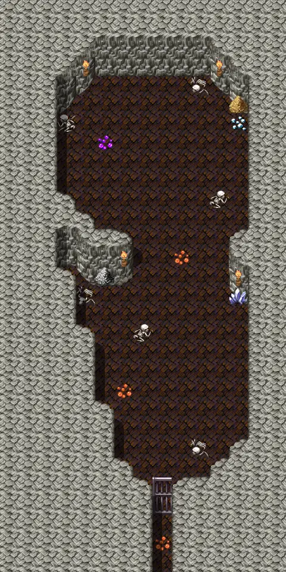

# Ratdom maze 517a

15×30 tiles

<label class="lg"><input type="checkbox" data-t="spawn" checked><b>Red</b>&nbsp;Monsters / NPCs</label><label class="lg"><input type="checkbox" data-t="mapchange" checked><b>Blue</b>&nbsp;Exit to another map</label><label class="lg"><input type="checkbox" data-t="container" checked><b>Yellow</b>&nbsp;Container (click to see contents)</label><label class="lg"><input type="checkbox" data-t="sign" checked><b>Purple</b>&nbsp;Sign</label><label class="lg"><input type="checkbox" data-t="rest" checked><b>Green</b>&nbsp;Resting place</label><label class="lg"><input type="checkbox" data-t="key" checked><b>Orange dashed</b>&nbsp;Blocked until a quest step / item</label><label class="lg"><input type="checkbox" data-t="script"><b>Grey dotted</b>&nbsp;Scripted event</label><label class="lg"><input type="checkbox" data-t="replace"><b>White dotted</b>&nbsp;Changes during a quest</label>

## Containers

<b>Container 1</b><ul><li><a href="../../items/gold/">Gold coins</a> <small>100% · ×1000 to 5000</small></li><li><a href="../../items/gem2/">Ruby gem</a> <small>100% · ×1 to 3</small></li></ul>

<b>Container 2</b><ul><li><a href="../../items/gold/">Gold coins</a> <small>100% · ×1000 to 5000</small></li><li><a href="../../items/gem1/">Glass gem</a> <small>100% · ×1 to 3</small></li></ul>

## Exits

- [Ratdom maze 517](ratdom_maze_517.md)

## Monsters & NPCs here

| Name | HP |
|---|---|
| [Clevred](../monsters/ratdom_rat.md) | 0 |
| [Tiny rat](../monsters/ratdom_maze_rat1.md) | 2 |
| [Tough cave rat](../monsters/tough_cave_rat3.md) | 5 |
| [Cave rat](../monsters/ratdom_maze_rat2.md) | 5 |
| [Young ogre](../monsters/ratdom_troll_1.md) | 230 |
| [Weak ogre](../monsters/ratdom_troll_2.md) | 230 |
| [Angry ogre](../monsters/ratdom_troll_3.md) | 330 |
| [Mad ogre](../monsters/ratdom_troll_4.md) | 330 |
| [Dangerous ogre](../monsters/ratdom_troll_5.md) | 380 |
| [Ancient ogre](../monsters/ratdom_troll_6.md) | 430 |
| [Giant ogre](../monsters/ratdom_troll_9.md) | 590 |

<small>Map ID: `ratdom_maze_517a` · Data from v0.8.18</small>
