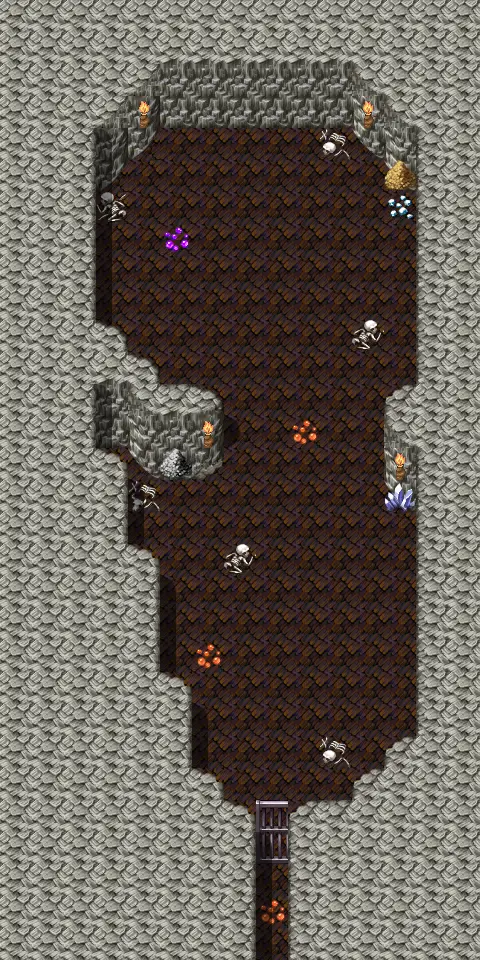

# Ratdom maze 517a

| | |
|---|---|
| **Map ID** | `ratdom_maze_517a` |
| **Type** | Indoors / underground |
| **Size** | 15×30 tiles |
| **Introduced** | [v0.8.5](../versions/0.8.5.md) |
| **NPCs** | 1 |
| **Enemy types** | 10 |
| **Quests** | 1 |
| **Containers** | 2 |

**Ratdom maze 517a** is an indoor map. It has 1 NPC and 10 kinds of enemy. Exits lead to Ratdom maze 517.

## Map

<label class="lg"><input type="checkbox" data-t="spawn" checked><b>Red</b>&nbsp;Monsters / NPCs</label><label class="lg"><input type="checkbox" data-t="mapchange" checked><b>Blue</b>&nbsp;Exit to another map</label><label class="lg"><input type="checkbox" data-t="container" checked><b>Yellow</b>&nbsp;Container (click to see contents)</label><label class="lg"><input type="checkbox" data-t="sign" checked><b>Purple</b>&nbsp;Sign</label><label class="lg"><input type="checkbox" data-t="rest" checked><b>Green</b>&nbsp;Resting place</label><label class="lg"><input type="checkbox" data-t="key" checked><b>Orange dashed</b>&nbsp;Blocked until a quest step / item</label><label class="lg"><input type="checkbox" data-t="script"><b>Grey dotted</b>&nbsp;Scripted event</label><label class="lg"><input type="checkbox" data-t="replace"><b>White dotted</b>&nbsp;Changes during a quest</label><label class="lg"><input type="checkbox" data-t="pin" checked><b>Numbers</b>&nbsp;Numbered key points (see the key below the map)</label>

<a class="pin pin-exit" href="#key-1" style="left:56.667%;top:98.333%" title="Exit (south): to [Ratdom maze 517](ratdom_maze_517.md)">1</a><a id="pin-npc-ratdom_rat" class="pin pin-npc" href="#key-2" style="left:96.667%;top:1.667%" title="[Clevred](../../monsters/ratdom_rat.md): 1 quest">2</a><a class="pin pin-script" href="#key-3" style="left:53.333%;top:56.667%" title="Quest trigger: Scripted event: advances the quest: hidden story flag “ratdom_nondisplay” to stage 169 (“169=Troll_9 spawned”)">3</a><a class="pin pin-container" href="#key-4" style="left:36.667%;top:88.333%" title="Container 1: Gold coins, Ruby gem">4</a><a class="pin pin-container" href="#key-5" style="left:70.000%;top:91.667%" title="Container 2: Gold coins, Glass gem">5</a><a class="pin pin-key" href="#key-6" style="left:56.667%;top:88.333%" title="Blocked passage: Unlocked during the quest: hidden story flag “ratdom_nondisplay” (stage 171: “171=Troll door 2 open”)">6</a><a class="pin pin-replace" href="#key-7" style="left:16.667%;top:25.000%" title="Changes during a quest: This area changes during the quest: hidden story flag “ratdom_nondisplay” (stage 162: “162=Troll_2 spawned”)">7</a><a class="pin pin-replace" href="#key-7" style="left:50.000%;top:95.000%" title="Changes during a quest: This area changes during the quest: hidden story flag “ratdom_nondisplay” (stage 162: “162=Troll_2 spawned”)">7</a><a class="pin pin-replace" href="#key-8" style="left:33.333%;top:75.000%" title="Changes during a quest: This area changes during the quest: hidden story flag “ratdom_nondisplay” (stage 163: “163=Troll_3 spawned”)">8</a><a class="pin pin-replace" href="#key-9" style="left:90.000%;top:28.333%" title="Changes during a quest: This area changes during the quest: hidden story flag “ratdom_nondisplay” (stage 164: “162=Troll_4 spawned”)">9</a><a class="pin pin-replace" href="#key-9" style="left:26.667%;top:60.000%" title="Changes during a quest: This area changes during the quest: hidden story flag “ratdom_nondisplay” (stage 164: “162=Troll_4 spawned”)">9</a><a class="pin pin-replace" href="#key-10" style="left:90.000%;top:63.333%" title="Changes during a quest: This area changes during the quest: hidden story flag “ratdom_nondisplay” (stage 165: “162=Troll_5 spawned”)">10</a><a class="pin pin-replace" href="#key-11" style="left:80.000%;top:83.333%" title="Changes during a quest: This area changes during the quest: hidden story flag “ratdom_nondisplay” (stage 166: “162=Troll_6 spawned”)">11</a><a class="pin pin-replace" href="#key-12" style="left:53.333%;top:6.667%" title="Changes during a quest: This area changes during the quest: hidden story flag “ratdom_nondisplay” (stage 169: “169=Troll_9 spawned”)">12</a><a class="pin pin-replace" href="#key-13" style="left:57.105%;top:84.167%" title="Changes during a quest: This area changes during the quest: hidden story flag “ratdom_nondisplay” (stage 171: “171=Troll door 2 open”)">13</a>

??? abstract "Key to the numbers on the map"

    | # | What | Details |
    |---|---|---|
    | 1 | Exit (south) | to [Ratdom maze 517](ratdom_maze_517.md) |
    | 2 | [Clevred](../monsters/ratdom_rat.md) | 1 quest |
    | 3 | Quest trigger | Scripted event: advances the quest: hidden story flag “ratdom_nondisplay” to stage 169 (“169=Troll_9 spawned”) |
    | 4 | Container 1 | Gold coins, Ruby gem |
    | 5 | Container 2 | Gold coins, Glass gem |
    | 6 | Blocked passage | Unlocked during the quest: hidden story flag “ratdom_nondisplay” (stage 171: “171=Troll door 2 open”) |
    | 7 | Changes during a quest | This area changes during the quest: hidden story flag “ratdom_nondisplay” (stage 162: “162=Troll_2 spawned”) |
    | 8 | Changes during a quest | This area changes during the quest: hidden story flag “ratdom_nondisplay” (stage 163: “163=Troll_3 spawned”) |
    | 9 | Changes during a quest | This area changes during the quest: hidden story flag “ratdom_nondisplay” (stage 164: “162=Troll_4 spawned”) |
    | 10 | Changes during a quest | This area changes during the quest: hidden story flag “ratdom_nondisplay” (stage 165: “162=Troll_5 spawned”) |
    | 11 | Changes during a quest | This area changes during the quest: hidden story flag “ratdom_nondisplay” (stage 166: “162=Troll_6 spawned”) |
    | 12 | Changes during a quest | This area changes during the quest: hidden story flag “ratdom_nondisplay” (stage 169: “169=Troll_9 spawned”) |
    | 13 | Changes during a quest | This area changes during the quest: hidden story flag “ratdom_nondisplay” (stage 171: “171=Troll door 2 open”) |

Verified against v0.8.18 map data.

## Connections

| Direction | Leads to | Region there | Map # |
|---|---|---|---|
| South | [Ratdom maze 517](ratdom_maze_517.md) | Entry | 1 |

## NPCs

- [Clevred](../monsters/ratdom_rat.md) — quests: [Yellow is it](../quests/ratdom_quest.md) (#2)

## Enemies

| Enemy | HP | Damage | Up to | Notes |
|---|---|---|---|---|
| [Tiny rat](../monsters/tiny_rat.md#v-ratdom_maze_rat1) | 2 | 1–1 | 1 | shares spawn with Cave rat, Tough cave rat |
| [Tough cave rat](../monsters/tough_cave_rat.md#v-tough_cave_rat3) | 5 | 3–3 | 1 | shares spawn with Cave rat, Tiny rat |
| [Cave rat](../monsters/cave_rat.md#v-ratdom_maze_rat2) | 5 | 2–2 | 1 | shares spawn with Tiny rat, Tough cave rat |
| [Young ogre](../monsters/ratdom_troll_1.md) | 230 | 1–10 | 3 | – |
| [Weak ogre](../monsters/ratdom_troll_2.md) | 230 | 1–12 | 8 | – |
| [Angry ogre](../monsters/ratdom_troll_3.md) | 330 | 10–15 | 8 | – |
| [Mad ogre](../monsters/ratdom_troll_4.md) | 330 | 10–20 | 10 | – |
| [Dangerous ogre](../monsters/ratdom_troll_5.md) | 380 | 15–30 | 10 | – |
| [Ancient ogre](../monsters/ratdom_troll_6.md) | 430 | 15–30 | 5 | – |
| [Giant ogre](../monsters/ratdom_troll_9.md) | 590 | 20–60 | 1 | – |

<small>“Up to” is the most that can be alive at once from the spawn areas on this map.</small>

## Items & containers

<b>Container 1</b><ul><li><a href="../../items/gold/">Gold coins</a> <small>100% · ×1000 to 5000</small></li><li><a href="../../items/gem2/">Ruby gem</a> <small>100% · ×1 to 3</small></li></ul>

<b>Container 2</b><ul><li><a href="../../items/gold/">Gold coins</a> <small>100% · ×1000 to 5000</small></li><li><a href="../../items/gem1/">Glass gem</a> <small>100% · ×1 to 3</small></li></ul>

## Quests

- [Yellow is it](../quests/ratdom_quest.md): [Clevred](../monsters/ratdom_rat.md) is involved
- [Ratdom story flags (hidden flag)](../quests/ratdom_nondisplay.md): [Clevred](../monsters/ratdom_rat.md) is involved; blocked passage opens at stage 171; part of the map changes at stage 162; part of the map changes at stage 163; part of the map changes at stage 164; part of the map changes at stage 165; part of the map changes at stage 166; part of the map changes at stage 169; part of the map changes at stage 171; something on this map advances it; stepping on a trigger here sets stage 162; stepping on a trigger here sets stage 163; stepping on a trigger here sets stage 164; stepping on a trigger here sets stage 165; stepping on a trigger here sets stage 166; stepping on a trigger here sets stage 169

## Points of interest

- **Quest trigger** (#3): Scripted event: advances the quest: hidden story flag “ratdom_nondisplay” to stage 169 (“169=Troll_9 spawned”)
- **Blocked passage** (#6): Unlocked during the quest: hidden story flag “ratdom_nondisplay” (stage 171: “171=Troll door 2 open”)
- **Changes during a quest** (#7): This area changes during the quest: hidden story flag “ratdom_nondisplay” (stage 162: “162=Troll_2 spawned”)
- **Changes during a quest** (#8): This area changes during the quest: hidden story flag “ratdom_nondisplay” (stage 163: “163=Troll_3 spawned”)
- **Changes during a quest** (#9): This area changes during the quest: hidden story flag “ratdom_nondisplay” (stage 164: “162=Troll_4 spawned”)
- **Changes during a quest** (#10): This area changes during the quest: hidden story flag “ratdom_nondisplay” (stage 165: “162=Troll_5 spawned”)
- **Changes during a quest** (#11): This area changes during the quest: hidden story flag “ratdom_nondisplay” (stage 166: “162=Troll_6 spawned”)
- **Changes during a quest** (#12): This area changes during the quest: hidden story flag “ratdom_nondisplay” (stage 169: “169=Troll_9 spawned”)
- **Changes during a quest** (#13): This area changes during the quest: hidden story flag “ratdom_nondisplay” (stage 171: “171=Troll door 2 open”)

## Version history

| Version | Change |
|---|---|
| [v0.8.5](../versions/0.8.5.md) | Added |

Verified against v0.8.18 and every earlier release back to v0.7.0 (game data compared release by release).

## Community notes

<small>Written by players, not generated from game data. **Observations**: what players notice in-game · **Lore**: the in-world story · **Trivia**: real-world facts, references, development history · **Theory / speculation**: unconfirmed ideas; may just be unfinished content</small>

### Observations

*No notes yet. Contributions are welcome: [add a note](https://github.com/asdfghjkl628/Andor-s-Trail-Wikiiii/new/main/notes/maps?filename=ratdom_maze_517a.md&value=%23%23%20Observations%0A%0A%3C%21--%20what%20players%20notice%20in-game%20--%3E%0A%0A%23%23%20Lore%0A%0A%3C%21--%20the%20in-world%20story%20--%3E%0A%0A%23%23%20Trivia%0A%0A%3C%21--%20real-world%20facts%2C%20references%2C%20development%20history%20--%3E%0A%0A%23%23%20Theory%20/%20speculation%0A%0A%3C%21--%20unconfirmed%20ideas%3B%20may%20just%20be%20unfinished%20content%20--%3E%0A).*

### Lore

*No notes yet. Contributions are welcome: [add a note](https://github.com/asdfghjkl628/Andor-s-Trail-Wikiiii/new/main/notes/maps?filename=ratdom_maze_517a.md&value=%23%23%20Observations%0A%0A%3C%21--%20what%20players%20notice%20in-game%20--%3E%0A%0A%23%23%20Lore%0A%0A%3C%21--%20the%20in-world%20story%20--%3E%0A%0A%23%23%20Trivia%0A%0A%3C%21--%20real-world%20facts%2C%20references%2C%20development%20history%20--%3E%0A%0A%23%23%20Theory%20/%20speculation%0A%0A%3C%21--%20unconfirmed%20ideas%3B%20may%20just%20be%20unfinished%20content%20--%3E%0A).*

### Trivia

*No notes yet. Contributions are welcome: [add a note](https://github.com/asdfghjkl628/Andor-s-Trail-Wikiiii/new/main/notes/maps?filename=ratdom_maze_517a.md&value=%23%23%20Observations%0A%0A%3C%21--%20what%20players%20notice%20in-game%20--%3E%0A%0A%23%23%20Lore%0A%0A%3C%21--%20the%20in-world%20story%20--%3E%0A%0A%23%23%20Trivia%0A%0A%3C%21--%20real-world%20facts%2C%20references%2C%20development%20history%20--%3E%0A%0A%23%23%20Theory%20/%20speculation%0A%0A%3C%21--%20unconfirmed%20ideas%3B%20may%20just%20be%20unfinished%20content%20--%3E%0A).*

### Theory / speculation

*No notes yet. Contributions are welcome: [add a note](https://github.com/asdfghjkl628/Andor-s-Trail-Wikiiii/new/main/notes/maps?filename=ratdom_maze_517a.md&value=%23%23%20Observations%0A%0A%3C%21--%20what%20players%20notice%20in-game%20--%3E%0A%0A%23%23%20Lore%0A%0A%3C%21--%20the%20in-world%20story%20--%3E%0A%0A%23%23%20Trivia%0A%0A%3C%21--%20real-world%20facts%2C%20references%2C%20development%20history%20--%3E%0A%0A%23%23%20Theory%20/%20speculation%0A%0A%3C%21--%20unconfirmed%20ideas%3B%20may%20just%20be%20unfinished%20content%20--%3E%0A).*

??? info "Technical information"

    | | |
    |---|---|
    | Map ID | `ratdom_maze_517a` |
    | File | `res/xml/ratdom_maze_517a.tmx` |
    | Size | 15×30 tiles (480×960 px) |
    | outdoors property | – |
    | Layers drawn | ground, objects, above, top |
    | Tilesets | map_bed_1, map_border_1, map_bridge_1, map_bridge_2, map_broken_1, map_cavewall_1, map_cavewall_2, map_cavewall_3, map_cavewall_4, map_chair_table_1, map_chair_table_2, map_crate_1, map_cupboard_1, map_curtain_1, map_entrance_1, map_entrance_2, map_fence_1, map_fence_2, map_fence_3, map_fence_4, map_ground_1, map_ground_2, map_ground_3, map_ground_4, map_ground_5, map_ground_6, map_ground_7, map_ground_8, map_guynmart, map_house_1, map_house_2, map_indoor_1, map_indoor_2, map_kitchen_1, map_outdoor_1, map_pillar_1, map_pillar_2, map_plant_1, map_plant_2, map_ratdom, map_rock_1, map_rock_2, map_roof_1, map_roof_2, map_roof_3, map_shop_1, map_sign_ladder_1, map_table_1, map_trail_1, map_transition_1, map_transition_2, map_transition_3, map_transition_4, map_transition_5, map_tree_1, map_tree_2, map_wall_1, map_wall_2, map_wall_3, map_wall_4, map_window_1, map_window_2 |
    | Map objects | spawn: 12, replace: 9, container: 2, mapchange: 1, script: 1, key: 1 |
    | World map position | – |

<small>Data from v0.8.18</small>
