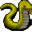
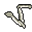

# Ratdom maze 535a

15×30 tiles · part of [Ratdom level 5](index.md)

<label class="lg"><input type="checkbox" data-t="spawn" checked><b>Red</b>&nbsp;Monsters / NPCs</label><label class="lg"><input type="checkbox" data-t="mapchange" checked><b>Blue</b>&nbsp;Exit to another map</label><label class="lg"><input type="checkbox" data-t="container" checked><b>Yellow</b>&nbsp;Container (click to see contents)</label><label class="lg"><input type="checkbox" data-t="sign" checked><b>Purple</b>&nbsp;Sign</label><label class="lg"><input type="checkbox" data-t="rest" checked><b>Green</b>&nbsp;Resting place</label><label class="lg"><input type="checkbox" data-t="key" checked><b>Orange dashed</b>&nbsp;Blocked until a quest step / item</label><label class="lg"><input type="checkbox" data-t="script"><b>Grey dotted</b>&nbsp;Scripted event</label><label class="lg"><input type="checkbox" data-t="replace"><b>White dotted</b>&nbsp;Changes during a quest</label>

## Containers

<b>Container 1</b><ul><li><a href="../../items/ratdom_rat_skelett_leg/">Leg bones of a rat</a> <small>100%</small></li><li><a href="../../items/gold/">Gold coins</a> <small>100% · ×30 to 200</small></li></ul>

## Exits

- [Ratdom maze 535](ratdom_maze_535.md)

## Monsters & NPCs here

| Name | HP |
|---|---|
| [Clevred](../monsters/ratdom_rat.md) | 0 |
| [Tiny rat](../monsters/ratdom_maze_rat1.md) | 2 |
| [Tough cave rat](../monsters/tough_cave_rat3.md) | 5 |
| [Cave rat](../monsters/ratdom_maze_rat2.md) | 5 |
| [Pernicious cave snake](../monsters/ratdom_m4a.md) | 30 |
| [Virulent cave snake](../monsters/ratdom_m4b.md) | 30 |
| [Gold hunter](../monsters/ratdom_goldhunter.md) | 70 |

<small>Map ID: `ratdom_maze_535a` · Data from v0.8.18</small>
