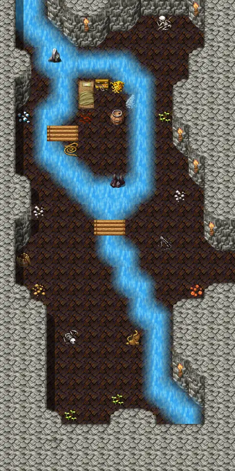

# Ratdom maze 535a

| | |
|---|---|
| **Map ID** | `ratdom_maze_535a` |
| **Region** | In Gold hunter (other) |
| **Type** | Indoors / underground |
| **Size** | 15×30 tiles |
| **World map** | [Ratdom level 5](index.md) |
| **Introduced** | [v0.8.5](../versions/0.8.5.md) |
| **NPCs** | 1 |
| **Enemy types** | 6 |
| **Quests** | 1 |
| **Containers** | 1 |

**Ratdom maze 535a** is an indoor map, in Gold hunter (other). It has 1 NPC and 6 kinds of enemy. Exits lead to Ratdom maze 535.

## Map

<label class="lg"><input type="checkbox" data-t="spawn" checked><b>Red</b>&nbsp;Monsters / NPCs</label><label class="lg"><input type="checkbox" data-t="mapchange" checked><b>Blue</b>&nbsp;Exit to another map</label><label class="lg"><input type="checkbox" data-t="container" checked><b>Yellow</b>&nbsp;Container (click to see contents)</label><label class="lg"><input type="checkbox" data-t="sign" checked><b>Purple</b>&nbsp;Sign</label><label class="lg"><input type="checkbox" data-t="rest" checked><b>Green</b>&nbsp;Resting place</label><label class="lg"><input type="checkbox" data-t="key" checked><b>Orange dashed</b>&nbsp;Blocked until a quest step / item</label><label class="lg"><input type="checkbox" data-t="script"><b>Grey dotted</b>&nbsp;Scripted event</label><label class="lg"><input type="checkbox" data-t="replace"><b>White dotted</b>&nbsp;Changes during a quest</label><label class="lg"><input type="checkbox" data-t="pin" checked><b>Numbers</b>&nbsp;Numbered key points (see the key below the map)</label>

<a class="pin pin-exit" href="#key-1" style="left:96.667%;top:56.667%" title="Exit (east): to [Ratdom maze 535](ratdom_maze_535.md)">1</a><a id="pin-npc-ratdom_rat" class="pin pin-npc" href="#key-2" style="left:50.000%;top:1.667%" title="[Clevred](../../monsters/ratdom_rat.md): 1 quest">2</a><a class="pin pin-script" href="#key-3" style="left:36.667%;top:25.000%" title="Quest trigger: Scripted event: advances the quest: hidden story flag “ratdom_nondisplay” to stage 75 (“75=Troll bridge active”)">3</a><a class="pin pin-script" href="#key-4" style="left:36.667%;top:21.667%" title="Quest trigger: Scripted event: advances the quest: hidden story flag “ratdom_nondisplay” to stage 74 (“74=Troll bridge thrown”)">4</a><a class="pin pin-script" href="#key-5" style="left:30.000%;top:28.333%" title="Quest trigger: Scripted event: advances the quest: hidden story flag “ratdom_nondisplay” to stage 71 (“71=GoldHunter bridge active”)">5</a><a class="pin pin-script" href="#key-6" style="left:66.667%;top:33.333%" title="Quest trigger: Scripted event: advances the quest: hidden story flag “ratdom_nondisplay” to stage 72 (“72=GoldHunter talked to”)">6</a><a class="pin pin-script" href="#key-6" style="left:16.667%;top:35.000%" title="Quest trigger: Scripted event: advances the quest: hidden story flag “ratdom_nondisplay” to stage 72 (“72=GoldHunter talked to”)">6</a><a class="pin pin-script" href="#key-7" style="left:43.333%;top:18.333%" title="Quest trigger: Scripted event: advances the quest: Yellow is it to stage 31 (“I took a leg bone of a rat from a gold hunter.”)">7</a><a class="pin pin-container" href="#key-8" style="left:43.772%;top:15.834%" title="Container 1: Leg bones of a rat, Gold coins">8</a><a class="pin pin-script" href="#key-9" style="left:23.333%;top:28.333%" title="Quest trigger: Scripted event: advances the quest: hidden story flag “ratdom_nondisplay” to stage 76 (“76=Hint Gold hunter”)">9</a><a class="pin pin-replace" href="#key-10" style="left:30.439%;top:24.167%" title="Changes during a quest: This area changes during the quest: hidden story flag “ratdom_nondisplay” (stage 75: “75=Troll bridge active”)">10</a><a class="pin pin-replace" href="#key-11" style="left:40.030%;top:27.194%" title="Changes during a quest: This area changes during the quest: hidden story flag “ratdom_nondisplay” (stage 74: “74=Troll bridge thrown”)">11</a><a class="pin pin-replace" href="#key-12" style="left:33.364%;top:30.527%" title="Changes during a quest: This area changes during the quest: hidden story flag “ratdom_nondisplay” (stage 73: “73=GoldHunter bridge burnt”)">12</a><a class="pin pin-replace" href="#key-13" style="left:23.772%;top:25.834%" title="Changes during a quest: This area changes during the quest: hidden story flag “ratdom_nondisplay” (stage 71: “71=GoldHunter bridge active”)">13</a>

??? abstract "Key to the numbers on the map"

    | # | What | Details |
    |---|---|---|
    | 1 | Exit (east) | to [Ratdom maze 535](ratdom_maze_535.md) |
    | 2 | [Clevred](../monsters/ratdom_rat.md) | 1 quest |
    | 3 | Quest trigger | Scripted event: advances the quest: hidden story flag “ratdom_nondisplay” to stage 75 (“75=Troll bridge active”) |
    | 4 | Quest trigger | Scripted event: advances the quest: hidden story flag “ratdom_nondisplay” to stage 74 (“74=Troll bridge thrown”) |
    | 5 | Quest trigger | Scripted event: advances the quest: hidden story flag “ratdom_nondisplay” to stage 71 (“71=GoldHunter bridge active”) |
    | 6 | Quest trigger | Scripted event: advances the quest: hidden story flag “ratdom_nondisplay” to stage 72 (“72=GoldHunter talked to”) |
    | 7 | Quest trigger | Scripted event: advances the quest: Yellow is it to stage 31 (“I took a leg bone of a rat from a gold hunter.”) |
    | 8 | Container 1 | Leg bones of a rat, Gold coins |
    | 9 | Quest trigger | Scripted event: advances the quest: hidden story flag “ratdom_nondisplay” to stage 76 (“76=Hint Gold hunter”) |
    | 10 | Changes during a quest | This area changes during the quest: hidden story flag “ratdom_nondisplay” (stage 75: “75=Troll bridge active”) |
    | 11 | Changes during a quest | This area changes during the quest: hidden story flag “ratdom_nondisplay” (stage 74: “74=Troll bridge thrown”) |
    | 12 | Changes during a quest | This area changes during the quest: hidden story flag “ratdom_nondisplay” (stage 73: “73=GoldHunter bridge burnt”) |
    | 13 | Changes during a quest | This area changes during the quest: hidden story flag “ratdom_nondisplay” (stage 71: “71=GoldHunter bridge active”) |

Verified against v0.8.18 map data.

## Connections

| Direction | Leads to | Region there | Map # |
|---|---|---|---|
| East | [Ratdom maze 535](ratdom_maze_535.md) | Gold hunter | 1 |

## NPCs

- [Clevred](../monsters/ratdom_rat.md) — quests: [Yellow is it](../quests/ratdom_quest.md) (#2)

## Enemies

| Enemy | HP | Damage | Up to | Notes |
|---|---|---|---|---|
| [Tiny rat](../monsters/tiny_rat.md#v-ratdom_maze_rat1) | 2 | 1–1 | 1 | shares spawn with Cave rat, Tough cave rat |
| [Tough cave rat](../monsters/tough_cave_rat.md#v-tough_cave_rat3) | 5 | 3–3 | 1 | shares spawn with Cave rat, Tiny rat |
| [Cave rat](../monsters/cave_rat.md#v-ratdom_maze_rat2) | 5 | 2–2 | 1 | shares spawn with Tiny rat, Tough cave rat |
| [Virulent cave snake](../monsters/ratdom_m4b.md) | 30 | 5–5 | 2 | shares spawn with Pernicious cave snake |
| [Pernicious cave snake](../monsters/ratdom_m4a.md) | 30 | 5–5 | 2 | shares spawn with Virulent cave snake |
| [Gold hunter](../monsters/ratdom_goldhunter.md) | 70 | 3–10 | 1 | – |

<small>“Up to” is the most that can be alive at once from the spawn areas on this map.</small>

## Items & containers

<b>Container 1</b><ul><li><a href="../../items/ratdom_rat_skelett_leg/">Leg bones of a rat</a> <small>100%</small></li><li><a href="../../items/gold/">Gold coins</a> <small>100% · ×30 to 200</small></li></ul>

## Quests

- [Yellow is it](../quests/ratdom_quest.md): [Clevred](../monsters/ratdom_rat.md) is involved; something on this map advances it; stepping on a trigger here sets stage 31
- [ratdom_nondisplay (hidden flag)](../quests/ratdom_nondisplay.md): [Clevred](../monsters/ratdom_rat.md) is involved; part of the map changes at stage 71; part of the map changes at stage 73; part of the map changes at stage 74; part of the map changes at stage 75; something on this map advances it; stepping on a trigger here sets stage 71; stepping on a trigger here sets stage 72; stepping on a trigger here sets stage 73; stepping on a trigger here sets stage 74; stepping on a trigger here sets stage 75; stepping on a trigger here sets stage 76

## Points of interest

- **Quest trigger** (#3): Scripted event: advances the quest: hidden story flag “ratdom_nondisplay” to stage 75 (“75=Troll bridge active”)
- **Quest trigger** (#4): Scripted event: advances the quest: hidden story flag “ratdom_nondisplay” to stage 74 (“74=Troll bridge thrown”)
- **Quest trigger** (#5): Scripted event: advances the quest: hidden story flag “ratdom_nondisplay” to stage 71 (“71=GoldHunter bridge active”)
- **Quest trigger** (#6): Scripted event: advances the quest: hidden story flag “ratdom_nondisplay” to stage 72 (“72=GoldHunter talked to”)
- **Quest trigger** (#7): Scripted event: advances the quest: Yellow is it to stage 31 (“I took a leg bone of a rat from a gold hunter.”)
- **Quest trigger** (#9): Scripted event: advances the quest: hidden story flag “ratdom_nondisplay” to stage 76 (“76=Hint Gold hunter”)
- **Changes during a quest** (#10): This area changes during the quest: hidden story flag “ratdom_nondisplay” (stage 75: “75=Troll bridge active”)
- **Changes during a quest** (#11): This area changes during the quest: hidden story flag “ratdom_nondisplay” (stage 74: “74=Troll bridge thrown”)
- **Changes during a quest** (#12): This area changes during the quest: hidden story flag “ratdom_nondisplay” (stage 73: “73=GoldHunter bridge burnt”)
- **Changes during a quest** (#13): This area changes during the quest: hidden story flag “ratdom_nondisplay” (stage 71: “71=GoldHunter bridge active”)

## Version history

| Version | Change |
|---|---|
| [v0.8.5](../versions/0.8.5.md) | Added |

Verified against v0.8.18 and every earlier release back to v0.7.0 (game data compared release by release).

## Community notes

<small>Written by players, not generated from game data. **Observations**: what players notice in-game · **Lore**: the in-world story · **Trivia**: real-world facts, references, development history · **Theory / speculation**: unconfirmed ideas; may just be unfinished content</small>

### Observations

*No notes yet. Contributions are welcome: [add a note](https://github.com/asdfghjkl628/Andor-s-Trail-Wikiiii/new/main/notes/maps?filename=ratdom_maze_535a.md&value=%23%23%20Observations%0A%0A%3C%21--%20what%20players%20notice%20in-game%20--%3E%0A%0A%23%23%20Lore%0A%0A%3C%21--%20the%20in-world%20story%20--%3E%0A%0A%23%23%20Trivia%0A%0A%3C%21--%20real-world%20facts%2C%20references%2C%20development%20history%20--%3E%0A%0A%23%23%20Theory%20/%20speculation%0A%0A%3C%21--%20unconfirmed%20ideas%3B%20may%20just%20be%20unfinished%20content%20--%3E%0A).*

### Lore

*No notes yet. Contributions are welcome: [add a note](https://github.com/asdfghjkl628/Andor-s-Trail-Wikiiii/new/main/notes/maps?filename=ratdom_maze_535a.md&value=%23%23%20Observations%0A%0A%3C%21--%20what%20players%20notice%20in-game%20--%3E%0A%0A%23%23%20Lore%0A%0A%3C%21--%20the%20in-world%20story%20--%3E%0A%0A%23%23%20Trivia%0A%0A%3C%21--%20real-world%20facts%2C%20references%2C%20development%20history%20--%3E%0A%0A%23%23%20Theory%20/%20speculation%0A%0A%3C%21--%20unconfirmed%20ideas%3B%20may%20just%20be%20unfinished%20content%20--%3E%0A).*

### Trivia

*No notes yet. Contributions are welcome: [add a note](https://github.com/asdfghjkl628/Andor-s-Trail-Wikiiii/new/main/notes/maps?filename=ratdom_maze_535a.md&value=%23%23%20Observations%0A%0A%3C%21--%20what%20players%20notice%20in-game%20--%3E%0A%0A%23%23%20Lore%0A%0A%3C%21--%20the%20in-world%20story%20--%3E%0A%0A%23%23%20Trivia%0A%0A%3C%21--%20real-world%20facts%2C%20references%2C%20development%20history%20--%3E%0A%0A%23%23%20Theory%20/%20speculation%0A%0A%3C%21--%20unconfirmed%20ideas%3B%20may%20just%20be%20unfinished%20content%20--%3E%0A).*

### Theory / speculation

*No notes yet. Contributions are welcome: [add a note](https://github.com/asdfghjkl628/Andor-s-Trail-Wikiiii/new/main/notes/maps?filename=ratdom_maze_535a.md&value=%23%23%20Observations%0A%0A%3C%21--%20what%20players%20notice%20in-game%20--%3E%0A%0A%23%23%20Lore%0A%0A%3C%21--%20the%20in-world%20story%20--%3E%0A%0A%23%23%20Trivia%0A%0A%3C%21--%20real-world%20facts%2C%20references%2C%20development%20history%20--%3E%0A%0A%23%23%20Theory%20/%20speculation%0A%0A%3C%21--%20unconfirmed%20ideas%3B%20may%20just%20be%20unfinished%20content%20--%3E%0A).*

??? info "Technical information"

    | | |
    |---|---|
    | Map ID | `ratdom_maze_535a` |
    | File | `res/xml/ratdom_maze_535a.tmx` |
    | Size | 15×30 tiles (480×960 px) |
    | outdoors property | – |
    | Layers drawn | base, ground, objects, above, top |
    | Tilesets | map_bed_1, map_border_1, map_bridge_1, map_bridge_2, map_broken_1, map_cavewall_1, map_cavewall_2, map_cavewall_3, map_cavewall_4, map_chair_table_1, map_chair_table_2, map_crate_1, map_cupboard_1, map_curtain_1, map_entrance_1, map_entrance_2, map_fence_1, map_fence_2, map_fence_3, map_fence_4, map_ground_1, map_ground_2, map_ground_3, map_ground_4, map_ground_5, map_ground_6, map_ground_7, map_ground_8, map_guynmart, map_house_1, map_house_2, map_indoor_1, map_indoor_2, map_kitchen_1, map_outdoor_1, map_pillar_1, map_pillar_2, map_plant_1, map_plant_2, map_ratdom, map_rock_1, map_rock_2, map_roof_1, map_roof_2, map_roof_3, map_shop_1, map_sign_ladder_1, map_table_1, map_trail_1, map_transition_1, map_transition_2, map_transition_3, map_transition_4, map_transition_5, map_tree_1, map_tree_2, map_wall_1, map_wall_2, map_wall_3, map_wall_4, map_window_1, map_window_2 |
    | Map objects | script: 7, mapchange: 6, spawn: 4, replace: 4, container: 1 |
    | World map position | segment `ratdom_level_5`, x 105, y 90 |

<small>Data from v0.8.18</small>
