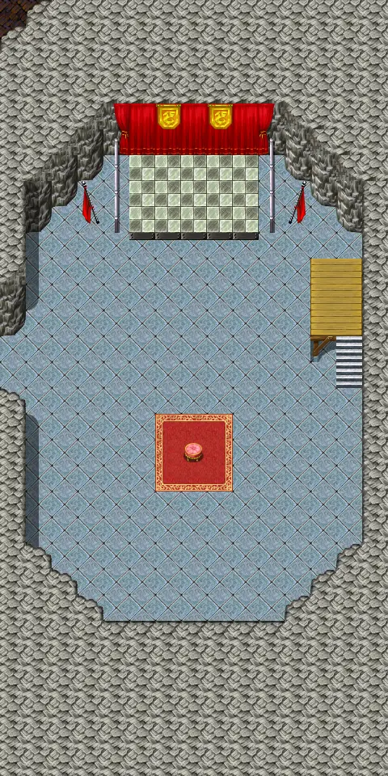
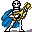
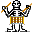
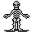
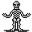
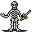
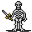

# Ratdom maze 543d

15×30 tiles · part of [Ratdom level 5](index.md)

<label class="lg"><input type="checkbox" data-t="spawn" checked><b>Red</b>&nbsp;Monsters / NPCs</label><label class="lg"><input type="checkbox" data-t="mapchange" checked><b>Blue</b>&nbsp;Exit to another map</label><label class="lg"><input type="checkbox" data-t="container" checked><b>Yellow</b>&nbsp;Container (click to see contents)</label><label class="lg"><input type="checkbox" data-t="sign" checked><b>Purple</b>&nbsp;Sign</label><label class="lg"><input type="checkbox" data-t="rest" checked><b>Green</b>&nbsp;Resting place</label><label class="lg"><input type="checkbox" data-t="key" checked><b>Orange dashed</b>&nbsp;Blocked until a quest step / item</label><label class="lg"><input type="checkbox" data-t="script"><b>Grey dotted</b>&nbsp;Scripted event</label><label class="lg"><input type="checkbox" data-t="replace"><b>White dotted</b>&nbsp;Changes during a quest</label>

## Exits

- [Ratdom maze 543](ratdom_maze_543.md)

## Monsters & NPCs here

| Name | HP |
|---|---|
| [Dancing skeleton](../monsters/ratdom_skel_dance4.md) | 0 |
| [Horn player](../monsters/ratdom_skel_horn.md) | 0 |
| [Clevred](../monsters/ratdom_rat.md) | 0 |
| [Drummer](../monsters/ratdom_skel_drum.md) | 0 |
| [Dancing skeleton](../monsters/ratdom_skel_dance5.md) | 0 |
| [Dancing skeleton](../monsters/ratdom_skel_dance2.md) | 0 |
| [Dancing skeleton](../monsters/ratdom_skel_dance3.md) | 0 |
| [Dancing skeleton](../monsters/ratdom_skel_dance6.md) | 0 |
| [Skeleton mage](../monsters/ratdom_skel_mage.md) | 0 |
| [Cymbalist](../monsters/ratdom_skel_cymb.md) | 0 |
| [Dancing skeleton](../monsters/ratdom_skel_dance7.md) | 0 |
| [Lutenist](../monsters/ratdom_skel_lute.md) | 0 |
| [Dancing skeleton](../monsters/ratdom_skel_dance1.md) | 0 |
| [Angry skeleton](../monsters/ratdom_skel_dance22.md) | 80 |
| [Angry skeleton](../monsters/ratdom_skel_dance26.md) | 80 |
| [Angry skeleton](../monsters/ratdom_skel_dance25.md) | 80 |
| [Angry skeleton](../monsters/ratdom_skel_dance21.md) | 80 |
| [Angry skeleton](../monsters/ratdom_skel_dance23.md) | 80 |
| [Angry skeleton](../monsters/ratdom_skel_dance24.md) | 80 |
| [Angry skeleton](../monsters/ratdom_skel_dance27.md) | 80 |

<small>Map ID: `ratdom_maze_543d` · Data from v0.8.18</small>
