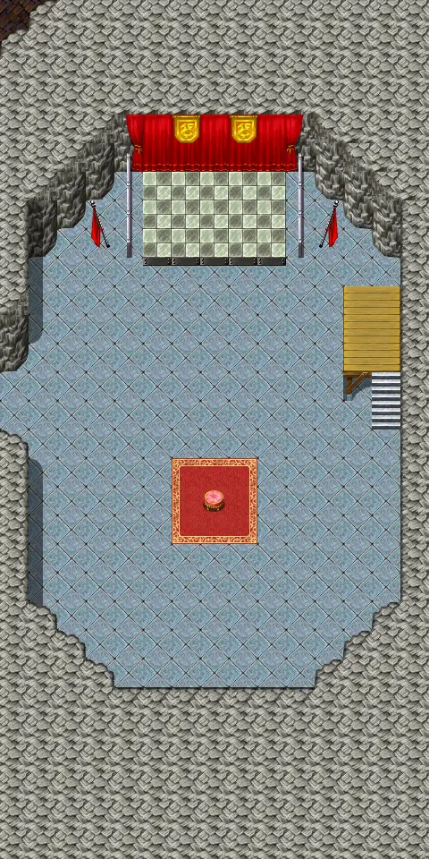
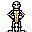
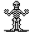
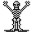
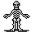
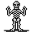
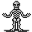
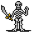
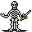
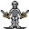

# Ratdom maze 543d

| | |
|---|---|
| **Map ID** | `ratdom_maze_543d` |
| **Region** | In Skeleton dance (other) |
| **Type** | Indoors / underground |
| **Size** | 15×30 tiles |
| **World map** | [Ratdom level 5](index.md) |
| **Introduced** | [v0.8.5](../versions/0.8.5.md) |
| **NPCs** | 9 |
| **Enemy types** | 7 |
| **Quests** | 2 |

**Ratdom maze 543d** is an indoor map, in Skeleton dance (other). It has 9 NPCs and 7 kinds of enemy. Exits lead to Ratdom maze 543.

## Map

<label class="lg"><input type="checkbox" data-t="spawn" checked><b>Red</b>&nbsp;Monsters / NPCs</label><label class="lg"><input type="checkbox" data-t="mapchange" checked><b>Blue</b>&nbsp;Exit to another map</label><label class="lg"><input type="checkbox" data-t="container" checked><b>Yellow</b>&nbsp;Container (click to see contents)</label><label class="lg"><input type="checkbox" data-t="sign" checked><b>Purple</b>&nbsp;Sign</label><label class="lg"><input type="checkbox" data-t="rest" checked><b>Green</b>&nbsp;Resting place</label><label class="lg"><input type="checkbox" data-t="key" checked><b>Orange dashed</b>&nbsp;Blocked until a quest step / item</label><label class="lg"><input type="checkbox" data-t="script"><b>Grey dotted</b>&nbsp;Scripted event</label><label class="lg"><input type="checkbox" data-t="replace"><b>White dotted</b>&nbsp;Changes during a quest</label><label class="lg"><input type="checkbox" data-t="pin" checked><b>Numbers</b>&nbsp;Numbered key points (see the key below the map)</label>

<a class="pin pin-exit" href="#key-1" style="left:3.333%;top:46.667%" title="Exit (west): to [Ratdom maze 543](ratdom_maze_543.md)">1</a><a id="pin-npc-ratdom_rat" class="pin pin-npc" href="#key-2" style="left:50.000%;top:1.667%" title="[Clevred](../../monsters/ratdom_rat.md): 1 quest">2</a><a id="pin-npc-ratdom_skel_dance6" class="pin pin-npc" href="#key-3" style="left:50.000%;top:58.333%" title="[Dancing skeleton](../../monsters/ratdom_skel_dance1.md#v-ratdom_skel_dance6): NPC">3</a><a id="pin-npc-ratdom_skel_dance1" class="pin pin-npc" href="#key-4" style="left:23.333%;top:61.667%" title="[Dancing skeleton](../../monsters/ratdom_skel_dance1.md): NPC">4</a><a id="pin-npc-ratdom_skel_dance3" class="pin pin-npc" href="#key-5" style="left:50.000%;top:48.333%" title="[Dancing skeleton](../../monsters/ratdom_skel_dance1.md#v-ratdom_skel_dance3): NPC">5</a><a id="pin-npc-ratdom_skel_dance4" class="pin pin-npc" href="#key-6" style="left:23.333%;top:48.333%" title="[Dancing skeleton](../../monsters/ratdom_skel_dance1.md#v-ratdom_skel_dance4): NPC">6</a><a id="pin-npc-ratdom_skel_dance2" class="pin pin-npc" href="#key-7" style="left:63.333%;top:55.000%" title="[Dancing skeleton](../../monsters/ratdom_skel_dance1.md#v-ratdom_skel_dance2): NPC">7</a><a id="pin-npc-ratdom_skel_dance5" class="pin pin-npc" href="#key-8" style="left:30.000%;top:45.000%" title="[Dancing skeleton](../../monsters/ratdom_skel_dance1.md#v-ratdom_skel_dance5): NPC">8</a><a id="pin-npc-ratdom_skel_dance7" class="pin pin-npc" href="#key-9" style="left:76.667%;top:71.667%" title="[Dancing skeleton](../../monsters/ratdom_skel_dance1.md#v-ratdom_skel_dance7): NPC">9</a><a id="pin-npc-ratdom_skel_mage" class="pin pin-npc" href="#key-10" style="left:90.000%;top:38.333%" title="[Skeleton mage](../../monsters/ratdom_skel_mage.md): NPC">10</a><a class="pin pin-script" href="#key-11" style="left:46.667%;top:50.000%" title="Quest trigger: Scripted event: advances the quest: hidden story flag “ratdom_nondisplay” to stage 101 (“101=Lute_1 active”)">11</a><a class="pin pin-script" href="#key-12" style="left:50.439%;top:55.834%" title="Quest trigger: Scripted event: advances the quest: Yellow is it to stage 34 (“I took a leg bone of a rat from the dancing but vengeful and unforgiving skeletons.”) (+1 more quest(s))">12</a><a class="pin pin-key" href="#key-13" style="left:50.000%;top:65.000%" title="Blocked passage: Closed off once you reach this point in the quest: base_nondisplay (stage 2: “2=This stage is never set”)">13</a><a class="pin pin-key" href="#key-14" style="left:50.000%;top:25.000%" title="Blocked passage: Unlocked during the quest: base_nondisplay (stage 2: “2=This stage is never set”)">14</a><a class="pin pin-key" href="#key-14" style="left:56.667%;top:21.667%" title="Blocked passage: Unlocked during the quest: base_nondisplay (stage 2: “2=This stage is never set”)">14</a><a class="pin pin-key" href="#key-14" style="left:50.000%;top:21.667%" title="Blocked passage: Unlocked during the quest: base_nondisplay (stage 2: “2=This stage is never set”)">14</a><a class="pin pin-key" href="#key-14" style="left:43.333%;top:21.667%" title="Blocked passage: Unlocked during the quest: base_nondisplay (stage 2: “2=This stage is never set”)">14</a><a class="pin pin-replace" href="#key-15" style="left:53.364%;top:27.194%" title="Changes during a quest: This area changes during the quest: hidden story flag “ratdom_nondisplay” (stage 101: “101=Lute_1 active”)">15</a><a class="pin pin-replace" href="#key-16" style="left:43.772%;top:19.167%" title="Changes during a quest: This area changes during the quest: hidden story flag “ratdom_nondisplay” (stage 104: “104=Cymb_1 active”)">16</a><a class="pin pin-replace" href="#key-17" style="left:50.439%;top:19.167%" title="Changes during a quest: This area changes during the quest: hidden story flag “ratdom_nondisplay” (stage 103: “103=Drum_1 active”)">17</a><a class="pin pin-replace" href="#key-18" style="left:57.105%;top:19.167%" title="Changes during a quest: This area changes during the quest: hidden story flag “ratdom_nondisplay” (stage 102: “102=Horn_1 active”)">18</a><a class="pin pin-replace" href="#key-19" style="left:44.133%;top:24.481%" title="Changes during a quest: This area changes back during the quest: hidden story flag “ratdom_nondisplay” (stage 101: “101=Lute_1 active”)">19</a><a class="pin pin-replace" href="#key-20" style="left:37.466%;top:21.148%" title="Changes during a quest: This area changes back during the quest: hidden story flag “ratdom_nondisplay” (stage 104: “104=Cymb_1 active”)">20</a><a class="pin pin-replace" href="#key-21" style="left:57.010%;top:24.620%" title="Changes during a quest: This area changes back during the quest: hidden story flag “ratdom_nondisplay” (stage 103: “103=Drum_1 active”)">21</a><a class="pin pin-replace" href="#key-22" style="left:62.014%;top:19.966%" title="Changes during a quest: This area changes back during the quest: hidden story flag “ratdom_nondisplay” (stage 102: “102=Horn_1 active”)">22</a>

??? abstract "Key to the numbers on the map"

    | # | What | Details |
    |---|---|---|
    | 1 | Exit (west) | to [Ratdom maze 543](ratdom_maze_543.md) |
    | 2 | [Clevred](../monsters/ratdom_rat.md) | 1 quest |
    | 3 | [Dancing skeleton](../monsters/ratdom_skel_dance1.md#v-ratdom_skel_dance6) | NPC |
    | 4 | [Dancing skeleton](../monsters/ratdom_skel_dance1.md) | NPC |
    | 5 | [Dancing skeleton](../monsters/ratdom_skel_dance1.md#v-ratdom_skel_dance3) | NPC |
    | 6 | [Dancing skeleton](../monsters/ratdom_skel_dance1.md#v-ratdom_skel_dance4) | NPC |
    | 7 | [Dancing skeleton](../monsters/ratdom_skel_dance1.md#v-ratdom_skel_dance2) | NPC |
    | 8 | [Dancing skeleton](../monsters/ratdom_skel_dance1.md#v-ratdom_skel_dance5) | NPC |
    | 9 | [Dancing skeleton](../monsters/ratdom_skel_dance1.md#v-ratdom_skel_dance7) | NPC |
    | 10 | [Skeleton mage](../monsters/ratdom_skel_mage.md) | NPC |
    | 11 | Quest trigger | Scripted event: advances the quest: hidden story flag “ratdom_nondisplay” to stage 101 (“101=Lute_1 active”) |
    | 12 | Quest trigger | Scripted event: advances the quest: Yellow is it to stage 34 (“I took a leg bone of a rat from the dancing but vengeful and unforgiving skeletons.”) (+1 more quest(s)) |
    | 13 | Blocked passage | Closed off once you reach this point in the quest: base_nondisplay (stage 2: “2=This stage is never set”) |
    | 14 | Blocked passage | Unlocked during the quest: base_nondisplay (stage 2: “2=This stage is never set”) |
    | 15 | Changes during a quest | This area changes during the quest: hidden story flag “ratdom_nondisplay” (stage 101: “101=Lute_1 active”) |
    | 16 | Changes during a quest | This area changes during the quest: hidden story flag “ratdom_nondisplay” (stage 104: “104=Cymb_1 active”) |
    | 17 | Changes during a quest | This area changes during the quest: hidden story flag “ratdom_nondisplay” (stage 103: “103=Drum_1 active”) |
    | 18 | Changes during a quest | This area changes during the quest: hidden story flag “ratdom_nondisplay” (stage 102: “102=Horn_1 active”) |
    | 19 | Changes during a quest | This area changes back during the quest: hidden story flag “ratdom_nondisplay” (stage 101: “101=Lute_1 active”) |
    | 20 | Changes during a quest | This area changes back during the quest: hidden story flag “ratdom_nondisplay” (stage 104: “104=Cymb_1 active”) |
    | 21 | Changes during a quest | This area changes back during the quest: hidden story flag “ratdom_nondisplay” (stage 103: “103=Drum_1 active”) |
    | 22 | Changes during a quest | This area changes back during the quest: hidden story flag “ratdom_nondisplay” (stage 102: “102=Horn_1 active”) |

Verified against v0.8.18 map data.

## Connections

| Direction | Leads to | Region there | Map # |
|---|---|---|---|
| West | [Ratdom maze 543](ratdom_maze_543.md) | Skeleton dance | 1 |

## NPCs

- [Clevred](../monsters/ratdom_rat.md) — quests: [Yellow is it](../quests/ratdom_quest.md) (#2)
- [Dancing skeleton](../monsters/ratdom_skel_dance1.md#v-ratdom_skel_dance6) (#3)
- [Dancing skeleton](../monsters/ratdom_skel_dance1.md) (#4)
- [Dancing skeleton](../monsters/ratdom_skel_dance1.md#v-ratdom_skel_dance3) (#5)
- [Dancing skeleton](../monsters/ratdom_skel_dance1.md#v-ratdom_skel_dance4) (#6)
- [Dancing skeleton](../monsters/ratdom_skel_dance1.md#v-ratdom_skel_dance2) (#7)
- [Dancing skeleton](../monsters/ratdom_skel_dance1.md#v-ratdom_skel_dance5) (#8)
- [Dancing skeleton](../monsters/ratdom_skel_dance1.md#v-ratdom_skel_dance7) (#9)
- [Skeleton mage](../monsters/ratdom_skel_mage.md) (#10)

## Enemies

| Enemy | HP | Damage | Up to | Notes |
|---|---|---|---|---|
| [Angry skeleton](../monsters/ratdom_skel_dance21.md#v-ratdom_skel_dance25) | 80 | 10–20 | 25 | appears later, during a quest; shares spawn with Angry skeleton |
| [Angry skeleton](../monsters/ratdom_skel_dance21.md#v-ratdom_skel_dance23) | 80 | 10–20 | 25 | appears later, during a quest; shares spawn with Angry skeleton |
| [Angry skeleton](../monsters/ratdom_skel_dance21.md#v-ratdom_skel_dance26) | 80 | 10–30 | 25 | appears later, during a quest; shares spawn with Angry skeleton |
| [Angry skeleton](../monsters/ratdom_skel_dance21.md) | 80 | 10–20 | 25 | appears later, during a quest; shares spawn with Angry skeleton |
| [Angry skeleton](../monsters/ratdom_skel_dance21.md#v-ratdom_skel_dance24) | 80 | 10–20 | 25 | appears later, during a quest; shares spawn with Angry skeleton |
| [Angry skeleton](../monsters/ratdom_skel_dance21.md#v-ratdom_skel_dance27) | 80 | 10–30 | 25 | appears later, during a quest; shares spawn with Angry skeleton |
| [Angry skeleton](../monsters/ratdom_skel_dance21.md#v-ratdom_skel_dance22) | 80 | 10–20 | 25 | appears later, during a quest; shares spawn with Angry skeleton |

<small>“Up to” is the most that can be alive at once from the spawn areas on this map.</small>

**Scenery:** [Cymbalist](../monsters/ratdom_skel_cymb.md), [Drummer](../monsters/erwyn_skel_drum.md#v-ratdom_skel_drum), [Horn player](../monsters/ratdom_skel_horn.md), [Lutenist](../monsters/erwyn_skel_lute.md#v-ratdom_skel_lute)

## Quests

- [base_nondisplay](../quests/base_nondisplay.md): blocked passage closes at stage 2; blocked passage opens at stage 2
- [Yellow is it](../quests/ratdom_quest.md): [Clevred](../monsters/ratdom_rat.md) is involved; something on this map advances it; stepping on a trigger here sets stage 34
- [Ratdom story flags (hidden flag)](../quests/ratdom_nondisplay.md): [Clevred](../monsters/ratdom_rat.md) is involved; part of the map changes at stage 101; part of the map changes at stage 102; part of the map changes at stage 103; part of the map changes at stage 104; something on this map advances it; stepping on a trigger here sets stage 100; stepping on a trigger here sets stage 101; stepping on a trigger here sets stage 102; stepping on a trigger here sets stage 103; stepping on a trigger here sets stage 104; stepping on a trigger here sets stage 105; stepping on a trigger here sets stage 106; stepping on a trigger here sets stage 107; stepping on a trigger here sets stage 108; stepping on a trigger here sets stage 109

## Points of interest

- **Quest trigger** (#11): Scripted event: advances the quest: hidden story flag “ratdom_nondisplay” to stage 101 (“101=Lute_1 active”)
- **Quest trigger** (#12): Scripted event: advances the quest: Yellow is it to stage 34 (“I took a leg bone of a rat from the dancing but vengeful and unforgiving skeletons.”) (+1 more quest(s))
- **Blocked passage** (#13): Closed off once you reach this point in the quest: base_nondisplay (stage 2: “2=This stage is never set”)
- **Blocked passage** (#14): Unlocked during the quest: base_nondisplay (stage 2: “2=This stage is never set”)
- **Changes during a quest** (#15): This area changes during the quest: hidden story flag “ratdom_nondisplay” (stage 101: “101=Lute_1 active”)
- **Changes during a quest** (#16): This area changes during the quest: hidden story flag “ratdom_nondisplay” (stage 104: “104=Cymb_1 active”)
- **Changes during a quest** (#17): This area changes during the quest: hidden story flag “ratdom_nondisplay” (stage 103: “103=Drum_1 active”)
- **Changes during a quest** (#18): This area changes during the quest: hidden story flag “ratdom_nondisplay” (stage 102: “102=Horn_1 active”)
- **Changes during a quest** (#19): This area changes back during the quest: hidden story flag “ratdom_nondisplay” (stage 101: “101=Lute_1 active”)
- **Changes during a quest** (#20): This area changes back during the quest: hidden story flag “ratdom_nondisplay” (stage 104: “104=Cymb_1 active”)
- **Changes during a quest** (#21): This area changes back during the quest: hidden story flag “ratdom_nondisplay” (stage 103: “103=Drum_1 active”)
- **Changes during a quest** (#22): This area changes back during the quest: hidden story flag “ratdom_nondisplay” (stage 102: “102=Horn_1 active”)

## Version history

| Version | Change |
|---|---|
| [v0.8.5](../versions/0.8.5.md) | Added |
| [v0.8.12.1](../versions/0.8.12.1.md) | Map layout or objects changed |

Verified against v0.8.18 and every earlier release back to v0.7.0 (game data compared release by release).

## Community notes

<small>Written by players, not generated from game data. **Observations**: what players notice in-game · **Lore**: the in-world story · **Trivia**: real-world facts, references, development history · **Theory / speculation**: unconfirmed ideas; may just be unfinished content</small>

### Observations

*No notes yet. Contributions are welcome: [add a note](https://github.com/asdfghjkl628/Andor-s-Trail-Wikiiii/new/main/notes/maps?filename=ratdom_maze_543d.md&value=%23%23%20Observations%0A%0A%3C%21--%20what%20players%20notice%20in-game%20--%3E%0A%0A%23%23%20Lore%0A%0A%3C%21--%20the%20in-world%20story%20--%3E%0A%0A%23%23%20Trivia%0A%0A%3C%21--%20real-world%20facts%2C%20references%2C%20development%20history%20--%3E%0A%0A%23%23%20Theory%20/%20speculation%0A%0A%3C%21--%20unconfirmed%20ideas%3B%20may%20just%20be%20unfinished%20content%20--%3E%0A).*

### Lore

*No notes yet. Contributions are welcome: [add a note](https://github.com/asdfghjkl628/Andor-s-Trail-Wikiiii/new/main/notes/maps?filename=ratdom_maze_543d.md&value=%23%23%20Observations%0A%0A%3C%21--%20what%20players%20notice%20in-game%20--%3E%0A%0A%23%23%20Lore%0A%0A%3C%21--%20the%20in-world%20story%20--%3E%0A%0A%23%23%20Trivia%0A%0A%3C%21--%20real-world%20facts%2C%20references%2C%20development%20history%20--%3E%0A%0A%23%23%20Theory%20/%20speculation%0A%0A%3C%21--%20unconfirmed%20ideas%3B%20may%20just%20be%20unfinished%20content%20--%3E%0A).*

### Trivia

*No notes yet. Contributions are welcome: [add a note](https://github.com/asdfghjkl628/Andor-s-Trail-Wikiiii/new/main/notes/maps?filename=ratdom_maze_543d.md&value=%23%23%20Observations%0A%0A%3C%21--%20what%20players%20notice%20in-game%20--%3E%0A%0A%23%23%20Lore%0A%0A%3C%21--%20the%20in-world%20story%20--%3E%0A%0A%23%23%20Trivia%0A%0A%3C%21--%20real-world%20facts%2C%20references%2C%20development%20history%20--%3E%0A%0A%23%23%20Theory%20/%20speculation%0A%0A%3C%21--%20unconfirmed%20ideas%3B%20may%20just%20be%20unfinished%20content%20--%3E%0A).*

### Theory / speculation

*No notes yet. Contributions are welcome: [add a note](https://github.com/asdfghjkl628/Andor-s-Trail-Wikiiii/new/main/notes/maps?filename=ratdom_maze_543d.md&value=%23%23%20Observations%0A%0A%3C%21--%20what%20players%20notice%20in-game%20--%3E%0A%0A%23%23%20Lore%0A%0A%3C%21--%20the%20in-world%20story%20--%3E%0A%0A%23%23%20Trivia%0A%0A%3C%21--%20real-world%20facts%2C%20references%2C%20development%20history%20--%3E%0A%0A%23%23%20Theory%20/%20speculation%0A%0A%3C%21--%20unconfirmed%20ideas%3B%20may%20just%20be%20unfinished%20content%20--%3E%0A).*

??? info "Technical information"

    | | |
    |---|---|
    | Map ID | `ratdom_maze_543d` |
    | File | `res/xml/ratdom_maze_543d.tmx` |
    | Size | 15×30 tiles (480×960 px) |
    | outdoors property | – |
    | Layers drawn | ground, objects, above, top |
    | Tilesets | map_bed_1, map_border_1, map_bridge_1, map_bridge_2, map_broken_1, map_cavewall_1, map_cavewall_2, map_cavewall_3, map_cavewall_4, map_chair_table_1, map_chair_table_2, map_crate_1, map_cupboard_1, map_curtain_1, map_entrance_1, map_entrance_2, map_fence_1, map_fence_2, map_fence_3, map_fence_4, map_ground_1, map_ground_2, map_ground_3, map_ground_4, map_ground_5, map_ground_6, map_ground_7, map_ground_8, map_guynmart, map_house_1, map_house_2, map_indoor_1, map_indoor_2, map_kitchen_1, map_outdoor_1, map_pillar_1, map_pillar_2, map_plant_1, map_plant_2, map_ratdom, map_rock_1, map_rock_2, map_roof_1, map_roof_2, map_roof_3, map_shop_1, map_sign_ladder_1, map_table_1, map_trail_1, map_transition_1, map_transition_2, map_transition_3, map_transition_4, map_transition_5, map_tree_1, map_tree_2, map_wall_1, map_wall_2, map_wall_3, map_wall_4, map_window_1, map_window_2 |
    | Map objects | spawn: 8, replace: 8, key: 5, script: 2, mapchange: 1 |
    | World map position | segment `ratdom_level_5`, x 90, y 120 |

<small>Data from v0.8.18</small>
