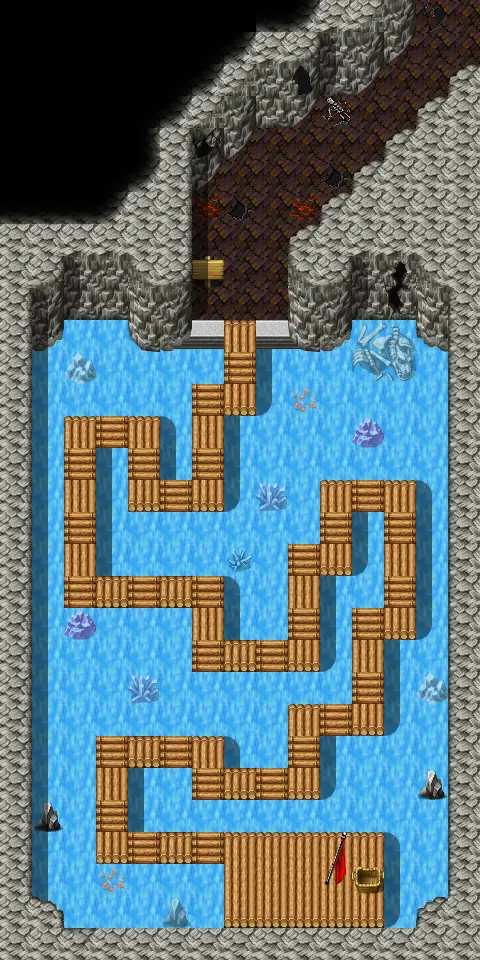
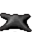

# Ratdom maze 664

| | |
|---|---|
| **Map ID** | `ratdom_maze_664` |
| **Region** | In Waterway (other) |
| **Type** | Indoors / underground |
| **Size** | 15×30 tiles |
| **World map** | [Ratdom level 6](index.md) |
| **Introduced** | [v0.8.5](../versions/0.8.5.md) |
| **NPCs** | 1 |
| **Enemy types** | 7 |
| **Quests** | 2 |
| **Containers** | 1 |

**Ratdom maze 664** is an indoor map, in Waterway (other). It has 1 NPC and 7 kinds of enemy. Exits lead to Ratdom maze 655, Ratdom maze 664, Ratdom maze 675, Ratdom maze 674 and 1 more.

## Map

<label class="lg"><input type="checkbox" data-t="spawn" checked><b>Red</b>&nbsp;Monsters / NPCs</label><label class="lg"><input type="checkbox" data-t="mapchange" checked><b>Blue</b>&nbsp;Exit to another map</label><label class="lg"><input type="checkbox" data-t="container" checked><b>Yellow</b>&nbsp;Container (click to see contents)</label><label class="lg"><input type="checkbox" data-t="sign" checked><b>Purple</b>&nbsp;Sign</label><label class="lg"><input type="checkbox" data-t="rest" checked><b>Green</b>&nbsp;Resting place</label><label class="lg"><input type="checkbox" data-t="key" checked><b>Orange dashed</b>&nbsp;Blocked until a quest step / item</label><label class="lg"><input type="checkbox" data-t="script"><b>Grey dotted</b>&nbsp;Scripted event</label><label class="lg"><input type="checkbox" data-t="replace"><b>White dotted</b>&nbsp;Changes during a quest</label><label class="lg"><input type="checkbox" data-t="pin" checked><b>Numbers</b>&nbsp;Numbered key points (see the key below the map)</label>

<a class="pin pin-exit" href="#key-1" style="left:93.333%;top:3.333%" title="Exit (northeast): to [Ratdom maze 655](../ratdom_maze_655.md)">1</a><a class="pin pin-exit" href="#key-2" style="left:86.667%;top:81.667%" title="Exit (east): to [Ratdom maze 664](../ratdom_maze_664.md)">2</a><a class="pin pin-exit" href="#key-2" style="left:90.000%;top:58.333%" title="Exit (east): to [Ratdom maze 664](../ratdom_maze_664.md)">2</a><a class="pin pin-exit" href="#key-2" style="left:87.105%;top:79.167%" title="Exit (east): to [Ratdom maze 664](../ratdom_maze_664.md)">2</a><a class="pin pin-exit" href="#key-2" style="left:90.439%;top:55.834%" title="Exit (east): to [Ratdom maze 664](../ratdom_maze_664.md)">2</a><a class="pin pin-exit" href="#key-3" style="left:93.333%;top:96.667%" title="Exit (southeast): to [Ratdom maze 675](../ratdom_maze_675.md)">3</a><a class="pin pin-exit" href="#key-4" style="left:26.667%;top:93.333%" title="Exit (south): to [Ratdom maze 664](../ratdom_maze_664.md)">4</a><a class="pin pin-exit" href="#key-4" style="left:27.105%;top:90.834%" title="Exit (south): to [Ratdom maze 664](../ratdom_maze_664.md)">4</a><a class="pin pin-exit" href="#key-5" style="left:6.667%;top:96.667%" title="Exit (southwest): to [Ratdom maze 674](../ratdom_maze_674.md)">5</a><a class="pin pin-exit" href="#key-6" style="left:10.000%;top:53.333%" title="Exit (west): to [Ratdom maze 664](../ratdom_maze_664.md)">6</a><a class="pin pin-exit" href="#key-6" style="left:13.333%;top:83.333%" title="Exit (west): to [Ratdom maze 664](../ratdom_maze_664.md)">6</a><a class="pin pin-exit" href="#key-6" style="left:10.439%;top:50.834%" title="Exit (west): to [Ratdom maze 664](../ratdom_maze_664.md)">6</a><a class="pin pin-exit" href="#key-6" style="left:13.772%;top:80.834%" title="Exit (west): to [Ratdom maze 664](../ratdom_maze_664.md)">6</a><a class="pin pin-exit" href="#key-7" style="left:6.667%;top:3.333%" title="Exit (northwest): to [Ratdom maze 654](../ratdom_maze_654.md)">7</a><a class="pin pin-exit" href="#key-8" style="left:43.333%;top:36.667%" title="Exit (stairs / passage): to [Ratdom maze 664](../ratdom_maze_664.md)">8</a><a class="pin pin-exit" href="#key-8" style="left:23.333%;top:38.333%" title="Exit (stairs / passage): to [Ratdom maze 664](../ratdom_maze_664.md)">8</a><a class="pin pin-exit" href="#key-8" style="left:23.333%;top:70.000%" title="Exit (stairs / passage): to [Ratdom maze 664](../ratdom_maze_664.md)">8</a><a class="pin pin-exit" href="#key-8" style="left:36.667%;top:46.667%" title="Exit (stairs / passage): to [Ratdom maze 664](../ratdom_maze_664.md)">8</a><a class="pin pin-exit" href="#key-8" style="left:56.667%;top:71.667%" title="Exit (stairs / passage): to [Ratdom maze 664](../ratdom_maze_664.md)">8</a><a class="pin pin-exit" href="#key-8" style="left:53.333%;top:76.667%" title="Exit (stairs / passage): to [Ratdom maze 664](../ratdom_maze_664.md)">8</a><a class="pin pin-exit" href="#key-8" style="left:33.333%;top:83.333%" title="Exit (stairs / passage): to [Ratdom maze 664](../ratdom_maze_664.md)">8</a><a class="pin pin-exit" href="#key-8" style="left:53.333%;top:85.000%" title="Exit (stairs / passage): to [Ratdom maze 664](../ratdom_maze_664.md)">8</a><a class="pin pin-exit" href="#key-8" style="left:73.333%;top:81.667%" title="Exit (stairs / passage): to [Ratdom maze 664](../ratdom_maze_664.md)">8</a><a class="pin pin-exit" href="#key-8" style="left:73.333%;top:43.333%" title="Exit (stairs / passage): to [Ratdom maze 664](../ratdom_maze_664.md)">8</a><a class="pin pin-exit" href="#key-8" style="left:56.667%;top:50.000%" title="Exit (stairs / passage): to [Ratdom maze 664](../ratdom_maze_664.md)">8</a><a class="pin pin-exit" href="#key-8" style="left:53.333%;top:61.667%" title="Exit (stairs / passage): to [Ratdom maze 664](../ratdom_maze_664.md)">8</a><a class="pin pin-exit" href="#key-8" style="left:33.333%;top:56.667%" title="Exit (stairs / passage): to [Ratdom maze 664](../ratdom_maze_664.md)">8</a><a class="pin pin-exit" href="#key-8" style="left:23.333%;top:50.000%" title="Exit (stairs / passage): to [Ratdom maze 664](../ratdom_maze_664.md)">8</a><a class="pin pin-exit" href="#key-8" style="left:70.000%;top:65.000%" title="Exit (stairs / passage): to [Ratdom maze 664](../ratdom_maze_664.md)">8</a><a class="pin pin-exit" href="#key-8" style="left:76.667%;top:58.333%" title="Exit (stairs / passage): to [Ratdom maze 664](../ratdom_maze_664.md)">8</a><a class="pin pin-exit" href="#key-8" style="left:43.333%;top:75.000%" title="Exit (stairs / passage): to [Ratdom maze 664](../ratdom_maze_664.md)">8</a><a class="pin pin-exit" href="#key-8" style="left:43.772%;top:34.167%" title="Exit (stairs / passage): to [Ratdom maze 664](../ratdom_maze_664.md)">8</a><a class="pin pin-exit" href="#key-8" style="left:23.772%;top:35.834%" title="Exit (stairs / passage): to [Ratdom maze 664](../ratdom_maze_664.md)">8</a><a class="pin pin-exit" href="#key-8" style="left:23.772%;top:67.500%" title="Exit (stairs / passage): to [Ratdom maze 664](../ratdom_maze_664.md)">8</a><a class="pin pin-exit" href="#key-8" style="left:37.105%;top:44.167%" title="Exit (stairs / passage): to [Ratdom maze 664](../ratdom_maze_664.md)">8</a><a class="pin pin-exit" href="#key-8" style="left:57.105%;top:69.167%" title="Exit (stairs / passage): to [Ratdom maze 664](../ratdom_maze_664.md)">8</a><a class="pin pin-exit" href="#key-8" style="left:53.772%;top:74.167%" title="Exit (stairs / passage): to [Ratdom maze 664](../ratdom_maze_664.md)">8</a><a class="pin pin-exit" href="#key-8" style="left:33.772%;top:80.834%" title="Exit (stairs / passage): to [Ratdom maze 664](../ratdom_maze_664.md)">8</a><a class="pin pin-exit" href="#key-8" style="left:53.772%;top:82.500%" title="Exit (stairs / passage): to [Ratdom maze 664](../ratdom_maze_664.md)">8</a><a class="pin pin-exit" href="#key-8" style="left:73.772%;top:79.167%" title="Exit (stairs / passage): to [Ratdom maze 664](../ratdom_maze_664.md)">8</a><a class="pin pin-exit" href="#key-8" style="left:73.772%;top:40.834%" title="Exit (stairs / passage): to [Ratdom maze 664](../ratdom_maze_664.md)">8</a><a class="pin pin-exit" href="#key-8" style="left:57.105%;top:47.500%" title="Exit (stairs / passage): to [Ratdom maze 664](../ratdom_maze_664.md)">8</a><a class="pin pin-exit" href="#key-8" style="left:53.772%;top:59.167%" title="Exit (stairs / passage): to [Ratdom maze 664](../ratdom_maze_664.md)">8</a><a class="pin pin-exit" href="#key-8" style="left:33.772%;top:54.167%" title="Exit (stairs / passage): to [Ratdom maze 664](../ratdom_maze_664.md)">8</a><a class="pin pin-exit" href="#key-8" style="left:23.772%;top:47.500%" title="Exit (stairs / passage): to [Ratdom maze 664](../ratdom_maze_664.md)">8</a><a class="pin pin-exit" href="#key-8" style="left:70.439%;top:62.500%" title="Exit (stairs / passage): to [Ratdom maze 664](../ratdom_maze_664.md)">8</a><a class="pin pin-exit" href="#key-8" style="left:77.105%;top:55.834%" title="Exit (stairs / passage): to [Ratdom maze 664](../ratdom_maze_664.md)">8</a><a class="pin pin-exit" href="#key-8" style="left:43.772%;top:72.500%" title="Exit (stairs / passage): to [Ratdom maze 664](../ratdom_maze_664.md)">8</a><a class="pin pin-npc" href="#key-9" style="left:50.000%;top:1.667%" title="[Clevred](../../monsters/ratdom_rat.md): 1 quest">9</a><a class="pin pin-script" href="#key-10" style="left:13.333%;top:10.000%" title="Quest trigger: Scripted event: advances the quest: hidden story flag “ratdom_maze” to stage 1 (“Light-1”)">10</a><a class="pin pin-script" href="#key-11" style="left:86.667%;top:10.000%" title="Quest trigger: Scripted event: advances the quest: hidden story flag “ratdom_maze” to stage 2 (“Light-2”)">11</a><a class="pin pin-script" href="#key-12" style="left:50.000%;top:20.000%" title="Quest trigger: Scripted event: advances the quest: hidden story flag “ratdom_maze” to stage 5 (“Light-5”)">12</a><a class="pin pin-script" href="#key-13" style="left:53.333%;top:31.667%" title="Quest trigger: Scripted event: advances the quest: hidden story flag “ratdom_maze” to stage 7 (“Light-7”)">13</a><a class="pin pin-container" href="#key-14" style="left:76.667%;top:91.667%" title="Container 1: Gold coins">14</a><a class="pin pin-key" href="#key-15" style="left:70.000%;top:91.667%" title="Blocked passage: Unlocked during the quest: base_nondisplay (stage 2: “2=This stage is never set”)">15</a><a class="pin pin-replace" href="#key-16" style="left:50.000%;top:50.000%" title="Changes during a quest: This area changes during the quest: hidden story flag “ratdom_maze” (stage 10: “Light off”)">16</a><a class="pin pin-replace" href="#key-17" style="left:50.439%;top:47.500%" title="Changes during a quest: This area changes during the quest: hidden story flag “ratdom_maze” (stage 1: “Light-1”)">17</a><a class="pin pin-replace" href="#key-18" style="left:53.364%;top:52.194%" title="Changes during a quest: This area changes during the quest: hidden story flag “ratdom_maze” (stage 2: “Light-2”)">18</a><a class="pin pin-replace" href="#key-19" style="left:44.133%;top:49.481%" title="Changes during a quest: This area changes during the quest: hidden story flag “ratdom_maze” (stage 3: “Light-3”)">19</a><a class="pin pin-replace" href="#key-20" style="left:48.266%;top:53.225%" title="Changes during a quest: This area changes during the quest: hidden story flag “ratdom_maze” (stage 4: “Light-4”)">20</a><a class="pin pin-replace" href="#key-21" style="left:43.641%;top:46.190%" title="Changes during a quest: This area changes during the quest: hidden story flag “ratdom_maze” (stage 5: “Light-5”)">21</a><a class="pin pin-replace" href="#key-22" style="left:41.567%;top:52.934%" title="Changes during a quest: This area changes during the quest: hidden story flag “ratdom_maze” (stage 6: “Light-6”)">22</a><a class="pin pin-replace" href="#key-23" style="left:52.291%;top:44.906%" title="Changes during a quest: This area changes during the quest: hidden story flag “ratdom_maze” (stage 7: “Light-7”)">23</a><a class="pin pin-replace" href="#key-24" style="left:55.275%;top:54.602%" title="Changes during a quest: This area changes during the quest: hidden story flag “ratdom_maze” (stage 8: “Light-8”)">24</a><a class="pin pin-replace" href="#key-25" style="left:70.000%;top:5.000%" title="Changes during a quest: This area changes during the quest: hidden story flag “ratdom_maze” (stage 30: “compass off”)">25</a><a class="pin pin-replace" href="#key-26" style="left:70.439%;top:2.500%" title="Changes during a quest: This area changes during the quest: hidden story flag “ratdom_maze” (stage 31: “compass BWM”)">26</a><a class="pin pin-replace" href="#key-27" style="left:56.667%;top:8.333%" title="Changes during a quest: This area changes during the quest: hidden story flag “ratdom_maze” (stage 32: “compass Tour”)">27</a><a class="pin pin-script" href="#key-28" style="left:77.105%;top:89.167%" title="Quest trigger: Scripted event: advances the quest: hidden story flag “ratdom_nondisplay” to stage 60 (“60=Water: Flag reached”) (+1 more quest(s))">28</a>

??? abstract "Key to the numbers on the map"

    | # | What | Details |
    |---|---|---|
    | 1 | Exit (northeast) | to [Ratdom maze 655](../ratdom_maze_655.md) |
    | 2 | Exit (east) | to [Ratdom maze 664](../ratdom_maze_664.md) |
    | 3 | Exit (southeast) | to [Ratdom maze 675](../ratdom_maze_675.md) |
    | 4 | Exit (south) | to [Ratdom maze 664](../ratdom_maze_664.md) |
    | 5 | Exit (southwest) | to [Ratdom maze 674](../ratdom_maze_674.md) |
    | 6 | Exit (west) | to [Ratdom maze 664](../ratdom_maze_664.md) |
    | 7 | Exit (northwest) | to [Ratdom maze 654](../ratdom_maze_654.md) |
    | 8 | Exit (stairs / passage) | to [Ratdom maze 664](../ratdom_maze_664.md) |
    | 9 | [Clevred](../monsters/ratdom_rat.md) | 1 quest |
    | 10 | Quest trigger | Scripted event: advances the quest: hidden story flag “ratdom_maze” to stage 1 (“Light-1”) |
    | 11 | Quest trigger | Scripted event: advances the quest: hidden story flag “ratdom_maze” to stage 2 (“Light-2”) |
    | 12 | Quest trigger | Scripted event: advances the quest: hidden story flag “ratdom_maze” to stage 5 (“Light-5”) |
    | 13 | Quest trigger | Scripted event: advances the quest: hidden story flag “ratdom_maze” to stage 7 (“Light-7”) |
    | 14 | Container 1 | Gold coins |
    | 15 | Blocked passage | Unlocked during the quest: base_nondisplay (stage 2: “2=This stage is never set”) |
    | 16 | Changes during a quest | This area changes during the quest: hidden story flag “ratdom_maze” (stage 10: “Light off”) |
    | 17 | Changes during a quest | This area changes during the quest: hidden story flag “ratdom_maze” (stage 1: “Light-1”) |
    | 18 | Changes during a quest | This area changes during the quest: hidden story flag “ratdom_maze” (stage 2: “Light-2”) |
    | 19 | Changes during a quest | This area changes during the quest: hidden story flag “ratdom_maze” (stage 3: “Light-3”) |
    | 20 | Changes during a quest | This area changes during the quest: hidden story flag “ratdom_maze” (stage 4: “Light-4”) |
    | 21 | Changes during a quest | This area changes during the quest: hidden story flag “ratdom_maze” (stage 5: “Light-5”) |
    | 22 | Changes during a quest | This area changes during the quest: hidden story flag “ratdom_maze” (stage 6: “Light-6”) |
    | 23 | Changes during a quest | This area changes during the quest: hidden story flag “ratdom_maze” (stage 7: “Light-7”) |
    | 24 | Changes during a quest | This area changes during the quest: hidden story flag “ratdom_maze” (stage 8: “Light-8”) |
    | 25 | Changes during a quest | This area changes during the quest: hidden story flag “ratdom_maze” (stage 30: “compass off”) |
    | 26 | Changes during a quest | This area changes during the quest: hidden story flag “ratdom_maze” (stage 31: “compass BWM”) |
    | 27 | Changes during a quest | This area changes during the quest: hidden story flag “ratdom_maze” (stage 32: “compass Tour”) |
    | 28 | Quest trigger | Scripted event: advances the quest: hidden story flag “ratdom_nondisplay” to stage 60 (“60=Water: Flag reached”) (+1 more quest(s)) |

Verified against v0.8.18 map data.

## Connections

| Direction | Leads to | Region there | Map # |
|---|---|---|---|
| Northeast | [Ratdom maze 655](ratdom_maze_655.md) | Waterway | 1 |
| East | [Ratdom maze 664](ratdom_maze_664.md) | Waterway | 2 |
| Southeast | [Ratdom maze 675](ratdom_maze_675.md) | – | 3 |
| South | [Ratdom maze 664](ratdom_maze_664.md) | Waterway | 4 |
| Southwest | [Ratdom maze 674](ratdom_maze_674.md) | – | 5 |
| West | [Ratdom maze 664](ratdom_maze_664.md) | Waterway | 6 |
| Northwest | [Ratdom maze 654](ratdom_maze_654.md) | – | 7 |
| Stairs / passage | [Ratdom maze 664](ratdom_maze_664.md) | Waterway | 8 |

## NPCs

- [Clevred](../monsters/ratdom_rat.md) — quests: [Yellow is it](../quests/ratdom_quest.md) (#9)

## Enemies

| Enemy | HP | Damage | Up to | Notes |
|---|---|---|---|---|
| [Fish](../monsters/ratdom_water_fish2.md) | 0 | 0–0 | 1 | – |
| [Fish](../monsters/ratdom_water_fish1.md) | 0 | 0–0 | 1 | – |
| [Tiny rat](../monsters/ratdom_maze_rat1.md) | 2 | 1–1 | 1 | shares spawn with Cave rat, Tough cave rat |
| [Tough cave rat](../monsters/tough_cave_rat3.md) | 5 | 3–3 | 1 | shares spawn with Cave rat, Tiny rat |
| [Cave rat](../monsters/ratdom_maze_rat2.md) | 5 | 2–2 | 1 | shares spawn with Tiny rat, Tough cave rat |
| [Malignant cave snake](../monsters/ratdom_m3a.md) | 30 | 5–5 | 1 | shares spawn with Nasty cave snake |
| [Nasty cave snake](../monsters/ratdom_m3b.md) | 30 | 5–5 | 1 | shares spawn with Malignant cave snake |

<small>“Up to” is the most that can be alive at once from the spawn areas on this map.</small>

## Items & containers

<b>Container 1</b><ul><li><a href="../../items/gold/">Gold coins</a> <small>100% · ×80 to 200</small></li></ul>

## Quests

- [base_nondisplay](../quests/base_nondisplay.md): blocked passage opens at stage 2
- [Yellow is it](../quests/ratdom_quest.md): [Clevred](../monsters/ratdom_rat.md) is involved; something on this map advances it; stepping on a trigger here sets stage 35
- [Ratdom_maze (hidden flag)](../quests/ratdom_maze.md): part of the map changes at stage 1; part of the map changes at stage 10; part of the map changes at stage 2; part of the map changes at stage 3; part of the map changes at stage 30; part of the map changes at stage 31; part of the map changes at stage 32; part of the map changes at stage 4; part of the map changes at stage 5; part of the map changes at stage 6; part of the map changes at stage 7; part of the map changes at stage 8; something on this map advances it; stepping on a trigger here sets stage 1; stepping on a trigger here sets stage 10; stepping on a trigger here sets stage 2; stepping on a trigger here sets stage 5; stepping on a trigger here sets stage 7
- [ratdom_nondisplay (hidden flag)](../quests/ratdom_nondisplay.md): [Clevred](../monsters/ratdom_rat.md) is involved; a scripted event can trigger here from stage 10; something on this map advances it; stepping on a trigger here sets stage 60

## Points of interest

- **Quest trigger** (#10): Scripted event: advances the quest: hidden story flag “ratdom_maze” to stage 1 (“Light-1”)
- **Quest trigger** (#11): Scripted event: advances the quest: hidden story flag “ratdom_maze” to stage 2 (“Light-2”)
- **Quest trigger** (#12): Scripted event: advances the quest: hidden story flag “ratdom_maze” to stage 5 (“Light-5”)
- **Quest trigger** (#13): Scripted event: advances the quest: hidden story flag “ratdom_maze” to stage 7 (“Light-7”)
- **Blocked passage** (#15): Unlocked during the quest: base_nondisplay (stage 2: “2=This stage is never set”)
- **Changes during a quest** (#16): This area changes during the quest: hidden story flag “ratdom_maze” (stage 10: “Light off”)
- **Changes during a quest** (#17): This area changes during the quest: hidden story flag “ratdom_maze” (stage 1: “Light-1”)
- **Changes during a quest** (#18): This area changes during the quest: hidden story flag “ratdom_maze” (stage 2: “Light-2”)
- **Changes during a quest** (#19): This area changes during the quest: hidden story flag “ratdom_maze” (stage 3: “Light-3”)
- **Changes during a quest** (#20): This area changes during the quest: hidden story flag “ratdom_maze” (stage 4: “Light-4”)
- **Changes during a quest** (#21): This area changes during the quest: hidden story flag “ratdom_maze” (stage 5: “Light-5”)
- **Changes during a quest** (#22): This area changes during the quest: hidden story flag “ratdom_maze” (stage 6: “Light-6”)
- **Changes during a quest** (#23): This area changes during the quest: hidden story flag “ratdom_maze” (stage 7: “Light-7”)
- **Changes during a quest** (#24): This area changes during the quest: hidden story flag “ratdom_maze” (stage 8: “Light-8”)
- **Changes during a quest** (#25): This area changes during the quest: hidden story flag “ratdom_maze” (stage 30: “compass off”)
- **Changes during a quest** (#26): This area changes during the quest: hidden story flag “ratdom_maze” (stage 31: “compass BWM”)
- **Changes during a quest** (#27): This area changes during the quest: hidden story flag “ratdom_maze” (stage 32: “compass Tour”)
- **Quest trigger** (#28): Scripted event: advances the quest: hidden story flag “ratdom_nondisplay” to stage 60 (“60=Water: Flag reached”) (+1 more quest(s))

## Version history

| Version | Change |
|---|---|
| [v0.8.5](../versions/0.8.5.md) | Added |

Verified against v0.8.18 and every earlier release back to v0.7.0 (game data compared release by release).

## Community notes

<small>Written by players, not generated from game data. **Observations**: what players notice in-game · **Lore**: the in-world story · **Trivia**: real-world facts, references, development history · **Theory / speculation**: unconfirmed ideas; may just be unfinished content</small>

### Observations

*Nothing here yet. Know something? [Add it](https://github.com/asdfghjkl628/Andor-s-Trail-Wikiiii/new/main/notes/maps?filename=ratdom_maze_664.md&value=%23%23%20Observations%0A%0A%3C%21--%20what%20players%20notice%20in-game%20--%3E%0A%0A%23%23%20Lore%0A%0A%3C%21--%20the%20in-world%20story%20--%3E%0A%0A%23%23%20Trivia%0A%0A%3C%21--%20real-world%20facts%2C%20references%2C%20development%20history%20--%3E%0A%0A%23%23%20Theory%20/%20speculation%0A%0A%3C%21--%20unconfirmed%20ideas%3B%20may%20just%20be%20unfinished%20content%20--%3E%0A).*

### Lore

*Nothing here yet. Know something? [Add it](https://github.com/asdfghjkl628/Andor-s-Trail-Wikiiii/new/main/notes/maps?filename=ratdom_maze_664.md&value=%23%23%20Observations%0A%0A%3C%21--%20what%20players%20notice%20in-game%20--%3E%0A%0A%23%23%20Lore%0A%0A%3C%21--%20the%20in-world%20story%20--%3E%0A%0A%23%23%20Trivia%0A%0A%3C%21--%20real-world%20facts%2C%20references%2C%20development%20history%20--%3E%0A%0A%23%23%20Theory%20/%20speculation%0A%0A%3C%21--%20unconfirmed%20ideas%3B%20may%20just%20be%20unfinished%20content%20--%3E%0A).*

### Trivia

*Nothing here yet. Know something? [Add it](https://github.com/asdfghjkl628/Andor-s-Trail-Wikiiii/new/main/notes/maps?filename=ratdom_maze_664.md&value=%23%23%20Observations%0A%0A%3C%21--%20what%20players%20notice%20in-game%20--%3E%0A%0A%23%23%20Lore%0A%0A%3C%21--%20the%20in-world%20story%20--%3E%0A%0A%23%23%20Trivia%0A%0A%3C%21--%20real-world%20facts%2C%20references%2C%20development%20history%20--%3E%0A%0A%23%23%20Theory%20/%20speculation%0A%0A%3C%21--%20unconfirmed%20ideas%3B%20may%20just%20be%20unfinished%20content%20--%3E%0A).*

### Theory / speculation

*Nothing here yet. Know something? [Add it](https://github.com/asdfghjkl628/Andor-s-Trail-Wikiiii/new/main/notes/maps?filename=ratdom_maze_664.md&value=%23%23%20Observations%0A%0A%3C%21--%20what%20players%20notice%20in-game%20--%3E%0A%0A%23%23%20Lore%0A%0A%3C%21--%20the%20in-world%20story%20--%3E%0A%0A%23%23%20Trivia%0A%0A%3C%21--%20real-world%20facts%2C%20references%2C%20development%20history%20--%3E%0A%0A%23%23%20Theory%20/%20speculation%0A%0A%3C%21--%20unconfirmed%20ideas%3B%20may%20just%20be%20unfinished%20content%20--%3E%0A).*

??? info "Technical information"

    | | |
    |---|---|
    | Map ID | `ratdom_maze_664` |
    | File | `res/xml/ratdom_maze_664.tmx` |
    | Size | 15×30 tiles (480×960 px) |
    | outdoors property | – |
    | Layers drawn | ground, objects, above, top |
    | Tilesets | map_bed_1, map_border_1, map_bridge_1, map_bridge_2, map_broken_1, map_cavewall_1, map_cavewall_2, map_cavewall_3, map_cavewall_4, map_chair_table_1, map_chair_table_2, map_crate_1, map_cupboard_1, map_curtain_1, map_entrance_1, map_entrance_2, map_fence_1, map_fence_2, map_fence_3, map_fence_4, map_ground_1, map_ground_2, map_ground_3, map_ground_4, map_ground_5, map_ground_6, map_ground_7, map_ground_8, map_guynmart, map_house_1, map_house_2, map_indoor_1, map_indoor_2, map_kitchen_1, map_outdoor_1, map_pillar_1, map_pillar_2, map_plant_1, map_plant_2, map_ratdom, map_rock_1, map_rock_2, map_roof_1, map_roof_2, map_roof_3, map_shop_1, map_sign_ladder_1, map_table_1, map_trail_1, map_transition_1, map_transition_2, map_transition_3, map_transition_4, map_transition_5, map_tree_1, map_tree_2, map_wall_1, map_wall_2, map_wall_3, map_wall_4, map_window_1, map_window_2 |
    | Map objects | mapchange: 50, replace: 12, script: 7, spawn: 5, container: 1, key: 1 |
    | World map position | segment `ratdom_level_6`, x 105, y 180 |

<small>Data from v0.8.18</small>
