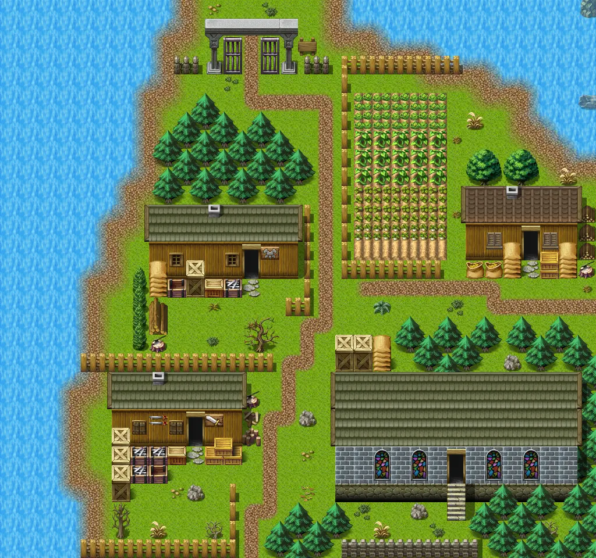

# Remgard0

| | |
|---|---|
| **Map ID** | `remgard0` |
| **Region** | In Remgard (settlement) |
| **Type** | Outdoors |
| **Size** | 32×30 tiles |
| **World map** | [World1](index.md) |
| **Introduced** | v0.7.0 or earlier |
| **NPCs** | 7 |
| **Quests** | 3 |

**Remgard0** is an outdoor map, in Remgard (settlement). It has 7 NPCs, and no enemies. Exits lead to Mountainlake13a, Mountainlake16, Remgard1, Remgard3 and 5 more.

## Map

<label class="lg"><input type="checkbox" data-t="spawn" checked><b>Red</b>&nbsp;Monsters / NPCs</label><label class="lg"><input type="checkbox" data-t="mapchange" checked><b>Blue</b>&nbsp;Exit to another map</label><label class="lg"><input type="checkbox" data-t="container" checked><b>Yellow</b>&nbsp;Container (click to see contents)</label><label class="lg"><input type="checkbox" data-t="sign" checked><b>Purple</b>&nbsp;Sign</label><label class="lg"><input type="checkbox" data-t="rest" checked><b>Green</b>&nbsp;Resting place</label><label class="lg"><input type="checkbox" data-t="key" checked><b>Orange dashed</b>&nbsp;Blocked until a quest step / item</label><label class="lg"><input type="checkbox" data-t="script"><b>Grey dotted</b>&nbsp;Scripted event</label><label class="lg"><input type="checkbox" data-t="replace"><b>White dotted</b>&nbsp;Changes during a quest</label><label class="lg"><input type="checkbox" data-t="pin" checked><b>Numbers</b>&nbsp;Numbered key points (see the key below the map)</label>

<a class="pin pin-exit" href="#key-1" style="left:43.750%;top:1.667%" title="Exit (north): to [Mountainlake13a](mountainlake13a.md)">1</a><a class="pin pin-exit" href="#key-1" style="left:79.688%;top:1.667%" title="Exit (north): to [Mountainlake13a](mountainlake13a.md)">1</a><a class="pin pin-exit" href="#key-2" style="left:98.438%;top:10.000%" title="Exit (east): to [Mountainlake16](mountainlake16.md)">2</a><a class="pin pin-exit" href="#key-3" style="left:98.438%;top:56.667%" title="Exit (east): to [Remgard1](remgard1.md)">3</a><a class="pin pin-exit" href="#key-4" style="left:42.188%;top:98.333%" title="Exit (south): to [Remgard3](remgard3.md)">4</a><a class="pin pin-exit" href="#key-5" style="left:42.188%;top:48.333%" title="Exit (door): to [Remgard armour](remgard_armour.md)">5</a><a class="pin pin-exit" href="#key-6" style="left:76.562%;top:85.000%" title="Exit (door): to [Remgard church](remgard_church.md)">6</a><a class="pin pin-exit" href="#key-7" style="left:89.062%;top:45.000%" title="Exit (door): to [Remgard farmer1](remgard_farmer1.md)">7</a><a class="pin pin-exit" href="#key-8" style="left:48.438%;top:41.667%" title="Exit (door): to [Remgard prison](remgard_prison.md)">8</a><a class="pin pin-exit" href="#key-8" style="left:48.438%;top:45.000%" title="Exit (door): to [Remgard prison](remgard_prison.md)">8</a><a class="pin pin-exit" href="#key-8" style="left:48.438%;top:48.333%" title="Exit (door): to [Remgard prison](remgard_prison.md)">8</a><a class="pin pin-exit" href="#key-8" style="left:50.000%;top:51.667%" title="Exit (door): to [Remgard prison](remgard_prison.md)">8</a><a class="pin pin-exit" href="#key-8" style="left:46.933%;top:53.137%" title="Exit (door): to [Remgard prison](remgard_prison.md)">8</a><a class="pin pin-exit" href="#key-8" style="left:45.370%;top:49.804%" title="Exit (door): to [Remgard prison](remgard_prison.md)">8</a><a class="pin pin-exit" href="#key-8" style="left:48.438%;top:55.000%" title="Exit (door): to [Remgard prison](remgard_prison.md)">8</a><a class="pin pin-exit" href="#key-8" style="left:43.750%;top:58.333%" title="Exit (door): to [Remgard prison](remgard_prison.md)">8</a><a class="pin pin-exit" href="#key-8" style="left:45.312%;top:61.667%" title="Exit (door): to [Remgard prison](remgard_prison.md)">8</a><a class="pin pin-exit" href="#key-8" style="left:45.312%;top:65.000%" title="Exit (door): to [Remgard prison](remgard_prison.md)">8</a><a class="pin pin-exit" href="#key-8" style="left:54.688%;top:55.000%" title="Exit (door): to [Remgard prison](remgard_prison.md)">8</a><a class="pin pin-exit" href="#key-8" style="left:57.812%;top:55.000%" title="Exit (door): to [Remgard prison](remgard_prison.md)">8</a><a class="pin pin-exit" href="#key-8" style="left:60.938%;top:55.000%" title="Exit (door): to [Remgard prison](remgard_prison.md)">8</a><a class="pin pin-exit" href="#key-8" style="left:51.768%;top:49.167%" title="Exit (door): to [Remgard prison](remgard_prison.md)">8</a><a class="pin pin-exit" href="#key-8" style="left:51.562%;top:55.000%" title="Exit (door): to [Remgard prison](remgard_prison.md)">8</a><a class="pin pin-exit" href="#key-8" style="left:51.562%;top:58.333%" title="Exit (door): to [Remgard prison](remgard_prison.md)">8</a><a class="pin pin-exit" href="#key-9" style="left:32.812%;top:78.333%" title="Exit (door): to [Remgard weapon](remgard_weapon.md)">9</a><a id="pin-npc-caeda" class="pin pin-npc" href="#key-10" style="left:60.938%;top:31.667%" title="[Caeda](../../monsters/caeda.md): 2 quests">10</a><a id="pin-npc-rg_villager1" class="pin pin-npc" href="#key-11" style="left:48.438%;top:78.333%" title="[Commoner](../../monsters/rg_villager1.md): NPC">11</a><a id="pin-npc-patrol_roaming" class="pin pin-npc" href="#key-12" style="left:54.688%;top:58.333%" title="[Feygard soldier](../../monsters/patrol_roaming.md): NPC">12</a><a id="pin-npc-patrol2_captain" class="pin pin-npc" href="#key-13" style="left:45.518%;top:55.834%" title="[Feygard soldier](../../monsters/patrol_roaming.md#v-patrol2_captain): NPC">13</a><a id="pin-npc-patrol2_roaming" class="pin pin-npc" href="#key-14" style="left:60.938%;top:51.667%" title="[Feygard soldier](../../monsters/patrol_roaming.md#v-patrol2_roaming): NPC">14</a><a id="pin-npc-ingus" class="pin pin-npc" href="#key-15" style="left:57.812%;top:58.333%" title="[Ingus](../../monsters/ingus.md): 1 quest">15</a><a id="pin-npc-taylin" class="pin pin-npc" href="#key-16" style="left:17.188%;top:75.000%" title="[Taylin](../../monsters/taylin.md): NPC">16</a><a class="pin pin-sign" href="#key-17" style="left:51.562%;top:8.333%" title="Sign: “Welcome to Lake Laeroth and the city of Remgard!”">17</a><a class="pin pin-script" href="#key-18" style="left:43.750%;top:5.000%" title="Quest trigger: Scripted event: advances the quest: hidden story flag “nondisplay_2” to stage 170 (“Been to Remgard”)">18</a><a class="pin pin-script" href="#key-19" style="left:58.018%;top:52.500%" title="Quest trigger: Scripted event: advances the quest: hidden story flag “brv_nondisplay” to stage 142 (“Confiscated bonemeals”) (+1 more quest(s))">19</a><a class="pin pin-key" href="#key-20" style="left:61.098%;top:57.954%" title="Blocked passage: Closed off once you reach this point in the quest: hidden story flag “brv_nondisplay” (stage 140: “Movement blocked by the Feygard patrol”)">20</a>

??? abstract "Key to the numbers on the map"

    | # | What | Details |
    |---|---|---|
    | 1 | Exit (north) | to [Mountainlake13a](mountainlake13a.md) |
    | 2 | Exit (east) | to [Mountainlake16](mountainlake16.md) |
    | 3 | Exit (east) | to [Remgard1](remgard1.md) |
    | 4 | Exit (south) | to [Remgard3](remgard3.md) |
    | 5 | Exit (door) | to [Remgard armour](remgard_armour.md) |
    | 6 | Exit (door) | to [Remgard church](remgard_church.md) |
    | 7 | Exit (door) | to [Remgard farmer1](remgard_farmer1.md) |
    | 8 | Exit (door) | to [Remgard prison](remgard_prison.md) |
    | 9 | Exit (door) | to [Remgard weapon](remgard_weapon.md) |
    | 10 | [Caeda](../monsters/caeda.md) | 2 quests |
    | 11 | [Commoner](../monsters/rg_villager1.md) | NPC |
    | 12 | [Feygard soldier](../monsters/patrol_roaming.md) | NPC |
    | 13 | [Feygard soldier](../monsters/patrol_roaming.md#v-patrol2_captain) | NPC |
    | 14 | [Feygard soldier](../monsters/patrol_roaming.md#v-patrol2_roaming) | NPC |
    | 15 | [Ingus](../monsters/ingus.md) | 1 quest |
    | 16 | [Taylin](../monsters/taylin.md) | NPC |
    | 17 | Sign | “Welcome to Lake Laeroth and the city of Remgard!” |
    | 18 | Quest trigger | Scripted event: advances the quest: hidden story flag “nondisplay_2” to stage 170 (“Been to Remgard”) |
    | 19 | Quest trigger | Scripted event: advances the quest: hidden story flag “brv_nondisplay” to stage 142 (“Confiscated bonemeals”) (+1 more quest(s)) |
    | 20 | Blocked passage | Closed off once you reach this point in the quest: hidden story flag “brv_nondisplay” (stage 140: “Movement blocked by the Feygard patrol”) |

Verified against v0.8.18 map data.

## Connections

| Direction | Leads to | Region there | Map # |
|---|---|---|---|
| North | [Mountainlake13a](mountainlake13a.md) | Remgard | 1 |
| East | [Mountainlake16](mountainlake16.md) | Remgard | 2 |
| East | [Remgard1](remgard1.md) | Remgard | 3 |
| South | [Remgard3](remgard3.md) | Remgard | 4 |
| Door | [Remgard armour](remgard_armour.md) | Remgard | 5 |
| Door | [Remgard church](remgard_church.md) | Remgard | 6 |
| Door | [Remgard farmer1](remgard_farmer1.md) | Remgard | 7 |
| Door | [Remgard prison](remgard_prison.md) | Remgard | 8 |
| Door | [Remgard weapon](remgard_weapon.md) | Remgard | 9 |

## NPCs

- [Caeda](../monsters/caeda.md) — quests: [A secret garden](../quests/secret_garden.md), [The roots of love](../quests/roots_love.md) (#10)
- [Commoner](../monsters/rg_villager1.md) (#11)
- [Feygard soldier](../monsters/patrol_roaming.md) (#12)
- [Feygard soldier](../monsters/patrol_roaming.md#v-patrol2_captain) (#13)
- [Feygard soldier](../monsters/patrol_roaming.md#v-patrol2_roaming) (#14)
- [Ingus](../monsters/ingus.md) — quests: [A difference of opinion](../quests/sisterfight.md) (#15)
- [Taylin](../monsters/taylin.md) (#16)

## Quests

- [A difference of opinion](../quests/sisterfight.md): [Ingus](../monsters/ingus.md) is involved
- [A secret garden](../quests/secret_garden.md): [Caeda](../monsters/caeda.md) is involved
- [The roots of love](../quests/roots_love.md): [Caeda](../monsters/caeda.md) is involved
- [brv_nondisplay (hidden flag)](../quests/brv_nondisplay.md): [Feygard soldier](../monsters/patrol_roaming.md#v-patrol2_captain) is involved; [Feygard soldier](../monsters/patrol_roaming.md#v-patrol2_roaming) is involved; [Feygard soldier](../monsters/patrol_roaming.md) is involved; blocked passage closes at stage 140; something on this map advances it; stepping on a trigger here sets stage 140; stepping on a trigger here sets stage 142
- [bwmfill_nondisplay (hidden flag)](../quests/bwmfill_nondisplay.md): something on this map advances it; stepping on a trigger here sets stage 40; stepping on a trigger here sets stage 41; stepping on a trigger here sets stage 42; stepping on a trigger here sets stage 43
- [Placeholder for hidden quest stages 2 (not displayed) (hidden flag)](../quests/nondisplay_2.md): something on this map advances it; stepping on a trigger here sets stage 170
- [stn_nondisplay (hidden flag)](../quests/stn_nondisplay.md): [Caeda](../monsters/caeda.md) is involved

## Points of interest

- **Sign** (#17): “Welcome to Lake Laeroth and the city of Remgard!”
- **Quest trigger** (#18): Scripted event: advances the quest: hidden story flag “nondisplay_2” to stage 170 (“Been to Remgard”)
- **Quest trigger** (#19): Scripted event: advances the quest: hidden story flag “brv_nondisplay” to stage 142 (“Confiscated bonemeals”) (+1 more quest(s))
- **Blocked passage** (#20): Closed off once you reach this point in the quest: hidden story flag “brv_nondisplay” (stage 140: “Movement blocked by the Feygard patrol”)

## Version history

| Version | Change |
|---|---|
| [v0.7.0](../versions/0.7.0.md) | Present in v0.7.0 (earliest release tracked) |
| [v0.7.1](../versions/0.7.1.md) | Map layout or objects changed |
| [v0.7.2](../versions/0.7.2.md) | Map layout or objects changed |
| [v0.7.11](../versions/0.7.11.md) | Map layout or objects changed |
| [v0.7.14](../versions/0.7.14.md) | Map layout or objects changed |
| [v0.8.11](../versions/0.8.11.md) | Map layout or objects changed |
| [v0.8.18](../versions/0.8.18.md) | Map layout or objects changed |

Verified against v0.8.18 and every earlier release back to v0.7.0 (game data compared release by release).

## Community notes

<small>Written by players, not generated from game data. **Observations**: what players notice in-game · **Lore**: the in-world story · **Trivia**: real-world facts, references, development history · **Theory / speculation**: unconfirmed ideas; may just be unfinished content</small>

### Observations

*No notes yet. Contributions are welcome: [add a note](https://github.com/asdfghjkl628/Andor-s-Trail-Wikiiii/new/main/notes/maps?filename=remgard0.md&value=%23%23%20Observations%0A%0A%3C%21--%20what%20players%20notice%20in-game%20--%3E%0A%0A%23%23%20Lore%0A%0A%3C%21--%20the%20in-world%20story%20--%3E%0A%0A%23%23%20Trivia%0A%0A%3C%21--%20real-world%20facts%2C%20references%2C%20development%20history%20--%3E%0A%0A%23%23%20Theory%20/%20speculation%0A%0A%3C%21--%20unconfirmed%20ideas%3B%20may%20just%20be%20unfinished%20content%20--%3E%0A).*

### Lore

*No notes yet. Contributions are welcome: [add a note](https://github.com/asdfghjkl628/Andor-s-Trail-Wikiiii/new/main/notes/maps?filename=remgard0.md&value=%23%23%20Observations%0A%0A%3C%21--%20what%20players%20notice%20in-game%20--%3E%0A%0A%23%23%20Lore%0A%0A%3C%21--%20the%20in-world%20story%20--%3E%0A%0A%23%23%20Trivia%0A%0A%3C%21--%20real-world%20facts%2C%20references%2C%20development%20history%20--%3E%0A%0A%23%23%20Theory%20/%20speculation%0A%0A%3C%21--%20unconfirmed%20ideas%3B%20may%20just%20be%20unfinished%20content%20--%3E%0A).*

### Trivia

*No notes yet. Contributions are welcome: [add a note](https://github.com/asdfghjkl628/Andor-s-Trail-Wikiiii/new/main/notes/maps?filename=remgard0.md&value=%23%23%20Observations%0A%0A%3C%21--%20what%20players%20notice%20in-game%20--%3E%0A%0A%23%23%20Lore%0A%0A%3C%21--%20the%20in-world%20story%20--%3E%0A%0A%23%23%20Trivia%0A%0A%3C%21--%20real-world%20facts%2C%20references%2C%20development%20history%20--%3E%0A%0A%23%23%20Theory%20/%20speculation%0A%0A%3C%21--%20unconfirmed%20ideas%3B%20may%20just%20be%20unfinished%20content%20--%3E%0A).*

### Theory / speculation

*No notes yet. Contributions are welcome: [add a note](https://github.com/asdfghjkl628/Andor-s-Trail-Wikiiii/new/main/notes/maps?filename=remgard0.md&value=%23%23%20Observations%0A%0A%3C%21--%20what%20players%20notice%20in-game%20--%3E%0A%0A%23%23%20Lore%0A%0A%3C%21--%20the%20in-world%20story%20--%3E%0A%0A%23%23%20Trivia%0A%0A%3C%21--%20real-world%20facts%2C%20references%2C%20development%20history%20--%3E%0A%0A%23%23%20Theory%20/%20speculation%0A%0A%3C%21--%20unconfirmed%20ideas%3B%20may%20just%20be%20unfinished%20content%20--%3E%0A).*

??? info "Technical information"

    | | |
    |---|---|
    | Map ID | `remgard0` |
    | File | `res/xml/remgard0.tmx` |
    | Size | 32×30 tiles (1024×960 px) |
    | outdoors property | 1 |
    | Layers drawn | ground, objects, above |
    | Tilesets | map_bed_1, map_border_1, map_bridge_1, map_bridge_2, map_broken_1, map_cavewall_1, map_cavewall_2, map_cavewall_3, map_cavewall_4, map_chair_table_1, map_chair_table_2, map_crate_1, map_cupboard_1, map_curtain_1, map_entrance_1, map_entrance_2, map_fence_1, map_fence_2, map_fence_3, map_fence_4, map_ground_1, map_ground_2, map_ground_3, map_ground_4, map_ground_5, map_ground_6, map_ground_7, map_ground_8, map_guynmart, map_house_1, map_house_2, map_indoor_1, map_indoor_2, map_kitchen_1, map_outdoor_1, map_pillar_1, map_pillar_2, map_plant_1, map_plant_2, map_rock_1, map_rock_2, map_roof_1, map_roof_2, map_roof_3, map_shop_1, map_sign_ladder_1, map_table_1, map_trail_1, map_transition_1, map_transition_2, map_transition_3, map_transition_4, map_transition_5, map_tree_1, map_tree_2, map_wall_1, map_wall_2, map_wall_3, map_wall_4, map_window_1, map_window_2 |
    | Map objects | mapchange: 25, spawn: 7, script: 2, sign: 1, key: 1 |
    | World map position | segment `world1`, x 640, y 76 |

<small>Data from v0.8.18</small>
