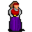

# Remgard1

36×30 tiles · outdoors · part of [World1](index.md)

<label class="lg"><input type="checkbox" data-t="spawn" checked><b>Red</b>&nbsp;Monsters / NPCs</label><label class="lg"><input type="checkbox" data-t="mapchange" checked><b>Blue</b>&nbsp;Exit to another map</label><label class="lg"><input type="checkbox" data-t="container" checked><b>Yellow</b>&nbsp;Container (click to see contents)</label><label class="lg"><input type="checkbox" data-t="sign" checked><b>Purple</b>&nbsp;Sign</label><label class="lg"><input type="checkbox" data-t="rest" checked><b>Green</b>&nbsp;Resting place</label><label class="lg"><input type="checkbox" data-t="key" checked><b>Orange dashed</b>&nbsp;Blocked until a quest step / item</label><label class="lg"><input type="checkbox" data-t="script"><b>Grey dotted</b>&nbsp;Scripted event</label><label class="lg"><input type="checkbox" data-t="replace"><b>White dotted</b>&nbsp;Changes during a quest</label>

## Exits

- [Mountainlake16](mountainlake16.md)
- [Mountainlake17](mountainlake17.md)
- [Remgard0](remgard0.md)
- [Remgard2](remgard2.md)
- [Remgard2a](remgard2a.md)
- [Remgard clothes](remgard_clothes.md)
- [Remgard farmer2](remgard_farmer2.md)
- [Remgard tavern0](remgard_tavern0.md)
- [Remgard villager1](remgard_villager1.md)

## Monsters & NPCs here

| Name | HP |
|---|---|
| [Commoner](../monsters/rg_villager4.md) | 0 |
| [Fish](../monsters/ll2_fish2.md) | 0 |
| [Farmer](../monsters/remgard_farmer1.md) | 0 |
| [Fish](../monsters/ll2_fish3.md) | 0 |
| [Fish](../monsters/ll2_fish6.md) | 0 |
| [Jellyfish](../monsters/ll2_jelly1.md) | 0 |
| [Fish](../monsters/ll2_fish5.md) | 0 |
| [Fish](../monsters/ll2_fish4.md) | 0 |
| [Turtle](../monsters/ll2_turtle1.md) | 0 |
| [Squid](../monsters/ll2_squid1.md) | 0 |
| [Commoner](../monsters/rg_villager2.md) | 0 |
| [Fish](../monsters/ll2_fish1.md) | 0 |
| [Chael](../monsters/chael.md) | 0 |
| [Eel](../monsters/ll2_watersnake1.md) | 0 |

<small>Map ID: `remgard1` · Data from v0.8.18</small>
