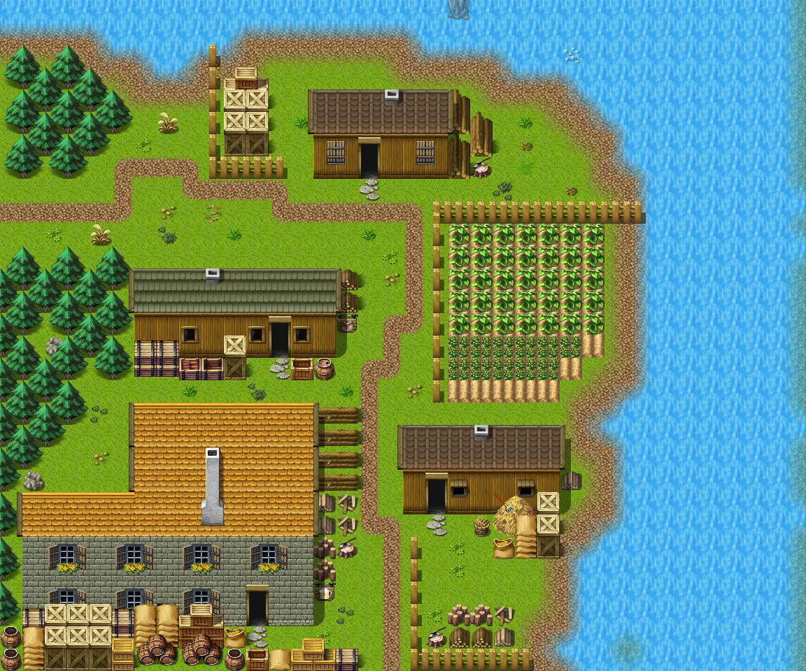

# Remgard1

| | |
|---|---|
| **Map ID** | `remgard1` |
| **Region** | In Remgard (settlement) |
| **Type** | Outdoors |
| **Size** | 36×30 tiles |
| **World map** | [World1](index.md) |
| **Introduced** | v0.7.0 or earlier |
| **NPCs** | 4 |
| **Enemy types** | 10 |
| **Quests** | 0 |

**Remgard1** is an outdoor map, in Remgard (settlement). It has 4 NPCs and 10 kinds of enemy. Exits lead to Mountainlake16, Mountainlake17, Remgard2, Remgard2a and 5 more.

## Map

<label class="lg"><input type="checkbox" data-t="spawn" checked><b>Red</b>&nbsp;Monsters / NPCs</label><label class="lg"><input type="checkbox" data-t="mapchange" checked><b>Blue</b>&nbsp;Exit to another map</label><label class="lg"><input type="checkbox" data-t="container" checked><b>Yellow</b>&nbsp;Container (click to see contents)</label><label class="lg"><input type="checkbox" data-t="sign" checked><b>Purple</b>&nbsp;Sign</label><label class="lg"><input type="checkbox" data-t="rest" checked><b>Green</b>&nbsp;Resting place</label><label class="lg"><input type="checkbox" data-t="key" checked><b>Orange dashed</b>&nbsp;Blocked until a quest step / item</label><label class="lg"><input type="checkbox" data-t="script"><b>Grey dotted</b>&nbsp;Scripted event</label><label class="lg"><input type="checkbox" data-t="replace"><b>White dotted</b>&nbsp;Changes during a quest</label><label class="lg"><input type="checkbox" data-t="pin" checked><b>Numbers</b>&nbsp;Numbered key points (see the key below the map)</label>

<a class="pin pin-exit" href="#key-1" style="left:20.833%;top:1.667%" title="Exit (north): to [Mountainlake16](../mountainlake16.md)">1</a><a class="pin pin-exit" href="#key-2" style="left:77.778%;top:1.667%" title="Exit (north): to [Mountainlake17](../mountainlake17.md)">2</a><a class="pin pin-exit" href="#key-3" style="left:47.222%;top:98.333%" title="Exit (south): to [Remgard2](../remgard2.md)">3</a><a class="pin pin-exit" href="#key-4" style="left:88.889%;top:98.333%" title="Exit (south): to [Remgard2a](../remgard2a.md)">4</a><a class="pin pin-exit" href="#key-5" style="left:1.389%;top:33.333%" title="Exit (west): to [Remgard0](../remgard0.md)">5</a><a class="pin pin-exit" href="#key-6" style="left:34.722%;top:51.667%" title="Exit (door): to [Remgard clothes](../remgard_clothes.md)">6</a><a class="pin pin-exit" href="#key-7" style="left:54.167%;top:75.000%" title="Exit (door): to [Remgard farmer2](../remgard_farmer2.md)">7</a><a class="pin pin-exit" href="#key-8" style="left:31.944%;top:91.667%" title="Exit (door): to [Remgard tavern0](../remgard_tavern0.md)">8</a><a class="pin pin-exit" href="#key-9" style="left:45.833%;top:25.000%" title="Exit (door): to [Remgard villager1](../remgard_villager1.md)">9</a><a class="pin pin-npc" href="#key-10" style="left:43.056%;top:85.000%" title="[Chael](../../monsters/chael.md): NPC">10</a><a class="pin pin-npc" href="#key-11" style="left:31.944%;top:28.333%" title="[Commoner](../../monsters/rg_villager2.md): NPC">11</a><a class="pin pin-npc" href="#key-12" style="left:43.056%;top:38.333%" title="[Commoner](../../monsters/rg_villager4.md): NPC">12</a><a class="pin pin-npc" href="#key-13" style="left:68.056%;top:55.000%" title="[Farmer](../../monsters/remgard_farmer1.md): NPC">13</a><a class="pin pin-script" href="#key-14" style="left:31.944%;top:95.000%" title="Quest trigger: Scripted event: advances the quest: hidden story flag “quest_burhczyd_nd” to stage 57 (“57=show oven in Remgard”)">14</a>

??? abstract "Key to the numbers on the map"

    | # | What | Details |
    |---|---|---|
    | 1 | Exit (north) | to [Mountainlake16](../mountainlake16.md) |
    | 2 | Exit (north) | to [Mountainlake17](../mountainlake17.md) |
    | 3 | Exit (south) | to [Remgard2](../remgard2.md) |
    | 4 | Exit (south) | to [Remgard2a](../remgard2a.md) |
    | 5 | Exit (west) | to [Remgard0](../remgard0.md) |
    | 6 | Exit (door) | to [Remgard clothes](../remgard_clothes.md) |
    | 7 | Exit (door) | to [Remgard farmer2](../remgard_farmer2.md) |
    | 8 | Exit (door) | to [Remgard tavern0](../remgard_tavern0.md) |
    | 9 | Exit (door) | to [Remgard villager1](../remgard_villager1.md) |
    | 10 | [Chael](../monsters/chael.md) | NPC |
    | 11 | [Commoner](../monsters/rg_villager2.md) | NPC |
    | 12 | [Commoner](../monsters/rg_villager4.md) | NPC |
    | 13 | [Farmer](../monsters/remgard_farmer1.md) | NPC |
    | 14 | Quest trigger | Scripted event: advances the quest: hidden story flag “quest_burhczyd_nd” to stage 57 (“57=show oven in Remgard”) |

Verified against v0.8.18 map data.

## Connections

| Direction | Leads to | Region there | Map # |
|---|---|---|---|
| North | [Mountainlake16](mountainlake16.md) | Remgard | 1 |
| North | [Mountainlake17](mountainlake17.md) | Remgard | 2 |
| South | [Remgard2](remgard2.md) | Remgard | 3 |
| South | [Remgard2a](remgard2a.md) | Remgard | 4 |
| West | [Remgard0](remgard0.md) | Remgard | 5 |
| Door | [Remgard clothes](remgard_clothes.md) | Remgard | 6 |
| Door | [Remgard farmer2](remgard_farmer2.md) | Remgard | 7 |
| Door | [Remgard tavern0](remgard_tavern0.md) | Remgard | 8 |
| Door | [Remgard villager1](remgard_villager1.md) | Remgard | 9 |

## NPCs

- [Chael](../monsters/chael.md) (#10)
- [Commoner](../monsters/rg_villager2.md) (#11)
- [Commoner](../monsters/rg_villager4.md) (#12)
- [Farmer](../monsters/remgard_farmer1.md) (#13)

## Enemies

| Enemy | HP | Damage | Up to | Notes |
|---|---|---|---|---|
| [Jellyfish](../monsters/ll2_jelly1.md) | 0 | 0–0 | 4 | shares spawn with Eel, Fish, Squid, Turtle |
| [Fish](../monsters/ll2_fish3.md) | 0 | 0–0 | 4 | shares spawn with Eel, Fish, Jellyfish, Squid, Turtle |
| [Fish](../monsters/ll2_fish4.md) | 0 | 0–0 | 4 | shares spawn with Eel, Fish, Jellyfish, Squid, Turtle |
| [Eel](../monsters/ll2_watersnake1.md) | 0 | 0–0 | 4 | shares spawn with Fish, Jellyfish, Squid, Turtle |
| [Fish](../monsters/ll2_fish1.md) | 0 | 0–0 | 4 | shares spawn with Eel, Fish, Jellyfish, Squid, Turtle |
| [Fish](../monsters/ll2_fish5.md) | 0 | 0–0 | 4 | shares spawn with Eel, Fish, Jellyfish, Squid, Turtle |
| [Fish](../monsters/ll2_fish2.md) | 0 | 0–0 | 4 | shares spawn with Eel, Fish, Jellyfish, Squid, Turtle |
| [Fish](../monsters/ll2_fish6.md) | 0 | 0–0 | 4 | shares spawn with Eel, Fish, Jellyfish, Squid, Turtle |
| [Turtle](../monsters/ll2_turtle1.md) | 0 | 0–0 | 4 | shares spawn with Eel, Fish, Jellyfish, Squid |
| [Squid](../monsters/ll2_squid1.md) | 0 | 0–0 | 4 | shares spawn with Eel, Fish, Jellyfish, Turtle |

<small>“Up to” is the most that can be alive at once from the spawn areas on this map.</small>

## Quests

- [Young merchant Non-displayed (hidden flag)](../quests/quest_burhczyd_nd.md): something on this map advances it; stepping on a trigger here sets stage 57

## Points of interest

- **Quest trigger** (#14): Scripted event: advances the quest: hidden story flag “quest_burhczyd_nd” to stage 57 (“57=show oven in Remgard”)

## Version history

| Version | Change |
|---|---|
| [v0.7.0](../versions/0.7.0.md) | Present in v0.7.0 (earliest release tracked) |
| [v0.7.1](../versions/0.7.1.md) | map layout or objects changed |
| [v0.7.2](../versions/0.7.2.md) | map layout or objects changed |
| [v0.7.11](../versions/0.7.11.md) | map layout or objects changed |
| [v0.8.2](../versions/0.8.2.md) | map layout or objects changed |
| [v0.8.11](../versions/0.8.11.md) | map layout or objects changed |
| [v0.8.18](../versions/0.8.18.md) | map layout or objects changed |

Verified against v0.8.18 and every earlier release back to v0.7.0 (game data compared release by release).

## Community notes

<small>Written by players, not generated from game data. **Observations**: what players notice in-game · **Lore**: the in-world story · **Trivia**: real-world facts, references, development history · **Theory / speculation**: unconfirmed ideas; may just be unfinished content</small>

### Observations

*Nothing here yet. Know something? [Add it](https://github.com/asdfghjkl628/Andor-s-Trail-Wikiiii/new/main/notes/maps?filename=remgard1.md&value=%23%23%20Observations%0A%0A%3C%21--%20what%20players%20notice%20in-game%20--%3E%0A%0A%23%23%20Lore%0A%0A%3C%21--%20the%20in-world%20story%20--%3E%0A%0A%23%23%20Trivia%0A%0A%3C%21--%20real-world%20facts%2C%20references%2C%20development%20history%20--%3E%0A%0A%23%23%20Theory%20/%20speculation%0A%0A%3C%21--%20unconfirmed%20ideas%3B%20may%20just%20be%20unfinished%20content%20--%3E%0A).*

### Lore

*Nothing here yet. Know something? [Add it](https://github.com/asdfghjkl628/Andor-s-Trail-Wikiiii/new/main/notes/maps?filename=remgard1.md&value=%23%23%20Observations%0A%0A%3C%21--%20what%20players%20notice%20in-game%20--%3E%0A%0A%23%23%20Lore%0A%0A%3C%21--%20the%20in-world%20story%20--%3E%0A%0A%23%23%20Trivia%0A%0A%3C%21--%20real-world%20facts%2C%20references%2C%20development%20history%20--%3E%0A%0A%23%23%20Theory%20/%20speculation%0A%0A%3C%21--%20unconfirmed%20ideas%3B%20may%20just%20be%20unfinished%20content%20--%3E%0A).*

### Trivia

*Nothing here yet. Know something? [Add it](https://github.com/asdfghjkl628/Andor-s-Trail-Wikiiii/new/main/notes/maps?filename=remgard1.md&value=%23%23%20Observations%0A%0A%3C%21--%20what%20players%20notice%20in-game%20--%3E%0A%0A%23%23%20Lore%0A%0A%3C%21--%20the%20in-world%20story%20--%3E%0A%0A%23%23%20Trivia%0A%0A%3C%21--%20real-world%20facts%2C%20references%2C%20development%20history%20--%3E%0A%0A%23%23%20Theory%20/%20speculation%0A%0A%3C%21--%20unconfirmed%20ideas%3B%20may%20just%20be%20unfinished%20content%20--%3E%0A).*

### Theory / speculation

*Nothing here yet. Know something? [Add it](https://github.com/asdfghjkl628/Andor-s-Trail-Wikiiii/new/main/notes/maps?filename=remgard1.md&value=%23%23%20Observations%0A%0A%3C%21--%20what%20players%20notice%20in-game%20--%3E%0A%0A%23%23%20Lore%0A%0A%3C%21--%20the%20in-world%20story%20--%3E%0A%0A%23%23%20Trivia%0A%0A%3C%21--%20real-world%20facts%2C%20references%2C%20development%20history%20--%3E%0A%0A%23%23%20Theory%20/%20speculation%0A%0A%3C%21--%20unconfirmed%20ideas%3B%20may%20just%20be%20unfinished%20content%20--%3E%0A).*

??? info "Technical information"

    | | |
    |---|---|
    | Map ID | `remgard1` |
    | File | `res/xml/remgard1.tmx` |
    | Size | 36×30 tiles (1152×960 px) |
    | outdoors property | 1 |
    | Layers drawn | ground, objects, above |
    | Tilesets | map_bed_1, map_border_1, map_bridge_1, map_bridge_2, map_broken_1, map_cavewall_1, map_cavewall_2, map_cavewall_3, map_cavewall_4, map_chair_table_1, map_chair_table_2, map_crate_1, map_cupboard_1, map_curtain_1, map_entrance_1, map_entrance_2, map_fence_1, map_fence_2, map_fence_3, map_fence_4, map_ground_1, map_ground_2, map_ground_3, map_ground_4, map_ground_5, map_ground_6, map_ground_7, map_ground_8, map_guynmart, map_house_1, map_house_2, map_indoor_1, map_indoor_2, map_kitchen_1, map_outdoor_1, map_pillar_1, map_pillar_2, map_plant_1, map_plant_2, map_rock_1, map_rock_2, map_roof_1, map_roof_2, map_roof_3, map_shop_1, map_sign_ladder_1, map_table_1, map_trail_1, map_transition_1, map_transition_2, map_transition_3, map_transition_4, map_transition_5, map_tree_1, map_tree_2, map_wall_1, map_wall_2, map_wall_3, map_wall_4, map_window_1, map_window_2 |
    | Map objects | mapchange: 9, spawn: 5, script: 1 |
    | World map position | segment `world1`, x 673, y 83 |

<small>Data from v0.8.18</small>
