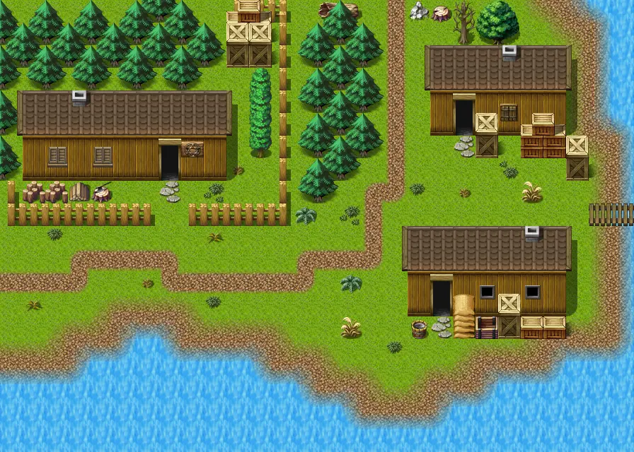

# Remgard 2

| | |
|---|---|
| **Map ID** | `remgard2` |
| **Region** | In Remgard (settlement) |
| **Type** | Outdoors |
| **Size** | 28×20 tiles |
| **World map** | [World 1](index.md) |
| **Introduced** | v0.7.0 or earlier |
| **NPCs** | 2 |
| **Quests** | 0 |

**Remgard 2** is an outdoor map, in Remgard (settlement). It has 2 NPCs, and no enemies. Exits lead to Remgard 1, Remgard 2a, Remgard 3, Remgard school and 2 more.

## Map

<label class="lg"><input type="checkbox" data-t="spawn" checked><b>Red</b>&nbsp;Monsters / NPCs</label><label class="lg"><input type="checkbox" data-t="mapchange" checked><b>Blue</b>&nbsp;Exit to another map</label><label class="lg"><input type="checkbox" data-t="container" checked><b>Yellow</b>&nbsp;Container (click to see contents)</label><label class="lg"><input type="checkbox" data-t="sign" checked><b>Purple</b>&nbsp;Sign</label><label class="lg"><input type="checkbox" data-t="rest" checked><b>Green</b>&nbsp;Resting place</label><label class="lg"><input type="checkbox" data-t="key" checked><b>Orange dashed</b>&nbsp;Blocked until a quest step / item</label><label class="lg"><input type="checkbox" data-t="script"><b>Grey dotted</b>&nbsp;Scripted event</label><label class="lg"><input type="checkbox" data-t="replace"><b>White dotted</b>&nbsp;Changes during a quest</label><label class="lg"><input type="checkbox" data-t="pin" checked><b>Numbers</b>&nbsp;Numbered key points (see the key below the map)</label>

<a class="pin pin-exit" href="#key-1" style="left:60.714%;top:2.500%" title="Exit (north): to [Remgard 1](remgard1.md)">1</a><a class="pin pin-exit" href="#key-2" style="left:98.214%;top:47.500%" title="Exit (east): to [Remgard 2a](remgard2a.md)">2</a><a class="pin pin-exit" href="#key-3" style="left:1.786%;top:65.000%" title="Exit (west): to [Remgard 3](remgard3.md)">3</a><a class="pin pin-exit" href="#key-4" style="left:26.786%;top:37.500%" title="Exit (door): to [Remgard school](remgard_school.md)">4</a><a class="pin pin-exit" href="#key-5" style="left:73.214%;top:27.500%" title="Exit (door): to [Remgard villager 2](remgard_villager2.md)">5</a><a class="pin pin-exit" href="#key-6" style="left:69.643%;top:67.500%" title="Exit (door): to [Remgard villager 3](remgard_villager3.md)">6</a><a id="pin-npc-rg_villager5" class="pin pin-npc" href="#key-7" style="left:19.643%;top:57.500%" title="[Commoner](../../monsters/rg_villager1.md#v-rg_villager5): NPC">7</a><a id="pin-npc-rg_villager6" class="pin pin-npc" href="#key-8" style="left:66.071%;top:22.500%" title="[Commoner](../../monsters/rg_villager1.md#v-rg_villager6): NPC">8</a><a class="pin pin-script" href="#key-9" style="left:94.643%;top:47.500%" title="Quest trigger: Scripted event: advances the quest: hidden story flag “ll2_nd” to stage 11 (“11=Boat anchored in Remgard”)">9</a>

??? abstract "Key to the numbers on the map"

    | # | What | Details |
    |---|---|---|
    | 1 | Exit (north) | to [Remgard 1](remgard1.md) |
    | 2 | Exit (east) | to [Remgard 2a](remgard2a.md) |
    | 3 | Exit (west) | to [Remgard 3](remgard3.md) |
    | 4 | Exit (door) | to [Remgard school](remgard_school.md) |
    | 5 | Exit (door) | to [Remgard villager 2](remgard_villager2.md) |
    | 6 | Exit (door) | to [Remgard villager 3](remgard_villager3.md) |
    | 7 | [Commoner](../monsters/rg_villager1.md#v-rg_villager5) | NPC |
    | 8 | [Commoner](../monsters/rg_villager1.md#v-rg_villager6) | NPC |
    | 9 | Quest trigger | Scripted event: advances the quest: hidden story flag “ll2_nd” to stage 11 (“11=Boat anchored in Remgard”) |

Verified against v0.8.18 map data.

## Connections

| Direction | Leads to | Region there | Map # |
|---|---|---|---|
| North | [Remgard 1](remgard1.md) | Remgard | 1 |
| East | [Remgard 2a](remgard2a.md) | Remgard | 2 |
| West | [Remgard 3](remgard3.md) | Remgard | 3 |
| Door | [Remgard school](remgard_school.md) | Remgard | 4 |
| Door | [Remgard villager 2](remgard_villager2.md) | Remgard | 5 |
| Door | [Remgard villager 3](remgard_villager3.md) | Remgard | 6 |

## NPCs

- [Commoner](../monsters/rg_villager1.md#v-rg_villager5) (#7)
- [Commoner](../monsters/rg_villager1.md#v-rg_villager6) (#8)

## Quests

- [Lake Laeroth story flags (hidden flag)](../quests/ll2_nd.md): something on this map advances it; stepping on a trigger here sets stage 11

## Points of interest

- **Quest trigger** (#9): Scripted event: advances the quest: hidden story flag “ll2_nd” to stage 11 (“11=Boat anchored in Remgard”)

## Version history

| Version | Change |
|---|---|
| [v0.7.0](../versions/0.7.0.md) | Present in v0.7.0 (earliest release tracked) |
| [v0.7.1](../versions/0.7.1.md) | Map layout or objects changed |
| [v0.7.2](../versions/0.7.2.md) | Map layout or objects changed |
| [v0.8.11](../versions/0.8.11.md) | Map layout or objects changed |
| [v0.8.18](../versions/0.8.18.md) | Map layout or objects changed |

Verified against v0.8.18 and every earlier release back to v0.7.0 (game data compared release by release).

## Community notes

<small>Written by players, not generated from game data. **Observations**: what players notice in-game · **Lore**: the in-world story · **Trivia**: real-world facts, references, development history · **Theory / speculation**: unconfirmed ideas; may just be unfinished content</small>

### Observations

*No notes yet. Contributions are welcome: [add a note](https://github.com/asdfghjkl628/Andor-s-Trail-Wikiiii/new/main/notes/maps?filename=remgard2.md&value=%23%23%20Observations%0A%0A%3C%21--%20what%20players%20notice%20in-game%20--%3E%0A%0A%23%23%20Lore%0A%0A%3C%21--%20the%20in-world%20story%20--%3E%0A%0A%23%23%20Trivia%0A%0A%3C%21--%20real-world%20facts%2C%20references%2C%20development%20history%20--%3E%0A%0A%23%23%20Theory%20/%20speculation%0A%0A%3C%21--%20unconfirmed%20ideas%3B%20may%20just%20be%20unfinished%20content%20--%3E%0A).*

### Lore

*No notes yet. Contributions are welcome: [add a note](https://github.com/asdfghjkl628/Andor-s-Trail-Wikiiii/new/main/notes/maps?filename=remgard2.md&value=%23%23%20Observations%0A%0A%3C%21--%20what%20players%20notice%20in-game%20--%3E%0A%0A%23%23%20Lore%0A%0A%3C%21--%20the%20in-world%20story%20--%3E%0A%0A%23%23%20Trivia%0A%0A%3C%21--%20real-world%20facts%2C%20references%2C%20development%20history%20--%3E%0A%0A%23%23%20Theory%20/%20speculation%0A%0A%3C%21--%20unconfirmed%20ideas%3B%20may%20just%20be%20unfinished%20content%20--%3E%0A).*

### Trivia

*No notes yet. Contributions are welcome: [add a note](https://github.com/asdfghjkl628/Andor-s-Trail-Wikiiii/new/main/notes/maps?filename=remgard2.md&value=%23%23%20Observations%0A%0A%3C%21--%20what%20players%20notice%20in-game%20--%3E%0A%0A%23%23%20Lore%0A%0A%3C%21--%20the%20in-world%20story%20--%3E%0A%0A%23%23%20Trivia%0A%0A%3C%21--%20real-world%20facts%2C%20references%2C%20development%20history%20--%3E%0A%0A%23%23%20Theory%20/%20speculation%0A%0A%3C%21--%20unconfirmed%20ideas%3B%20may%20just%20be%20unfinished%20content%20--%3E%0A).*

### Theory / speculation

*No notes yet. Contributions are welcome: [add a note](https://github.com/asdfghjkl628/Andor-s-Trail-Wikiiii/new/main/notes/maps?filename=remgard2.md&value=%23%23%20Observations%0A%0A%3C%21--%20what%20players%20notice%20in-game%20--%3E%0A%0A%23%23%20Lore%0A%0A%3C%21--%20the%20in-world%20story%20--%3E%0A%0A%23%23%20Trivia%0A%0A%3C%21--%20real-world%20facts%2C%20references%2C%20development%20history%20--%3E%0A%0A%23%23%20Theory%20/%20speculation%0A%0A%3C%21--%20unconfirmed%20ideas%3B%20may%20just%20be%20unfinished%20content%20--%3E%0A).*

??? info "Technical information"

    | | |
    |---|---|
    | Map ID | `remgard2` |
    | File | `res/xml/remgard2.tmx` |
    | Size | 28×20 tiles (896×640 px) |
    | outdoors property | 1 |
    | Layers drawn | ground, objects, above |
    | Tilesets | map_bed_1, map_border_1, map_bridge_1, map_bridge_2, map_broken_1, map_cavewall_1, map_cavewall_2, map_cavewall_3, map_cavewall_4, map_chair_table_1, map_chair_table_2, map_crate_1, map_cupboard_1, map_curtain_1, map_entrance_1, map_entrance_2, map_fence_1, map_fence_2, map_fence_3, map_fence_4, map_ground_1, map_ground_2, map_ground_3, map_ground_4, map_ground_5, map_ground_6, map_ground_7, map_ground_8, map_house_1, map_house_2, map_indoor_1, map_indoor_2, map_kitchen_1, map_outdoor_1, map_pillar_1, map_pillar_2, map_plant_1, map_plant_2, map_rock_1, map_rock_2, map_roof_1, map_roof_2, map_roof_3, map_shop_1, map_sign_ladder_1, map_table_1, map_trail_1, map_transition_1, map_transition_2, map_transition_3, map_transition_4, map_transition_5, map_tree_1, map_tree_2, map_wall_1, map_wall_2, map_wall_3, map_wall_4, map_window_1, map_window_2 |
    | Map objects | mapchange: 6, spawn: 2, script: 1 |
    | World map position | segment `world1`, x 673, y 114 |

<small>Data from v0.8.18</small>
