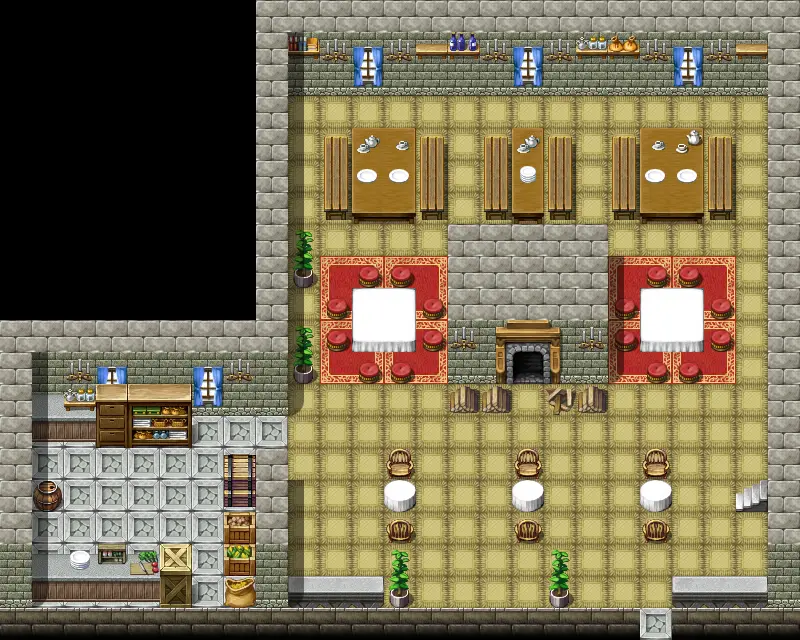

# Remgard tavern0

25×20 tiles

<label class="lg lg-spawn"><input type="checkbox" data-t="spawn" checked> Monsters / NPCs</label><label class="lg lg-mapchange"><input type="checkbox" data-t="mapchange" checked> Exit to another map</label><label class="lg lg-container"><input type="checkbox" data-t="container" checked> Container</label><label class="lg lg-sign"><input type="checkbox" data-t="sign" checked> Sign</label><label class="lg lg-rest"><input type="checkbox" data-t="rest" checked> Resting place</label><label class="lg lg-key"><input type="checkbox" data-t="key" checked> Blocked / needs key or quest</label><label class="lg lg-script"><input type="checkbox" data-t="script"> Scripted event</label><label class="lg lg-replace"><input type="checkbox" data-t="replace"> Changes after a quest</label>

## Exits

- [Remgard1](remgard1.md)
- [Remgard tavern1](remgard_tavern1.md)

## Monsters & NPCs here

| Name | HP |
|---|---|
| [Krell](../monsters/krell.md) | 0 |
| [Eraepsekahs](../monsters/eraepsekahs.md) | 0 |
| [Knight of Elythom](../monsters/elythom_kn2.md) | 0 |
| [Leofric](../monsters/leofric_remgard.md) | 0 |
| [Tavern guest](../monsters/remgard_d2.md) | 0 |
| [Knight of Elythom](../monsters/burhczyd7e.md) | 0 |
| [Thyrope Splathershed](../monsters/ll2_mapmaker.md) | 0 |
| [Knight of Elythom](../monsters/elythom_kn1.md) | 0 |
| [Burhczyd](../monsters/burhczyd7.md) | 0 |
| [Tavern guest](../monsters/remgard_d1.md) | 0 |
| [Arghes](../monsters/arghes.md) | 0 |
| [Kendelow](../monsters/kendelow.md) | 0 |

<small>Map ID: `remgard_tavern0` · Data from v0.8.18</small>
