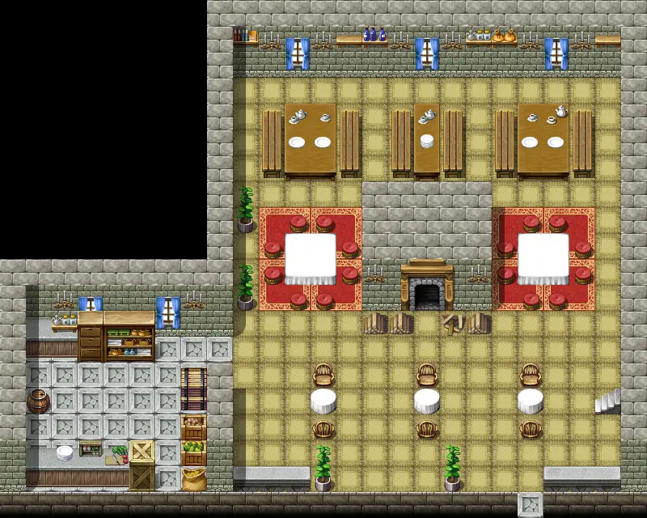

# Remgard tavern0

| | |
|---|---|
| **Map ID** | `remgard_tavern0` |
| **Region** | In Remgard (settlement) |
| **Type** | Indoors / underground |
| **Size** | 25×20 tiles |
| **Introduced** | v0.7.0 or earlier |
| **NPCs** | 12 |
| **Quests** | 3 |

**Remgard tavern0** is an indoor map, in Remgard (settlement). It has 12 NPCs, and no enemies. Exits lead to Remgard tavern1, Remgard1.

## Map

<label class="lg"><input type="checkbox" data-t="spawn" checked><b>Red</b>&nbsp;Monsters / NPCs</label><label class="lg"><input type="checkbox" data-t="mapchange" checked><b>Blue</b>&nbsp;Exit to another map</label><label class="lg"><input type="checkbox" data-t="container" checked><b>Yellow</b>&nbsp;Container (click to see contents)</label><label class="lg"><input type="checkbox" data-t="sign" checked><b>Purple</b>&nbsp;Sign</label><label class="lg"><input type="checkbox" data-t="rest" checked><b>Green</b>&nbsp;Resting place</label><label class="lg"><input type="checkbox" data-t="key" checked><b>Orange dashed</b>&nbsp;Blocked until a quest step / item</label><label class="lg"><input type="checkbox" data-t="script"><b>Grey dotted</b>&nbsp;Scripted event</label><label class="lg"><input type="checkbox" data-t="replace"><b>White dotted</b>&nbsp;Changes during a quest</label><label class="lg"><input type="checkbox" data-t="pin" checked><b>Numbers</b>&nbsp;Numbered key points (see the key below the map)</label>

<a class="pin pin-exit" href="#key-1" style="left:94.000%;top:77.500%" title="Exit (east): to [Remgard tavern1](../remgard_tavern1.md)">1</a><a class="pin pin-exit" href="#key-2" style="left:82.000%;top:97.500%" title="Exit (south): to [Remgard1](../remgard1.md)">2</a><a class="pin pin-npc" href="#key-3" style="left:38.000%;top:47.500%" title="[Arghes](../../monsters/arghes.md): shopkeeper">3</a><a class="pin pin-npc" href="#key-4" style="left:50.000%;top:42.500%" title="[Burhczyd](../../monsters/burhczyd7.md): 1 quest">4</a><a class="pin pin-npc" href="#key-5" style="left:94.000%;top:67.500%" title="[Eraepsekahs](../../monsters/eraepsekahs.md): NPC">5</a><a class="pin pin-npc" href="#key-6" style="left:10.000%;top:77.500%" title="[Kendelow](../../monsters/kendelow.md): shopkeeper">6</a><a class="pin pin-npc" href="#key-7" style="left:86.000%;top:42.500%" title="[Knight of Elythom](../../monsters/elythom_kn2.md): NPC">7</a><a class="pin pin-npc" href="#key-8" style="left:78.000%;top:47.500%" title="[Knight of Elythom](../../monsters/elythom_kn1.md): NPC">8</a><a class="pin pin-npc" href="#key-9" style="left:50.263%;top:38.750%" title="[Knight of Elythom](../../monsters/burhczyd7e.md): 1 quest">9</a><a class="pin pin-npc" href="#key-10" style="left:82.000%;top:42.500%" title="[Krell](../../monsters/krell.md): 1 quest">10</a><a class="pin pin-npc" href="#key-11" style="left:58.000%;top:32.500%" title="[Leofric](../../monsters/leofric_remgard.md): shopkeeper">11</a><a class="pin pin-npc" href="#key-12" style="left:42.000%;top:82.500%" title="[Tavern guest](../../monsters/remgard_d1.md): NPC">12</a><a class="pin pin-npc" href="#key-13" style="left:78.000%;top:72.500%" title="[Tavern guest](../../monsters/remgard_d2.md): NPC">13</a><a class="pin pin-npc" href="#key-14" style="left:42.000%;top:52.500%" title="[Thyrope Splathershed](../../monsters/ll2_mapmaker.md): 1 quest">14</a>

??? abstract "Key to the numbers on the map"

    | # | What | Details |
    |---|---|---|
    | 1 | Exit (east) | to [Remgard tavern1](../remgard_tavern1.md) |
    | 2 | Exit (south) | to [Remgard1](../remgard1.md) |
    | 3 | [Arghes](../monsters/arghes.md) | shopkeeper |
    | 4 | [Burhczyd](../monsters/burhczyd7.md) | 1 quest |
    | 5 | [Eraepsekahs](../monsters/eraepsekahs.md) | NPC |
    | 6 | [Kendelow](../monsters/kendelow.md) | shopkeeper |
    | 7 | [Knight of Elythom](../monsters/elythom_kn2.md) | NPC |
    | 8 | [Knight of Elythom](../monsters/elythom_kn1.md) | NPC |
    | 9 | [Knight of Elythom](../monsters/burhczyd7e.md) | 1 quest |
    | 10 | [Krell](../monsters/krell.md) | 1 quest |
    | 11 | [Leofric](../monsters/leofric_remgard.md) | shopkeeper |
    | 12 | [Tavern guest](../monsters/remgard_d1.md) | NPC |
    | 13 | [Tavern guest](../monsters/remgard_d2.md) | NPC |
    | 14 | [Thyrope Splathershed](../monsters/ll2_mapmaker.md) | 1 quest |

Verified against v0.8.18 map data.

## Connections

| Direction | Leads to | Region there | Map # |
|---|---|---|---|
| East | [Remgard tavern1](remgard_tavern1.md) | Remgard | 1 |
| South | [Remgard1](remgard1.md) | Remgard | 2 |

## NPCs

- [Arghes](../monsters/arghes.md) — shopkeeper (#3)
- [Burhczyd](../monsters/burhczyd7.md) — quests: [Young merchant](../quests/quest_burhczyd.md) (#4)
- [Eraepsekahs](../monsters/eraepsekahs.md) (#5)
- [Kendelow](../monsters/kendelow.md) — shopkeeper (#6)
- [Knight of Elythom](../monsters/elythom_kn2.md) (#7)
- [Knight of Elythom](../monsters/elythom_kn1.md) (#8)
- [Knight of Elythom](../monsters/burhczyd7e.md) — quests: [Young merchant](../quests/quest_burhczyd.md) (#9)
- [Krell](../monsters/krell.md) — quests: [Everything in order](../quests/remgard.md) (#10)
- [Leofric](../monsters/leofric_remgard.md) — shopkeeper (#11)
- [Tavern guest](../monsters/remgard_d1.md) (#12)
- [Tavern guest](../monsters/remgard_d2.md) (#13)
- [Thyrope Splathershed](../monsters/ll2_mapmaker.md) — quests: [A map of the Great Lake Laeroth](../quests/lake_map.md) (#14)

## Items & containers

**Shops:** [Arghes](../monsters/arghes.md), [Kendelow](../monsters/kendelow.md), [Leofric](../monsters/leofric_remgard.md)

## Quests

- [A map of the Great Lake Laeroth](../quests/lake_map.md): [Thyrope Splathershed](../monsters/ll2_mapmaker.md) is involved
- [Everything in order](../quests/remgard.md): [Krell](../monsters/krell.md) is involved
- [Young merchant](../quests/quest_burhczyd.md): [Burhczyd](../monsters/burhczyd7.md) is involved; [Knight of Elythom](../monsters/burhczyd7e.md) is involved
- [Delivery - nondisplay (hidden flag)](../quests/brv_wh_delivery_nondisplay.md): [Arghes](../monsters/arghes.md) is involved
- [Placeholder for hidden quest stages (not displayed) (hidden flag)](../quests/nondisplay.md): [Kendelow](../monsters/kendelow.md) is involved
- [Young merchant Non-displayed (hidden flag)](../quests/quest_burhczyd_nd.md): [Burhczyd](../monsters/burhczyd7.md) is involved; [Knight of Elythom](../monsters/burhczyd7e.md) is involved

## Version history

| Version | Change |
|---|---|
| [v0.7.0](../versions/0.7.0.md) | Present in v0.7.0 (earliest release tracked) |
| [v0.7.1](../versions/0.7.1.md) | map layout or objects changed |
| [v0.7.2](../versions/0.7.2.md) | map layout or objects changed |
| [v0.7.8](../versions/0.7.8.md) | map layout or objects changed |
| [v0.7.11](../versions/0.7.11.md) | map layout or objects changed |
| [v0.8.2](../versions/0.8.2.md) | map layout or objects changed |
| [v0.8.11](../versions/0.8.11.md) | map layout or objects changed |
| [v0.8.18](../versions/0.8.18.md) | map layout or objects changed |

Verified against v0.8.18 and every earlier release back to v0.7.0 (game data compared release by release).

## Community notes

<small>Written by players, not generated from game data. **Observations**: what players notice in-game · **Lore**: the in-world story · **Trivia**: real-world facts, references, development history · **Theory / speculation**: unconfirmed ideas; may just be unfinished content</small>

### Observations

*Nothing here yet. Know something? [Add it](https://github.com/asdfghjkl628/Andor-s-Trail-Wikiiii/new/main/notes/maps?filename=remgard_tavern0.md&value=%23%23%20Observations%0A%0A%3C%21--%20what%20players%20notice%20in-game%20--%3E%0A%0A%23%23%20Lore%0A%0A%3C%21--%20the%20in-world%20story%20--%3E%0A%0A%23%23%20Trivia%0A%0A%3C%21--%20real-world%20facts%2C%20references%2C%20development%20history%20--%3E%0A%0A%23%23%20Theory%20/%20speculation%0A%0A%3C%21--%20unconfirmed%20ideas%3B%20may%20just%20be%20unfinished%20content%20--%3E%0A).*

### Lore

*Nothing here yet. Know something? [Add it](https://github.com/asdfghjkl628/Andor-s-Trail-Wikiiii/new/main/notes/maps?filename=remgard_tavern0.md&value=%23%23%20Observations%0A%0A%3C%21--%20what%20players%20notice%20in-game%20--%3E%0A%0A%23%23%20Lore%0A%0A%3C%21--%20the%20in-world%20story%20--%3E%0A%0A%23%23%20Trivia%0A%0A%3C%21--%20real-world%20facts%2C%20references%2C%20development%20history%20--%3E%0A%0A%23%23%20Theory%20/%20speculation%0A%0A%3C%21--%20unconfirmed%20ideas%3B%20may%20just%20be%20unfinished%20content%20--%3E%0A).*

### Trivia

*Nothing here yet. Know something? [Add it](https://github.com/asdfghjkl628/Andor-s-Trail-Wikiiii/new/main/notes/maps?filename=remgard_tavern0.md&value=%23%23%20Observations%0A%0A%3C%21--%20what%20players%20notice%20in-game%20--%3E%0A%0A%23%23%20Lore%0A%0A%3C%21--%20the%20in-world%20story%20--%3E%0A%0A%23%23%20Trivia%0A%0A%3C%21--%20real-world%20facts%2C%20references%2C%20development%20history%20--%3E%0A%0A%23%23%20Theory%20/%20speculation%0A%0A%3C%21--%20unconfirmed%20ideas%3B%20may%20just%20be%20unfinished%20content%20--%3E%0A).*

### Theory / speculation

*Nothing here yet. Know something? [Add it](https://github.com/asdfghjkl628/Andor-s-Trail-Wikiiii/new/main/notes/maps?filename=remgard_tavern0.md&value=%23%23%20Observations%0A%0A%3C%21--%20what%20players%20notice%20in-game%20--%3E%0A%0A%23%23%20Lore%0A%0A%3C%21--%20the%20in-world%20story%20--%3E%0A%0A%23%23%20Trivia%0A%0A%3C%21--%20real-world%20facts%2C%20references%2C%20development%20history%20--%3E%0A%0A%23%23%20Theory%20/%20speculation%0A%0A%3C%21--%20unconfirmed%20ideas%3B%20may%20just%20be%20unfinished%20content%20--%3E%0A).*

??? info "Technical information"

    | | |
    |---|---|
    | Map ID | `remgard_tavern0` |
    | File | `res/xml/remgard_tavern0.tmx` |
    | Size | 25×20 tiles (800×640 px) |
    | outdoors property | – |
    | Layers drawn | ground, objects, above |
    | Tilesets | map_bed_1, map_border_1, map_bridge_1, map_bridge_2, map_broken_1, map_cavewall_1, map_cavewall_2, map_cavewall_3, map_cavewall_4, map_chair_table_1, map_chair_table_2, map_crate_1, map_cupboard_1, map_curtain_1, map_entrance_1, map_entrance_2, map_fence_1, map_fence_2, map_fence_3, map_fence_4, map_ground_1, map_ground_2, map_ground_3, map_ground_4, map_ground_5, map_ground_6, map_ground_7, map_ground_8, map_house_1, map_house_2, map_indoor_1, map_indoor_2, map_kitchen_1, map_outdoor_1, map_pillar_1, map_pillar_2, map_plant_1, map_plant_2, map_rock_1, map_rock_2, map_roof_1, map_roof_2, map_roof_3, map_shop_1, map_sign_ladder_1, map_table_1, map_trail_1, map_transition_1, map_transition_2, map_transition_3, map_transition_4, map_transition_5, map_tree_1, map_tree_2, map_wall_1, map_wall_2, map_wall_3, map_wall_4, map_window_1, map_window_2 |
    | Map objects | spawn: 12, mapchange: 2 |
    | World map position | – |

<small>Data from v0.8.18</small>
