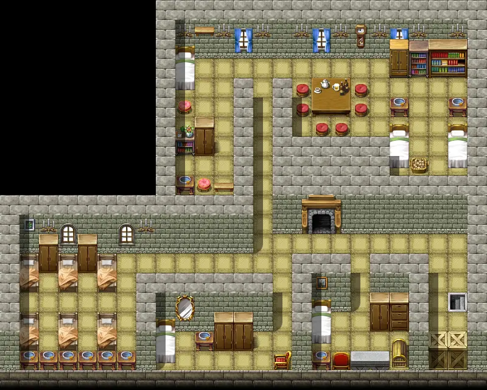
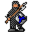
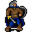
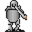

# Remgard tavern 1

| | |
|---|---|
| **Map ID** | `remgard_tavern1` |
| **Region** | In Remgard (settlement) |
| **Type** | Indoors / underground |
| **Size** | 25×20 tiles |
| **Introduced** | v0.7.0 or earlier |
| **NPCs** | 7 |
| **Quests** | 5 |

**Remgard tavern 1** is an indoor map, in Remgard (settlement). It has 7 NPCs, and no enemies. Exits lead to Remgard tavern 0, Stoutford castle barrack 2.

## Map

<label class="lg"><input type="checkbox" data-t="spawn" checked><b>Red</b>&nbsp;Monsters / NPCs</label><label class="lg"><input type="checkbox" data-t="mapchange" checked><b>Blue</b>&nbsp;Exit to another map</label><label class="lg"><input type="checkbox" data-t="container" checked><b>Yellow</b>&nbsp;Container (click to see contents)</label><label class="lg"><input type="checkbox" data-t="sign" checked><b>Purple</b>&nbsp;Sign</label><label class="lg"><input type="checkbox" data-t="rest" checked><b>Green</b>&nbsp;Resting place</label><label class="lg"><input type="checkbox" data-t="key" checked><b>Orange dashed</b>&nbsp;Blocked until a quest step / item</label><label class="lg"><input type="checkbox" data-t="script"><b>Grey dotted</b>&nbsp;Scripted event</label><label class="lg"><input type="checkbox" data-t="replace"><b>White dotted</b>&nbsp;Changes during a quest</label><label class="lg"><input type="checkbox" data-t="pin" checked><b>Numbers</b>&nbsp;Numbered key points (see the key below the map)</label>

<a class="pin pin-exit" href="#key-1" style="left:94.000%;top:77.500%" title="Exit (east): to [Remgard tavern 0](remgard_tavern0.md)">1</a><a class="pin pin-exit" href="#key-2" style="left:14.000%;top:67.500%" title="Exit (stairs / passage): to [Stoutford castle barrack 2](stoutford_castle_barrack2.md)">2</a><a id="pin-npc-remgard_g1" class="pin pin-npc" href="#key-3" style="left:78.000%;top:17.500%" title="[Guard](../../monsters/guard.md#v-remgard_g1): NPC">3</a><a id="pin-npc-remgard_g3" class="pin pin-npc" href="#key-4" style="left:10.000%;top:87.500%" title="[Guard](../../monsters/guard.md#v-remgard_g3): NPC">4</a><a id="pin-npc-remgard_g2" class="pin pin-npc" href="#key-5" style="left:78.263%;top:13.750%" title="[Guard](../../monsters/guard.md#v-remgard_g2): NPC">5</a><a id="pin-npc-jhaeld" class="pin pin-npc" href="#key-6" style="left:90.000%;top:27.500%" title="[Jhaeld](../../monsters/jhaeld.md): 2 quests">6</a><a id="pin-npc-kaverin" class="pin pin-npc" href="#key-7" style="left:46.000%;top:27.500%" title="[Kaverin](../../monsters/kaverin.md): 1 quest">7</a><a id="pin-npc-maelf" class="pin pin-npc" href="#key-8" style="left:10.000%;top:72.500%" title="[Maelf](../../monsters/maelf.md): NPC">8</a><a id="pin-npc-morgisia" class="pin pin-npc" href="#key-9" style="left:74.000%;top:87.500%" title="[Morgisia](../../monsters/morgisia.md): NPC">9</a><a class="pin pin-sign" href="#key-10" style="left:90.000%;top:42.500%" title="Sign: A sign">10</a><a class="pin pin-rest" href="#key-11" style="left:34.000%;top:87.500%" title="Resting place: Rest here to heal and set your respawn point">11</a><a class="pin pin-key" href="#key-12" style="left:58.000%;top:77.500%" title="Blocked passage: Unlocked during the quest: hidden story flag “nondisplay” (stage 21: “Tavern room in Remgard”)">12</a><a class="pin pin-key" href="#key-13" style="left:14.263%;top:63.750%" title="Blocked passage: Unlocked during the quest: base_nondisplay (stage 1: “1=Developers Debug Version active”)">13</a>

??? abstract "Key to the numbers on the map"

    | # | What | Details |
    |---|---|---|
    | 1 | Exit (east) | to [Remgard tavern 0](remgard_tavern0.md) |
    | 2 | Exit (stairs / passage) | to [Stoutford castle barrack 2](stoutford_castle_barrack2.md) |
    | 3 | [Guard](../monsters/guard.md#v-remgard_g1) | NPC |
    | 4 | [Guard](../monsters/guard.md#v-remgard_g3) | NPC |
    | 5 | [Guard](../monsters/guard.md#v-remgard_g2) | NPC |
    | 6 | [Jhaeld](../monsters/jhaeld.md) | 2 quests |
    | 7 | [Kaverin](../monsters/kaverin.md) | 1 quest |
    | 8 | [Maelf](../monsters/maelf.md) | NPC |
    | 9 | [Morgisia](../monsters/morgisia.md) | NPC |
    | 10 | Sign | A sign |
    | 11 | Resting place | Rest here to heal and set your respawn point |
    | 12 | Blocked passage | Unlocked during the quest: hidden story flag “nondisplay” (stage 21: “Tavern room in Remgard”) |
    | 13 | Blocked passage | Unlocked during the quest: base_nondisplay (stage 1: “1=Developers Debug Version active”) |

Verified against v0.8.18 map data.

## Connections

| Direction | Leads to | Region there | Map # |
|---|---|---|---|
| East | [Remgard tavern 0](remgard_tavern0.md) | Remgard | 1 |
| Stairs / passage | [Stoutford castle barrack 2](stoutford_castle_barrack2.md) | Prim | 2 |

## NPCs

- [Guard](../monsters/guard.md#v-remgard_g1) (#3)
- [Guard](../monsters/guard.md#v-remgard_g3) (#4)
- [Guard](../monsters/guard.md#v-remgard_g2) (#5)
- [Jhaeld](../monsters/jhaeld.md) — quests: [Everything in order](../quests/remgard.md), [What is that stench?](../quests/remgard2.md) (#6)
- [Kaverin](../monsters/kaverin.md) — can be fought — quests: [Old friends?](../quests/kaverin.md) (#7)
- [Maelf](../monsters/maelf.md) (#8)
- [Morgisia](../monsters/morgisia.md) (#9)

## Quests

- [base_nondisplay](../quests/base_nondisplay.md): blocked passage opens at stage 1
- [Everything in order](../quests/remgard.md): [Jhaeld](../monsters/jhaeld.md) is involved
- [Old friends?](../quests/kaverin.md): [Kaverin](../monsters/kaverin.md) is involved
- [The five idols](../quests/fiveidols.md): something on this map advances it
- [What is that stench?](../quests/remgard2.md): [Jhaeld](../monsters/jhaeld.md) is involved
- [General story flags (hidden flag)](../quests/nondisplay.md): blocked passage opens at stage 21

## Points of interest

- **Sign** (#10): A sign
- **Resting place** (#11): Rest here to heal and set your respawn point
- **Blocked passage** (#12): Unlocked during the quest: hidden story flag “nondisplay” (stage 21: “Tavern room in Remgard”)
- **Blocked passage** (#13): Unlocked during the quest: base_nondisplay (stage 1: “1=Developers Debug Version active”)

## Version history

| Version | Change |
|---|---|
| [v0.7.0](../versions/0.7.0.md) | Present in v0.7.0 (earliest release tracked) |
| [v0.7.1](../versions/0.7.1.md) | Map layout or objects changed |
| [v0.7.2](../versions/0.7.2.md) | Map layout or objects changed |

Verified against v0.8.18 and every earlier release back to v0.7.0 (game data compared release by release).

## Community notes

<small>Written by players, not generated from game data. **Observations**: what players notice in-game · **Lore**: the in-world story · **Trivia**: real-world facts, references, development history · **Theory / speculation**: unconfirmed ideas; may just be unfinished content</small>

### Observations

*No notes yet. Contributions are welcome: [add a note](https://github.com/asdfghjkl628/Andor-s-Trail-Wikiiii/new/main/notes/maps?filename=remgard_tavern1.md&value=%23%23%20Observations%0A%0A%3C%21--%20what%20players%20notice%20in-game%20--%3E%0A%0A%23%23%20Lore%0A%0A%3C%21--%20the%20in-world%20story%20--%3E%0A%0A%23%23%20Trivia%0A%0A%3C%21--%20real-world%20facts%2C%20references%2C%20development%20history%20--%3E%0A%0A%23%23%20Theory%20/%20speculation%0A%0A%3C%21--%20unconfirmed%20ideas%3B%20may%20just%20be%20unfinished%20content%20--%3E%0A).*

### Lore

*No notes yet. Contributions are welcome: [add a note](https://github.com/asdfghjkl628/Andor-s-Trail-Wikiiii/new/main/notes/maps?filename=remgard_tavern1.md&value=%23%23%20Observations%0A%0A%3C%21--%20what%20players%20notice%20in-game%20--%3E%0A%0A%23%23%20Lore%0A%0A%3C%21--%20the%20in-world%20story%20--%3E%0A%0A%23%23%20Trivia%0A%0A%3C%21--%20real-world%20facts%2C%20references%2C%20development%20history%20--%3E%0A%0A%23%23%20Theory%20/%20speculation%0A%0A%3C%21--%20unconfirmed%20ideas%3B%20may%20just%20be%20unfinished%20content%20--%3E%0A).*

### Trivia

*No notes yet. Contributions are welcome: [add a note](https://github.com/asdfghjkl628/Andor-s-Trail-Wikiiii/new/main/notes/maps?filename=remgard_tavern1.md&value=%23%23%20Observations%0A%0A%3C%21--%20what%20players%20notice%20in-game%20--%3E%0A%0A%23%23%20Lore%0A%0A%3C%21--%20the%20in-world%20story%20--%3E%0A%0A%23%23%20Trivia%0A%0A%3C%21--%20real-world%20facts%2C%20references%2C%20development%20history%20--%3E%0A%0A%23%23%20Theory%20/%20speculation%0A%0A%3C%21--%20unconfirmed%20ideas%3B%20may%20just%20be%20unfinished%20content%20--%3E%0A).*

### Theory / speculation

*No notes yet. Contributions are welcome: [add a note](https://github.com/asdfghjkl628/Andor-s-Trail-Wikiiii/new/main/notes/maps?filename=remgard_tavern1.md&value=%23%23%20Observations%0A%0A%3C%21--%20what%20players%20notice%20in-game%20--%3E%0A%0A%23%23%20Lore%0A%0A%3C%21--%20the%20in-world%20story%20--%3E%0A%0A%23%23%20Trivia%0A%0A%3C%21--%20real-world%20facts%2C%20references%2C%20development%20history%20--%3E%0A%0A%23%23%20Theory%20/%20speculation%0A%0A%3C%21--%20unconfirmed%20ideas%3B%20may%20just%20be%20unfinished%20content%20--%3E%0A).*

??? info "Technical information"

    | | |
    |---|---|
    | Map ID | `remgard_tavern1` |
    | File | `res/xml/remgard_tavern1.tmx` |
    | Size | 25×20 tiles (800×640 px) |
    | outdoors property | – |
    | Layers drawn | ground, objects, above |
    | Tilesets | map_bed_1, map_border_1, map_bridge_1, map_bridge_2, map_broken_1, map_cavewall_1, map_cavewall_2, map_cavewall_3, map_cavewall_4, map_chair_table_1, map_chair_table_2, map_crate_1, map_cupboard_1, map_curtain_1, map_entrance_1, map_entrance_2, map_fence_1, map_fence_2, map_fence_3, map_fence_4, map_ground_1, map_ground_2, map_ground_3, map_ground_4, map_ground_5, map_ground_6, map_ground_7, map_ground_8, map_house_1, map_house_2, map_indoor_1, map_indoor_2, map_kitchen_1, map_outdoor_1, map_pillar_1, map_pillar_2, map_plant_1, map_plant_2, map_rock_1, map_rock_2, map_roof_1, map_roof_2, map_roof_3, map_shop_1, map_sign_ladder_1, map_table_1, map_trail_1, map_transition_1, map_transition_2, map_transition_3, map_transition_4, map_transition_5, map_tree_1, map_tree_2, map_wall_1, map_wall_2, map_wall_3, map_wall_4, map_window_1, map_window_2 |
    | Map objects | spawn: 7, mapchange: 2, key: 2, sign: 1, rest: 1 |
    | World map position | – |

<small>Data from v0.8.18</small>
