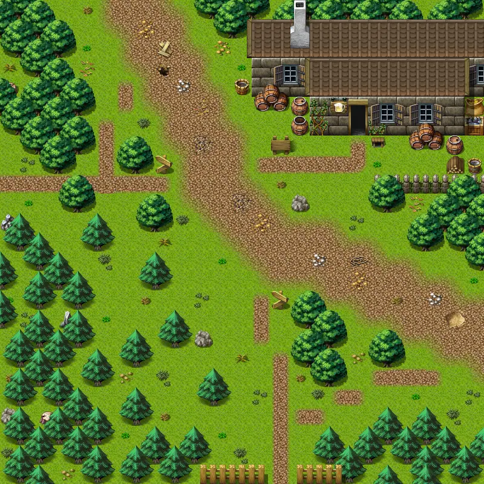

# Road1

| | |
|---|---|
| **Map ID** | `road1` |
| **Region** | In Foaming Flask Tavern (other) |
| **Type** | Outdoors |
| **Size** | 25×25 tiles |
| **World map** | [World1](index.md) |
| **Introduced** | v0.7.0 or earlier |
| **NPCs** | 3 |
| **Enemy types** | 2 |
| **Quests** | 3 |

**Road1** is an outdoor map, in Foaming Flask Tavern (other). It has 3 NPCs and 2 kinds of enemy. Exits lead to Roadbeforecrossroads9, Road2, Vilegard north, Wild15 and 1 more.

## Map

<label class="lg"><input type="checkbox" data-t="spawn" checked><b>Red</b>&nbsp;Monsters / NPCs</label><label class="lg"><input type="checkbox" data-t="mapchange" checked><b>Blue</b>&nbsp;Exit to another map</label><label class="lg"><input type="checkbox" data-t="container" checked><b>Yellow</b>&nbsp;Container (click to see contents)</label><label class="lg"><input type="checkbox" data-t="sign" checked><b>Purple</b>&nbsp;Sign</label><label class="lg"><input type="checkbox" data-t="rest" checked><b>Green</b>&nbsp;Resting place</label><label class="lg"><input type="checkbox" data-t="key" checked><b>Orange dashed</b>&nbsp;Blocked until a quest step / item</label><label class="lg"><input type="checkbox" data-t="script"><b>Grey dotted</b>&nbsp;Scripted event</label><label class="lg"><input type="checkbox" data-t="replace"><b>White dotted</b>&nbsp;Changes during a quest</label><label class="lg"><input type="checkbox" data-t="pin" checked><b>Numbers</b>&nbsp;Numbered key points (see the key below the map)</label>

<a class="pin pin-exit" href="#key-1" style="left:24.000%;top:2.000%" title="Exit (north): to [Roadbeforecrossroads9](roadbeforecrossroads9.md)">1</a><a class="pin pin-exit" href="#key-2" style="left:98.000%;top:74.000%" title="Exit (east): to [Road2](road2.md)">2</a><a class="pin pin-exit" href="#key-3" style="left:58.000%;top:98.000%" title="Exit (south): to [Vilegard north](vilegard_n.md)">3</a><a class="pin pin-exit" href="#key-4" style="left:2.000%;top:36.000%" title="Exit (west): to [Wild15](wild15.md)">4</a><a class="pin pin-exit" href="#key-5" style="left:74.000%;top:26.000%" title="Exit (door): to [Foaming flask](foaming_flask.md)">5</a><a id="pin-npc-Feygard_BG" class="pin pin-npc" href="#key-6" style="left:22.000%;top:38.000%" title="[Feygard barricade guard](../../monsters/Feygard_BG.md): 1 quest">6</a><a id="pin-npc-feygard_patrol_watch" class="pin pin-npc" href="#key-7" style="left:82.000%;top:30.000%" title="[Feygard patrol watch](../../monsters/feygard_patrol_watch.md): 1 quest">7</a><a id="pin-npc-patrol_roaming" class="pin pin-npc" href="#key-8" style="left:70.000%;top:38.000%" title="[Feygard soldier](../../monsters/patrol_roaming.md): NPC">8</a><a class="pin pin-sign" href="#key-9" style="left:58.000%;top:30.000%" title="Sign: “Welcome to the Foaming Flask tavern!”">9</a><a class="pin pin-sign" href="#key-10" style="left:34.000%;top:34.000%" title="Sign: “North: Loneford
East: Nor City
West: Fallhaven”">10</a><a class="pin pin-sign" href="#key-11" style="left:58.000%;top:62.000%" title="Sign: “North: Loneford
East: Nor City
South: Vilegard”">11</a><a class="pin pin-script" href="#key-12" style="left:58.000%;top:56.000%" title="Quest trigger: Scripted event: advances the quest: hidden story flag “brv_nondisplay” to stage 142 (“Confiscated bonemeals”) (+1 more quest(s))">12</a><a class="pin pin-script" href="#key-13" style="left:18.000%;top:44.000%" title="Quest trigger: Scripted event: advances the quest: Unusual experiences and achievements to stage 10 (“On the road: My first glimpse of the great Duleian Road!”)">13</a><a class="pin pin-script" href="#key-14" style="left:72.000%;top:30.000%" title="Quest trigger: Scripted event: advances the quest: hidden story flag “quest_burhczyd_nd” to stage 513 (“513=show oven in Foaming Flask”)">14</a><a class="pin pin-key" href="#key-15" style="left:58.263%;top:53.000%" title="Blocked passage: Closed off once you reach this point in the quest: hidden story flag “brv_nondisplay” (stage 140: “Movement blocked by the Feygard patrol”)">15</a><a class="pin pin-replace" href="#key-16" style="left:8.000%;top:42.000%" title="Changes during a quest: This area changes during the quest: hidden story flag “thieves_hidden” (stage 30: “Spoke to dying Crackshot. Remove block road1”)">16</a>

??? abstract "Key to the numbers on the map"

    | # | What | Details |
    |---|---|---|
    | 1 | Exit (north) | to [Roadbeforecrossroads9](roadbeforecrossroads9.md) |
    | 2 | Exit (east) | to [Road2](road2.md) |
    | 3 | Exit (south) | to [Vilegard north](vilegard_n.md) |
    | 4 | Exit (west) | to [Wild15](wild15.md) |
    | 5 | Exit (door) | to [Foaming flask](foaming_flask.md) |
    | 6 | [Feygard barricade guard](../monsters/Feygard_BG.md) | 1 quest |
    | 7 | [Feygard patrol watch](../monsters/feygard_patrol_watch.md) | 1 quest |
    | 8 | [Feygard soldier](../monsters/patrol_roaming.md) | NPC |
    | 9 | Sign | “Welcome to the Foaming Flask tavern!” |
    | 10 | Sign | “North: Loneford East: Nor City West: Fallhaven” |
    | 11 | Sign | “North: Loneford East: Nor City South: Vilegard” |
    | 12 | Quest trigger | Scripted event: advances the quest: hidden story flag “brv_nondisplay” to stage 142 (“Confiscated bonemeals”) (+1 more quest(s)) |
    | 13 | Quest trigger | Scripted event: advances the quest: Unusual experiences and achievements to stage 10 (“On the road: My first glimpse of the great Duleian Road!”) |
    | 14 | Quest trigger | Scripted event: advances the quest: hidden story flag “quest_burhczyd_nd” to stage 513 (“513=show oven in Foaming Flask”) |
    | 15 | Blocked passage | Closed off once you reach this point in the quest: hidden story flag “brv_nondisplay” (stage 140: “Movement blocked by the Feygard patrol”) |
    | 16 | Changes during a quest | This area changes during the quest: hidden story flag “thieves_hidden” (stage 30: “Spoke to dying Crackshot. Remove block road1”) |

Verified against v0.8.18 map data.

## Connections

| Direction | Leads to | Region there | Map # |
|---|---|---|---|
| North | [Roadbeforecrossroads9](roadbeforecrossroads9.md) | Foaming Flask Tavern | 1 |
| East | [Road2](road2.md) | Foaming Flask Tavern | 2 |
| South | [Vilegard north](vilegard_n.md) | Vilegard | 3 |
| West | [Wild15](wild15.md) | Foaming Flask Tavern | 4 |
| Door | [Foaming flask](foaming_flask.md) | Foaming Flask Tavern | 5 |

## NPCs

- [Feygard barricade guard](../monsters/Feygard_BG.md) — quests: [The ruthless Crackshot](../quests/Thieves03.md) (#6)
- [Feygard patrol watch](../monsters/feygard_patrol_watch.md) — can be fought — quests: [Spies in the foam](../quests/jolnor.md) (#7)
- [Feygard soldier](../monsters/patrol_roaming.md) (#8)

## Enemies

| Enemy | HP | Damage | Up to | Notes |
|---|---|---|---|---|
| [Hardshell beetle](../monsters/hardshell_beetle.md) | 25 | 0–5 | 3 | – |
| [Vicious forest serpent](../monsters/vicious_forest_serpent.md) | 27 | 3–4 | 1 | – |

<small>“Up to” is the most that can be alive at once from the spawn areas on this map.</small>

## Quests

- [Spies in the foam](../quests/jolnor.md): [Feygard patrol watch](../monsters/feygard_patrol_watch.md) is involved
- [The ruthless Crackshot](../quests/Thieves03.md): [Feygard barricade guard](../monsters/Feygard_BG.md) is involved
- [Unusual experiences and achievements](../quests/achievements.md): something on this map advances it; stepping on a trigger here sets stage 10
- [brv_nondisplay (hidden flag)](../quests/brv_nondisplay.md): [Feygard soldier](../monsters/patrol_roaming.md) is involved; blocked passage closes at stage 140; something on this map advances it; stepping on a trigger here sets stage 140; stepping on a trigger here sets stage 142
- [bwmfill_nondisplay (hidden flag)](../quests/bwmfill_nondisplay.md): something on this map advances it; stepping on a trigger here sets stage 40; stepping on a trigger here sets stage 41; stepping on a trigger here sets stage 42; stepping on a trigger here sets stage 43
- [Thieves Hidden (hidden flag)](../quests/thieves_hidden.md): part of the map changes at stage 30
- [Young merchant Non-displayed (hidden flag)](../quests/quest_burhczyd_nd.md): something on this map advances it; stepping on a trigger here sets stage 513

## Points of interest

- **Sign** (#9): “Welcome to the Foaming Flask tavern!”
- **Sign** (#10): “North: Loneford East: Nor City West: Fallhaven”
- **Sign** (#11): “North: Loneford East: Nor City South: Vilegard”
- **Quest trigger** (#12): Scripted event: advances the quest: hidden story flag “brv_nondisplay” to stage 142 (“Confiscated bonemeals”) (+1 more quest(s))
- **Quest trigger** (#13): Scripted event: advances the quest: Unusual experiences and achievements to stage 10 (“On the road: My first glimpse of the great Duleian Road!”)
- **Quest trigger** (#14): Scripted event: advances the quest: hidden story flag “quest_burhczyd_nd” to stage 513 (“513=show oven in Foaming Flask”)
- **Blocked passage** (#15): Closed off once you reach this point in the quest: hidden story flag “brv_nondisplay” (stage 140: “Movement blocked by the Feygard patrol”)
- **Changes during a quest** (#16): This area changes during the quest: hidden story flag “thieves_hidden” (stage 30: “Spoke to dying Crackshot. Remove block road1”)

## Version history

| Version | Change |
|---|---|
| [v0.7.0](../versions/0.7.0.md) | Present in v0.7.0 (earliest release tracked) |
| [v0.7.1](../versions/0.7.1.md) | Map layout or objects changed |
| [v0.7.2](../versions/0.7.2.md) | Map layout or objects changed |
| [v0.7.8](../versions/0.7.8.md) | Map layout or objects changed |
| [v0.7.10](../versions/0.7.10.md) | Map layout or objects changed |
| [v0.7.11](../versions/0.7.11.md) | Map layout or objects changed |
| [v0.7.12](../versions/0.7.12.md) | Map layout or objects changed |
| [v0.7.13](../versions/0.7.13.md) | Map layout or objects changed |
| [v0.8.2](../versions/0.8.2.md) | Map layout or objects changed |
| [v0.8.12.1](../versions/0.8.12.1.md) | Map layout or objects changed |
| [v0.8.16.1](../versions/0.8.16.1.md) | Map layout or objects changed |

Verified against v0.8.18 and every earlier release back to v0.7.0 (game data compared release by release).

## Community notes

<small>Written by players, not generated from game data. **Observations**: what players notice in-game · **Lore**: the in-world story · **Trivia**: real-world facts, references, development history · **Theory / speculation**: unconfirmed ideas; may just be unfinished content</small>

### Observations

*No notes yet. Contributions are welcome: [add a note](https://github.com/asdfghjkl628/Andor-s-Trail-Wikiiii/new/main/notes/maps?filename=road1.md&value=%23%23%20Observations%0A%0A%3C%21--%20what%20players%20notice%20in-game%20--%3E%0A%0A%23%23%20Lore%0A%0A%3C%21--%20the%20in-world%20story%20--%3E%0A%0A%23%23%20Trivia%0A%0A%3C%21--%20real-world%20facts%2C%20references%2C%20development%20history%20--%3E%0A%0A%23%23%20Theory%20/%20speculation%0A%0A%3C%21--%20unconfirmed%20ideas%3B%20may%20just%20be%20unfinished%20content%20--%3E%0A).*

### Lore

*No notes yet. Contributions are welcome: [add a note](https://github.com/asdfghjkl628/Andor-s-Trail-Wikiiii/new/main/notes/maps?filename=road1.md&value=%23%23%20Observations%0A%0A%3C%21--%20what%20players%20notice%20in-game%20--%3E%0A%0A%23%23%20Lore%0A%0A%3C%21--%20the%20in-world%20story%20--%3E%0A%0A%23%23%20Trivia%0A%0A%3C%21--%20real-world%20facts%2C%20references%2C%20development%20history%20--%3E%0A%0A%23%23%20Theory%20/%20speculation%0A%0A%3C%21--%20unconfirmed%20ideas%3B%20may%20just%20be%20unfinished%20content%20--%3E%0A).*

### Trivia

*No notes yet. Contributions are welcome: [add a note](https://github.com/asdfghjkl628/Andor-s-Trail-Wikiiii/new/main/notes/maps?filename=road1.md&value=%23%23%20Observations%0A%0A%3C%21--%20what%20players%20notice%20in-game%20--%3E%0A%0A%23%23%20Lore%0A%0A%3C%21--%20the%20in-world%20story%20--%3E%0A%0A%23%23%20Trivia%0A%0A%3C%21--%20real-world%20facts%2C%20references%2C%20development%20history%20--%3E%0A%0A%23%23%20Theory%20/%20speculation%0A%0A%3C%21--%20unconfirmed%20ideas%3B%20may%20just%20be%20unfinished%20content%20--%3E%0A).*

### Theory / speculation

*No notes yet. Contributions are welcome: [add a note](https://github.com/asdfghjkl628/Andor-s-Trail-Wikiiii/new/main/notes/maps?filename=road1.md&value=%23%23%20Observations%0A%0A%3C%21--%20what%20players%20notice%20in-game%20--%3E%0A%0A%23%23%20Lore%0A%0A%3C%21--%20the%20in-world%20story%20--%3E%0A%0A%23%23%20Trivia%0A%0A%3C%21--%20real-world%20facts%2C%20references%2C%20development%20history%20--%3E%0A%0A%23%23%20Theory%20/%20speculation%0A%0A%3C%21--%20unconfirmed%20ideas%3B%20may%20just%20be%20unfinished%20content%20--%3E%0A).*

??? info "Technical information"

    | | |
    |---|---|
    | Map ID | `road1` |
    | File | `res/xml/road1.tmx` |
    | Size | 25×25 tiles (800×800 px) |
    | outdoors property | 1 |
    | Layers drawn | ground, objects, above |
    | Tilesets | map_bed_1, map_border_1, map_bridge_1, map_bridge_2, map_broken_1, map_cavewall_1, map_cavewall_2, map_cavewall_3, map_cavewall_4, map_chair_table_1, map_chair_table_2, map_crate_1, map_cupboard_1, map_curtain_1, map_entrance_1, map_entrance_2, map_fence_1, map_fence_2, map_fence_3, map_fence_4, map_ground_1, map_ground_2, map_ground_3, map_ground_4, map_ground_5, map_ground_6, map_ground_7, map_ground_8, map_house_1, map_house_2, map_indoor_1, map_indoor_2, map_kitchen_1, map_outdoor_1, map_pillar_1, map_pillar_2, map_plant_1, map_plant_2, map_rock_1, map_rock_2, map_roof_1, map_roof_2, map_roof_3, map_shop_1, map_sign_ladder_1, map_table_1, map_trail_1, map_transition_1, map_transition_2, map_transition_3, map_transition_4, map_transition_5, map_tree_1, map_tree_2, map_wall_1, map_wall_2, map_wall_3, map_wall_4, map_window_1, map_window_2 |
    | Map objects | spawn: 6, mapchange: 5, sign: 3, script: 3, replace: 2, key: 1 |
    | World map position | segment `world1`, x 356, y 445 |

<small>Data from v0.8.18</small>
