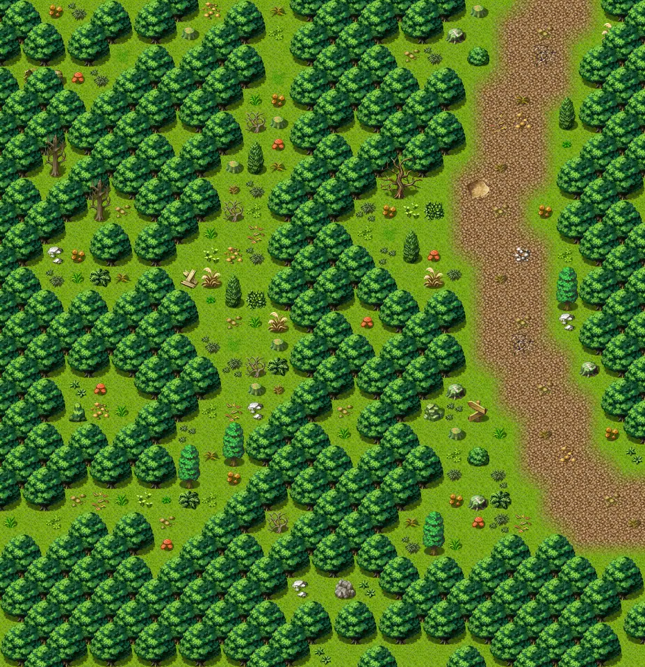
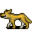

# Roadbeforecrossroads2

| | |
|---|---|
| **Map ID** | `roadbeforecrossroads2` |
| **Region** | Near Fallhaven (settlement) |
| **Type** | Outdoors |
| **Size** | 29×30 tiles |
| **World map** | [World1](index.md) |
| **Introduced** | v0.7.0 or earlier |
| **NPCs** | 1 |
| **Enemy types** | 6 |
| **Quests** | 0 |

**Roadbeforecrossroads2** is an outdoor map, near Fallhaven (settlement). It has 1 NPC and 6 kinds of enemy. Exits lead to Roadbeforecrossroads1, Roadbeforecrossroads3, Fallhaven north-east, Woodsettlement0.

## Map

<label class="lg"><input type="checkbox" data-t="spawn" checked><b>Red</b>&nbsp;Monsters / NPCs</label><label class="lg"><input type="checkbox" data-t="mapchange" checked><b>Blue</b>&nbsp;Exit to another map</label><label class="lg"><input type="checkbox" data-t="container" checked><b>Yellow</b>&nbsp;Container (click to see contents)</label><label class="lg"><input type="checkbox" data-t="sign" checked><b>Purple</b>&nbsp;Sign</label><label class="lg"><input type="checkbox" data-t="rest" checked><b>Green</b>&nbsp;Resting place</label><label class="lg"><input type="checkbox" data-t="key" checked><b>Orange dashed</b>&nbsp;Blocked until a quest step / item</label><label class="lg"><input type="checkbox" data-t="script"><b>Grey dotted</b>&nbsp;Scripted event</label><label class="lg"><input type="checkbox" data-t="replace"><b>White dotted</b>&nbsp;Changes during a quest</label><label class="lg"><input type="checkbox" data-t="pin" checked><b>Numbers</b>&nbsp;Numbered key points (see the key below the map)</label>

<a class="pin pin-exit" href="#key-1" style="left:37.931%;top:1.667%" title="Exit (north): to [Roadbeforecrossroads1](roadbeforecrossroads1.md)">1</a><a class="pin pin-exit" href="#key-1" style="left:84.483%;top:1.667%" title="Exit (north): to [Roadbeforecrossroads1](roadbeforecrossroads1.md)">1</a><a class="pin pin-exit" href="#key-2" style="left:98.276%;top:76.667%" title="Exit (east): to [Roadbeforecrossroads3](roadbeforecrossroads3.md)">2</a><a class="pin pin-exit" href="#key-3" style="left:51.724%;top:98.333%" title="Exit (south): to [Fallhaven north-east](fallhaven_ne.md)">3</a><a class="pin pin-exit" href="#key-3" style="left:74.138%;top:98.333%" title="Exit (south): to [Fallhaven north-east](fallhaven_ne.md)">3</a><a class="pin pin-exit" href="#key-4" style="left:1.724%;top:80.000%" title="Exit (west): to [Woodsettlement0](woodsettlement0.md)">4</a><a id="pin-npc-patrol_roaming" class="pin pin-npc" href="#key-5" style="left:81.034%;top:28.333%" title="[Feygard soldier](../../monsters/patrol_roaming.md): NPC">5</a><a class="pin pin-sign" href="#key-6" style="left:74.138%;top:61.667%" title="Sign: “North: Feygard
South: Nor City”">6</a><a class="pin pin-script" href="#key-7" style="left:81.034%;top:21.667%" title="Quest trigger: Scripted event: advances the quest: hidden story flag “brv_nondisplay” to stage 142 (“Confiscated bonemeals”) (+1 more quest(s))">7</a><a class="pin pin-key" href="#key-8" style="left:79.374%;top:24.804%" title="Blocked passage: Closed off once you reach this point in the quest: hidden story flag “brv_nondisplay” (stage 140: “Movement blocked by the Feygard patrol”)">8</a>

??? abstract "Key to the numbers on the map"

    | # | What | Details |
    |---|---|---|
    | 1 | Exit (north) | to [Roadbeforecrossroads1](roadbeforecrossroads1.md) |
    | 2 | Exit (east) | to [Roadbeforecrossroads3](roadbeforecrossroads3.md) |
    | 3 | Exit (south) | to [Fallhaven north-east](fallhaven_ne.md) |
    | 4 | Exit (west) | to [Woodsettlement0](woodsettlement0.md) |
    | 5 | [Feygard soldier](../monsters/patrol_roaming.md) | NPC |
    | 6 | Sign | “North: Feygard South: Nor City” |
    | 7 | Quest trigger | Scripted event: advances the quest: hidden story flag “brv_nondisplay” to stage 142 (“Confiscated bonemeals”) (+1 more quest(s)) |
    | 8 | Blocked passage | Closed off once you reach this point in the quest: hidden story flag “brv_nondisplay” (stage 140: “Movement blocked by the Feygard patrol”) |

Verified against v0.8.18 map data.

## Connections

| Direction | Leads to | Region there | Map # |
|---|---|---|---|
| North | [Roadbeforecrossroads1](roadbeforecrossroads1.md) | Crossroads Guardhouse | 1 |
| East | [Roadbeforecrossroads3](roadbeforecrossroads3.md) | Fallhaven | 2 |
| South | [Fallhaven north-east](fallhaven_ne.md) | Fallhaven | 3 |
| West | [Woodsettlement0](woodsettlement0.md) | Fallhaven | 4 |

## NPCs

- [Feygard soldier](../monsters/patrol_roaming.md) (#5)

## Enemies

| Enemy | HP | Damage | Up to | Notes |
|---|---|---|---|---|
| [Forest serpent](../monsters/forest_serpent.md) | 20 | 2–3 | 1 | – |
| [Wild fox](../monsters/wild_fox.md) | 25 | 4–5 | 8 | – |
| [Wolf](../monsters/wolf.md) | 30 | 3–6 | 6 | – |
| [Young forest fox](../monsters/forestfox2.md) | 31 | 0–5 | 3 | shares spawn with Forest fox |
| [Anklebiter](../monsters/anklebiter.md) | 31 | 3–9 | 2 | – |
| [Forest fox](../monsters/forestfox3.md) | 35 | 0–5 | 3 | shares spawn with Young forest fox |

<small>“Up to” is the most that can be alive at once from the spawn areas on this map.</small>

## Quests

- [brv_nondisplay (hidden flag)](../quests/brv_nondisplay.md): [Feygard soldier](../monsters/patrol_roaming.md) is involved; blocked passage closes at stage 140; something on this map advances it; stepping on a trigger here sets stage 140; stepping on a trigger here sets stage 142
- [bwmfill_nondisplay (hidden flag)](../quests/bwmfill_nondisplay.md): something on this map advances it; stepping on a trigger here sets stage 40; stepping on a trigger here sets stage 41; stepping on a trigger here sets stage 42; stepping on a trigger here sets stage 43

## Points of interest

- **Sign** (#6): “North: Feygard South: Nor City”
- **Quest trigger** (#7): Scripted event: advances the quest: hidden story flag “brv_nondisplay” to stage 142 (“Confiscated bonemeals”) (+1 more quest(s))
- **Blocked passage** (#8): Closed off once you reach this point in the quest: hidden story flag “brv_nondisplay” (stage 140: “Movement blocked by the Feygard patrol”)

## Version history

| Version | Change |
|---|---|
| [v0.7.0](../versions/0.7.0.md) | Present in v0.7.0 (earliest release tracked) |
| [v0.7.1](../versions/0.7.1.md) | map layout or objects changed |
| [v0.7.2](../versions/0.7.2.md) | map layout or objects changed |
| [v0.7.11](../versions/0.7.11.md) | map layout or objects changed |
| [v0.8.2](../versions/0.8.2.md) | map layout or objects changed |
| [v0.8.12.1](../versions/0.8.12.1.md) | map layout or objects changed |

Verified against v0.8.18 and every earlier release back to v0.7.0 (game data compared release by release).

## Community notes

<small>Written by players, not generated from game data. **Observations**: what players notice in-game · **Lore**: the in-world story · **Trivia**: real-world facts, references, development history · **Theory / speculation**: unconfirmed ideas; may just be unfinished content</small>

### Observations

*No notes yet. Contributions are welcome: [add a note](https://github.com/asdfghjkl628/Andor-s-Trail-Wikiiii/new/main/notes/maps?filename=roadbeforecrossroads2.md&value=%23%23%20Observations%0A%0A%3C%21--%20what%20players%20notice%20in-game%20--%3E%0A%0A%23%23%20Lore%0A%0A%3C%21--%20the%20in-world%20story%20--%3E%0A%0A%23%23%20Trivia%0A%0A%3C%21--%20real-world%20facts%2C%20references%2C%20development%20history%20--%3E%0A%0A%23%23%20Theory%20/%20speculation%0A%0A%3C%21--%20unconfirmed%20ideas%3B%20may%20just%20be%20unfinished%20content%20--%3E%0A).*

### Lore

*No notes yet. Contributions are welcome: [add a note](https://github.com/asdfghjkl628/Andor-s-Trail-Wikiiii/new/main/notes/maps?filename=roadbeforecrossroads2.md&value=%23%23%20Observations%0A%0A%3C%21--%20what%20players%20notice%20in-game%20--%3E%0A%0A%23%23%20Lore%0A%0A%3C%21--%20the%20in-world%20story%20--%3E%0A%0A%23%23%20Trivia%0A%0A%3C%21--%20real-world%20facts%2C%20references%2C%20development%20history%20--%3E%0A%0A%23%23%20Theory%20/%20speculation%0A%0A%3C%21--%20unconfirmed%20ideas%3B%20may%20just%20be%20unfinished%20content%20--%3E%0A).*

### Trivia

*No notes yet. Contributions are welcome: [add a note](https://github.com/asdfghjkl628/Andor-s-Trail-Wikiiii/new/main/notes/maps?filename=roadbeforecrossroads2.md&value=%23%23%20Observations%0A%0A%3C%21--%20what%20players%20notice%20in-game%20--%3E%0A%0A%23%23%20Lore%0A%0A%3C%21--%20the%20in-world%20story%20--%3E%0A%0A%23%23%20Trivia%0A%0A%3C%21--%20real-world%20facts%2C%20references%2C%20development%20history%20--%3E%0A%0A%23%23%20Theory%20/%20speculation%0A%0A%3C%21--%20unconfirmed%20ideas%3B%20may%20just%20be%20unfinished%20content%20--%3E%0A).*

### Theory / speculation

*No notes yet. Contributions are welcome: [add a note](https://github.com/asdfghjkl628/Andor-s-Trail-Wikiiii/new/main/notes/maps?filename=roadbeforecrossroads2.md&value=%23%23%20Observations%0A%0A%3C%21--%20what%20players%20notice%20in-game%20--%3E%0A%0A%23%23%20Lore%0A%0A%3C%21--%20the%20in-world%20story%20--%3E%0A%0A%23%23%20Trivia%0A%0A%3C%21--%20real-world%20facts%2C%20references%2C%20development%20history%20--%3E%0A%0A%23%23%20Theory%20/%20speculation%0A%0A%3C%21--%20unconfirmed%20ideas%3B%20may%20just%20be%20unfinished%20content%20--%3E%0A).*

??? info "Technical information"

    | | |
    |---|---|
    | Map ID | `roadbeforecrossroads2` |
    | File | `res/xml/roadbeforecrossroads2.tmx` |
    | Size | 29×30 tiles (928×960 px) |
    | outdoors property | 1 |
    | Layers drawn | ground, objects, above |
    | Tilesets | map_bed_1, map_border_1, map_bridge_1, map_bridge_2, map_broken_1, map_cavewall_1, map_cavewall_2, map_cavewall_3, map_cavewall_4, map_chair_table_1, map_chair_table_2, map_crate_1, map_cupboard_1, map_curtain_1, map_entrance_1, map_entrance_2, map_fence_1, map_fence_2, map_fence_3, map_fence_4, map_ground_1, map_ground_2, map_ground_3, map_ground_4, map_ground_5, map_ground_6, map_ground_7, map_ground_8, map_house_1, map_house_2, map_indoor_1, map_indoor_2, map_kitchen_1, map_outdoor_1, map_pillar_1, map_pillar_2, map_plant_1, map_plant_2, map_rock_1, map_rock_2, map_roof_1, map_roof_2, map_roof_3, map_shop_1, map_sign_ladder_1, map_table_1, map_trail_1, map_transition_1, map_transition_2, map_transition_3, map_transition_4, map_transition_5, map_tree_1, map_tree_2, map_wall_1, map_wall_2, map_wall_3, map_wall_4, map_window_1, map_window_2 |
    | Map objects | spawn: 12, mapchange: 6, sign: 1, script: 1, key: 1 |
    | World map position | segment `world1`, x 232, y 351 |

<small>Data from v0.8.18</small>
