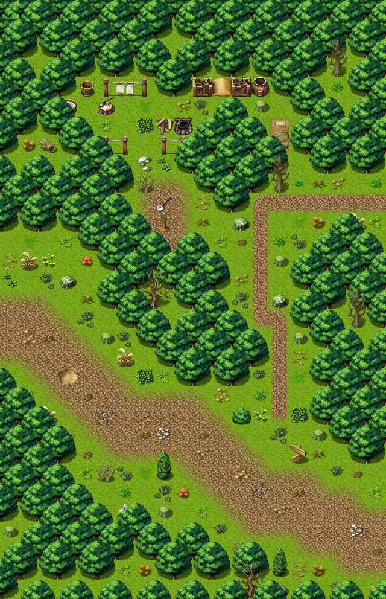

# Roadbeforecrossroads6

20×31 tiles · outdoors · part of [World1](index.md)

<label class="lg"><input type="checkbox" data-t="spawn" checked><b>Red</b>&nbsp;Monsters / NPCs</label><label class="lg"><input type="checkbox" data-t="mapchange" checked><b>Blue</b>&nbsp;Exit to another map</label><label class="lg"><input type="checkbox" data-t="container" checked><b>Yellow</b>&nbsp;Container (click to see contents)</label><label class="lg"><input type="checkbox" data-t="sign" checked><b>Purple</b>&nbsp;Sign</label><label class="lg"><input type="checkbox" data-t="rest" checked><b>Green</b>&nbsp;Resting place</label><label class="lg"><input type="checkbox" data-t="key" checked><b>Orange dashed</b>&nbsp;Blocked until a quest step / item</label><label class="lg"><input type="checkbox" data-t="script"><b>Grey dotted</b>&nbsp;Scripted event</label><label class="lg"><input type="checkbox" data-t="replace"><b>White dotted</b>&nbsp;Changes during a quest</label>

## Exits

- [Roadbeforecrossroads5](roadbeforecrossroads5.md)
- [Roadbeforecrossroads7](roadbeforecrossroads7.md)
- [Waytominingtown0](waytominingtown0.md)

## Monsters & NPCs here

| Name | HP |
|---|---|
| [Agthor's guard](../monsters/agthor_guard.md) | 0 |
| [Feygard soldier](../monsters/patrol_roaming.md) | 0 |
| [Agthor](../monsters/agthor.md) | 0 |
| [Wild fox](../monsters/wild_fox.md) | 25 |
| [Vicious forest serpent](../monsters/vicious_forest_serpent.md) | 27 |
| [Young forest fox](../monsters/forestfox2.md) | 31 |
| [Anklebiter](../monsters/anklebiter.md) | 31 |
| [Forest fox](../monsters/forestfox3.md) | 35 |

<small>Map ID: `roadbeforecrossroads6` · Data from v0.8.18</small>
