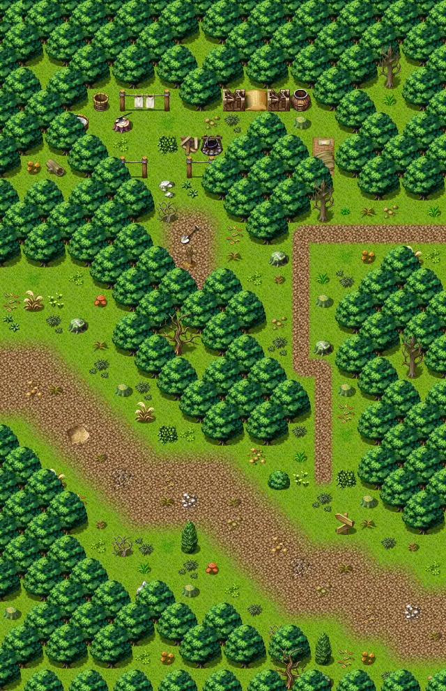

# Roadbeforecrossroads6

| | |
|---|---|
| **Map ID** | `roadbeforecrossroads6` |
| **Region** | Near Fallhaven (settlement) |
| **Type** | Outdoors |
| **Size** | 20×31 tiles |
| **World map** | [World1](index.md) |
| **Introduced** | v0.7.0 or earlier |
| **NPCs** | 3 |
| **Enemy types** | 5 |
| **Quests** | 0 |

**Roadbeforecrossroads6** is an outdoor map, near Fallhaven (settlement). It has 3 NPCs and 5 kinds of enemy. Exits lead to Roadbeforecrossroads7, Waytominingtown0, Roadbeforecrossroads5.

## Map

<label class="lg"><input type="checkbox" data-t="spawn" checked><b>Red</b>&nbsp;Monsters / NPCs</label><label class="lg"><input type="checkbox" data-t="mapchange" checked><b>Blue</b>&nbsp;Exit to another map</label><label class="lg"><input type="checkbox" data-t="container" checked><b>Yellow</b>&nbsp;Container (click to see contents)</label><label class="lg"><input type="checkbox" data-t="sign" checked><b>Purple</b>&nbsp;Sign</label><label class="lg"><input type="checkbox" data-t="rest" checked><b>Green</b>&nbsp;Resting place</label><label class="lg"><input type="checkbox" data-t="key" checked><b>Orange dashed</b>&nbsp;Blocked until a quest step / item</label><label class="lg"><input type="checkbox" data-t="script"><b>Grey dotted</b>&nbsp;Scripted event</label><label class="lg"><input type="checkbox" data-t="replace"><b>White dotted</b>&nbsp;Changes during a quest</label><label class="lg"><input type="checkbox" data-t="pin" checked><b>Numbers</b>&nbsp;Numbered key points (see the key below the map)</label>

<a class="pin pin-exit" href="#key-1" style="left:97.500%;top:88.710%" title="Exit (east): to [Roadbeforecrossroads7](../roadbeforecrossroads7.md)">1</a><a class="pin pin-exit" href="#key-2" style="left:97.500%;top:35.484%" title="Exit (east): to [Waytominingtown0](../waytominingtown0.md)">2</a><a class="pin pin-exit" href="#key-3" style="left:2.500%;top:51.613%" title="Exit (west): to [Roadbeforecrossroads5](../roadbeforecrossroads5.md)">3</a><a class="pin pin-npc" href="#key-4" style="left:22.500%;top:17.742%" title="[Agthor](../../monsters/agthor.md): shopkeeper">4</a><a class="pin pin-npc" href="#key-5" style="left:37.500%;top:17.742%" title="[Agthor&#x27;s guard](../../monsters/agthor_guard.md): NPC">5</a><a class="pin pin-npc" href="#key-6" style="left:52.500%;top:72.581%" title="[Feygard soldier](../../monsters/patrol_roaming.md): NPC">6</a><a class="pin pin-sign" href="#key-7" style="left:77.500%;top:75.806%" title="Sign: “West: Feygard
North: Charwood
East: Nor City”">7</a><a class="pin pin-sign" href="#key-8" style="left:42.500%;top:33.871%" title="Sign: “The text on the cross says: Here lies another Nor City savage bandit that roamed the Duleian road, easily slain by the glorious Feygard patrol.”">8</a><a class="pin pin-script" href="#key-9" style="left:62.500%;top:77.419%" title="Quest trigger: Scripted event: advances the quest: hidden story flag “brv_nondisplay” to stage 142 (“Confiscated bonemeals”) (+1 more quest(s))">9</a><a class="pin pin-key" href="#key-10" style="left:60.092%;top:80.455%" title="Blocked passage: Closed off once you reach this point in the quest: hidden story flag “brv_nondisplay” (stage 140: “Movement blocked by the Feygard patrol”)">10</a>

??? abstract "Key to the numbers on the map"

    | # | What | Details |
    |---|---|---|
    | 1 | Exit (east) | to [Roadbeforecrossroads7](../roadbeforecrossroads7.md) |
    | 2 | Exit (east) | to [Waytominingtown0](../waytominingtown0.md) |
    | 3 | Exit (west) | to [Roadbeforecrossroads5](../roadbeforecrossroads5.md) |
    | 4 | [Agthor](../monsters/agthor.md) | shopkeeper |
    | 5 | [Agthor's guard](../monsters/agthor_guard.md) | NPC |
    | 6 | [Feygard soldier](../monsters/patrol_roaming.md) | NPC |
    | 7 | Sign | “West: Feygard North: Charwood East: Nor City” |
    | 8 | Sign | “The text on the cross says: Here lies another Nor City savage bandit that roamed the Duleian road, easily slain by the glorious Feygard patrol.” |
    | 9 | Quest trigger | Scripted event: advances the quest: hidden story flag “brv_nondisplay” to stage 142 (“Confiscated bonemeals”) (+1 more quest(s)) |
    | 10 | Blocked passage | Closed off once you reach this point in the quest: hidden story flag “brv_nondisplay” (stage 140: “Movement blocked by the Feygard patrol”) |

Verified against v0.8.18 map data.

## Connections

| Direction | Leads to | Region there | Map # |
|---|---|---|---|
| East | [Roadbeforecrossroads7](roadbeforecrossroads7.md) | Fallhaven | 1 |
| East | [Waytominingtown0](waytominingtown0.md) | Fallhaven | 2 |
| West | [Roadbeforecrossroads5](roadbeforecrossroads5.md) | Fallhaven | 3 |

## NPCs

- [Agthor](../monsters/agthor.md) — shopkeeper (#4)
- [Agthor's guard](../monsters/agthor_guard.md) (#5)
- [Feygard soldier](../monsters/patrol_roaming.md) (#6)

## Enemies

| Enemy | HP | Damage | Up to | Notes |
|---|---|---|---|---|
| [Wild fox](../monsters/wild_fox.md) | 25 | 4–5 | 1 | – |
| [Vicious forest serpent](../monsters/vicious_forest_serpent.md) | 27 | 3–4 | 2 | – |
| [Anklebiter](../monsters/anklebiter.md) | 31 | 3–9 | 1 | – |
| [Young forest fox](../monsters/forestfox2.md) | 31 | 0–5 | 4 | shares spawn with Forest fox |
| [Forest fox](../monsters/forestfox3.md) | 35 | 0–5 | 4 | shares spawn with Young forest fox |

<small>“Up to” is the most that can be alive at once from the spawn areas on this map.</small>

## Items & containers

**Shops:** [Agthor](../monsters/agthor.md)

## Quests

- [brv_nondisplay (hidden flag)](../quests/brv_nondisplay.md): [Feygard soldier](../monsters/patrol_roaming.md) is involved; blocked passage closes at stage 140; something on this map advances it; stepping on a trigger here sets stage 140; stepping on a trigger here sets stage 142
- [bwmfill_nondisplay (hidden flag)](../quests/bwmfill_nondisplay.md): something on this map advances it; stepping on a trigger here sets stage 40; stepping on a trigger here sets stage 41; stepping on a trigger here sets stage 42; stepping on a trigger here sets stage 43

## Points of interest

- **Sign** (#7): “West: Feygard North: Charwood East: Nor City”
- **Sign** (#8): “The text on the cross says: Here lies another Nor City savage bandit that roamed the Duleian road, easily slain by the glorious Feygard patrol.”
- **Quest trigger** (#9): Scripted event: advances the quest: hidden story flag “brv_nondisplay” to stage 142 (“Confiscated bonemeals”) (+1 more quest(s))
- **Blocked passage** (#10): Closed off once you reach this point in the quest: hidden story flag “brv_nondisplay” (stage 140: “Movement blocked by the Feygard patrol”)

## Version history

| Version | Change |
|---|---|
| [v0.7.0](../versions/0.7.0.md) | Present in v0.7.0 (earliest release tracked) |
| [v0.7.1](../versions/0.7.1.md) | map layout or objects changed |
| [v0.7.2](../versions/0.7.2.md) | map layout or objects changed |
| [v0.7.11](../versions/0.7.11.md) | map layout or objects changed |
| [v0.7.13](../versions/0.7.13.md) | map layout or objects changed |
| [v0.8.12.1](../versions/0.8.12.1.md) | map layout or objects changed |

Verified against v0.8.18 and every earlier release back to v0.7.0 (game data compared release by release).

## Community notes

<small>Written by players, not generated from game data. **Observations**: what players notice in-game · **Lore**: the in-world story · **Trivia**: real-world facts, references, development history · **Theory / speculation**: unconfirmed ideas; may just be unfinished content</small>

### Observations

*Nothing here yet. Know something? [Add it](https://github.com/asdfghjkl628/Andor-s-Trail-Wikiiii/new/main/notes/maps?filename=roadbeforecrossroads6.md&value=%23%23%20Observations%0A%0A%3C%21--%20what%20players%20notice%20in-game%20--%3E%0A%0A%23%23%20Lore%0A%0A%3C%21--%20the%20in-world%20story%20--%3E%0A%0A%23%23%20Trivia%0A%0A%3C%21--%20real-world%20facts%2C%20references%2C%20development%20history%20--%3E%0A%0A%23%23%20Theory%20/%20speculation%0A%0A%3C%21--%20unconfirmed%20ideas%3B%20may%20just%20be%20unfinished%20content%20--%3E%0A).*

### Lore

*Nothing here yet. Know something? [Add it](https://github.com/asdfghjkl628/Andor-s-Trail-Wikiiii/new/main/notes/maps?filename=roadbeforecrossroads6.md&value=%23%23%20Observations%0A%0A%3C%21--%20what%20players%20notice%20in-game%20--%3E%0A%0A%23%23%20Lore%0A%0A%3C%21--%20the%20in-world%20story%20--%3E%0A%0A%23%23%20Trivia%0A%0A%3C%21--%20real-world%20facts%2C%20references%2C%20development%20history%20--%3E%0A%0A%23%23%20Theory%20/%20speculation%0A%0A%3C%21--%20unconfirmed%20ideas%3B%20may%20just%20be%20unfinished%20content%20--%3E%0A).*

### Trivia

*Nothing here yet. Know something? [Add it](https://github.com/asdfghjkl628/Andor-s-Trail-Wikiiii/new/main/notes/maps?filename=roadbeforecrossroads6.md&value=%23%23%20Observations%0A%0A%3C%21--%20what%20players%20notice%20in-game%20--%3E%0A%0A%23%23%20Lore%0A%0A%3C%21--%20the%20in-world%20story%20--%3E%0A%0A%23%23%20Trivia%0A%0A%3C%21--%20real-world%20facts%2C%20references%2C%20development%20history%20--%3E%0A%0A%23%23%20Theory%20/%20speculation%0A%0A%3C%21--%20unconfirmed%20ideas%3B%20may%20just%20be%20unfinished%20content%20--%3E%0A).*

### Theory / speculation

*Nothing here yet. Know something? [Add it](https://github.com/asdfghjkl628/Andor-s-Trail-Wikiiii/new/main/notes/maps?filename=roadbeforecrossroads6.md&value=%23%23%20Observations%0A%0A%3C%21--%20what%20players%20notice%20in-game%20--%3E%0A%0A%23%23%20Lore%0A%0A%3C%21--%20the%20in-world%20story%20--%3E%0A%0A%23%23%20Trivia%0A%0A%3C%21--%20real-world%20facts%2C%20references%2C%20development%20history%20--%3E%0A%0A%23%23%20Theory%20/%20speculation%0A%0A%3C%21--%20unconfirmed%20ideas%3B%20may%20just%20be%20unfinished%20content%20--%3E%0A).*

??? info "Technical information"

    | | |
    |---|---|
    | Map ID | `roadbeforecrossroads6` |
    | File | `res/xml/roadbeforecrossroads6.tmx` |
    | Size | 20×31 tiles (640×992 px) |
    | outdoors property | 1 |
    | Layers drawn | ground, objects, above |
    | Tilesets | map_bed_1, map_border_1, map_bridge_1, map_bridge_2, map_broken_1, map_cavewall_1, map_cavewall_2, map_cavewall_3, map_cavewall_4, map_chair_table_1, map_chair_table_2, map_crate_1, map_cupboard_1, map_curtain_1, map_entrance_1, map_entrance_2, map_fence_1, map_fence_2, map_fence_3, map_fence_4, map_ground_1, map_ground_2, map_ground_3, map_ground_4, map_ground_5, map_ground_6, map_ground_7, map_ground_8, map_house_1, map_house_2, map_indoor_1, map_indoor_2, map_kitchen_1, map_outdoor_1, map_pillar_1, map_pillar_2, map_plant_1, map_plant_2, map_rock_1, map_rock_2, map_roof_1, map_roof_2, map_roof_3, map_shop_1, map_sign_ladder_1, map_table_1, map_trail_1, map_transition_1, map_transition_2, map_transition_3, map_transition_4, map_transition_5, map_tree_1, map_tree_2, map_wall_1, map_wall_2, map_wall_3, map_wall_4, map_window_1, map_window_2 |
    | Map objects | spawn: 8, mapchange: 3, sign: 2, script: 1, key: 1 |
    | World map position | segment `world1`, x 293, y 404 |

<small>Data from v0.8.18</small>
