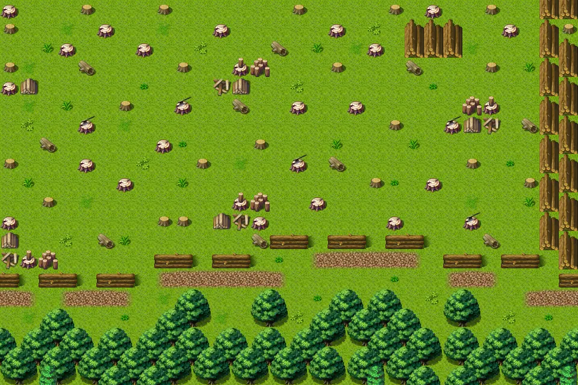

# Roadtocarntower0

| | |
|---|---|
| **Map ID** | `roadtocarntower0` |
| **Region** | Near Crossroads Guardhouse (other) |
| **Type** | Outdoors |
| **Size** | 30×20 tiles |
| **World map** | [World1](index.md) |
| **Introduced** | v0.7.0 or earlier |
| **Enemy types** | 3 |
| **Quests** | 1 |

**Roadtocarntower0** is an outdoor map, near Crossroads Guardhouse (other). It has no NPCs and 3 kinds of enemy. Exits lead to Fields8, Crossroads, Bwmfill1, Roadtocarntower1.

## Map

<label class="lg"><input type="checkbox" data-t="spawn" checked><b>Red</b>&nbsp;Monsters / NPCs</label><label class="lg"><input type="checkbox" data-t="mapchange" checked><b>Blue</b>&nbsp;Exit to another map</label><label class="lg"><input type="checkbox" data-t="container" checked><b>Yellow</b>&nbsp;Container (click to see contents)</label><label class="lg"><input type="checkbox" data-t="sign" checked><b>Purple</b>&nbsp;Sign</label><label class="lg"><input type="checkbox" data-t="rest" checked><b>Green</b>&nbsp;Resting place</label><label class="lg"><input type="checkbox" data-t="key" checked><b>Orange dashed</b>&nbsp;Blocked until a quest step / item</label><label class="lg"><input type="checkbox" data-t="script"><b>Grey dotted</b>&nbsp;Scripted event</label><label class="lg"><input type="checkbox" data-t="replace"><b>White dotted</b>&nbsp;Changes during a quest</label><label class="lg"><input type="checkbox" data-t="pin" checked><b>Numbers</b>&nbsp;Numbered key points (see the key below the map)</label>

<a class="pin pin-exit" href="#key-1" style="left:38.333%;top:2.500%" title="Exit (north): to [Fields8](fields8.md)">1</a><a class="pin pin-exit" href="#key-1" style="left:85.000%;top:2.500%" title="Exit (north): to [Fields8](fields8.md)">1</a><a class="pin pin-exit" href="#key-2" style="left:98.333%;top:82.500%" title="Exit (east): to [Crossroads](crossroads.md)">2</a><a class="pin pin-exit" href="#key-3" style="left:21.667%;top:97.500%" title="Exit (south): to [Bwmfill1](bwmfill1.md)">3</a><a class="pin pin-exit" href="#key-4" style="left:1.667%;top:12.500%" title="Exit (west): to [Roadtocarntower1](roadtocarntower1.md)">4</a><a class="pin pin-exit" href="#key-4" style="left:1.667%;top:40.000%" title="Exit (west): to [Roadtocarntower1](roadtocarntower1.md)">4</a><a class="pin pin-exit" href="#key-4" style="left:1.667%;top:82.500%" title="Exit (west): to [Roadtocarntower1](roadtocarntower1.md)">4</a><a class="pin pin-replace" href="#key-5" style="left:20.000%;top:92.500%" title="Changes during a quest: This area changes during the quest: It makes no fence (stage 32: “Hadracor opened up a passage to the south, so I wouldn&#x27;t have to take the long way up to Tunlon any more.”)">5</a>

??? abstract "Key to the numbers on the map"

    | # | What | Details |
    |---|---|---|
    | 1 | Exit (north) | to [Fields8](fields8.md) |
    | 2 | Exit (east) | to [Crossroads](crossroads.md) |
    | 3 | Exit (south) | to [Bwmfill1](bwmfill1.md) |
    | 4 | Exit (west) | to [Roadtocarntower1](roadtocarntower1.md) |
    | 5 | Changes during a quest | This area changes during the quest: It makes no fence (stage 32: “Hadracor opened up a passage to the south, so I wouldn't have to take the long way up to Tunlon any more.”) |

Verified against v0.8.18 map data.

## Connections

| Direction | Leads to | Region there | Map # |
|---|---|---|---|
| North | [Fields8](fields8.md) | Crossroads Guardhouse | 1 |
| East | [Crossroads](crossroads.md) | Crossroads Guardhouse | 2 |
| South | [Bwmfill1](bwmfill1.md) | Blackwater Mountain | 3 |
| West | [Roadtocarntower1](roadtocarntower1.md) | Crossroads Guardhouse | 4 |

## Enemies

| Enemy | HP | Damage | Up to | Notes |
|---|---|---|---|---|
| [Rabid fox](../monsters/rabid_fox.md) | 25 | 3–3 | 3 | – |
| [Frantic forest wasp](../monsters/fieldwasp_0.md#v-fieldwasp_1) | 32 | 2–6 | 5 | – |
| [Frantic forest wasp](../monsters/fieldwasp_0.md#v-fieldwasp_unique) | 70 | 2–6 | 1 | – |

<small>“Up to” is the most that can be alive at once from the spawn areas on this map.</small>

## Quests

- [It makes no fence](../quests/tunlon_fence.md): part of the map changes at stage 32

## Points of interest

- **Changes during a quest** (#5): This area changes during the quest: It makes no fence (stage 32: “Hadracor opened up a passage to the south, so I wouldn't have to take the long way up to Tunlon any more.”)

## Version history

| Version | Change |
|---|---|
| [v0.7.0](../versions/0.7.0.md) | Present in v0.7.0 (earliest release tracked) |
| [v0.7.1](../versions/0.7.1.md) | Map layout or objects changed |
| [v0.7.2](../versions/0.7.2.md) | Map layout or objects changed |
| [v0.8.10](../versions/0.8.10.md) | Map layout or objects changed |

Verified against v0.8.18 and every earlier release back to v0.7.0 (game data compared release by release).

## Community notes

<small>Written by players, not generated from game data. **Observations**: what players notice in-game · **Lore**: the in-world story · **Trivia**: real-world facts, references, development history · **Theory / speculation**: unconfirmed ideas; may just be unfinished content</small>

### Observations

*No notes yet. Contributions are welcome: [add a note](https://github.com/asdfghjkl628/Andor-s-Trail-Wikiiii/new/main/notes/maps?filename=roadtocarntower0.md&value=%23%23%20Observations%0A%0A%3C%21--%20what%20players%20notice%20in-game%20--%3E%0A%0A%23%23%20Lore%0A%0A%3C%21--%20the%20in-world%20story%20--%3E%0A%0A%23%23%20Trivia%0A%0A%3C%21--%20real-world%20facts%2C%20references%2C%20development%20history%20--%3E%0A%0A%23%23%20Theory%20/%20speculation%0A%0A%3C%21--%20unconfirmed%20ideas%3B%20may%20just%20be%20unfinished%20content%20--%3E%0A).*

### Lore

*No notes yet. Contributions are welcome: [add a note](https://github.com/asdfghjkl628/Andor-s-Trail-Wikiiii/new/main/notes/maps?filename=roadtocarntower0.md&value=%23%23%20Observations%0A%0A%3C%21--%20what%20players%20notice%20in-game%20--%3E%0A%0A%23%23%20Lore%0A%0A%3C%21--%20the%20in-world%20story%20--%3E%0A%0A%23%23%20Trivia%0A%0A%3C%21--%20real-world%20facts%2C%20references%2C%20development%20history%20--%3E%0A%0A%23%23%20Theory%20/%20speculation%0A%0A%3C%21--%20unconfirmed%20ideas%3B%20may%20just%20be%20unfinished%20content%20--%3E%0A).*

### Trivia

*No notes yet. Contributions are welcome: [add a note](https://github.com/asdfghjkl628/Andor-s-Trail-Wikiiii/new/main/notes/maps?filename=roadtocarntower0.md&value=%23%23%20Observations%0A%0A%3C%21--%20what%20players%20notice%20in-game%20--%3E%0A%0A%23%23%20Lore%0A%0A%3C%21--%20the%20in-world%20story%20--%3E%0A%0A%23%23%20Trivia%0A%0A%3C%21--%20real-world%20facts%2C%20references%2C%20development%20history%20--%3E%0A%0A%23%23%20Theory%20/%20speculation%0A%0A%3C%21--%20unconfirmed%20ideas%3B%20may%20just%20be%20unfinished%20content%20--%3E%0A).*

### Theory / speculation

*No notes yet. Contributions are welcome: [add a note](https://github.com/asdfghjkl628/Andor-s-Trail-Wikiiii/new/main/notes/maps?filename=roadtocarntower0.md&value=%23%23%20Observations%0A%0A%3C%21--%20what%20players%20notice%20in-game%20--%3E%0A%0A%23%23%20Lore%0A%0A%3C%21--%20the%20in-world%20story%20--%3E%0A%0A%23%23%20Trivia%0A%0A%3C%21--%20real-world%20facts%2C%20references%2C%20development%20history%20--%3E%0A%0A%23%23%20Theory%20/%20speculation%0A%0A%3C%21--%20unconfirmed%20ideas%3B%20may%20just%20be%20unfinished%20content%20--%3E%0A).*

??? info "Technical information"

    | | |
    |---|---|
    | Map ID | `roadtocarntower0` |
    | File | `res/xml/roadtocarntower0.tmx` |
    | Size | 30×20 tiles (960×640 px) |
    | outdoors property | 1 |
    | Layers drawn | ground, objects, above |
    | Tilesets | map_bed_1, map_border_1, map_bridge_1, map_bridge_2, map_broken_1, map_cavewall_1, map_cavewall_2, map_cavewall_3, map_cavewall_4, map_chair_table_1, map_chair_table_2, map_crate_1, map_cupboard_1, map_curtain_1, map_entrance_1, map_entrance_2, map_fence_1, map_fence_2, map_fence_3, map_fence_4, map_ground_1, map_ground_2, map_ground_3, map_ground_4, map_ground_5, map_ground_6, map_ground_7, map_ground_8, map_house_1, map_house_2, map_indoor_1, map_indoor_2, map_kitchen_1, map_outdoor_1, map_pillar_1, map_pillar_2, map_plant_1, map_plant_2, map_rock_1, map_rock_2, map_roof_1, map_roof_2, map_roof_3, map_shop_1, map_sign_ladder_1, map_table_1, map_trail_1, map_transition_1, map_transition_2, map_transition_3, map_transition_4, map_transition_5, map_tree_1, map_tree_2, map_wall_1, map_wall_2, map_wall_3, map_wall_4, map_window_1, map_window_2 |
    | Map objects | mapchange: 7, spawn: 3, replace: 1 |
    | World map position | segment `world1`, x 148, y 300 |

<small>Data from v0.8.18</small>
