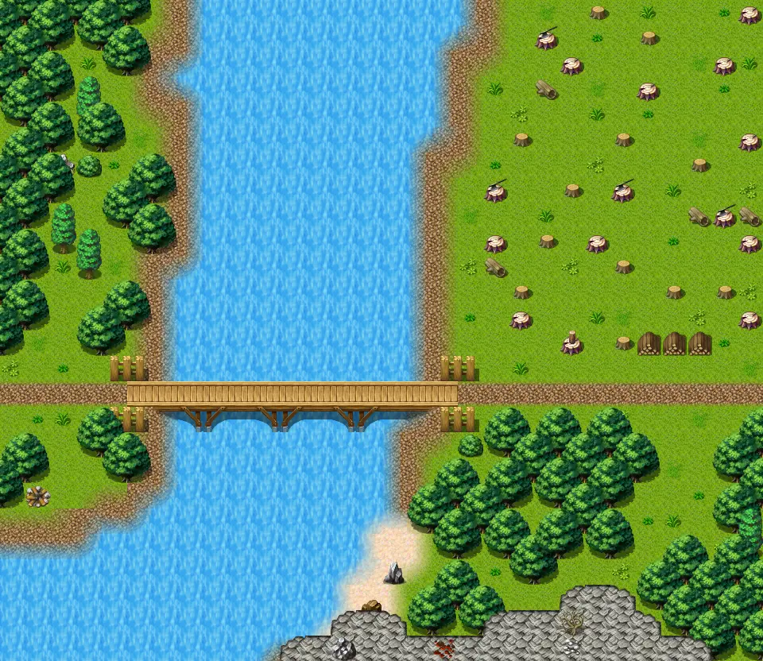

# Roadtocarntower2

| | |
|---|---|
| **Map ID** | `roadtocarntower2` |
| **Region** | Near Crossroads Guardhouse (other) |
| **Type** | Outdoors |
| **Size** | 30×26 tiles |
| **World map** | [World1](index.md) |
| **Introduced** | v0.7.0 or earlier |
| **NPCs** | 2 |
| **Enemy types** | 4 |
| **Quests** | 2 |

**Roadtocarntower2** is an outdoor map, near Crossroads Guardhouse (other). It has 2 NPCs and 4 kinds of enemy. Exits lead to Fields10, Roadtocarntower1.

## Map

<label class="lg"><input type="checkbox" data-t="spawn" checked><b>Red</b>&nbsp;Monsters / NPCs</label><label class="lg"><input type="checkbox" data-t="mapchange" checked><b>Blue</b>&nbsp;Exit to another map</label><label class="lg"><input type="checkbox" data-t="container" checked><b>Yellow</b>&nbsp;Container (click to see contents)</label><label class="lg"><input type="checkbox" data-t="sign" checked><b>Purple</b>&nbsp;Sign</label><label class="lg"><input type="checkbox" data-t="rest" checked><b>Green</b>&nbsp;Resting place</label><label class="lg"><input type="checkbox" data-t="key" checked><b>Orange dashed</b>&nbsp;Blocked until a quest step / item</label><label class="lg"><input type="checkbox" data-t="script"><b>Grey dotted</b>&nbsp;Scripted event</label><label class="lg"><input type="checkbox" data-t="replace"><b>White dotted</b>&nbsp;Changes during a quest</label><label class="lg"><input type="checkbox" data-t="pin" checked><b>Numbers</b>&nbsp;Numbered key points (see the key below the map)</label>

<a class="pin pin-exit" href="#key-1" style="left:80.000%;top:1.923%" title="Exit (north): to [Fields10](../fields10.md)">1</a><a class="pin pin-exit" href="#key-2" style="left:98.333%;top:11.538%" title="Exit (east): to [Roadtocarntower1](../roadtocarntower1.md)">2</a><a class="pin pin-exit" href="#key-2" style="left:98.333%;top:26.923%" title="Exit (east): to [Roadtocarntower1](../roadtocarntower1.md)">2</a><a class="pin pin-exit" href="#key-2" style="left:98.333%;top:57.692%" title="Exit (east): to [Roadtocarntower1](../roadtocarntower1.md)">2</a><a class="pin pin-exit" href="#key-2" style="left:98.333%;top:42.308%" title="Exit (east): to [Roadtocarntower1](../roadtocarntower1.md)">2</a><a class="pin pin-npc" href="#key-3" style="left:11.667%;top:75.000%" title="[Rogorn](../../monsters/rogorn.md): 1 quest">3</a><a class="pin pin-npc" href="#key-4" style="left:8.333%;top:75.000%" title="[Rogorn&#x27;s henchman](../../monsters/rogorn_henchman.md): NPC">4</a><a class="pin pin-script" href="#key-5" style="left:51.667%;top:82.692%" title="Quest trigger: Scripted event: advances the quest: The silver scale to stage 200 (“You put the scale on the mark on the ground.”)">5</a><a class="pin pin-script" href="#key-6" style="left:60.000%;top:86.538%" title="Quest trigger: Scripted event: advances the quest: The silver scale to stage 210 (“There rang out a beautiful song of gratitude.”)">6</a><a class="pin pin-replace" href="#key-7" style="left:36.667%;top:80.769%" title="Changes during a quest: This area changes during the quest: The silver scale (stage 210: “There rang out a beautiful song of gratitude.”)">7</a>

??? abstract "Key to the numbers on the map"

    | # | What | Details |
    |---|---|---|
    | 1 | Exit (north) | to [Fields10](../fields10.md) |
    | 2 | Exit (east) | to [Roadtocarntower1](../roadtocarntower1.md) |
    | 3 | [Rogorn](../monsters/rogorn.md) | 1 quest |
    | 4 | [Rogorn's henchman](../monsters/rogorn_henchman.md) | NPC |
    | 5 | Quest trigger | Scripted event: advances the quest: The silver scale to stage 200 (“You put the scale on the mark on the ground.”) |
    | 6 | Quest trigger | Scripted event: advances the quest: The silver scale to stage 210 (“There rang out a beautiful song of gratitude.”) |
    | 7 | Changes during a quest | This area changes during the quest: The silver scale (stage 210: “There rang out a beautiful song of gratitude.”) |

Verified against v0.8.18 map data.

## Connections

| Direction | Leads to | Region there | Map # |
|---|---|---|---|
| North | [Fields10](fields10.md) | – | 1 |
| East | [Roadtocarntower1](roadtocarntower1.md) | Crossroads Guardhouse | 2 |

## NPCs

- [Rogorn](../monsters/rogorn.md) — quests: [The path is clear to me](../quests/rogorn.md) (#3)
- [Rogorn's henchman](../monsters/rogorn_henchman.md) (#4)

## Enemies

| Enemy | HP | Damage | Up to | Notes |
|---|---|---|---|---|
| [Mermaid](../monsters/river_mermaid.md) | 0 | 0–0 | 1 | – |
| [Frantic forest wasp](../monsters/fieldwasp_2.md) | 35 | 2–6 | 3 | – |
| [Frantic forest wasp](../monsters/fieldwasp_unique.md) | 70 | 2–6 | 1 | – |
| [River troll](../monsters/rivertroll.md) | 210 | 2–9 | 1 | – |

<small>“Up to” is the most that can be alive at once from the spawn areas on this map.</small>

## Quests

- [The path is clear to me](../quests/rogorn.md): [Rogorn](../monsters/rogorn.md) is involved
- [The silver scale](../quests/mermaid_scale.md): part of the map changes at stage 210; something on this map advances it; stepping on a trigger here sets stage 200; stepping on a trigger here sets stage 210; stepping on a trigger here sets stage 220

## Points of interest

- **Quest trigger** (#5): Scripted event: advances the quest: The silver scale to stage 200 (“You put the scale on the mark on the ground.”)
- **Quest trigger** (#6): Scripted event: advances the quest: The silver scale to stage 210 (“There rang out a beautiful song of gratitude.”)
- **Changes during a quest** (#7): This area changes during the quest: The silver scale (stage 210: “There rang out a beautiful song of gratitude.”)

## Version history

| Version | Change |
|---|---|
| [v0.7.0](../versions/0.7.0.md) | Present in v0.7.0 (earliest release tracked) |
| [v0.7.1](../versions/0.7.1.md) | map layout or objects changed |
| [v0.7.2](../versions/0.7.2.md) | map layout or objects changed |
| [v0.7.8](../versions/0.7.8.md) | map layout or objects changed |

Verified against v0.8.18 and every earlier release back to v0.7.0 (game data compared release by release).

## Community notes

<small>Written by players, not generated from game data. **Observations**: what players notice in-game · **Lore**: the in-world story · **Trivia**: real-world facts, references, development history · **Theory / speculation**: unconfirmed ideas; may just be unfinished content</small>

### Observations

*Nothing here yet. Know something? [Add it](https://github.com/asdfghjkl628/Andor-s-Trail-Wikiiii/new/main/notes/maps?filename=roadtocarntower2.md&value=%23%23%20Observations%0A%0A%3C%21--%20what%20players%20notice%20in-game%20--%3E%0A%0A%23%23%20Lore%0A%0A%3C%21--%20the%20in-world%20story%20--%3E%0A%0A%23%23%20Trivia%0A%0A%3C%21--%20real-world%20facts%2C%20references%2C%20development%20history%20--%3E%0A%0A%23%23%20Theory%20/%20speculation%0A%0A%3C%21--%20unconfirmed%20ideas%3B%20may%20just%20be%20unfinished%20content%20--%3E%0A).*

### Lore

*Nothing here yet. Know something? [Add it](https://github.com/asdfghjkl628/Andor-s-Trail-Wikiiii/new/main/notes/maps?filename=roadtocarntower2.md&value=%23%23%20Observations%0A%0A%3C%21--%20what%20players%20notice%20in-game%20--%3E%0A%0A%23%23%20Lore%0A%0A%3C%21--%20the%20in-world%20story%20--%3E%0A%0A%23%23%20Trivia%0A%0A%3C%21--%20real-world%20facts%2C%20references%2C%20development%20history%20--%3E%0A%0A%23%23%20Theory%20/%20speculation%0A%0A%3C%21--%20unconfirmed%20ideas%3B%20may%20just%20be%20unfinished%20content%20--%3E%0A).*

### Trivia

*Nothing here yet. Know something? [Add it](https://github.com/asdfghjkl628/Andor-s-Trail-Wikiiii/new/main/notes/maps?filename=roadtocarntower2.md&value=%23%23%20Observations%0A%0A%3C%21--%20what%20players%20notice%20in-game%20--%3E%0A%0A%23%23%20Lore%0A%0A%3C%21--%20the%20in-world%20story%20--%3E%0A%0A%23%23%20Trivia%0A%0A%3C%21--%20real-world%20facts%2C%20references%2C%20development%20history%20--%3E%0A%0A%23%23%20Theory%20/%20speculation%0A%0A%3C%21--%20unconfirmed%20ideas%3B%20may%20just%20be%20unfinished%20content%20--%3E%0A).*

### Theory / speculation

*Nothing here yet. Know something? [Add it](https://github.com/asdfghjkl628/Andor-s-Trail-Wikiiii/new/main/notes/maps?filename=roadtocarntower2.md&value=%23%23%20Observations%0A%0A%3C%21--%20what%20players%20notice%20in-game%20--%3E%0A%0A%23%23%20Lore%0A%0A%3C%21--%20the%20in-world%20story%20--%3E%0A%0A%23%23%20Trivia%0A%0A%3C%21--%20real-world%20facts%2C%20references%2C%20development%20history%20--%3E%0A%0A%23%23%20Theory%20/%20speculation%0A%0A%3C%21--%20unconfirmed%20ideas%3B%20may%20just%20be%20unfinished%20content%20--%3E%0A).*

??? info "Technical information"

    | | |
    |---|---|
    | Map ID | `roadtocarntower2` |
    | File | `res/xml/roadtocarntower2.tmx` |
    | Size | 30×26 tiles (960×832 px) |
    | outdoors property | 1 |
    | Layers drawn | ground, objects, above, top |
    | Tilesets | map_bed_1, map_border_1, map_bridge_1, map_bridge_2, map_broken_1, map_cavewall_1, map_cavewall_2, map_cavewall_3, map_cavewall_4, map_chair_table_1, map_chair_table_2, map_crate_1, map_cupboard_1, map_curtain_1, map_entrance_1, map_entrance_2, map_fence_1, map_fence_2, map_fence_3, map_fence_4, map_ground_1, map_ground_2, map_ground_3, map_ground_4, map_ground_5, map_ground_6, map_ground_7, map_ground_8, map_guynmart, map_house_1, map_house_2, map_indoor_1, map_indoor_2, map_kitchen_1, map_outdoor_1, map_pillar_1, map_pillar_2, map_plant_1, map_plant_2, map_rock_1, map_rock_2, map_roof_1, map_roof_2, map_roof_3, map_shop_1, map_sign_ladder_1, map_table_1, map_trail_1, map_transition_1, map_transition_2, map_transition_3, map_transition_4, map_transition_5, map_tree_1, map_tree_2, map_wall_1, map_wall_2, map_wall_3, map_wall_4, map_window_1, map_window_2 |
    | Map objects | spawn: 7, mapchange: 5, script: 2, replace: 1 |
    | World map position | segment `world1`, x 86, y 300 |

<small>Data from v0.8.18</small>
