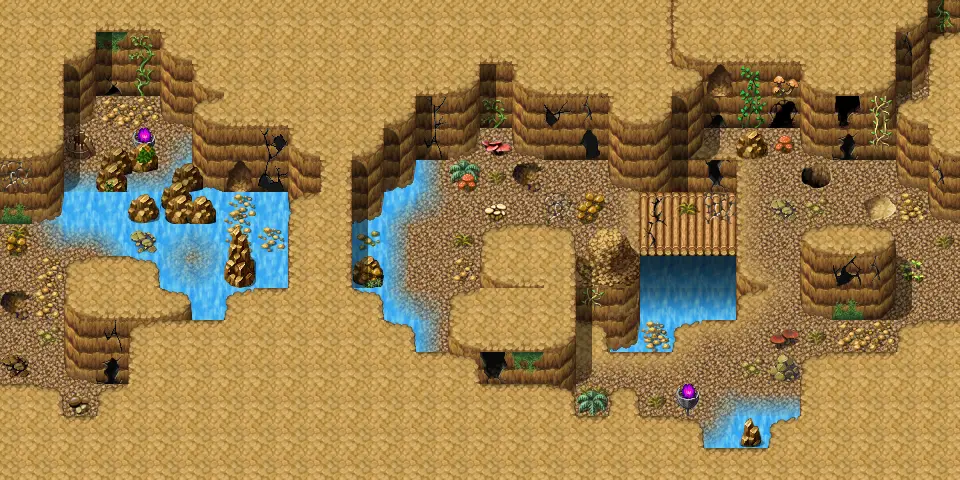
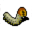
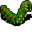
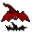
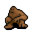
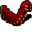

# Shortcut lodar 2

| | |
|---|---|
| **Map ID** | `shortcut_lodar2` |
| **Type** | Indoors / underground |
| **Size** | 30×15 tiles |
| **Introduced** | [v0.7.2](../versions/0.7.2.md) |
| **Enemy types** | 12 |
| **Quests** | 0 |
| **Containers** | 1 |

**Shortcut lodar 2** is an indoor map. It has no NPCs and 12 kinds of enemy. Exits lead to Shortcut lodar 1, Shortcut lodar 3, Shortcut lodar 2.

## Map

<label class="lg"><input type="checkbox" data-t="spawn" checked><b>Red</b>&nbsp;Monsters / NPCs</label><label class="lg"><input type="checkbox" data-t="mapchange" checked><b>Blue</b>&nbsp;Exit to another map</label><label class="lg"><input type="checkbox" data-t="container" checked><b>Yellow</b>&nbsp;Container (click to see contents)</label><label class="lg"><input type="checkbox" data-t="sign" checked><b>Purple</b>&nbsp;Sign</label><label class="lg"><input type="checkbox" data-t="rest" checked><b>Green</b>&nbsp;Resting place</label><label class="lg"><input type="checkbox" data-t="key" checked><b>Orange dashed</b>&nbsp;Blocked until a quest step / item</label><label class="lg"><input type="checkbox" data-t="script"><b>Grey dotted</b>&nbsp;Scripted event</label><label class="lg"><input type="checkbox" data-t="replace"><b>White dotted</b>&nbsp;Changes during a quest</label><label class="lg"><input type="checkbox" data-t="pin" checked><b>Numbers</b>&nbsp;Numbered key points (see the key below the map)</label>

<a class="pin pin-exit" href="#key-1" style="left:98.333%;top:56.667%" title="Exit (east): to [Shortcut lodar 1](shortcut_lodar1.md)">1</a><a class="pin pin-exit" href="#key-2" style="left:1.667%;top:63.333%" title="Exit (west): to [Shortcut lodar 3](shortcut_lodar3.md)">2</a><a class="pin pin-exit" href="#key-3" style="left:71.667%;top:83.333%" title="Exit (stairs / passage): to [Shortcut lodar 2](shortcut_lodar2.md)">3</a><a class="pin pin-exit" href="#key-3" style="left:15.000%;top:30.000%" title="Exit (stairs / passage): to [Shortcut lodar 2](shortcut_lodar2.md)">3</a><a class="pin pin-container" href="#key-4" style="left:8.333%;top:30.000%" title="Container 1: Gold coins, Worn iron boots, Heavy iron gloves">4</a>

??? abstract "Key to the numbers on the map"

    | # | What | Details |
    |---|---|---|
    | 1 | Exit (east) | to [Shortcut lodar 1](shortcut_lodar1.md) |
    | 2 | Exit (west) | to [Shortcut lodar 3](shortcut_lodar3.md) |
    | 3 | Exit (stairs / passage) | to [Shortcut lodar 2](shortcut_lodar2.md) |
    | 4 | Container 1 | Gold coins, Worn iron boots, Heavy iron gloves |

Verified against v0.8.18 map data.

## Connections

| Direction | Leads to | Region there | Map # |
|---|---|---|---|
| East | [Shortcut lodar 1](shortcut_lodar1.md) | – | 1 |
| West | [Shortcut lodar 3](shortcut_lodar3.md) | – | 2 |
| Stairs / passage | [Shortcut lodar 2](shortcut_lodar2.md) | – | 3 |

## Enemies

| Enemy | HP | Damage | Up to | Notes |
|---|---|---|---|---|
| [Gray cave bat](../monsters/cavebat1.md) | 28 | 3–5 | 4 | shares spawn with Black cave bat, Brown cave bat |
| [Black cave bat](../monsters/cavebat2.md) | 32 | 2–6 | 4 | shares spawn with Brown cave bat, Gray cave bat |
| [Brown cave bat](../monsters/cavebat3.md) | 36 | 1–7 | 4 | shares spawn with Black cave bat, Gray cave bat |
| [Mudfiend](../monsters/mudfiend1.md) | 37 | 4–6 | 1 | shares spawn with Tough mudfiend |
| [Cave bat](../monsters/cavebat4.md) | 39 | 1–7 | 2 | shares spawn with Aggressive cave bat |
| [Tough mudfiend](../monsters/mudfiend2.md) | 41 | 5–6 | 1 | shares spawn with Mudfiend |
| [Aggressive cave bat](../monsters/cavebat5.md) | 41 | 1–7 | 2 | shares spawn with Cave bat |
| [Young poisonous cave burrower](../monsters/caveburr1.md) | 57 | 0–5 | 4 | shares spawn with Infected larval cave burrower, Poisonous cave burrower |
| [Infected larval cave burrower](../monsters/caveburr2.md) | 62 | 0–6 | 4 | shares spawn with Poisonous cave burrower, Young poisonous cave burrower |
| [Poisonous cave burrower](../monsters/caveburr3.md) | 65 | 0–6 | 4 | shares spawn with Infected larval cave burrower, Young poisonous cave burrower |
| [Strong poisonous cave burrower](../monsters/caveburr4.md) | 67 | 0–6 | 5 | shares spawn with Giant poisonous cave burrower |
| [Giant poisonous cave burrower](../monsters/caveburr5.md) | 69 | 0–6 | 5 | shares spawn with Strong poisonous cave burrower |

<small>“Up to” is the most that can be alive at once from the spawn areas on this map.</small>

## Items & containers

<b>Container 1</b><ul><li><a href="../../items/gold/">Gold coins</a> <small>100% · ×150</small></li><li><a href="../../items/hboot_wirn/">Worn iron boots</a> <small>100%</small></li><li><a href="../../items/hglv_irn/">Heavy iron gloves</a> <small>100%</small></li></ul>

## Version history

| Version | Change |
|---|---|
| [v0.7.2](../versions/0.7.2.md) | Added |
| [v0.8.2](../versions/0.8.2.md) | Map layout or objects changed |
| [v0.8.8](../versions/0.8.8.md) | Map layout or objects changed |

Verified against v0.8.18 and every earlier release back to v0.7.0 (game data compared release by release).

## Community notes

<small>Written by players, not generated from game data. **Observations**: what players notice in-game · **Lore**: the in-world story · **Trivia**: real-world facts, references, development history · **Theory / speculation**: unconfirmed ideas; may just be unfinished content</small>

### Observations

*No notes yet. Contributions are welcome: [add a note](https://github.com/asdfghjkl628/Andor-s-Trail-Wikiiii/new/main/notes/maps?filename=shortcut_lodar2.md&value=%23%23%20Observations%0A%0A%3C%21--%20what%20players%20notice%20in-game%20--%3E%0A%0A%23%23%20Lore%0A%0A%3C%21--%20the%20in-world%20story%20--%3E%0A%0A%23%23%20Trivia%0A%0A%3C%21--%20real-world%20facts%2C%20references%2C%20development%20history%20--%3E%0A%0A%23%23%20Theory%20/%20speculation%0A%0A%3C%21--%20unconfirmed%20ideas%3B%20may%20just%20be%20unfinished%20content%20--%3E%0A).*

### Lore

*No notes yet. Contributions are welcome: [add a note](https://github.com/asdfghjkl628/Andor-s-Trail-Wikiiii/new/main/notes/maps?filename=shortcut_lodar2.md&value=%23%23%20Observations%0A%0A%3C%21--%20what%20players%20notice%20in-game%20--%3E%0A%0A%23%23%20Lore%0A%0A%3C%21--%20the%20in-world%20story%20--%3E%0A%0A%23%23%20Trivia%0A%0A%3C%21--%20real-world%20facts%2C%20references%2C%20development%20history%20--%3E%0A%0A%23%23%20Theory%20/%20speculation%0A%0A%3C%21--%20unconfirmed%20ideas%3B%20may%20just%20be%20unfinished%20content%20--%3E%0A).*

### Trivia

*No notes yet. Contributions are welcome: [add a note](https://github.com/asdfghjkl628/Andor-s-Trail-Wikiiii/new/main/notes/maps?filename=shortcut_lodar2.md&value=%23%23%20Observations%0A%0A%3C%21--%20what%20players%20notice%20in-game%20--%3E%0A%0A%23%23%20Lore%0A%0A%3C%21--%20the%20in-world%20story%20--%3E%0A%0A%23%23%20Trivia%0A%0A%3C%21--%20real-world%20facts%2C%20references%2C%20development%20history%20--%3E%0A%0A%23%23%20Theory%20/%20speculation%0A%0A%3C%21--%20unconfirmed%20ideas%3B%20may%20just%20be%20unfinished%20content%20--%3E%0A).*

### Theory / speculation

*No notes yet. Contributions are welcome: [add a note](https://github.com/asdfghjkl628/Andor-s-Trail-Wikiiii/new/main/notes/maps?filename=shortcut_lodar2.md&value=%23%23%20Observations%0A%0A%3C%21--%20what%20players%20notice%20in-game%20--%3E%0A%0A%23%23%20Lore%0A%0A%3C%21--%20the%20in-world%20story%20--%3E%0A%0A%23%23%20Trivia%0A%0A%3C%21--%20real-world%20facts%2C%20references%2C%20development%20history%20--%3E%0A%0A%23%23%20Theory%20/%20speculation%0A%0A%3C%21--%20unconfirmed%20ideas%3B%20may%20just%20be%20unfinished%20content%20--%3E%0A).*

??? info "Technical information"

    | | |
    |---|---|
    | Map ID | `shortcut_lodar2` |
    | File | `res/xml/shortcut_lodar2.tmx` |
    | Size | 30×15 tiles (960×480 px) |
    | outdoors property | – |
    | Layers drawn | base, ground, objects, above |
    | Tilesets | map_bed_1, map_border_1, map_bridge_1, map_bridge_2, map_broken_1, map_cavewall_1, map_cavewall_2, map_cavewall_3, map_cavewall_4, map_chair_table_1, map_chair_table_2, map_crate_1, map_cupboard_1, map_curtain_1, map_entrance_1, map_entrance_2, map_fence_1, map_fence_2, map_fence_3, map_fence_4, map_ground_1, map_ground_2, map_ground_3, map_ground_4, map_ground_5, map_ground_6, map_ground_7, map_ground_8, map_house_1, map_house_2, map_indoor_1, map_indoor_2, map_kitchen_1, map_outdoor_1, map_pillar_1, map_pillar_2, map_plant_1, map_plant_2, map_rock_1, map_rock_2, map_roof_1, map_roof_2, map_roof_3, map_shop_1, map_sign_ladder_1, map_table_1, map_trail_1, map_transition_1, map_transition_2, map_transition_3, map_transition_4, map_transition_5, map_tree_1, map_tree_2, map_wall_1, map_wall_2, map_wall_3, map_wall_4, map_window_1, map_window_2 |
    | Map objects | spawn: 11, mapchange: 4, replace: 2, container: 1 |
    | World map position | – |

<small>Data from v0.8.18</small>
