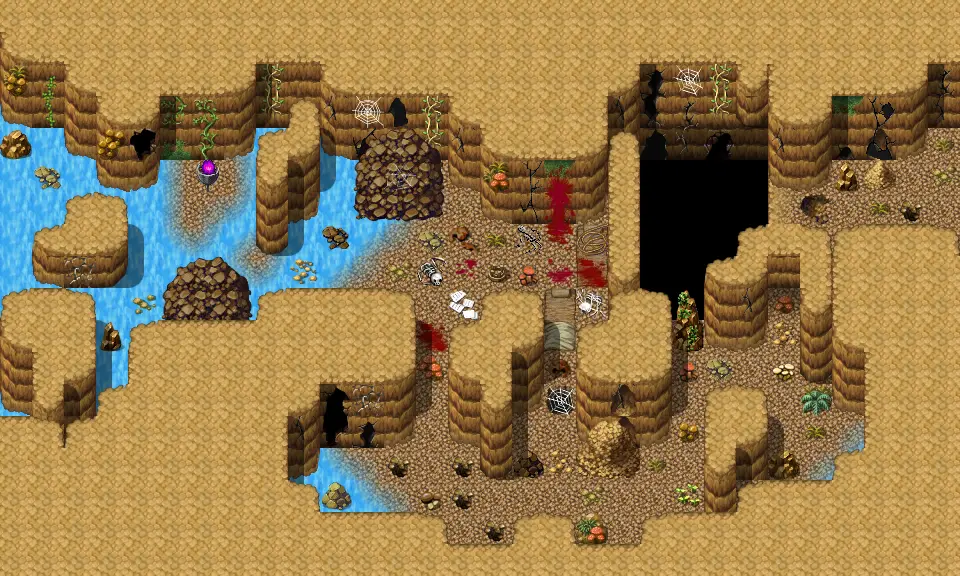

# Shortcut lodar3

30×18 tiles

<label class="lg lg-spawn"><input type="checkbox" data-t="spawn" checked> Monsters / NPCs</label><label class="lg lg-mapchange"><input type="checkbox" data-t="mapchange" checked> Exit to another map</label><label class="lg lg-container"><input type="checkbox" data-t="container" checked> Container</label><label class="lg lg-sign"><input type="checkbox" data-t="sign" checked> Sign</label><label class="lg lg-rest"><input type="checkbox" data-t="rest" checked> Resting place</label><label class="lg lg-key"><input type="checkbox" data-t="key" checked> Blocked / needs key or quest</label><label class="lg lg-script"><input type="checkbox" data-t="script"> Scripted event</label><label class="lg lg-replace"><input type="checkbox" data-t="replace"> Changes after a quest</label>

## Exits

- [Shortcut lodar2](shortcut_lodar2.md)
- [Shortcut lodar4](shortcut_lodar4.md)

## Monsters & NPCs here

| Name | HP |
|---|---|
| [Gray cave bat](../monsters/cavebat1.md) | 28 |
| [Black cave bat](../monsters/cavebat2.md) | 32 |
| [Brown cave bat](../monsters/cavebat3.md) | 36 |
| [Mudfiend](../monsters/mudfiend1.md) | 37 |
| [Cave bat](../monsters/cavebat4.md) | 39 |
| [Tough mudfiend](../monsters/mudfiend2.md) | 41 |
| [Aggressive cave bat](../monsters/cavebat5.md) | 41 |
| [Young poisonous cave burrower](../monsters/caveburr1.md) | 57 |
| [Infected larval cave burrower](../monsters/caveburr2.md) | 62 |
| [Poisonous cave burrower](../monsters/caveburr3.md) | 65 |
| [Strong poisonous cave burrower](../monsters/caveburr4.md) | 67 |
| [Giant poisonous cave burrower](../monsters/caveburr5.md) | 69 |

<small>Map ID: `shortcut_lodar3` · Data from v0.8.18</small>
